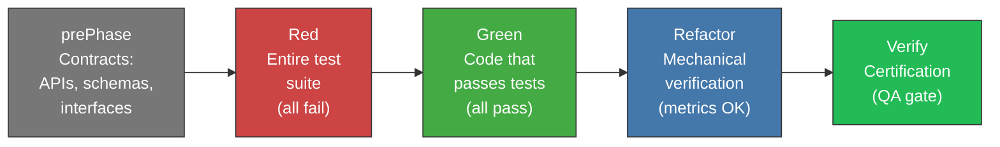
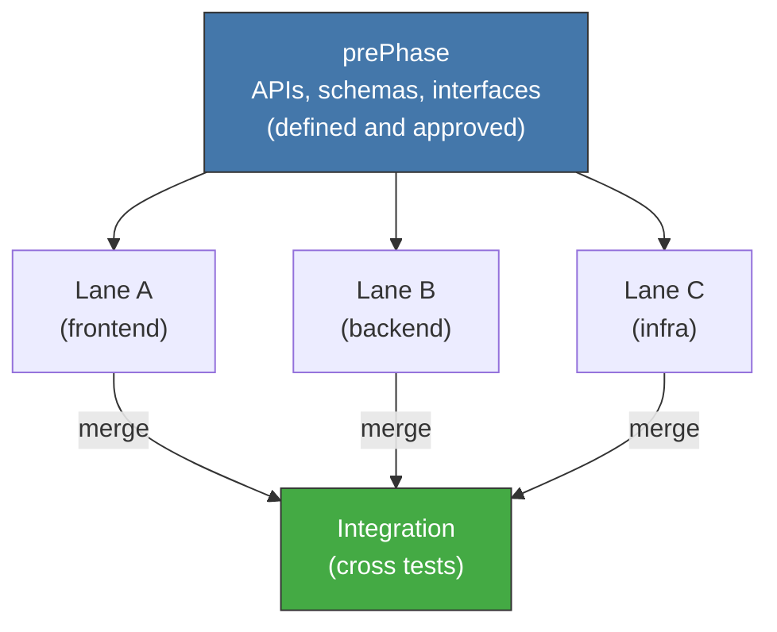

<!-- Virgil Principia
section_id: "11a-11b"
title: "How it executes — pipeline and contracts first"
source: "principia/constitution.md"
source_lines: [1418, 1475]
layer: execution
constitutional: true
actors: [SM, Virgil]
glossary_terms: [PlanningGapDetected]
depends_on: ["7a", "7e", "3a", "7c-rgr", "10"]
referenced_by: ["11c", "11d", "11e-routing", "11f"]
keywords:
  - prePhase
  - Red
  - Green
  - Refactor
  - Verify
  - contracts first
  - parallelism
  - lanes
  - PlanningGapDetected
  - exit gate
editorial_additions: [context_paragraph]
-->

> **Context:** After planning produces an approved handoff, execution transforms that handoff into a candidate implementation and Verify certifies it against the canonical path's artifacts/evidence (Echo System, section 7a). Virgil observes the execution but does not direct it.

## 11. How it executes

After planning produces an approved handoff, execution
transforms that handoff into a candidate implementation and **Verify**
certifies it against the canonical path's artifacts/evidence. Virgil
OBSERVES — it does not direct, it does not implement. It emits
PlanningGapDetected if it detects gaps.

### 11a. Execution pipeline

Five sequential phases. Each phase has its exit gate.

| Phase | What it produces | Exit gate |
|------|-------------|----------------|
| prePhase | Source contracts (OpenAPI source, schemas, interfaces) | All contracts defined |
| Red | Complete test suite | All fail (valid red) |
| Green | Implementation | All pass |
| Refactor | Metrics within threshold | Mutation, CRAP, complexity OK |
| Verify | Certification | Mechanical gates + structured verification (see 7e) |

### 11b. Contracts first — parallelism enabler

prePhase defines contracts BEFORE implementing. This allows
multiple lanes to work in parallel against the same interface.

