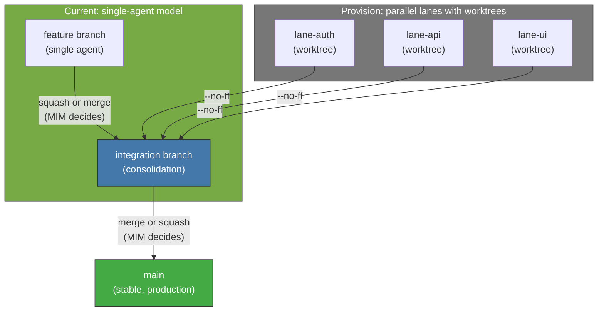

<!-- Virgil Principia
section_id: "11c"
title: "Git strategy — isolation and traceability"
source: "principia/constitution.md"
source_lines: [1476, 1520]
layer: execution
constitutional: true
actors: [Agent, MIM]
glossary_terms: [mutation domain, sourceRevision]
depends_on: ["7c-composite", "8f-construction", "11a-11b"]
referenced_by: ["11d", "11e-routing"]
keywords:
  - mutation domain
  - --no-ff
  - worktrees
  - branches
  - concurrent lanes
  - sourceRevision
  - commit conventions
  - invariants
  - baseline commit SHA
  - git diff
editorial_additions: [context_paragraph]
-->

> **Context:** This section details the version-control strategy that underpins the execution pipeline (section 11a). The current runtime stores baseline commit SHAs in META.json and uses `git diff` for audit checks; the lane-based isolation model is an architectural provision for multi-agent execution.

### 11c. Git strategy — isolation and traceability

The Principia does NOT impose GitFlow, trunk-based, or concrete branch names. It imposes four invariants:

1. Concurrent lanes must have **isolated mutation domains** while they diverge (isolated filesystem, conflict detection at integration, per-lane revision identity).
2. Every build artifact produced by the execution pipeline must be unambiguously linked to the `sourceRevision` that generated it.
3. Lane integration must re-run required verification on the integrated revision before that revision can be certified.
4. The identity and provenance of each lane must **survive integration** and be mechanically verifiable in the history. The canonical enforcement is `--no-ff` (no fast-forward merge); an alternative strategy is admissible only if it preserves equivalent evidence of lane identity and provenance.

**Current runtime**: each handoff records baseline commit SHAs in `META.json` (`repos[].commitSha`). The `AuditService` uses `git diff` against this baseline to check scope, forbidden paths, file count, and line count. Lane-based isolation with worktrees is an architectural provision for future multi-agent execution.

Commit conventions are Dogma defaults and may be overridden per project as long as Virgil can reconstruct phase, revision and evidence **by deterministic parsing** (not by LLM inference):

| Phase | Default prefix | Default frequency |
|------|-----------------|--------------------|
| prePhase | `contract:` | 1 per type |
| Red | `test:` | 1 per test or group |
| Green | `feat:` | 1 per passing test |
| Refactor | `refactor:` | 1 per atomic refactor |
