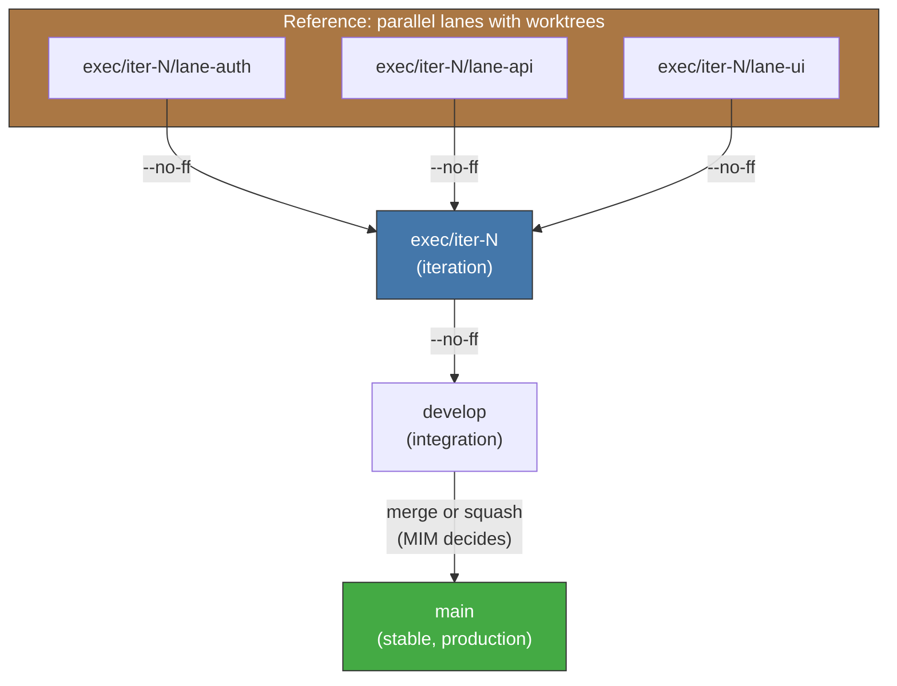

<!-- Virgil Principia
section_id: "11c"
title: "Git strategy — isolation and traceability"
source: "principia/constitution.md"
source_lines: [1476, 1520]
layer: execution
constitutional: true
actors: [SM, compositeAgent, MIM]
glossary_terms: [mutation domain, buildArtifactSet, sourceRevision, compositeAgent, PlanningGapDetected]
depends_on: ["7c-composite", "8f-construction", "11a-11b"]
referenced_by: ["11d", "11e-routing"]
keywords:
  - mutation domain
  - --no-ff
  - worktrees
  - branches
  - concurrent lanes
  - buildArtifactSet
  - sourceRevision
  - commit conventions
  - invariants
editorial_additions: [context_paragraph]
-->

> **Context:** This section details the version-control strategy that underpins the execution pipeline (section 11a). It relies on the mutation domain concept (section 7c) and on the structural traceability of code (section 8f).

### 11c. Git strategy — isolation and traceability

The Principia does NOT impose GitFlow, trunk-based, or concrete branch names. It imposes four invariants:

1. Concurrent lanes must have **isolated mutation domains** while they diverge (isolated filesystem, conflict detection at integration, per-lane revision identity).
2. Every `buildArtifactSet` produced by Echo must be unambiguously linked to the `sourceRevision` that generated it.
3. Lane integration must re-run the required Echo on the integrated revision before that revision can be certified.
4. The identity and provenance of each lane must **survive integration** and be mechanically verifiable in the history. The canonical enforcement is `--no-ff` (no fast-forward merge); an alternative strategy is admissible only if it preserves equivalent evidence of lane identity and provenance.

The concrete Git strategy is configurable per project within these invariants. The current Dogma provides worktrees + branches as the reference implementation:

With that implementation, each lane runs in an isolated worktree and a compositeAgent (section 7c) operates within that mutation domain. Another project may use a different isolation mechanism as long as it satisfies the mutation domain properties and the four invariants of this section.

If a lane detects a contract violation mid-flight, the SM emits PlanningGapDetected and stops THAT lane. Other running lanes that depend on the same contract receive an invalidated-contract notification and enter a paused state pending reconciliation. Independent lanes (with no dependency on the violated contract) continue without interruption.

Commit conventions are Dogma defaults and may be overridden per project as long as Virgil can reconstruct phase, revision and evidence **by deterministic parsing** (not by LLM inference):

| Phase | Default prefix | Default frequency |
|------|-----------------|--------------------|
| prePhase | `contract:` | 1 per type |
| Red | `test:` | 1 per test or group |
| Green | `feat:` | 1 per passing test |
| Refactor | `refactor:` | 1 per atomic refactor |
