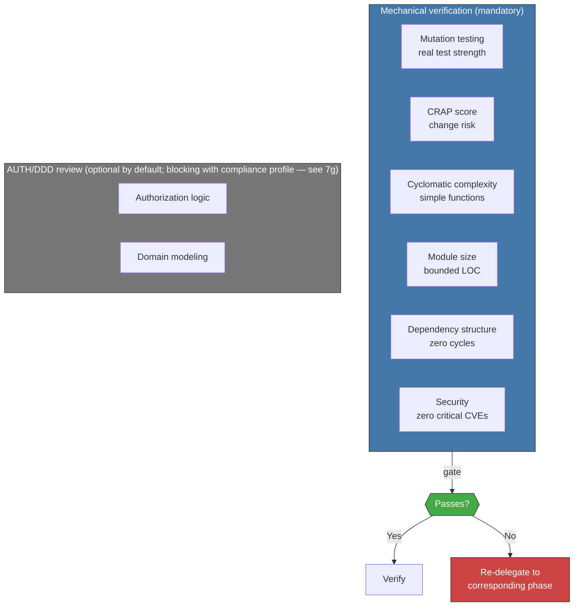

<!-- Virgil Principia
section_id: "11d"
title: "Mechanical verification — conditional human review"
source: "principia/constitution.md"
source_lines: [1521, 1556]
layer: execution
constitutional: true
actors: [SM]
glossary_terms: [PDC, CRAP score]
depends_on: ["7e", "7g", "11a-11b", "3b", "4", "11c"]
referenced_by: ["11e-routing"]
keywords:
  - mechanical verification
  - mutation testing
  - CRAP score
  - cyclomatic complexity
  - module size
  - dependency structure
  - CVE security
  - AUTH DDD review
  - regulatory compliance
  - Method Pack
  - PDC
editorial_additions: [context_paragraph]
-->

> **Context:** This section describes the Refactor phase of the execution pipeline (section 11a). It relies on the mechanical gates and structured verification defined in section 7e, and on the compliance-profile review mechanism from section 7g.

### 11d. Mechanical verification — conditional human review

The Refactor phase uses metrics-based mechanical verification as the primary certification mechanism. Mechanical gates (section 7e) are the main quality channel. For projects with a regulatory compliance profile, the Method Pack additionally activates blocking human review over authorization logic and domain modeling (see section 7g). In both cases, final certification requires that ALL applicable gates pass — both the mechanical ones and the human-review ones when active.

Certification gates combine deterministic mechanical verification (test pass/fail, mutation score, coverage, CRAP, CVE scan) and structured verification (architectural alignment — see section 7e). Human review, when active due to a compliance profile, is also part of the applicable gates. The PDC operates during execution as a coherence safeguard (section 3b), but is not part of the certification pipeline — it can stop an incoherent delegation, it does not certify or approve code.

The specific thresholds (mutation score, maximum CRAP, complexity)
are defined by the dogma per tier (strict, standard, relaxed). The
Principia defines the principle: **mechanical, not subjective**.
