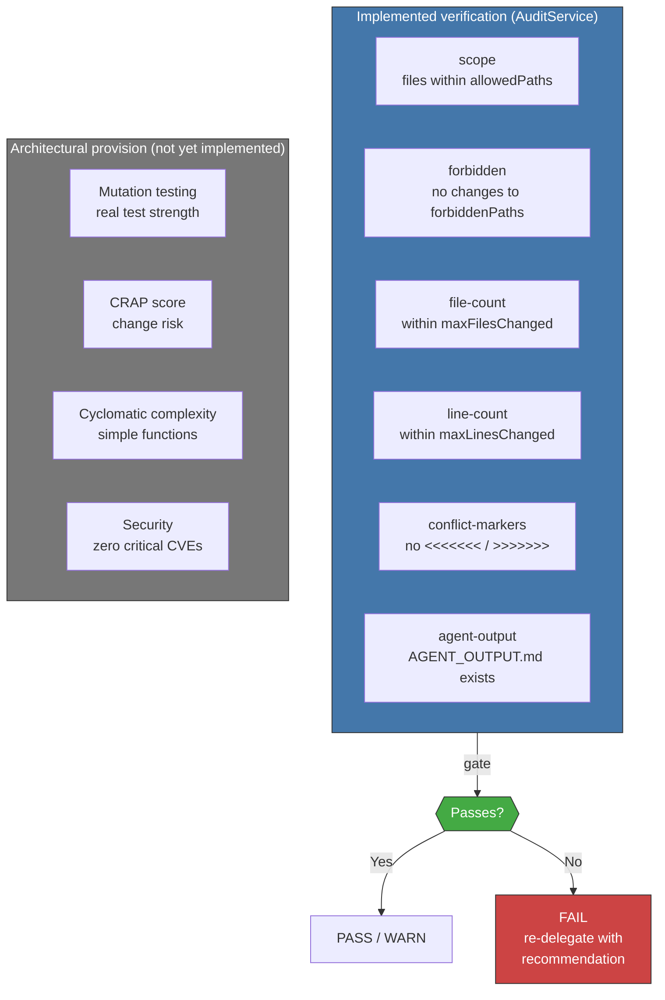

<!-- Virgil Principia
section_id: "11d"
title: "Mechanical verification — conditional human review"
source: "principia/constitution.md"
source_lines: [1521, 1556]
layer: execution
constitutional: true
actors: [Agent]
glossary_terms: [AuditService, GapType, CRAP score]
depends_on: ["7e", "7g", "11a-11b", "3b", "4", "11c"]
referenced_by: ["11e-routing"]
keywords:
  - mechanical verification
  - audit checks
  - scope check
  - forbidden paths
  - file count
  - line count
  - conflict markers
  - agent output
  - gap classification
  - mutation testing
  - CRAP score
  - CVE security
editorial_additions: [context_paragraph]
-->

> **Context:** This section describes the verification phase of the execution pipeline (section 11a). The current runtime implements guardrail-based mechanical verification through `AuditService`; the full metrics-based gates (mutation testing, CRAP, CVE) are architectural provisions.

### 11d. Mechanical verification — conditional human review

Mechanical verification is the primary certification mechanism. The principle: **mechanical, not subjective**. Gates that can be automated MUST be automated. Human review is reserved for cases where mechanical gates cannot provide sufficient confidence (authorization logic, domain modeling under a compliance profile — see section 7g).

#### Current implementation: AuditService

The `AuditService` runs 6 guardrail checks against the constraints defined in `META.json`:

Each failed check is classified by gap type:

| Check | Gap Type | Recommendation |
|-------|----------|----------------|
| scope, forbidden, file-count, line-count | `IMPLEMENTATION` | Re-delegate with tighter scope |
| conflict-markers | `CONTRACT` | Manual intervention required |
| agent-output | `COMPLIANCE` | Agent must write AGENT_OUTPUT.md |

Verdict logic: all checks pass → `PASS`; only agent-output fails → `WARN`; any other check fails → `FAIL`.

The specific thresholds for future metrics gates (mutation score, maximum CRAP, complexity)
will be defined by the dogma per tier (strict, standard, relaxed). The
Principia defines the principle: **mechanical, not subjective**.
