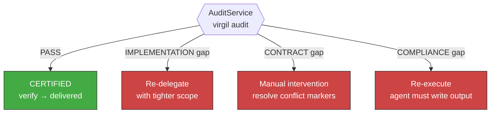

<!-- Virgil Principia
section_id: "11e-routing"
title: "Accept/Reject — certification by gates"
source: "principia/constitution.md"
source_lines: [1557, 1587]
layer: execution
constitutional: true
actors: [Agent]
glossary_terms: [GapType, AuditService]
depends_on: ["11a-11b", "11d", "9", "11c"]
referenced_by: ["11f", "11e-breakglass"]
keywords:
  - audit gate
  - gap type
  - implementation gap
  - contract gap
  - compliance gap
  - re-delegation
  - recommendation routing
editorial_additions: [context_paragraph]
-->

> **Context:** This section closes the execution pipeline (section 11a) by describing how the Verify phase certifies or rejects a handoff, and how gap classification routes re-delegation to the appropriate action.

### 11e. Accept/Reject — certification by gates

| Gap type | Verdict | Recommendation | State transition |
|----------|---------|----------------|------------------|
| None (all pass) | `PASS` | — | `verify → delivered` |
| `IMPLEMENTATION` | `FAIL` | Re-delegate with tighter scope constraints | `verify → execution` |
| `CONTRACT` | `FAIL` | Manual intervention — resolve conflict markers | `verify → execution` (after fix) |
| `COMPLIANCE` only | `WARN` | Agent must write AGENT_OUTPUT.md — re-execute | `verify → execution` |

Rejection is SPECIFIC — it identifies the gap type and provides an
actionable recommendation, not a generic "fix it." The `HandoffStateMachine`
enforces that `verify → delivered` requires audit `PASS`, and
`verify → execution` requires audit NOT `PASS`.

> **Architectural provision**: when execution sub-phases (prePhase, Red, Green, Refactor) are implemented, gap routing will target specific sub-phases instead of the monolithic `execution` state. The principle remains the same: rejection routes to the exact phase that must be corrected.
