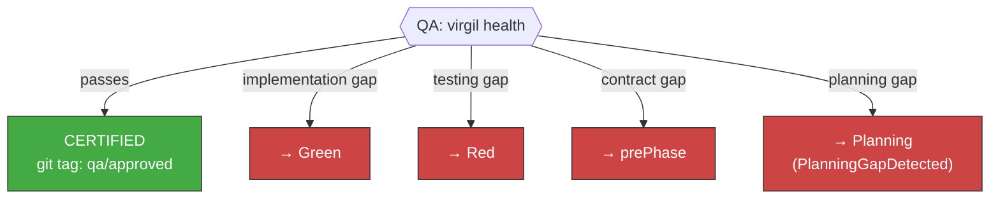

<!-- Virgil Principia
section_id: "11e-routing"
title: "Accept/Reject — certification by gates"
source: "principia/constitution.md"
source_lines: [1557, 1587]
layer: execution
constitutional: true
actors: [SM]
glossary_terms: [PDC]
depends_on: ["11a-11b", "11d", "9", "11c"]
referenced_by: ["11f", "11e-breakglass"]
keywords:
  - QA gate
  - virgil health
  - git tag qa/approved
  - implementation gap
  - testing gap
  - contract gap
  - planning gap
  - PlanningGapDetected
  - re-delegation
  - PDC
editorial_additions: [context_paragraph]
-->

> **Context:** This section closes the execution pipeline (section 11a) by describing how the Verify phase certifies or rejects a revision, and to which specific phase it re-delegates when a gap is detected.

### 11e. Accept/Reject — certification by gates

| Gap type | Rejection | Re-delegate to |
|-------------|---------|--------------|
| Code does not satisfy test | Incomplete implementation | Green |
| Incomplete test suite | Missing tests | Red |
| Contract violated | Broken interface | prePhase |
| Design not reflected in code | Divergent architecture | Refactor |
| Missing feature in planning | Insufficient deliverable | Planning |

Rejection is SPECIFIC — it identifies the exact phase that must
be corrected, not a generic "fix it." Every re-delegation goes through
the complete PDC (section 9c).
