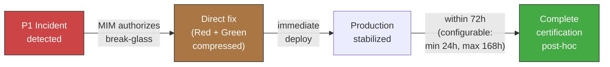

<!-- Virgil Principia
section_id: "11e-breakglass"
title: "Emergency lane (break-glass)"
source: "principia/constitution.md"
source_lines: [1588, 1617]
layer: execution
constitutional: false
actors: [MIM]
glossary_terms: [Break-glass, Ledger]
depends_on: ["11e-routing"]
referenced_by: []
keywords:
  - break-glass
  - P1 incident
  - MIM authorization
  - standing policy
  - post-hoc certification
  - 72 hours
  - Ledger
  - critical technical debt
editorial_additions: [context_paragraph]
-->

> **Context:** Break-glass is an exceptional path within the execution phase (section 11e), reserved for P1 incidents in production. It does not replace certification ceremony — it compresses and defers it, never eliminates it.

#### Emergency lane (break-glass)

For P1 incidents in production, there is an expedited path that
compresses ceremony without eliminating it:

| Restriction | Rule |
|-------------|-------|
| Authorization | Only the MIM can activate break-glass. In teams where the MIM is not always available, a standing policy issued by the MIM may pre-authorize activations under mechanically verifiable conditions: covered incident types, policy expiration date, and mandatory MIM notification within a defined window |
| Scope | Exclusively the incident fix — zero features |
| Certification | Complete post-hoc certification within 72 hours (configurable by the Method Pack, minimum 24h, maximum 168h) |
| Recording | The Ledger records the activation as an auditable event |

A standing policy does not transfer authority or expand scope: it declares closed conditions under which break-glass can be activated without the MIM's presence. Every activation must demonstrate it met the pre-authorized conditions, remain attributed to the active MIM policy, and notify the MIM within the window declared in the policy.

Break-glass is NOT a shortcut — it is a documented path with
explicit restrictions. A fix without post-hoc certification within
72 hours (or the configured window) is treated as critical technical debt.
