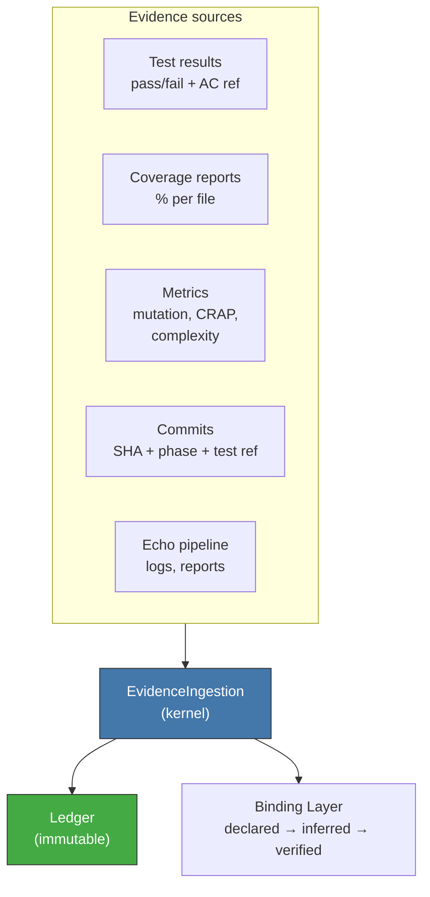

<!-- Virgil Principia
section_id: "11f"
title: "Evidence as queryable data"
source: "principia/constitution.md"
source_lines: [1618, 1649]
layer: execution
constitutional: true
actors: []
glossary_terms: [EchoRun, buildArtifactSet, Ledger, Binding Layer]
depends_on: ["7b", "8c-watermark", "11a-11b", "7a", "7d-binding", "11e-routing"]
referenced_by: ["12"]
keywords:
  - queryable evidence
  - EvidenceIngestion
  - immutable Ledger
  - Binding Layer
  - declared inferred verified
  - EchoRun
  - buildArtifactSet
  - test results
  - coverage
  - mutation testing
editorial_additions: [context_paragraph]
-->

> **Context:** This section closes the execution pipeline (section 11a) by explaining how all generated evidence is ingested in a structured way, linked to the canonical EchoRun (section 7b), and how it feeds the progression of the Binding Layer.

### 11f. Evidence as queryable data

Everything that happens during execution is ingested as queryable
evidence, not as narrative documentation. For **code certification**,
test results, coverage, metrics, scanners and build results
are only eligible when linked to an `EchoRun` and its
`buildArtifactSet`. Evidence from planning, human decisions or operation
events can come from other sources, but does not replace the Echo
path for certifying code.

Evidence feeds the Binding Layer: every commit referencing
a test moves the link from `declared` to `inferred`. Mechanical
verification (mutation testing) moves it to `verified`.
