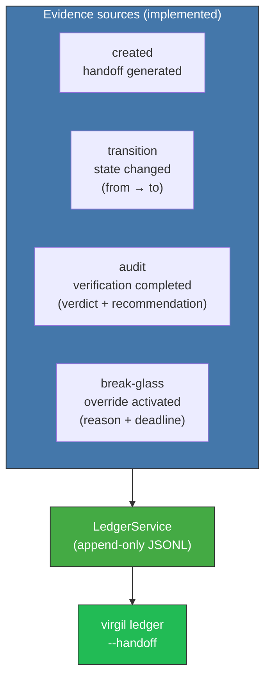

<!-- Virgil Principia
section_id: "11f"
title: "Evidence as queryable data"
source: "principia/constitution.md"
source_lines: [1618, 1649]
layer: execution
constitutional: true
actors: []
glossary_terms: [Ledger, LedgerService, Binding Layer]
depends_on: ["7b", "8c-watermark", "11a-11b", "7a", "7d-binding", "11e-routing"]
referenced_by: ["12"]
keywords:
  - queryable evidence
  - LedgerService
  - immutable Ledger
  - Binding Layer
  - declared inferred verified
  - audit events
  - transition events
  - break-glass events
editorial_additions: [context_paragraph]
-->

> **Context:** This section closes the execution pipeline (section 11a) by explaining how all generated evidence is ingested as structured, queryable data. The current implementation uses `LedgerService` (append-only JSONL); the full Binding Layer progression is an architectural provision.

### 11f. Evidence as queryable data

Everything that happens during execution is ingested as queryable
evidence, not as narrative documentation.

#### Current implementation: LedgerService

The `LedgerService` records four event types in an append-only JSONL file at `.virgil/ledger.jsonl`:

Each ledger entry contains: `timestamp`, `handoffId`, `event`, `actor`, and optional `from`/`to` states, `reason`, and `data`. Entries are filterable by handoff ID.

The `AuditService` also writes `AUDIT_REPORT.json` (machine-readable) and `FEEDBACK.md` (human-readable) to each handoff directory, providing structured evidence at the handoff level.

#### Architectural provision: Binding Layer

> **[Not yet implemented]** The Binding Layer describes three trust levels for the link between a test and the code it validates:
>
> | State | Phase | Guarantees |
> |--------|------|-----------|
> | declared | Red | The test exists and references an acceptance criterion |
> | inferred | Green | Evidence shows code exercises the test |
> | verified | Refactor | Mutation testing confirmed real strength |
>
> When execution sub-phases are implemented, evidence will feed the Binding Layer: every commit referencing a test moves the link from `declared` to `inferred`. Mechanical verification (mutation testing) moves it to `verified`.
