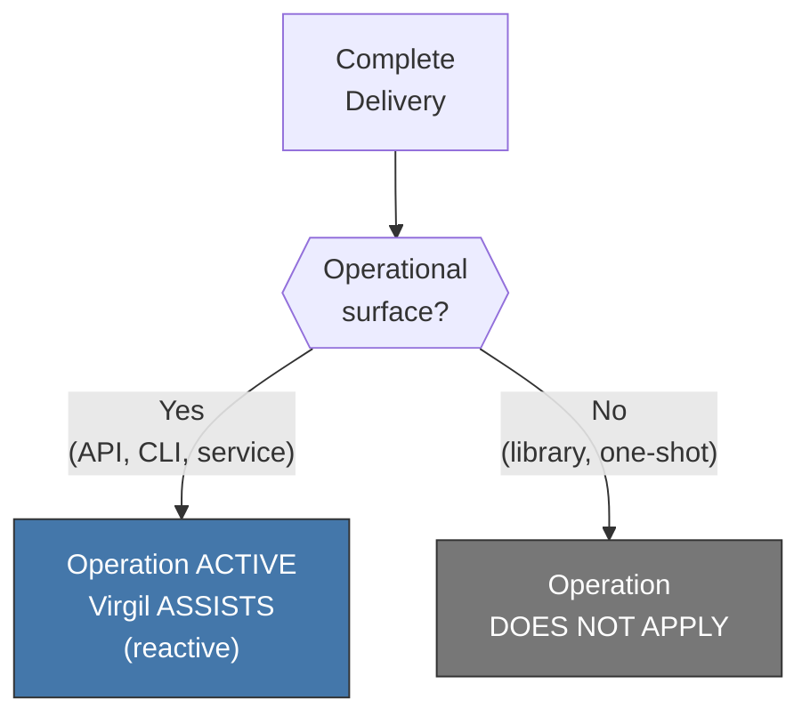
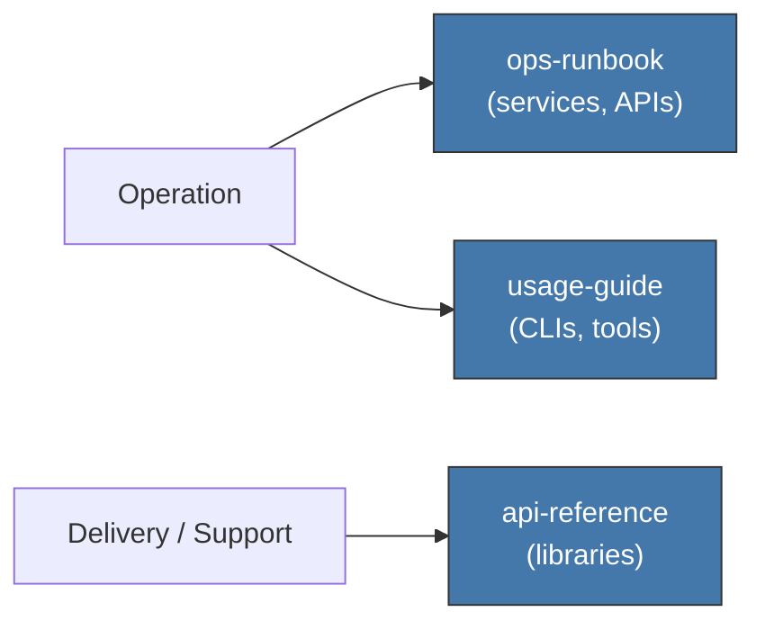
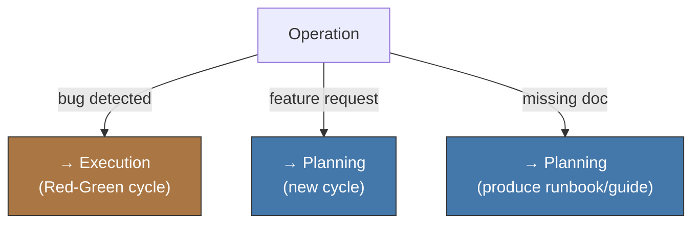

<!-- Virgil Principia
section_id: "12"
title: "How it operates (optional)"
source: "principia/constitution.md"
source_lines: [1652, 1717]
layer: operation
constitutional: false
actors: [MIM, Agent, Virgil]
glossary_terms: []
depends_on: ["11f"]
referenced_by: []
keywords:
  - operation
  - operational surface
  - operationalAssistant
  - ops-runbook
  - usage-guide
  - api-reference
  - Delivery support
  - escalation
  - bug detected
  - feature request
  - missing doc
editorial_additions: [context_paragraph]
-->

> **Context:** The Operation phase is optional and activates only when the delivered product has an active operational surface. It does not apply to libraries or single-use deliverables, whose documentation belongs to Delivery/support. Virgil itself is a CLI tool with an operational surface, so this section applies to the Virgil project in Development Mode.

## 12. How it operates (optional)

The operation phase activates ONLY if the product has an active
operational surface (APIs, CLIs, services or operated tools). A
library on its own does not activate Operation; its API reference belongs
to Delivery/support documentation. It also does not apply to single-use
deliverables.

### 12a. Activation and role

| Actor | Role in operation |
|-------|-----------------|
| MIM | User — consumes the product |
| Agent | operationalAssistant — executes MIM requests within the product's context |
| Virgil | Assists the agent with context, does NOT direct |

### 12b. Operation adapters

Two types of documentation belong directly to Operation; libraries keep `api-reference` as a Delivery/support artifact, without activating the operational phase by themselves.

### 12c. Escalation

If operation detects problems, it escalates back to the
corresponding cycle.

Operation never fixes bugs inline nor adds features without going
through the complete cycle. The e2e methodology principle (governance
principle 1) applies equally post-delivery.
