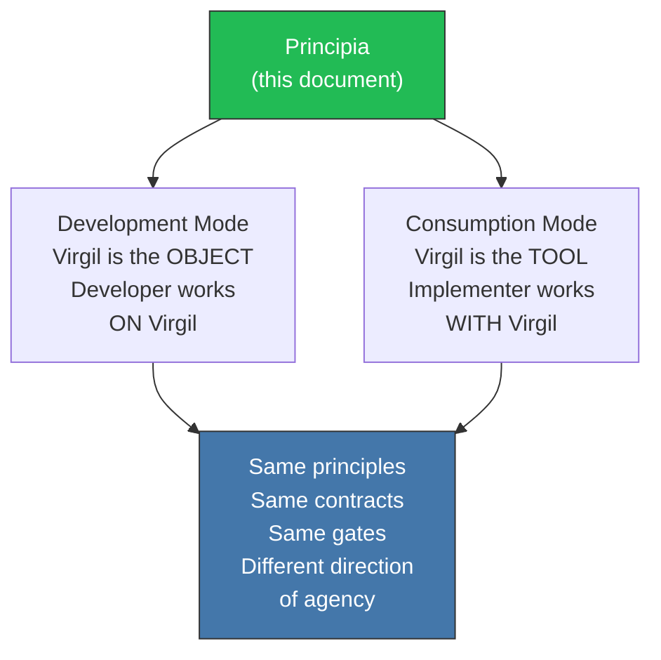

<!-- Virgil Principia
section_id: "authority"
title: "Authority and self-reference"
source: "principia/constitution.md"
source_lines: [[1720, 1738], [1782, 1788]]
source_lines_note: "Non-contiguous. Lines 1742-1779 (Glossary) belong entirely to chunk glossary (38); this chunk wraps around it, covering only 'Self-reference rule' (1720-1738) and 'Authority note' (1782-1788)."
layer: authority
constitutional: true
actors: []
glossary_terms: []
depends_on: ["6"]
referenced_by: []
keywords:
  - self-reference rule
  - Development Mode
  - Consumption Mode
  - same principles
  - same contracts
  - same gates
  - direction of agency
  - immutable
  - source of truth
  - authority note
editorial_additions: [context_paragraph]
-->

> **Context:** This rule establishes that the Principia holds the same constitutional authority over both usage modes described in the document: Development Mode (where Virgil is the object of the work) and Consumption Mode (where Virgil is the tool assisting other work).

## Self-reference rule

This Principia governs BOTH modes with the same authority:

---

## Authority note

This document is immutable once consolidated.

**Source of truth**: `principia/constitution.md`

This Principia governs with equal force **Development Mode** (where Virgil is the object being worked on) and **Consumption Mode** (where Virgil is the tool being worked with). Both modes inherit the same principles of governance, architecture, contracts and gates.
