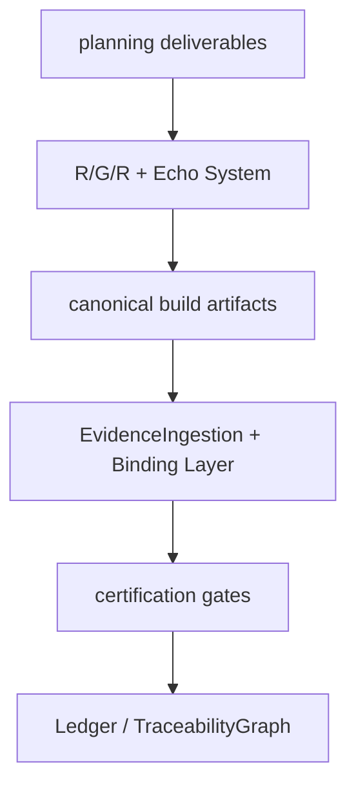
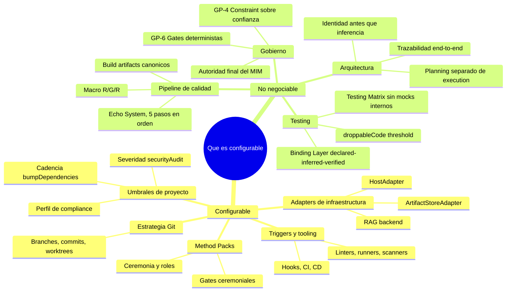

# Que es configurable y que no

[← docs/](../README.md) · [← reference/](./README.md)

Guia rapida para distinguir lo que un proyecto puede adaptar de lo que el
Principia declara invariante. Fuente: `principia/constitution.md`, Seccion 1a
(Regla anti-drift interpretativa).

## Regla anti-drift en terminos practicos

El Principia define un **ciclo cerrado de accountability** que ningun proyecto,
adapter ni Method Pack puede romper. Si una reinterpretacion permite que Virgil
"observe lo que haya ocurrido" y certifique evidencia arbitraria sin pasar por
Echo/build artifacts, esa reinterpretacion contradice el Principia.

Virgil no es un auditor pasivo: define el protocolo mediante el cual la
ejecucion adquiere evidencia certificable.

## Ciclo cerrado de accountability (backbone no negociable)

Este ciclo es la columna vertebral de Virgil. Cada paso alimenta al siguiente
y ninguno es omitible:

## Tabla de configurabilidad

| Aspecto | Configurable | No negociable (invariante) |
|---------|:---:|:---:|
| **Echo System: 5 pasos (Setup, Build, Static, Dynamic, E2E)** | | X |
| **Orden de los pasos del Echo** | | X |
| Herramientas concretas dentro de cada paso del Echo | X | |
| Scope del Echo por ambiente (dev vs CI vs CD) | X | |
| **Macro Red/Green/Refactor y su independencia por fase** | | X |
| **Existencia de build artifacts regenerables como salida del Echo** | | X |
| **Asociacion inequivoca EchoRun + sourceRevision + buildArtifactSet** | | X |
| **EvidenceIngestion y Binding Layer** | | X |
| **Gates minimas de calidad del Kernel** | | X |
| **Certificacion sobre evidencia del camino canonico** | | X |
| Comandos, runners, scanners | X | |
| Proveedores CI/CD | X | |
| Triggers que disparan Echo (hooks, CI, CD, otros adapters) | X | |
| Estrategia Git (GitFlow, trunk-based, otra) | X | |
| Nombres de branches | X | |
| Worktrees u otro mecanismo de aislamiento | X | |
| Convenciones de commits | X | |
| Ubicacion fisica de build artifacts | X | |
| Backends de HostAdapter | X | |
| Backends de ArtifactStoreAdapter | X | |
| Backends de RAG | X | |
| Method Packs (ceremonia, roles, gates adicionales) | X | |
| Umbrales de severidad en securityAudit | X | |
| Cadencia de bumpDependencies | X | |
| Plazo de certificacion post-hoc en break-glass (min 24h, max 168h) | X | |
| Perfil de compliance del proyecto (HIPAA, PCI, GDPR) | X | |
| **Principios de gobierno (GP-1 a GP-6)** | | X |
| **Invariantes arquitectonicos (9 principios)** | | X |
| **Componentes del Kernel** | | X |
| **Autoridad final del MIM** | | X |
| **Independencia stateless de fases del compositeAgent** | | X |
| **Invariantes de mutation domain** | | X |
| **Invariantes de Git strategy (4 invariantes de S11c)** | | X |
| **Binding Layer: progresion declared, inferred, verified** | | X |
| **Testing Matrix: prohibicion de unit tests con mocks internos** | | X |
| **droppableCode: threshold nunca se reduce sin MIM** | | X |

## Lo que puedes personalizar

Los siguientes elementos son **adapters, configuraciones y ceremonias** que cada
proyecto ajusta a su contexto:

### Adapters de infraestructura

- **HostAdapter**: como Virgil se comunica con el host (Claude, GPT, otro).
  Solo debe cumplir el contrato de discovery, invocacion y capabilities.
- **ArtifactStoreAdapter**: donde se persisten deliverables. Opciones: repo-docs
  (default), Jira, Confluence, Azure DevOps, Asana, GitHub Projects, u otro via
  contrato de adapter.
- **RAG backend**: el mecanismo de busqueda sobre deliverables y documentacion.
  La interfaz esta definida; la implementacion es libre.

### Method Packs

- El Method Pack define la **ceremonia**: cuantos roles participan, que gates
  ceremoniales se comprimen, como se itera.
- Puede agregar gates de calidad adicionales pero **nunca reducir** el minimo
  del Kernel.
- Pack Scrum es el unico implementado. Otros (Waterfall, Kanban, Shape Up,
  Custom) son provisiones arquitectonicas.

### Triggers y tooling

- Los triggers que disparan el Echo (git hooks, CI pipelines, CD gates) son
  configurables por proyecto.
- Las herramientas concretas dentro de cada paso del Echo (linters, test
  runners, scanners de seguridad) son libres siempre que produzcan el mismo
  contrato de evidencia.

### Estrategia Git

- Nombres de branches, convenciones de commits y flujo de integracion son
  configurables.
- El Dogma provee worktrees + branches como implementacion de referencia.
- **Restriccion**: las convenciones de commits deben permitir que Virgil
  reconstruya fase, revision y evidencia por parseo determinista (no por
  inferencia de un LLM).

### Ceremonia de planning

- FastForward (FF-1 a FF-4) comprime ceremonia de planning, no gates de calidad.
- Las gates de certificacion se ejecutan integras en todos los niveles de
  FastForward.

## Lo que no puedes cambiar

Estos son **invariantes constitucionales**. Ninguna configuracion de proyecto,
adapter ni Method Pack puede debilitarlos, omitirlos ni hacerlos opcionales:

### Pipeline de calidad

- El Echo System de 5 pasos existe y se ejecuta en orden.
- Macro R/G/R estructura la ejecucion con independencia por fase.
- Los build artifacts son regenerables y su existencia es canonica.
- La certificacion se decide sobre evidencia del camino canonico, no sobre
  afirmaciones del agente.

### Gobierno

- GP-4 (Constraint > confianza): constraints enforceables y gates, no promesas.
- GP-6 (Gates mecanicas deterministas): binario en ejecucion, pasa o no pasa.
- Autoridad final del MIM: aprueba, rechaza, desempata. No negociable.

### Arquitectura

- Identidad antes que inferencia.
- Autoridad separada de retrieval.
- Planning separado de execution.
- Trazabilidad end-to-end.

### Testing

- Testing Matrix: el tier primario es App/Servicio (stack real, sin mocks).
  Los unit tests con mocks internos (valor = 0) estan prohibidos.
- Binding Layer: la progresion declared, inferred, verified es obligatoria.
- droppableCode: el threshold de cobertura nunca se reduce sin autorizacion MIM.

### Fuerza normativa

Las declaraciones absolutas del Principia son **obligaciones de conformidad y
direccion arquitectonica**, no descripciones del estado actual de
implementacion. Una IA o implementador no debe:

- Debilitarlas porque hoy una herramienta no pueda enforcearlas completamente.
- Reemplazarlas por una abstraccion mas generica.
- Reinterpretar mecanismos fundacionales como detalles accidentales.
- Introducir salvedades operativas dentro del Principia cuando pertenecen al
  Dogma o adapters.

La incapacidad actual de enforcement crea trabajo pendiente de implementacion,
no una excepcion al principio.

## Prueba anti-drift

Para verificar si una reinterpretacion es valida, aplica esta prueba:

> Si la reinterpretacion permite que Virgil simplemente "observe lo que haya
> ocurrido" y certifique evidencia arbitraria sin pasar por Echo/build
> artifacts, esa reinterpretacion contradice el Principia.

Fuente: `principia/constitution.md`, Seccion 1a.

---

← Anterior: [Glosario](./glosario.md) · [↑ reference](./README.md) · [↑↑ docs](../README.md) · Siguiente: [Mapa de trazabilidad](./mapa-principia.md) →
