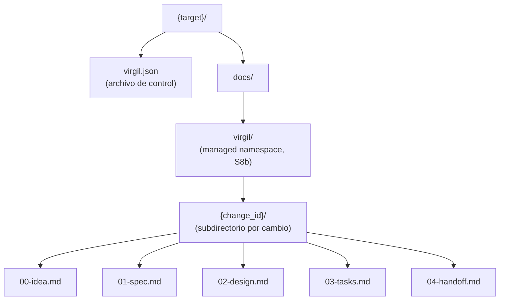

# Adapter repo-docs

[← docs/](../README.md) · [← specification/](./README.md)

`repo-docs` es el ArtifactStoreAdapter local predeterminado. Persiste revisiones y estado
del proyecto consumidor dentro de un namespace administrado de su propio repositorio.

Referencia constitucional: Principia S8a (ArtifactStore), S8b (separacion de namespaces).

<!-- SPEC-REPO-LAYOUT -->
## Layout de filesystem



Cada cambio publica sus artefactos bajo `docs/virgil/{change_id}/`. Multiples cambios
coexisten sin colision de nombres (`docs/virgil/users-rbac/`, `docs/virgil/pokemon-module/`).

## virgil.json

Archivo de control del adapter. Unica autoridad de identidad del proyecto.

| Campo | Tipo | Descripcion |
|---|---|---|
| `project_id` | string | Identidad estable del proyecto |
| `adapter` | string | `repo-docs` |
| `managed_root` | string | `docs/virgil/` |
| `active_change` | object | Cambio activo (`change_id`, `intention`, `created_at`) |

Slice 1 soporta un unico cambio activo por proyecto. `active_change` no es una lista.

<!-- SPEC-REPO-FRONTMATTER -->
## Frontmatter: JSON en Markdown

Cada archivo de artefacto es Markdown con frontmatter delimitado por `---json` (apertura)
y `---` (cierre), pero el contenido del frontmatter es **JSON** (no YAML). El tag `json`
en el delimitador de apertura distingue este frontmatter del YAML convencional y sigue
la convencion de frontmatter etiquetado de Hugo. Esto permite reutilizar `encoding/json`
sin dependencia de parsing YAML.

```text
---json
{
  "schema": "virgil.dev/artifact/v1alpha1",
  "artifact_kind": "idea",
  "change_id": "users-rbac",
  "project_id": "my-project",
  "status": "draft",
  "revision": "rev-000001",
  "upstream_refs": [],
  "content_digest": "sha256:...",
  "idempotency_key": "...",
  "created_at": "..."
}
---

# Contenido en Markdown
```

<!-- SPEC-REPO-WRITE-SCOPE -->
## Politica de escritura

El adapter PUEDE leer o indexar `docs/` segun una allowlist explicita. Solo PUEDE escribir:

- `virgil.json` (raiz del target)
- `events.jsonl` (raiz del target)
- `docs/virgil/{change_id}/{NN}-{kind}.md` que el mismo administra

Los documentos existentes en `docs/` fuera de `docs/virgil/` son read-only y no producen
`CORRUPT_LEDGER`: conviven con el corpus del consumidor. Codigo, producto y configuracion
permanecen fuera del write scope de planning. Referencia: Principia S8b.

<!-- SPEC-REPO-ATOMICITY -->
## Politica de escritura: create-exclusive

- **Inicializacion**: `virgil.json` se escribe con create-exclusive-y-rename.
- **Actualizacion**: copy-rewrite-rename para `virgil.json` y archivos de artefacto.
- **Atomicidad**: rename atomico del mismo filesystem cuando esta disponible.

Si el HostAdapter no puede garantizar atomicidad/durabilidad requerida, la operacion
responde `unsupported`. No degrada a last-write-wins.

## Persistencia de eventos

- **Ruta**: `{target}/events.jsonl`, en la raiz del target, junto a `virgil.json`.
- **Formato**: NDJSON — un objeto JSON por linea, terminada en salto de linea.
- **Campos por evento**: `event_id`, `event_type`, `change_id` (cuando aplica),
  `request_id`, `idempotency_key`, `timestamp`, `data`.
- **Contrato de escritura**: append-only. Los eventos nuevos se agregan al final del
  archivo; nunca se sobrescriben ni reordenan las lineas existentes.

El primer evento tras la inicializacion es `project_initialized`.

El log de eventos es la base de la recuperacion en sesion fresca (conformance C7), de la
idempotencia de retries y deteccion de reuso incompatible (conformance C8-C9), y de la
auditabilidad de adapter, policy y efectos (conformance C14).

En Slice 1, el historial de git complementa al log de eventos para el versionado de
artefactos, pero no lo reemplaza: `events.jsonl` sigue siendo la fuente de verdad para
recuperacion e idempotencia.

<!-- SPEC-REPO-LIFECYCLE -->
## Ciclo de vida de un artefacto en disco

- **Crear**: create-exclusive-y-rename produce `{NN}-{kind}.md` con `status: draft`.
- **Presentar**: reescribe frontmatter (`status: awaiting_approval`), contenido intacto.
- **Aprobar**: reescribe frontmatter (`status: approved`, agrega `approved_by`/`approved_at`).
- **Retirar**: reescribe frontmatter (`status: withdrawn`).
- **Nueva revision**: reutiliza el mismo archivo, incrementa `revision` (`rev-000002`).

En Slice 1, el historial de git actua como backend de registro para las revisiones.
Las propiedades completas del Ledger constitucional (idempotencia de transiciones,
inmutabilidad) se implementaran progresivamente en slices posteriores.

<!-- SPEC-REPO-DERIVATION -->
## Derivacion de estado

`repo-docs` no persiste `derived_step`. Lo recalcula en cada operacion escaneando
`docs/virgil/{change_id}/` y leyendo el `status` de cada frontmatter. El primer artefacto
de la secuencia que no esta en `approved` es el `derived_step` actual. Si los cinco
estan `approved`, `derived_step` es `complete`.

Referencia: `state-model.md` (derivacion de fase).

## Separacion de namespaces

Dos arboles `docs/` que no deben confundirse (Principia S8b):

- `Virgil/docs/` -- dogma operativo canonico. Read-only para consumidores.
- `{consumer}/docs/` -- artefactos operativos del proyecto consumidor.

Copiar artefactos del consumidor a `Virgil/docs/`, o dogma mutable al corpus del
consumidor, viola `method_source != target`.

<!-- SPEC-REPO-SELFHOST -->
## Self-hosting

Requiere autorizacion explicita. El `managed_root` no puede colisionar con el dogma
canonico. Se RECOMIENDA un adapter externo o temporal para validar/desarrollar Virgil.

<!-- SPEC-REPO-CONCURRENCY -->
## Concurrencia

Slice 1 admite un solo writer por cambio. Si no puede garantizarse esa exclusion,
el adapter detiene la operacion. Leases y compare-and-swap pertenecen a slices futuros.

---

← Anterior: [Modelo de estado](./state-model.md) · [↑ specification](./README.md) · [↑↑ docs](../README.md) · Siguiente: [Contratos de operaciones](./skill-contracts.md) →
