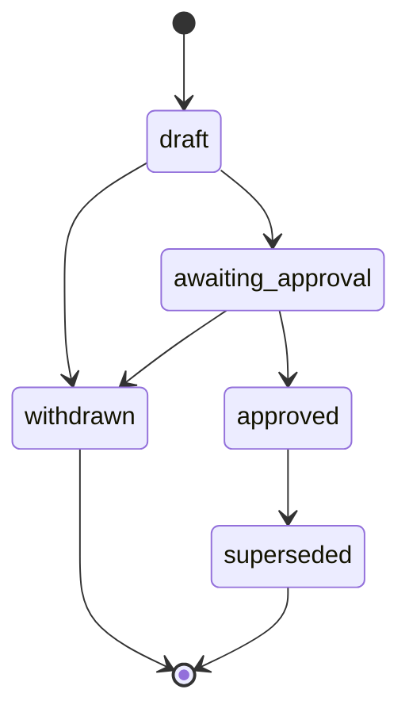

# Modelo de estado

[← docs/](../README.md) · [← specification/](./README.md)

La unica lifecycle persistida es la de una **revision de artefacto**. No se persiste una
segunda maquina para "fase", "completitud" o "progreso". La fase actual es una consulta
derivada.

Referencia constitucional: Principia S3a (ciclo de vida), S8a (ArtifactStore).

## Tipos de artefacto

Cada cambio usa los tipos requeridos por su Method Pack. Para el Pack Scrum (predeterminado)
el orden es:


## Estados de revision

| Estado | Significado |
|---|---|
| `draft` | Revision creada; correcciones requieren una revision sucesora |
| `awaiting_approval` | El productor la presento al gate del Method Pack |
| `approved` | El gate aplicable paso; Virgil registro la aprobacion |
| `withdrawn` | El draft o pedido de aprobacion se abandono sin borrar historial |
| `superseded` | Una revision aprobada posterior la reemplazo |

Los estados `withdrawn` y `superseded` son terminales (sin transiciones de salida).

## Transiciones permitidas



Toda transicion se persiste como evento. El contenido de una revision es inmutable desde
que se publica. Una correccion retira la revision presentada (`withdrawn`) y crea una
sucesora en `draft`; no devuelve ni edita la misma revision.

## Invariante de revision unica

Solo PUEDE existir una revision abierta (`draft` o `awaiting_approval`) por tipo de
artefacto y cambio. Esta invariante evita dos candidatos simultaneos dentro del baseline
single-writer.

## Revision aprobada efectiva

Una revision `approved` es **efectiva** cuando:

1. No existe una revision posterior del mismo artefacto en `draft` o `awaiting_approval`.
2. No esta `superseded` ni `withdrawn`.
3. Sus referencias upstream apuntan a las revisiones aprobadas efectivas actuales.

"Efectiva" es un predicado de consulta, no un estado persistido adicional.

Cuando una revision nueva alcanza `approved`, Virgil registra `approved -> superseded`
para la revision aprobada anterior del mismo artefacto.

## Derivacion de fase

Virgil recorre el orden requerido por el Method Pack y selecciona el primer tipo sin
revision aprobada efectiva. Ese tipo es el paso actual (`derived_step`).

```text
derived_step = first(required_artifacts, NOT has_effective_approved_revision)
```

Si todos tienen una revision aprobada efectiva, `derived_step` es `complete`. El resultado
de esta consulta no se persiste como otra maquina de estados. Referencia: Principia S10
(recuperacion por derivacion).

## Pivot

Un pivot registra un evento con su razon y el primer tipo de artefacto afectado. Luego
crea una revision `draft` para ese tipo.

Mientras esa revision este abierta, no hay revision aprobada efectiva para ese tipo y la
fase se deriva alli. Al aprobar su reemplazo:

1. La revision aprobada anterior pasa a `superseded`.
2. Cualquier downstream que referencie la revision anterior deja de ser efectivo.
3. La derivacion selecciona el primer downstream que debe revisarse.

Si el pivot se abandona (`withdrawn`), la revision aprobada anterior puede volver a ser
efectiva si sus referencias siguen vigentes.

## Restricciones

- No existen estados persistidos llamados `phase`, `stale`, `in_progress` o `complete`.
- `status` en el OperationResult describe la invocacion, no el lifecycle del cambio.
- El estado se reconstruye tras crash, compactacion o nueva sesion escaneando revisiones
  consolidadas (Principia S10).

---

← Anterior: [Protocolo de operaciones](./operation-protocol.md) · [↑ specification](./README.md) · [↑↑ docs](../README.md) · Siguiente: [Adapter repo-docs](./repo-docs-adapter.md) →
