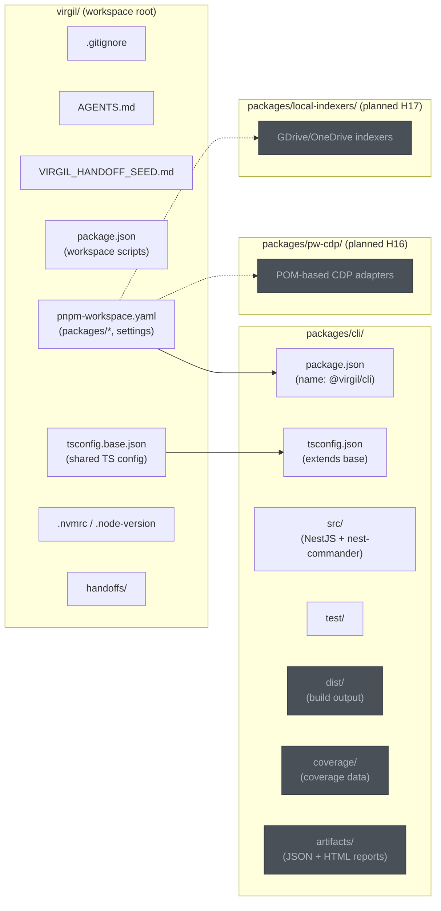

# H01 — Repository Bootstrap & Open Agentic Contract

> **Project:** Virgil
> **Artifact type:** Child handoff
> **Parent:** [`VIRGIL_HANDOFF_SEED.md`](../VIRGIL_HANDOFF_SEED.md)
> **Status:** Ready for assignment
> **Normative agent behavior:** [`AGENTS.md`](../AGENTS.md)

## Menú

- [Progress Tracker](#progress-tracker)
- [Objective](#objective)
- [Monorepo Package Ecosystem](#monorepo-package-ecosystem)
- [Repository Directory Structure](#repository-directory-structure)
- [Artifact Output Convention](#artifact-output-convention)
- [Scope](#scope)
- [Out of Scope](#out-of-scope)
- [Preconditions](#preconditions)
- [Deliverables](#deliverables)
- [Scaffolding Policy](#scaffolding-policy)
- [Verification Requirements](#verification-requirements)
- [Evidence Requirements](#evidence-requirements)
- [Risks and Constraints](#risks-and-constraints)
- [References](#references)

---

## Progress Tracker

- [ ] Assignment accepted
- [ ] Preconditions verified
- [ ] Monorepo workspace initialized (`pnpm-workspace.yaml` with `packages/*`)
- [ ] Shared `tsconfig.base.json` established at root
- [ ] NestJS project scaffolded into `packages/cli/`
- [ ] Exact version policy configured in `pnpm-workspace.yaml`
- [ ] Node.js pinned to exact version
- [ ] pnpm pinned to exact version
- [ ] Root `.gitignore` established
- [ ] `.atl/` ignored as local operational state
- [ ] TypeScript strict mode enabled (base and package-level)
- [ ] Minimal CLI command executes end-to-end
- [ ] `AGENTS.md` preserved as canonical open-standard contract
- [ ] Conventional Commits configured via Husky
- [ ] Standard verification gates pass (see [SHARED_VERIFICATION.md](./SHARED_VERIFICATION.md))
- [ ] Exact dependency-spec validation passes
- [ ] Evidence recorded
- [ ] Handoff completion report produced

[↑ Menú](#menú)

---

## Objective

Establish the smallest trustworthy monorepo foundation for Virgil. After this handoff is complete, subsequent handoffs (H02 onward) can begin work against a repository that has:

- a pnpm workspace with `packages/cli/` as the first active package,
- a shared TypeScript configuration at the root,
- a working NestJS + nest-commander CLI skeleton inside `packages/cli/`,
- exact dependency enforcement,
- static and dynamic verification gates,
- Husky-enforced conventional commits,
- predictable per-package artifact output conventions,
- and a clean `.gitignore` protecting against accidental state leakage.

This handoff produces a **buildable, testable, verifiable monorepo** — not a product feature.

[↑ Menú](#menú)

---

## Monorepo Package Ecosystem

Virgil is structured as a pnpm workspace monorepo. H01 establishes the workspace and the first package. Future handoffs introduce additional packages.

```mermaid
graph TB
    root["virgil (workspace root)<br/>pnpm-workspace.yaml<br/>tsconfig.base.json"]

    cli["packages/cli/<br/>NestJS + nest-commander<br/>SEA target binary"]
    pwcdp["packages/pw-cdp/<br/>Playwright CDP adapters<br/>Enterprise auth (OAuth/2FA/SSO)"]
    indexers["packages/local-indexers/<br/>GDrive/OneDrive synced<br/>folder indexers"]

    root --> cli
    root -.-> pwcdp
    root -.-> indexers

    cli -- "browser auth via" -.-> pwcdp
    cli -- "local knowledge via" -.-> indexers

    style cli fill:#2d6a4f,stroke:#1b4332,color:#d8f3dc
    style pwcdp fill:#495057,stroke:#343a40,color:#adb5bd
    style indexers fill:#495057,stroke:#343a40,color:#adb5bd
    style root fill:#1a535c,stroke:#0b3d45,color:#bee9e8
```

**Legend:**

- Solid arrows: active dependency within H01 scope.
- Dashed arrows: planned packages introduced by future handoffs.
- `packages/cli/` — H01 (this handoff) + H02.
- `packages/pw-cdp/` — H16 (Playwright CDP browser automation for enterprise auth, POM pattern).
- `packages/local-indexers/` — H17 (GDrive/OneDrive synced folder indexers).

[↑ Menú](#menú)

---

## Repository Directory Structure

The following diagram shows the target directory layout after H01 completion.



[↑ Menú](#menú)

---

## Artifact Output Convention

Every package in the monorepo must follow a predictable output directory structure. These directories are generated, never committed, and covered by the root `.gitignore`.

| Directory | Purpose | Lifecycle |
| --- | --- | --- |
| `packages/<pkg>/dist/` | Compiled build output (TypeScript to JavaScript) | Regenerated by `pnpm build` |
| `packages/<pkg>/coverage/` | Raw coverage data (v8/istanbul) | Regenerated by `pnpm test:dynamic` |
| `packages/<pkg>/artifacts/` | Machine-readable JSON and human-readable HTML/SPA test reports | Regenerated by `pnpm test:dynamic` |

Rules:

1. Each package owns its output directories. There is no shared root `dist/`, `coverage/`, or `artifacts/`.
2. Build and test scripts in each package must write to their own subdirectory, not to root-level directories.
3. The root `.gitignore` covers all three patterns globally (`dist/`, `coverage/`, `artifacts/`), ensuring consistent treatment across current and future packages.
4. CI pipelines and verification gates reference per-package paths when collecting artifacts.

[↑ Menú](#menú)

---

## Scope

### Included

1. **pnpm workspace initialization** — `pnpm-workspace.yaml` with `packages: ["packages/*"]`, `saveExact: true`, and `savePrefix: ''`.
2. **Shared TypeScript base configuration** — `tsconfig.base.json` at the workspace root with `strict: true` and common compiler options. Package-level `tsconfig.json` files extend this base.
3. **NestJS project scaffold into `packages/cli/`** using the CLI generator with exact versions.
4. **pnpm as the sole package manager** for repository development.
5. **Exact version policy** — configured at the workspace level via `pnpm-workspace.yaml`.
6. **Node.js version pinning** — `.nvmrc` or `.node-version` set to `24.16.0`.
7. **pnpm version pinning** — root `package.json#packageManager` set to `pnpm@11.24.0`.
8. **TypeScript strict mode** — enforced through `tsconfig.base.json` with `"strict": true`, extended by `packages/cli/tsconfig.json`.
9. **Root `.gitignore`** — covering `node_modules/`, `dist/`, `coverage/`, `artifacts/`, `*.log`, `.DS_Store`, `.env`/`.env.*` (except `.env.example`), and `.atl/`.
10. **AGENTS.md preservation** — the existing file must remain as-is. The repository structure must treat it as the canonical open-standard contract.
11. **Minimal CLI command** — a trivial command (e.g. `virgil version`) that proves NestJS + nest-commander bootstraps and executes end-to-end under normal Node runtime from `packages/cli/`.
12. **Conventional Commits enforcement** — Husky pre-commit/commit-msg hooks validating the commit convention defined in `AGENTS.md`.
13. **Static verification gate** — `pnpm test:static` running dependency audit, linting, formatting verification, TypeScript verification, and exact dependency-spec validation across the workspace. The specific linter and formatter are determined by the CLI generator (e.g. ESLint/Prettier, Biome, or equivalent) — do not force tools the scaffold does not provide.
14. **Dynamic verification gate** — `pnpm test:dynamic` running tests with > 97% coverage, producing JSON and HTML/SPA artifacts in `packages/cli/artifacts/`.
15. **Artifact output convention** — `dist/`, `coverage/`, and `artifacts/` directories per package, never at root.
16. **Language policy compliance** — all persistent artifacts (code, comments, tests, docs) in International English.
17. **Markdown authoring compliance** — all repository-authored Markdown follows the `## Menú` and `[↑ Menú](#menú)` backlink rules from `AGENTS.md`.

### Seed Definition of Done Coverage

This handoff addresses seed items: 1, 2, 3, 4, 5, 6, 7, 8, 9, 10, 14, 15, 16, 17, 18, 19, 20, 22, 28, 29.

[↑ Menú](#menú)

---

## Out of Scope

The following responsibilities belong to other handoffs and must **not** be addressed here:

| Exclusion | Owner |
| --- | --- |
| Node SEA packaging and runtime isolation | H02 |
| Global link / SEA distribution verification | H02 |
| CI artifact generation (GitHub Actions SEA matrix) | H02 |
| Workspace identity and configuration management | H03 |
| Provider contracts (Issue, Knowledge, Repo, Chat) | H04 |
| Local repository provider | H05 |
| SQLite persistence / Drizzle ORM schema | H06 |
| RAG / vector / embedding layer | H07 |
| Progressive discovery | H08 |
| Handoff protocol format | H09 |
| Product agent orchestration runtime | H10 |
| Model-tier routing runtime | H11 |
| Remote providers (Issue, Knowledge, Chat) | H12--H14 |
| Knowledge lifecycle and storage pressure | H15 |
| Playwright CDP browser automation (`packages/pw-cdp/`) | H16 |
| Local folder indexers (`packages/local-indexers/`) | H17 |
| CI/CD pipeline configuration | H18 |

The minimal CLI command proves the NestJS + nest-commander stack works inside the monorepo. It does **not** implement any Virgil product feature.

[↑ Menú](#menú)

---

## Preconditions

1. The repository contains `AGENTS.md` (immutable, already present).
2. The repository contains `VIRGIL_HANDOFF_SEED.md` (architectural seed).
3. Node.js 24.16.0 is available in the development environment.
4. pnpm 11.24.0 is available in the development environment.
5. The POC reference branch `poc/ref` is available locally for consultation.

[↑ Menú](#menú)

---

## Deliverables

### D1 — Monorepo Workspace & NestJS Project Scaffold

Initialize the pnpm workspace and scaffold NestJS into `packages/cli/`.

**Acceptance criteria:**

- `pnpm-workspace.yaml` exists at the workspace root with `packages: ["packages/*"]`.
- `tsconfig.base.json` exists at the workspace root with `strict: true` and shared compiler options (target, module resolution, declaration, source maps, path aliases).
- Project created via `pnpm dlx @nestjs/cli@12.0.1 new cli --strict --skip-git --package-manager pnpm` executed from the `packages/` directory (or equivalent flags after `--help` verification), placing the scaffold at `packages/cli/`.
- `--skip-git` used because the repository already has Git history.
- `packages/cli/tsconfig.json` extends `../../tsconfig.base.json`.
- NestJS 12.0.1, nest-commander 3.21.0 installed as exact versions within `packages/cli/`.
- No globally installed `@nestjs/cli`.
- Root `package.json` contains workspace-level scripts (`build`, `test:static`, `test:dynamic`) that delegate to the workspace via `pnpm -r` or `pnpm --filter`.

### D2 — Exact Version Policy

Configure pnpm to persist exact versions automatically at the workspace level.

**Acceptance criteria:**

- `pnpm-workspace.yaml` contains the equivalent of `saveExact: true` and `savePrefix: ''`.
- Root `package.json#packageManager` is set to `pnpm@11.24.0`.
- `.nvmrc` or `.node-version` contains `24.16.0`.
- A static verification script independently rejects any floating version specification (`^`, `~`, `>=`, `*`, `latest`) in all `packages/*/package.json` dependencies and devDependencies.

### D3 — Root .gitignore

Establish the root `.gitignore` before any tool-generated local state accumulates.

**Acceptance criteria:**

- `.gitignore` is created in the same commit as (or before) any file that would be ignored by it.
- Covers at minimum: `node_modules/`, `dist/`, `coverage/`, `artifacts/`, `*.log`, `.DS_Store`, `.env`, `.env.*`, `!.env.example`, `.atl/`.
- Patterns apply recursively, covering output directories within all current and future packages.

### D4 — Minimal CLI Command

Prove the NestJS + nest-commander stack bootstraps and executes a trivial command from the monorepo.

**Acceptance criteria:**

- Running the configured entry point (e.g. `npx ts-node packages/cli/src/main.ts version`) outputs a version string and exits cleanly.
- The command is implemented using nest-commander's `@Command()` decorator pattern within `packages/cli/src/`.
- The command does not depend on any external service, database, or provider.

### D5 — Static Verification Gate

Configure `pnpm test:static` as the unified static verification command across the workspace.

**Acceptance criteria:**

- Runs dependency/security audit with strict failure behavior.
- Runs the CLI-generated linter (ESLint, Biome, or equivalent) with a strict configuration across all packages.
- Runs the CLI-generated formatter in check mode across the workspace (Prettier, Biome, or equivalent).
- Runs `tsc --noEmit` for TypeScript verification (using the shared base config).
- Runs the exact dependency-spec validator from D2 across all `packages/*/package.json` files.
- Any violation fails the command with a non-zero exit code.

### D6 — Dynamic Verification Gate

Configure `pnpm test:dynamic` as the unified dynamic verification command.

**Acceptance criteria:**

- Runs the test suite (vitest or jest — implementer's choice, vitest preferred per POC-00 precedent).
- Coverage exceeds 97% for statements, lines, and functions.
- Produces a machine-readable JSON coverage artifact in `packages/cli/artifacts/`.
- Produces a standalone human-readable HTML/SPA coverage report in `packages/cli/artifacts/`.
- Tests exercise the minimal CLI command's public behavior.
- Tests mock no external systems (there are none to mock at this stage).

### D7 — Conventional Commits Enforcement

Configure Husky to enforce the commit convention from `AGENTS.md`.

**Acceptance criteria:**

- Husky is installed as a devDependency at the workspace root (exact version).
- A commit-msg hook validates that the commit message follows the format: `<type>: <title>` where type is one of `feat`, `fix`, `chore`, `task`, `spike`, `release`.
- Subject line validation: imperative mood is encouraged but not machine-enforced; lowercase, no trailing period, at most 72 characters are enforced.
- No `Co-Authored-By` lines attributing AI agents (enforcement optional — the convention is documented in `AGENTS.md`).

### D8 — Build Command

Configure `pnpm build` as the workspace-aware build command.

**Acceptance criteria:**

- `pnpm build` at the workspace root compiles TypeScript across all packages and produces runnable output in each package's `dist/` directory.
- `packages/cli/dist/` contains the compiled output for the CLI package.
- The build output is sufficient for normal Node execution (not SEA — that is H02).

[↑ Menú](#menú)

---

## Scaffolding Policy

File creation must prefer CLI generators over manual authoring.

Rules:

1. Before using any generator, run `--help` to discover available flags.
2. Use `pnpm dlx` for generators that are not project devDependencies (e.g. `pnpm dlx @nestjs/cli@12.0.1`).
3. Never install `@nestjs/cli` globally.
4. When a generator produces files that need modification, modify them after generation — do not create them manually instead.
5. The POC reference branch `poc/ref` may be consulted for patterns, but files must not be copied verbatim without adapting them to the monorepo structure.
6. Generators must target `packages/cli/` (or the appropriate package directory), never the workspace root.

[↑ Menú](#menú)

---

## Verification Requirements

> Standard static, dynamic, and build gates are defined in [`SHARED_VERIFICATION.md`](./SHARED_VERIFICATION.md). This handoff adds the following handoff-specific requirements:

- All five static gates (audit, linting, formatting, TypeScript, exact-deps) must be **wired for the first time** and green across the workspace.
- Test artifacts produced in `packages/cli/artifacts/`.
- Build output produced in `packages/cli/dist/`.

[↑ Menú](#menú)

---

## Evidence Requirements

> Standard evidence items (build, static, dynamic, coverage, dependency list) are defined in [`SHARED_VERIFICATION.md`](./SHARED_VERIFICATION.md). Handoff-specific evidence:

1. Proof that the minimal CLI command executes end-to-end from `packages/cli/` (terminal output).
2. Proof that `pnpm-workspace.yaml` enforces exact versions and declares `packages: ["packages/*"]` (show config + validation output).
3. Proof that `tsconfig.base.json` exists at root with `strict: true` and that `packages/cli/tsconfig.json` extends it.
4. Proof that `.gitignore` covers the required patterns (show file contents).
5. Proof that Husky commit-msg hook rejects a malformed commit message.
6. Confirmation that `AGENTS.md` is unchanged from its canonical state.

[↑ Menú](#menú)

---

## Risks and Constraints

| Risk | Mitigation |
| --- | --- |
| NestJS CLI may generate floating versions in `package.json` | Run exact-deps validator immediately after scaffolding; pin all versions before committing |
| NestJS 12 CLI flags may differ from documentation | Run `--help` first; adapt flags to actual CLI output |
| NestJS CLI `new` command may not scaffold cleanly into `packages/cli/` | Run from the `packages/` parent directory or use `--directory` flag; verify output path after generation |
| Husky installation may create files that need `.gitignore` coverage | Review generated files and update `.gitignore` in the same commit |
| Linter defaults may conflict with strict TypeScript | Configure the CLI-generated linter for TypeScript strict mode from the start; resolve conflicts before committing |
| `pnpm audit` may report vulnerabilities in fresh NestJS scaffold | Document any audit findings; if blocking, report as a constraint rather than silently ignoring |
| Shared `tsconfig.base.json` paths may conflict with package-level settings | Use `extends` with relative path `../../tsconfig.base.json`; test compilation from both root and package level |
| Workspace script delegation (`pnpm -r` / `--filter`) may have ordering issues with single package | Verify workspace commands work correctly with a single package; document the pattern for future packages |

[↑ Menú](#menú)

---

## References

- [`AGENTS.md`](../AGENTS.md) — normative agent behavior contract (immutable)
- [`VIRGIL_HANDOFF_SEED.md`](../VIRGIL_HANDOFF_SEED.md) — architectural seed and parent handoff
- [`SHARED_VERIFICATION.md`](./SHARED_VERIFICATION.md) — standard verification gates and POC-00 validated stack versions
- Branch `poc/ref` (local) — POC-00 reference implementation
- [AGENTS.md Open Standard](https://agents.md/) — Linux Foundation open agentic standard
- [pnpm Workspaces](https://pnpm.io/workspaces) — workspace configuration reference

[↑ Menú](#menú)
