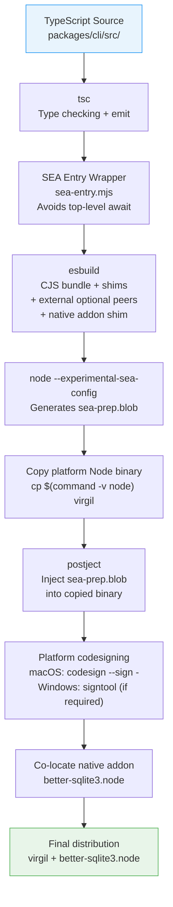
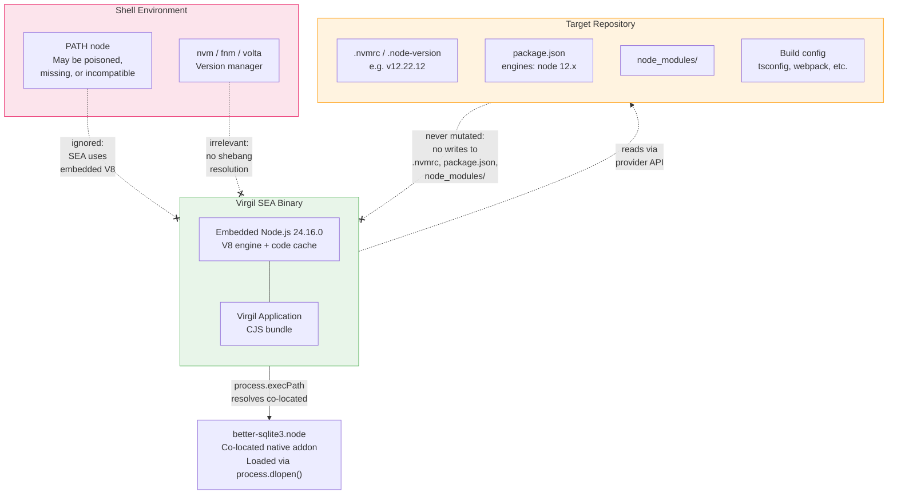

# H02 — CLI Runtime, Global Usage & SEA Packaging

> **Project:** Virgil
> **Artifact type:** Child handoff
> **Parent:** [`VIRGIL_HANDOFF_SEED.md`](../VIRGIL_HANDOFF_SEED.md)
> **Status:** Ready for assignment
> **Normative agent behavior:** [`AGENTS.md`](../AGENTS.md)

## Menú

- [Progress Tracker](#progress-tracker)
- [Objective](#objective)
- [Scope](#scope)
- [Out of Scope](#out-of-scope)
- [Preconditions](#preconditions)
- [Deliverables](#deliverables)
- [SEA Build Pipeline](#sea-build-pipeline)
- [Runtime Isolation Architecture](#runtime-isolation-architecture)
- [SEA Workarounds Reference](#sea-workarounds-reference)
- [Verification Requirements](#verification-requirements)
- [Evidence Requirements](#evidence-requirements)
- [Risks and Constraints](#risks-and-constraints)
- [References](#references)

---

## Progress Tracker

- [ ] Assignment accepted
- [ ] Preconditions verified
- [ ] Monorepo workspace structure established (`packages/cli/`)
- [ ] Trivial Virgil command executes end-to-end through normal Node runtime
- [ ] Global development linking (`pnpm link --global`) documented and verified
- [ ] SEA build pipeline configured (tsc, esbuild, sea-config, postject, codesign)
- [ ] SEA entry wrapper and CJS bundle produced
- [ ] Native addon shim resolves `better-sqlite3.node` in both SEA and development contexts
- [ ] NestJS optional peers marked external in esbuild
- [ ] SEA binary starts successfully from arbitrary working directory
- [ ] Runtime isolation proven: legacy-runtime fixture passes
- [ ] Runtime isolation proven: poisoned `node` on PATH ignored
- [ ] Runtime isolation proven: target-repository metadata unchanged
- [ ] Platform matrix defined with evidence
- [ ] SEA risks documented (Nest bundling, SQLite, native addons, vector extensions, assets)
- [ ] Standard verification gates pass (see [SHARED_VERIFICATION.md](./SHARED_VERIFICATION.md))

[↑ Menú](#menú)

---

## Objective

Prove that the Virgil CLI operates as a self-contained executable with full runtime isolation from target repositories. After this handoff is complete, Virgil can be distributed as a Node SEA binary that carries its own Node 24 runtime, starts from any directory regardless of the local Node version, and never contaminates the target repository's runtime metadata.

This handoff extends the POC-00 validated vertical into a production-grade SEA packaging pipeline within the `packages/cli/` monorepo package. POC-00 pre-validated the core SEA strategy; H02 codifies it as repeatable infrastructure with adversarial runtime isolation proofs and documented platform constraints.

[↑ Menú](#menú)

---

## Scope

### Included

1. **Monorepo CLI package** — establish `packages/cli/` as the NestJS + nest-commander SEA target within the pnpm workspace.
2. **Normal Node runtime verification** — a trivial Virgil command executes end-to-end through the standard `node` interpreter (seed DoD item 11).
3. **Global development linking** — `pnpm link --global` workflow documented and verified so contributors can iterate on the CLI without rebuilding SEA (seed DoD item 12).
4. **SEA build pipeline** — automated pipeline: `tsc` type check, `esbuild` CJS bundle with shims, `node --experimental-sea-config` blob generation, `postject` blob injection, platform codesigning, final binary (seed DoD item 23).
5. **SEA entry wrapper** — `sea-entry.mjs` wrapper that avoids top-level `await` incompatibility with CJS.
6. **Native addon co-location** — `better-sqlite3.node` resolved from `process.execPath` directory in SEA context, `__dirname` in development.
7. **NestJS optional peer externals** — `class-validator`, `class-transformer`, `@nestjs/microservices`, `@nestjs/websockets`, `@nestjs/platform-express` marked external in esbuild.
8. **Runtime isolation proof** — adversarial fixture demonstrating SEA binary ignores target repository runtime and poisoned PATH entries (seed DoD items 24, 25, 26).
9. **SEA risk documentation** — explicit documentation of constraints and limitations for Nest bundling, SQLite, native addons, vector extensions, and SEA assets (seed DoD item 27).
10. **Platform matrix specification** — evidence-based matrix for macOS, Linux, and Windows with architecture/CPU variants.
11. **Build output structure** — predictable output in `packages/cli/dist/` (compiled JS), `packages/cli/artifacts/` (SEA binaries).

### Seed Definition of Done Coverage

This handoff addresses seed items: 11, 12, 23, 24, 25, 26, 27.

[↑ Menú](#menú)

---

## Out of Scope

The following responsibilities belong to other handoffs and must **not** be addressed here:

| Exclusion | Owner |
| --- | --- |
| Repository bootstrap, `.gitignore`, exact version policy, Husky, static/dynamic gate scaffolding | H01 |
| CI/CD pipeline setup, GitHub Actions workflow, release automation | H18 |
| Workspace identity and configuration management | H03 |
| Provider contracts (Issue, Knowledge, Repo, Chat) | H04 |
| Local repository provider | H05 |
| SQLite persistence / Drizzle ORM schema design | H06 |
| RAG / vector / embedding layer | H07 |
| Vector extension SEA compatibility validation (sqlite-vec or equivalent) | H07 |
| Progressive discovery | H08 |
| Handoff protocol format | H09 |
| Product agent orchestration runtime | H10 |
| Model-tier routing runtime | H11 |
| Remote providers (Issue, Knowledge, Chat) | H12-H14 |
| Knowledge lifecycle and storage pressure | H15 |
| Playwright CDP browser adapters (`packages/pw-cdp/`) | H16 |
| Local indexers (`packages/local-indexers/`) | H17 |

H02 validates that the SEA binary starts and operates correctly. It does **not** implement any Virgil product feature beyond what is required to prove runtime isolation.

> **Note:** CI artifact generation and retention is deferred to H18 by owner decision, despite the seed assigning it to H02.

[↑ Menú](#menú)

---

## Preconditions

1. H01 (Repository Bootstrap) is complete — the repository has a working NestJS + nest-commander scaffold with exact version enforcement, static and dynamic verification gates, and Husky-enforced conventional commits.
2. The monorepo workspace root `pnpm-workspace.yaml` is configured and functional.
3. Node.js 24.16.0 is available in the development environment.
4. pnpm 11.24.0 is available in the development environment.
5. esbuild 0.28.2 is available (installable as an exact devDependency).
6. The POC reference branch `poc/ref` is available locally for consultation (validated SEA pipeline and workarounds).

[↑ Menú](#menú)

---

## Deliverables

### D1 — Monorepo CLI Package Structure

Establish `packages/cli/` as the primary CLI package within the pnpm workspace.

**Acceptance criteria:**

- `packages/cli/` contains the NestJS + nest-commander application source.
- `packages/cli/package.json` declares exact dependencies per repository policy.
- The workspace root `pnpm-workspace.yaml` includes `packages/cli` in the workspace packages list.
- `packages/cli/dist/` contains compiled JS output after `pnpm build`.
- `packages/cli/artifacts/` contains SEA binary output after the SEA build step.
- Build output directories are covered by `.gitignore`.

### D2 — Normal Node Runtime Execution

Prove the CLI executes end-to-end through the standard Node interpreter.

**Acceptance criteria:**

- Running the CLI entry point via `node` (e.g. `node packages/cli/dist/main.js version`) outputs a version string and exits cleanly.
- The command bootstraps through NestJS and nest-commander without errors.
- This validates seed DoD item 11.

### D3 — Global Development Linking

Document and verify the `pnpm link --global` workflow for contributor iteration.

**Acceptance criteria:**

- Running `pnpm link --global` from `packages/cli/` makes the `virgil` command available system-wide.
- Running `virgil version` after linking outputs the expected version string.
- The linked CLI resolves the active environment's `node` (this is expected behavior, not a defect — SEA provides isolation, not the link).
- The workflow is documented in the handoff evidence.
- A clear warning is documented: a development link is **not** proof of runtime isolation because it uses whatever `node` the shell resolves.
- This validates seed DoD item 12.

### D4 — SEA Build Pipeline

Implement the complete SEA build pipeline within `packages/cli/`.

**Acceptance criteria:**

- The pipeline executes the following stages in order: `tsc` type check, `esbuild` CJS bundle, `node --experimental-sea-config` blob generation, `postject` blob injection, platform codesigning, final binary output.
- The pipeline is invocable through a package script (e.g. `pnpm --filter cli build:sea`).
- esbuild configuration produces a single CJS bundle with all five documented workarounds applied (see [SEA Workarounds Reference](#sea-workarounds-reference)).
- The SEA binary is output to `packages/cli/artifacts/`.
- The native addon `better-sqlite3.node` is co-located alongside the SEA binary.
- Platform codesigning is applied where required (macOS `codesign`, Windows signtool if applicable).

### D5 — Runtime Isolation Proof

Prove the SEA binary operates independently of the target repository's Node runtime.

**Acceptance criteria:**

- **Legacy-runtime fixture:** A fixture repository declaring Node 12 (or equivalent legacy) in `.nvmrc` and `package.json#engines` exists. The SEA binary executes a trivial command from inside this fixture without error. Validates seed DoD item 24.
- **Poisoned PATH:** A failing/poisoned `node` shim is placed earlier in `PATH` than any real Node installation. The SEA binary starts and executes without invoking the poisoned shim. Validates seed DoD item 25.
- **No target mutation:** The fixture repository's files are checksummed (SHA-256) before and after SEA execution. All checksums match, proving Virgil did not mutate `.nvmrc`, `.node-version`, `package.json`, `node_modules/`, or any other target-repository file. Validates seed DoD item 26.
- All adversarial assertions are codified as automated tests included in `pnpm test:dynamic`.

### D6 — SEA Risk Documentation

Explicitly document all known SEA constraints, limitations, and risks.

**Acceptance criteria:**

- Each of the following risk areas is addressed with current status and mitigation:
  - NestJS + nest-commander bundling constraints (CJS format requirement, optional peer externals).
  - SQLite native addon behaviour in SEA context (co-location pattern, `process.dlopen()` constraints).
  - Native addon distribution (two-file pattern: binary + `.node` addon).
  - Vector extension loading (status: unvalidated; deferred to H07 with explicit SEA integration requirement).
  - SEA asset extraction/loading (embedded resources, `sea.getAsset()` API constraints).
  - OTEL auto-instrumentation loss (auto-instrumentation does not survive bundling; manual instrumentation required).
- The document is delivered as part of the handoff completion report.
- This validates seed DoD item 27.

### D7 — Platform Matrix Specification

Define the initial platform matrix for SEA binary production.

**Acceptance criteria:**

- The matrix covers at minimum: macOS (arm64, x64), Linux (x64, arm64), Windows (x64).
- Architecture/CPU variants are selected from evidence (Node.js SEA support matrix, CI runner availability), not assumed.
- Each platform entry documents: native addon build requirements, codesigning requirements, and known limitations.
- The matrix is a reference for H18 (CI/CD) when it implements GitHub Actions artifact generation.

[↑ Menú](#menú)

---

## SEA Build Pipeline

The following diagram illustrates the complete SEA build pipeline from TypeScript source to final distributable binary.

Key pipeline characteristics:

- **CJS format is required** on Node 24. ESM SEA support is expected in Node 25+ with v24 backports. This is temporal debt, not architectural.
- **Two-file distribution:** the SEA binary and the co-located `better-sqlite3.node` native addon. Single-file distribution is not possible when native addons use `process.dlopen()`.
- **Platform-specific:** each target OS/architecture requires its own pipeline execution on a matching runner.

[↑ Menú](#menú)

---

## Runtime Isolation Architecture

The following diagram illustrates how the SEA binary maintains complete runtime isolation from the target repository's Node environment.

The isolation invariant guarantees:

1. **Virgil carries its own runtime.** The SEA binary embeds Node.js 24.16.0 with V8 code cache, providing 4x faster startup (133ms vs 540ms) compared to interpreted mode.
2. **Target repository runtime is irrelevant.** The target may use Node 12, Node 16, no Node at all, or a completely different runtime. Virgil never invokes the target's `node`.
3. **No target mutation.** Virgil does not write to `.nvmrc`, `.node-version`, `package.json`, `node_modules/`, or any other target-repository file.
4. **PATH is ignored.** Even when a poisoned or incompatible `node` is first on PATH, the SEA binary uses its embedded V8 engine directly.

[↑ Menú](#menú)

---

## SEA Workarounds Reference

POC-00 identified five workarounds required for a working SEA binary. H02 must codify all five as permanent build infrastructure, not ad-hoc patches.

### W1 — CJS Bundle Format

**Problem:** CJS dependencies use `require()` for Node builtins. ESM format fails at runtime.

**Solution:** esbuild bundles to CJS format. This is a Node 24 temporal constraint — ESM SEA support is expected in Node 25+.

### W2 — SEA Entry Wrapper

**Problem:** Top-level `await` is incompatible with CJS module format.

**Solution:** A `sea-entry.mjs` wrapper calls `bootstrap().catch()` instead of `await bootstrap()`. No application source files are modified; the wrapper is a build-time concern only.

### W3 — Native Addon Shim

**Problem:** `better-sqlite3`'s `binding.js` resolves the `.node` file using paths that do not exist inside a SEA binary context.

**Solution:** A `native-binding-shim.cjs` replaces `better-sqlite3`'s `binding.js` at bundle time via an esbuild plugin. The shim resolves the `.node` file from `process.execPath` directory (SEA context) or `__dirname` (development context).

### W4 — NestJS Optional Peer Externals

**Problem:** NestJS dynamically requires optional peer dependencies that are not installed and should not be bundled.

**Solution:** `class-validator`, `class-transformer`, `@nestjs/microservices`, `@nestjs/websockets`, and `@nestjs/platform-express` are marked as `external` in the esbuild configuration. NestJS catches their absence gracefully at runtime.

### W5 — Negative Number Arguments

**Problem:** Commander.js (used internally by nest-commander) treats negative number arguments like `-1` as option flags.

**Solution:** nest-commander's `allowUnknownOptions: true` configuration on affected commands.

[↑ Menú](#menú)

---

## Verification Requirements

Standard static, dynamic, and build verification gates apply — see [SHARED_VERIFICATION.md](./SHARED_VERIFICATION.md).

### SEA-Specific Dynamic Verification

SEA-specific dynamic verification must include:

- **Normal Node runtime test:** the CLI command executes through the standard `node` interpreter.
- **SEA binary startup test:** the SEA binary starts and responds to a trivial command.
- **Legacy-runtime fixture test:** the SEA binary operates from inside a repository declaring Node 12.
- **Poisoned PATH test:** the SEA binary ignores a failing `node` shim placed first on PATH.
- **No-mutation test:** target-repository file checksums are identical before and after SEA execution.

### SEA-Specific Build Verification

- The SEA build script must complete without errors and produce a binary in `packages/cli/artifacts/`.

[↑ Menú](#menú)

---

## Evidence Requirements

Standard evidence items apply — see [SHARED_VERIFICATION.md](./SHARED_VERIFICATION.md).

Handoff-specific evidence:

1. Terminal output proving the SEA build pipeline completes (tsc, esbuild, sea-config, postject, codesign).
2. Terminal output proving the trivial CLI command runs under normal Node runtime.
3. Terminal output proving `virgil version` works after `pnpm link --global`.
4. Terminal output proving the SEA binary starts and executes the trivial command.
5. Terminal output proving SEA binary operates from inside the legacy-runtime fixture.
6. Terminal output proving SEA binary starts with a poisoned `node` on PATH.
7. SHA-256 checksum comparison proving no target-repository mutation.
8. SEA binary file size and startup time measurement.
9. SEA risk document covering all six risk areas from D6.
10. Platform matrix document from D7.

[↑ Menú](#menú)

---

## Risks and Constraints

| Risk | Mitigation |
| --- | --- |
| CJS bundle format is required on Node 24; ESM SEA support is not yet available | Accept as temporal debt. Monitor Node 25+ backports. The CJS wrapper is a build concern that does not affect application source architecture. |
| Two-file distribution (binary + `.node` addon) may confuse users expecting a single executable | Document clearly in user-facing materials. The co-location pattern is inherent to `process.dlopen()` and is not a defect. |
| Platform codesigning requirements differ across macOS, Linux, and Windows | macOS requires `codesign --sign -` after postject. Document per-platform requirements in the platform matrix. |
| Vector extension SEA compatibility is unvalidated | Explicitly deferred to H07. H02 documents this as an open risk. H07 must validate vector extension loading within SEA context before adopting. |
| OTEL auto-instrumentation does not survive esbuild bundling | Use manual OTEL instrumentation only. Document as a permanent SEA constraint. |
| esbuild CJS bundle size may grow significantly as the application expands | Monitor bundle size. Consider esbuild tree-shaking configuration and selective externals. Report if bundle exceeds reasonable thresholds. |
| SEA startup time advantage (4x) may degrade with bundle size growth | Baseline startup time during H02. Track in subsequent handoffs. |
| Native addon must be compiled per-platform; cross-compilation is unreliable | Prefer native CI runners for platform-specific builds (deferred to H18 for CI setup). |
| `node --experimental-sea-config` API may change in future Node versions | Pin to Node 24.16.0. Monitor Node release notes for SEA API stability. |
| Global link masks runtime isolation problems because it uses the shell's `node` | Document the distinction clearly. SEA binary is the isolation proof, not the link. |

[↑ Menú](#menú)

---

## References

- [`AGENTS.md`](../AGENTS.md) — normative agent behavior contract (immutable)
- [`VIRGIL_HANDOFF_SEED.md`](../VIRGIL_HANDOFF_SEED.md) — architectural seed and parent handoff
- [`H01_REPOSITORY_BOOTSTRAP.md`](./H01_REPOSITORY_BOOTSTRAP.md) — prerequisite handoff (repository foundation)
- Branch `poc/ref` (local) — POC-00 reference implementation with validated SEA pipeline and 5 workarounds
- [Node.js Single Executable Applications](https://nodejs.org/api/single-executable-applications.html) — official SEA documentation
- [postject](https://github.com/nicolo-ribaudo/postject) — blob injection tool for SEA binaries
- [esbuild](https://esbuild.github.io/) — JavaScript bundler used for CJS SEA bundle
- [AGENTS.md Open Standard](https://agents.md/) — Linux Foundation open agentic standard

[↑ Menú](#menú)
