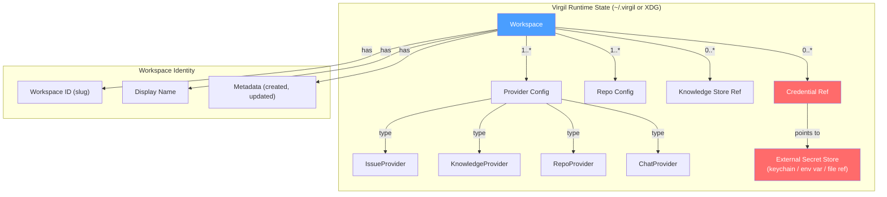
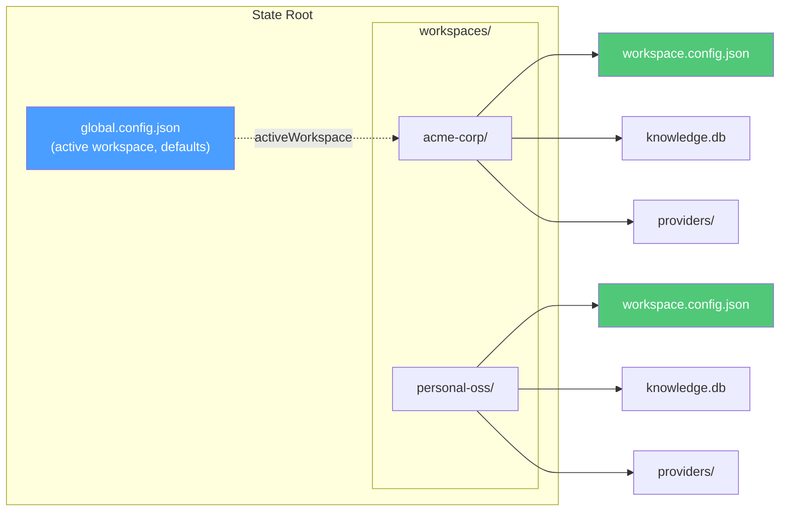

# H03 — Workspace & Configuration

> **Project:** Virgil
> **Artifact type:** Child handoff
> **Parent:** [`VIRGIL_HANDOFF_SEED.md`](../VIRGIL_HANDOFF_SEED.md)
> **Status:** Ready for assignment
> **Normative agent behavior:** [`AGENTS.md`](../AGENTS.md)

## Menú

- [Progress Tracker](#progress-tracker)
- [Objective](#objective)
- [Scope](#scope)
- [Out of Scope](#out-of-scope)
- [Preconditions](#preconditions)
- [Deliverables](#deliverables)
- [Verification Requirements](#verification-requirements)
- [Evidence Requirements](#evidence-requirements)
- [Risks and Constraints](#risks-and-constraints)
- [References](#references)

---

## Progress Tracker

- [ ] Assignment accepted
- [ ] Preconditions verified
- [ ] Workspace data model designed and documented
- [ ] Workspace identity scheme implemented
- [ ] Runtime state directory resolution implemented
- [ ] Provider registration schema defined with Zod
- [ ] Repository registration schema defined with Zod
- [ ] Credential reference model implemented (never embedded)
- [ ] Multi-workspace isolation proven
- [ ] Workspace CRUD operations implemented
- [ ] Configuration file read/write with Zod validation implemented
- [ ] Mermaid diagram included in handoff
- [ ] Standard verification gates pass (see [SHARED_VERIFICATION.md](./SHARED_VERIFICATION.md))

[↑ Menú](#menú)

---

## Objective

Define and implement the workspace and configuration layer for Virgil. After this handoff is complete, subsequent handoffs can register providers, repositories, and credential references against isolated, Zod-validated workspaces whose runtime state lives in well-known platform directories — never relative to the executable installation path.

This handoff answers the question: **where does Virgil store its per-organization/per-project configuration and runtime state, and how does it keep multiple workspaces isolated?**

### Workspace Data Model

### Configuration File Relationship

[↑ Menú](#menú)

---

## Scope

### Included

1. **Workspace identity scheme** — a unique, human-readable slug per workspace (e.g. `acme-corp`, `personal-oss`) with an optional display name. The slug must be filesystem-safe and serve as the directory name under the state root.

2. **Runtime state directory resolution** — Virgil must resolve its state root using platform-appropriate conventions. The state root must never be relative to the executable installation path. Preferred resolution order:
   - `VIRGIL_STATE_DIR` environment variable (explicit override)
   - XDG Base Directory (`$XDG_DATA_HOME/virgil`) on Linux
   - macOS Application Support (`~/Library/Application Support/virgil`)
   - Windows AppData (`%LOCALAPPDATA%\virgil`)
   - Fallback: `~/.virgil`

3. **Provider registration** — a Zod-validated schema for registering provider configurations within a workspace. Each provider config must declare:
   - provider family (`issue`, `knowledge`, `repo`, `chat`)
   - provider type (e.g. `github-issues`, `jira`, `confluence`, `local-fs`)
   - provider-specific connection parameters (Zod-validated per type)
   - credential reference (pointer, never embedded secret)
   - enabled/disabled flag

4. **Repository registration** — a Zod-validated schema for registering local repositories within a workspace. Each repo config must declare:
   - a local filesystem path
   - an optional alias
   - repository identity metadata (remote URL, default branch)

5. **Multi-workspace isolation** — each workspace must have its own:
   - configuration directory
   - knowledge database path reference
   - provider configurations
   - credential references
   - No cross-workspace data leakage by default.

6. **Credential references** — workspace configuration must never embed secrets. Instead, it stores typed references that point to external secret storage:
   - environment variable name
   - system keychain entry identifier
   - file path to a secret file (e.g. a token file)
   - The credential reference schema must be Zod-validated. Resolution of the actual secret value is a runtime concern and must be isolated behind a port.

7. **Zod validation of all configuration** — every configuration file (global config, workspace config, provider config) must have a corresponding Zod schema. Reading a malformed config must produce a clear, actionable validation error — never a silent default or a runtime crash in an unrelated module.

8. **Workspace CRUD commands** — CLI commands for workspace lifecycle:
   - `virgil workspace create <slug>` — create a new workspace
   - `virgil workspace list` — list all workspaces
   - `virgil workspace select <slug>` — set the active workspace
   - `virgil workspace show [slug]` — display workspace details
   - These commands prove the workspace layer works end-to-end through NestJS + nest-commander.

### Seed Definition of Done Coverage

This handoff primarily supports the structural foundation required for seed items: 11 (trivial command end-to-end, extended to workspace commands), 13 (no vendor-provider coupling in core contracts), 30 (child handoff generated), 31 (progress tracker present).

[↑ Menú](#menú)

---

## Out of Scope

The following responsibilities belong to other handoffs and must **not** be addressed here:

| Exclusion | Owner |
| --- | --- |
| Repository bootstrap, exact version policy, `.gitignore` | H01 |
| Node SEA packaging and runtime isolation | H02 |
| CI/CD pipeline configuration | H18 |
| Provider contract interfaces (IssueProvider, KnowledgeProvider, RepoProvider, ChatProvider) | H04 |
| Local repository provider implementation | H05 |
| SQLite persistence / Drizzle ORM schema for knowledge | H06 |
| RAG / vector / embedding layer | H07 |
| Progressive discovery logic | H08 |
| Handoff protocol format | H09 |
| Product agent orchestration runtime | H10 |
| Model-tier routing runtime | H11 |
| Remote provider implementations (Issue, Knowledge, Chat) | H12--H14 |
| Knowledge lifecycle and storage pressure | H15 |
| Actual secret retrieval from keychains/vaults | Provider adapter handoffs |
| Playwright CDP browser automation for enterprise auth | H16 |

The workspace layer defines **where** configuration lives and **what shape** it takes. It does not implement provider behaviour, knowledge persistence internals, or secret retrieval mechanisms.

[↑ Menú](#menú)

---

## Preconditions

1. H01 (Repository Bootstrap) is complete — the repository has a working NestJS + nest-commander CLI skeleton, build pipeline, and verification gates.
2. `AGENTS.md` is present and unchanged.
3. `VIRGIL_HANDOFF_SEED.md` is present as architectural reference.
4. Node.js 24.16.0 and pnpm 11.24.0 are available in the development environment.
5. Zod 4.5.4 is available as a validated dependency (per POC-00).
6. The monorepo workspace structure (`packages/cli/`) is established.

[↑ Menú](#menú)

---

## Deliverables

### D1 — State Directory Resolution Module

Implement a platform-aware state directory resolver.

**Acceptance criteria:**

- Resolves the Virgil state root following the platform-priority order defined in Scope item 2.
- `VIRGIL_STATE_DIR` environment variable overrides all platform defaults.
- The resolver never returns a path relative to `process.execPath` or the installation directory.
- The resolver creates the state root directory on first access if it does not exist.
- The module is a pure utility with no NestJS decorator dependencies, enabling reuse across packages.
- Covered by unit tests that mock environment variables and platform detection.

### D2 — Workspace Identity and Directory Structure

Implement workspace identity and the per-workspace directory layout.

**Acceptance criteria:**

- Workspace slugs are validated against a Zod schema: lowercase alphanumeric plus hyphens, 1--64 characters, must start with a letter.
- Each workspace occupies `<state-root>/workspaces/<slug>/`.
- A `workspace.config.json` file within each workspace directory holds the workspace metadata (slug, display name, created timestamp, updated timestamp).
- The workspace config file is read and written through Zod parse/serialize — never raw JSON manipulation without validation.
- Attempting to create a workspace with a duplicate slug produces a clear error.

### D3 — Global Configuration

Implement the global Virgil configuration layer.

**Acceptance criteria:**

- A `global.config.json` at the state root holds global settings, including `activeWorkspace` (a slug reference).
- The global config schema is Zod-validated.
- Setting the active workspace validates that the referenced workspace exists.
- When no workspace is active and commands require one, a clear error directs the user to create or select a workspace.

### D4 — Provider Registration Schema

Define the Zod schemas for provider configuration within a workspace.

**Acceptance criteria:**

- A base provider config schema defines common fields: `id` (UUID), `family` (enum: `issue`, `knowledge`, `repo`, `chat`), `type` (string), `enabled` (boolean), `credentialRef` (optional credential reference), `createdAt`, `updatedAt`.
- Provider-specific connection parameters use a discriminated union on the `type` field — each provider type extends the base schema with its own Zod-validated parameters.
- The schema is extensible: adding a new provider type requires only a new discriminated-union branch, not changes to the registration infrastructure.
- Provider configs are stored in the workspace directory.
- At this stage, provider type branches may include only placeholder/example types (e.g. `github-issues` with `owner` + `repo` fields, `local-fs` with `path` field). Real provider contracts belong to H04+.

### D5 — Repository Registration Schema

Define the Zod schema for repository registration within a workspace.

**Acceptance criteria:**

- Each repo config declares: `id` (UUID), `path` (absolute filesystem path), `alias` (optional human-readable name), `remoteUrl` (optional), `defaultBranch` (optional), `createdAt`, `updatedAt`.
- The schema validates that `path` is an absolute path.
- Repo configs are stored within the workspace directory.
- Duplicate path registration within the same workspace produces a clear error.

### D6 — Credential Reference Schema

Define the Zod schema for credential references.

**Acceptance criteria:**

- A credential reference is a discriminated union on `source` type:
  - `env` — `{ source: "env", variableName: string }`
  - `keychain` — `{ source: "keychain", service: string, account: string }`
  - `file` — `{ source: "file", path: string }`
- The schema validates the reference structure, not the secret value.
- No field in any config schema accepts a raw secret string.
- A `CredentialResolver` port (interface) is defined but not implemented — it declares `resolve(ref: CredentialRef): Promise<string>` for downstream handoffs to implement.

### D7 — Workspace CLI Commands

Implement workspace lifecycle commands via nest-commander.

**Acceptance criteria:**

- `virgil workspace create <slug>` — creates a new workspace directory, writes `workspace.config.json`.
- `virgil workspace list` — lists all workspaces, marking the active one.
- `virgil workspace select <slug>` — updates `global.config.json` with the active workspace.
- `virgil workspace show [slug]` — displays the configuration of the specified (or active) workspace, including registered providers and repos.
- All commands produce structured, human-readable output.
- All commands validate input through Zod schemas before performing filesystem operations.
- Commands fail with clear errors on invalid input (bad slug format, nonexistent workspace, etc.).

### D8 — Multi-Workspace Isolation Tests

Prove that workspaces are isolated.

**Acceptance criteria:**

- A test creates two workspaces, registers a provider in one, and verifies the provider is not visible from the other.
- A test creates two workspaces, registers a repository in one, and verifies the repository is not visible from the other.
- A test verifies that deleting a workspace does not affect other workspaces.
- Tests use a temporary state root (via `VIRGIL_STATE_DIR`) to avoid polluting the developer's real configuration.

[↑ Menú](#menú)

---

## Verification Requirements

Standard static, dynamic, and build verification gates apply — see [SHARED_VERIFICATION.md](./SHARED_VERIFICATION.md).

### Workspace Isolation

The multi-workspace isolation tests (D8) must demonstrate that provider and repository registrations are scoped to their owning workspace with zero cross-contamination.

[↑ Menú](#menú)

---

## Evidence Requirements

Standard evidence items apply — see [SHARED_VERIFICATION.md](./SHARED_VERIFICATION.md).

Handoff-specific evidence:

1. Proof that the state directory resolver honours `VIRGIL_STATE_DIR` and never resolves relative to `process.execPath` (test output).
2. Proof that `virgil workspace create` / `list` / `select` / `show` execute end-to-end (terminal output).
3. Proof of multi-workspace isolation (test output showing two workspaces with independent provider/repo registrations).
4. Proof that credential references are stored as typed pointers — show a sample `workspace.config.json` and confirm no raw secret values appear.
5. Proof that malformed configuration files produce actionable Zod validation errors (test output).
6. Zod schema definitions for: global config, workspace config, provider config (base + discriminated union), repo config, credential reference.

[↑ Menú](#menú)

---

## Risks and Constraints

| Risk | Mitigation |
| --- | --- |
| Platform-specific state directory conventions differ across macOS, Linux, and Windows | Abstract resolution into a single module with platform detection; test with environment variable override to decouple tests from the host OS |
| XDG Base Directory specification may not be followed consistently on all Linux distributions | Use `VIRGIL_STATE_DIR` as the authoritative override; XDG is a best-effort default |
| Zod 4 discriminated union API may differ from Zod 3 examples in community documentation | Validate against Zod 4.5.4 API specifically; consult POC-00 reference for proven patterns |
| Filesystem permissions may prevent state directory creation | Surface a clear error message with the attempted path and required permissions; do not silently fall back to an alternative location |
| Workspace slug collisions across case-insensitive filesystems (macOS HFS+) | Enforce lowercase-only slugs in the Zod schema to prevent case-sensitivity issues |
| Node SEA binary may resolve `process.execPath` differently than interpreted Node | The state directory resolver must never depend on `process.execPath` for state paths; this is tested in H02 but the design constraint originates here |
| Configuration schema evolution across Virgil versions | Include a `schemaVersion` field in all config files from day one to enable future migration |

[↑ Menú](#menú)

---

## References

- [`AGENTS.md`](../AGENTS.md) — normative agent behavior contract (immutable)
- [`VIRGIL_HANDOFF_SEED.md`](../VIRGIL_HANDOFF_SEED.md) — architectural seed and parent handoff (Workspace Model, Provider Authentication sections)
- [`H01_REPOSITORY_BOOTSTRAP.md`](./H01_REPOSITORY_BOOTSTRAP.md) — repository bootstrap handoff (prerequisite)
- Branch `poc/ref` (local) — POC-00 reference implementation (validated versions in [SHARED_VERIFICATION.md](./SHARED_VERIFICATION.md))
- [XDG Base Directory Specification](https://specifications.freedesktop.org/basedir-spec/latest/) — Linux state directory convention
- [Zod Documentation](https://zod.dev/) — schema validation library

[↑ Menú](#menú)
