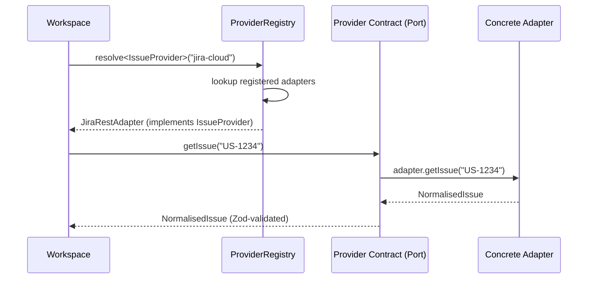

# H04 — Provider Contracts

> **Project:** Virgil
> **Artifact type:** Child handoff
> **Parent:** [`VIRGIL_HANDOFF_SEED.md`](../VIRGIL_HANDOFF_SEED.md)
> **Status:** Ready for assignment
> **Normative agent behavior:** [`AGENTS.md`](../AGENTS.md)

## Menú

- [Progress Tracker](#progress-tracker)
- [Objective](#objective)
- [Scope](#scope)
- [Out of Scope](#out-of-scope)
- [Preconditions](#preconditions)
- [Deliverables](#deliverables)
- [Verification Requirements](#verification-requirements)
- [Evidence Requirements](#evidence-requirements)
- [Risks and Constraints](#risks-and-constraints)
- [References](#references)

---

## Progress Tracker

- [ ] Assignment accepted
- [ ] Preconditions verified
- [ ] Port/adapter architecture diagram finalised
- [ ] KnowledgeProvider contract defined
- [ ] IssueProvider contract defined
- [ ] RepoProvider contract defined
- [ ] ChatProvider contract defined
- [ ] EmbeddingProvider contract defined
- [ ] VectorStore contract defined
- [ ] Retriever contract defined
- [ ] Shared provider primitives defined (ProviderMetadata, ProviderHealth, pagination)
- [ ] Provider registry abstraction defined
- [ ] Zod validation schemas for all contracts
- [ ] PW CDP adapter interface boundary documented
- [ ] No vendor SDK coupling in any contract
- [ ] All contracts placed in `packages/cli/` provider-contracts module
- [ ] Standard verification gates pass (see [SHARED_VERIFICATION.md](./SHARED_VERIFICATION.md))

[↑ Menú](#menú)

---

## Objective

Define the stable, vendor-neutral TypeScript interface contracts that form Virgil's provider abstraction layer. These contracts establish the **ports** side of Virgil's hexagonal architecture, ensuring that all external system interactions flow through capability-defined boundaries rather than vendor SDK surfaces.

After this handoff is complete, subsequent handoffs (H05 onward for concrete adapters, H07 for RAG, H12--H14 for remote providers) can implement adapters against well-defined, Zod-validated contracts without introducing coupling to any specific vendor, SDK, or authentication mechanism.

This handoff produces **contracts and their validation schemas** — not adapter implementations.

[↑ Menú](#menú)

---

## Scope

### Included

1. **KnowledgeProvider contract** — interface for document/knowledge source access (local filesystem, synchronised folders, Confluence, wikis).
2. **IssueProvider contract** — interface for work-item retrieval and normalisation (GitHub Issues, Jira, Monday).
3. **RepoProvider contract** — interface for repository discovery, file listing, and Git-aware metadata.
4. **ChatProvider contract** — interface for targeted organisational chat discovery (Slack, Teams).
5. **EmbeddingProvider contract** — interface for text-to-vector embedding generation, model-agnostic.
6. **VectorStore contract** — interface for vector persistence, search, and lifecycle operations.
7. **Retriever contract** — interface for hybrid retrieval combining lexical and semantic search with ranked fusion.
8. **Shared provider primitives** — common types used across all contracts:
   - `ProviderMetadata` (identity, version, capabilities declaration)
   - `ProviderHealth` (connectivity status, readiness)
   - `PaginatedResult<T>` (cursor-based pagination)
   - `ProviderError` (structured error with provider identity and recoverability)
   - `ContentIdentity` (hash, URI, version for deduplication and provenance)
   - `DiscoveryScope` (progressive-discovery boundary: what to fetch, depth limits)
9. **Provider registry abstraction** — contract for registering, resolving, and enumerating providers within a workspace.
10. **Zod validation schemas** — every contract paired with a Zod schema that validates provider configuration and output shapes at runtime.
11. **Adapter family boundaries** — documentation of the three adapter families (API, PW CDP browser automation, local filesystem) as implementation strategies, without implementing any adapter.
12. **Mermaid architecture diagram** — port/adapter diagram showing abstract contracts, adapter families, and concrete implementation slots.

### Seed Definition of Done Coverage

This handoff addresses seed item 13 (project structure does not couple core contracts to vendor providers).

[↑ Menú](#menú)

---

## Out of Scope

| Exclusion | Owner |
| --- | --- |
| Repository bootstrap, Node/pnpm pinning, `.gitignore` | H01 |
| Node SEA packaging, runtime isolation, CI artefacts | H02 |
| Workspace identity, provider registration persistence, credential storage | H03 |
| Local repository adapter implementation | H05 |
| SQLite persistence, Drizzle schema, content-identity storage | H06 |
| RAG core: chunking, embedding pipeline, vector-store implementation | H07 |
| Progressive discovery orchestration | H08 |
| Machine-readable handoff protocol format | H09 |
| Product agent orchestration runtime | H10 |
| Model-tier routing runtime | H11 |
| Remote issue provider adapter (e.g. Jira, GitHub Issues) | H12 |
| Remote knowledge provider adapter (e.g. Confluence) | H13 |
| Chat provider adapter (e.g. Slack, Teams) | H14 |
| Knowledge lifecycle and storage pressure | H15 |
| CI/CD pipeline setup | H18 |
| Concrete PW CDP adapter implementations | H12--H14 |
| Concrete local-indexer adapter implementations | H05, H13, H17 |

Provider contracts define **what** an adapter must do. Adapter handoffs (H05, H12--H14) define **how** specific adapters implement those contracts.

[↑ Menú](#menú)

---

## Preconditions

1. H01 (Repository Bootstrap) is complete — the repository has a buildable NestJS + nest-commander skeleton, exact-version enforcement, and working static/dynamic verification gates.
2. `AGENTS.md` is present and immutable.
3. `VIRGIL_HANDOFF_SEED.md` is available for architectural reference.
4. POC-00 reference branch `poc/ref` is available locally for consultation on NestJS module patterns.
5. Zod 4.5.4 is available as an exact dependency (installed during H01).
6. The monorepo workspace structure (`packages/cli/`) is established.

[↑ Menú](#menú)

---

## Deliverables

### D1 — Shared Provider Primitives

Define the common types that all provider contracts depend on.

**Acceptance criteria:**

- `ProviderMetadata` type includes: `id` (unique string), `name`, `version`, `adapterType` (enum: `api`, `browser`, `filesystem`), `capabilities` (provider-specific capability flags).
- `ProviderHealth` type includes: `status` (enum: `healthy`, `degraded`, `unavailable`), `lastChecked` (ISO timestamp), `message` (optional diagnostic).
- `PaginatedResult<T>` generic type includes: `items: T[]`, `cursor?: string`, `hasMore: boolean`.
- `ProviderError` type includes: `provider` (metadata reference), `code` (string), `message`, `recoverable` (boolean), `cause?` (unknown).
- `ContentIdentity` type includes: `uri` (canonical source path/URL), `hash` (content SHA-256), `version?` (provider-specific version), `discoveredAt` (ISO timestamp).
- `DiscoveryScope` type includes: `maxDepth?` (number), `maxItems?` (number), `include?` (glob patterns), `exclude?` (glob patterns), `since?` (ISO timestamp for incremental discovery).
- Every type has a companion Zod schema.
- No type imports from any vendor SDK.

### D2 — KnowledgeProvider Contract

Define the interface for knowledge/document source access.

**Acceptance criteria:**

- Interface declares methods for: `discover(scope: DiscoveryScope)`, `fetch(identity: ContentIdentity)`, `list(cursor?)`, `health()`.
- `discover` returns `PaginatedResult<KnowledgeArtifact>` where `KnowledgeArtifact` includes: `identity: ContentIdentity`, `title`, `mimeType`, `content` (raw text/markdown), `metadata` (provider-specific, Zod-validated).
- The contract does not reference any specific knowledge source (Confluence, filesystem, OneDrive).
- Zod schema validates `KnowledgeArtifact` shape.

### D3 — IssueProvider Contract

Define the interface for work-item retrieval and normalisation.

**Acceptance criteria:**

- Interface declares methods for: `getIssue(id: string)`, `search(query, scope?)`, `listRelated(id: string, scope?)`, `health()`.
- `getIssue` returns a `NormalisedIssue` including: `id`, `externalId`, `title`, `description`, `status`, `assignee?`, `labels`, `references` (linked issues, PRs, documents), `identity: ContentIdentity`, `metadata`.
- `search` returns `PaginatedResult<NormalisedIssue>`.
- The contract does not reference Jira, GitHub, Monday, or any vendor-specific field.
- Zod schema validates `NormalisedIssue` shape.

### D4 — RepoProvider Contract

Define the interface for repository discovery and Git-aware metadata.

**Acceptance criteria:**

- Interface declares methods for: `listFiles(scope: DiscoveryScope)`, `readFile(path: string)`, `getMetadata()`, `getGitContext()`, `health()`.
- `getMetadata` returns `RepoMetadata` including: `name`, `root` (absolute path), `defaultBranch`, `remotes`, `identity: ContentIdentity`.
- `getGitContext` returns `GitContext` including: `currentBranch`, `lastCommit` (hash, message, timestamp), `isDirty`, `trackedFileCount`.
- `listFiles` returns `PaginatedResult<FileEntry>` where `FileEntry` includes: `path` (relative), `mimeType?`, `size`, `lastModified`.
- `readFile` returns file content with `ContentIdentity` for deduplication.
- The contract does not assume a specific Git library or hosting provider.
- Zod schema validates all output shapes.

### D5 — ChatProvider Contract

Define the interface for targeted organisational chat discovery.

**Acceptance criteria:**

- Interface declares methods for: `searchMessages(query, scope?)`, `getThread(id: string)`, `listChannels(scope?)`, `health()`.
- `searchMessages` returns `PaginatedResult<ChatMessage>` where `ChatMessage` includes: `id`, `channel`, `author`, `content`, `timestamp`, `threadId?`, `identity: ContentIdentity`.
- `getThread` returns a `ChatThread` including: `id`, `channel`, `messages: ChatMessage[]`, `participants`.
- The contract is intentionally scoped for targeted discovery, not bulk archival ingestion.
- The contract does not reference Slack, Teams, or any vendor API.
- Zod schema validates all output shapes.

### D6 — EmbeddingProvider Contract

Define the interface for text-to-vector embedding generation.

**Acceptance criteria:**

- Interface declares methods for: `embed(texts: string[])`, `embedSingle(text: string)`, `dimensions()`, `modelIdentity()`, `health()`.
- `embed` returns `EmbeddingResult[]` where `EmbeddingResult` includes: `vector: number[]`, `tokenCount: number`, `model: string`.
- `dimensions` returns the vector dimensionality (number) for the active model.
- `modelIdentity` returns `EmbeddingModelInfo` including: `provider`, `model`, `dimensions`, `maxTokens`.
- The contract does not reference OpenAI, Cohere, Ollama, or any vendor embedding API.
- Zod schema validates `EmbeddingResult` and `EmbeddingModelInfo`.

### D7 — VectorStore Contract

Define the interface for vector persistence and similarity search.

**Acceptance criteria:**

- Interface declares methods for: `upsert(entries: VectorEntry[])`, `search(vector: number[], options: VectorSearchOptions)`, `delete(ids: string[])`, `count()`, `health()`.
- `VectorEntry` includes: `id`, `vector: number[]`, `metadata` (arbitrary JSON, Zod-validated), `content?` (original text for hybrid retrieval).
- `VectorSearchOptions` includes: `topK`, `threshold?` (similarity), `filter?` (metadata-based).
- `search` returns `VectorSearchResult[]` including: `id`, `score`, `metadata`, `content?`.
- The contract does not reference sqlite-vec, pgvector, Pinecone, Chroma, or any vector-store implementation.
- Zod schema validates all input and output shapes.

### D8 — Retriever Contract

Define the interface for hybrid retrieval combining lexical and semantic search.

**Acceptance criteria:**

- Interface declares methods for: `retrieve(query: string, options: RetrievalOptions)`, `health()`.
- `RetrievalOptions` includes: `topK`, `strategy` (enum: `lexical`, `semantic`, `hybrid`), `filter?` (metadata), `rerank?` (boolean).
- `retrieve` returns `RetrievalResult[]` including: `id`, `content`, `score`, `source` (enum: `lexical`, `semantic`, `fused`), `metadata`, `provenance: ContentIdentity`.
- The contract describes the retrieval capability without prescribing the fusion algorithm.
- Zod schema validates all shapes.

### D9 — Provider Registry Abstraction

Define the contract for registering and resolving providers within a workspace.

**Acceptance criteria:**

- Interface declares methods for: `register(provider, config)`, `resolve<T>(type, id?)`, `list(type?)`, `healthAll()`.
- `register` accepts a provider type discriminator and a Zod-validated configuration object.
- `resolve` returns the active provider of the requested type (or a specific one by id).
- `list` returns all registered providers, optionally filtered by type.
- `healthAll` returns aggregated health across all registered providers.
- The registry does not depend on NestJS DI — it defines a portable contract that NestJS modules can implement.
- Zod schema validates registration configuration.

### D10 — Port/Adapter Architecture Diagram

Produce a Mermaid diagram showing the hexagonal port/adapter architecture.

**Acceptance criteria:**

- The diagram shows all seven provider contracts as ports on the domain side.
- Three adapter families are shown: API adapters, PW CDP browser-automation adapters, local filesystem adapters.
- Concrete implementation examples are shown beneath each family (e.g. Jira API adapter, Confluence CDP adapter, local folder indexer).
- The diagram clearly separates the stable contract boundary from the replaceable adapter layer.
- The diagram is embedded in this handoff document (see [Architecture Diagram](#architecture-diagram) below).

[↑ Menú](#menú)

---

## Architecture Diagram

The following diagram illustrates Virgil's port/adapter architecture for provider contracts. The inner hexagon represents the stable domain contracts (ports). The outer ring represents the three adapter families with concrete implementation slots.

```mermaid
graph TB
    subgraph Domain["Virgil Domain Core (Stable Contracts)"]
        direction TB
        KP["KnowledgeProvider"]
        IP["IssueProvider"]
        RP["RepoProvider"]
        CP["ChatProvider"]
        EP["EmbeddingProvider"]
        VS["VectorStore"]
        RT["Retriever"]
        REG["ProviderRegistry"]
    end

    subgraph API["API Adapters (packages/cli/)"]
        direction TB
        API_Jira["Jira REST Adapter"]
        API_GH["GitHub Issues Adapter"]
        API_Conf["Confluence REST Adapter"]
        API_Slack["Slack Web API Adapter"]
        API_OAI["OpenAI Embedding Adapter"]
        API_Mon["Monday GraphQL Adapter"]
    end

    subgraph CDP["PW CDP Browser Adapters (packages/pw-cdp/)"]
        direction TB
        CDP_Jira["Jira CDP Adapter"]
        CDP_Conf["Confluence CDP Adapter"]
        CDP_Teams["Teams CDP Adapter"]
        CDP_SSO["Enterprise SSO Flow"]
    end

    subgraph FS["Local Filesystem Adapters (packages/local-indexers/)"]
        direction TB
        FS_Local["Local Folder Indexer"]
        FS_OneDrive["OneDrive Sync Adapter"]
        FS_GDrive["GDrive Sync Adapter"]
        FS_Git["Local Git Adapter"]
    end

    API_Jira --> IP
    API_GH --> IP
    API_Conf --> KP
    API_Slack --> CP
    API_OAI --> EP
    API_Mon --> IP

    CDP_Jira --> IP
    CDP_Conf --> KP
    CDP_Teams --> CP
    CDP_SSO -.->|"auth session"| CDP_Jira
    CDP_SSO -.->|"auth session"| CDP_Conf
    CDP_SSO -.->|"auth session"| CDP_Teams

    FS_Local --> KP
    FS_OneDrive --> KP
    FS_GDrive --> KP
    FS_Git --> RP

    REG -->|"resolves"| KP
    REG -->|"resolves"| IP
    REG -->|"resolves"| RP
    REG -->|"resolves"| CP
    REG -->|"resolves"| EP
    REG -->|"resolves"| VS
    REG -->|"resolves"| RT
```

The following diagram shows the adapter resolution flow, illustrating how a workspace resolves a provider request through the registry to the appropriate adapter family.

[↑ Menú](#menú)

---

## Verification Requirements

Standard static, dynamic, and build verification gates apply — see [SHARED_VERIFICATION.md](./SHARED_VERIFICATION.md).

### Vendor Isolation

A dedicated static check (linter rule or script) must confirm that no file within the provider-contracts module imports from:

- `@octokit/*`
- `jira.js` / `jira-client`
- `@slack/web-api`
- `@microsoft/microsoft-graph-client`
- `openai`
- `@anthropic-ai/sdk`
- `langchain` / `@langchain/*`
- `llamaindex`
- `chromadb`
- `pinecone` / `@pinecone-database/*`

or any other vendor-specific package. Contracts depend only on TypeScript built-in types, Zod, and shared Virgil primitives.

[↑ Menú](#menú)

---

## Evidence Requirements

Standard evidence items apply — see [SHARED_VERIFICATION.md](./SHARED_VERIFICATION.md).

Handoff-specific evidence:

1. File listing showing all contract interface and Zod schema files with their locations.
2. Proof that no contract file imports any vendor SDK (grep or linter output).
3. Proof that Zod schemas validate correct inputs and reject malformed inputs (test output).
4. Proof that a mock adapter implementing each contract compiles under TypeScript strict mode.
5. The rendered Mermaid diagram (embedded in this document) matching the port/adapter architecture.
6. Confirmation that `AGENTS.md` is unchanged.

[↑ Menú](#menú)

---

## Risks and Constraints

| Risk | Mitigation |
| --- | --- |
| Premature contract ossification — defining too-rigid interfaces before real adapters validate them | Mark contracts as `@experimental` in JSDoc; design for extension (optional fields, metadata bags) rather than exhaustive up-front specification. Adapter handoffs (H05, H12--H14) may propose contract amendments through a documented change request. |
| Over-abstraction — contracts so generic they provide no implementation guidance | Each contract must include at least one concrete method signature with typed input/output. Zod schemas enforce structural expectations. Avoid untyped `Record<string, unknown>` as the primary data surface. |
| PW CDP adapter boundary ambiguity — unclear where browser automation concerns belong | Contracts define what data is returned, never how it is obtained. PW CDP is an adapter-family implementation detail in `packages/pw-cdp/`. The contract module must not import Playwright. |
| EmbeddingProvider/VectorStore/Retriever contracts may evolve significantly during H07 (RAG Core) | Design contracts as minimum viable interfaces. H07 may extend them; breaking changes require a documented migration. |
| Zod 4.x API surface may differ from community examples targeting Zod 3.x | Validate all schemas against Zod 4.5.4 (pinned in POC-00). Run `pnpm test:dynamic` to confirm runtime behaviour. |
| Contract file placement conflicts with monorepo package boundaries | Place contracts in `packages/cli/src/providers/contracts/` as the canonical location. If shared across packages, extract to a `packages/contracts/` workspace package in a follow-up handoff. |

[↑ Menú](#menú)

---

## References

- [`AGENTS.md`](../AGENTS.md) — normative agent behaviour contract (immutable)
- [`VIRGIL_HANDOFF_SEED.md`](../VIRGIL_HANDOFF_SEED.md) — architectural seed and parent handoff
  - [Provider Families](../VIRGIL_HANDOFF_SEED.md#provider-families)
  - [Core Product Principles — Ports Before Vendors](../VIRGIL_HANDOFF_SEED.md#core-product-principles)
  - [Architectural Bias](../VIRGIL_HANDOFF_SEED.md#architectural-bias)
  - [Provider Authentication](../VIRGIL_HANDOFF_SEED.md#provider-authentication)
  - [Shared Knowledge and RAG](../VIRGIL_HANDOFF_SEED.md#shared-knowledge-and-rag)
  - [Workspace Model](../VIRGIL_HANDOFF_SEED.md#workspace-model)
- [`H01_REPOSITORY_BOOTSTRAP.md`](./H01_REPOSITORY_BOOTSTRAP.md) — repository foundation (prerequisite)
- Branch `poc/ref` (local) — POC-00 reference implementation (validated versions in [SHARED_VERIFICATION.md](./SHARED_VERIFICATION.md))
- [AGENTS.md Open Standard](https://agents.md/) — Linux Foundation open agentic standard

[↑ Menú](#menú)
