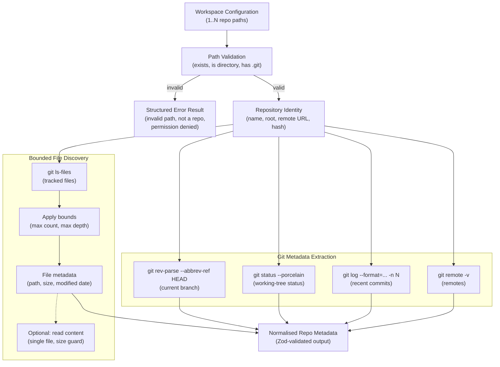

# H05 — Local Repo Provider

> **Project:** Virgil
> **Artifact type:** Child handoff
> **Parent:** [`VIRGIL_HANDOFF_SEED.md`](../VIRGIL_HANDOFF_SEED.md)
> **Status:** Ready for assignment
> **Normative agent behavior:** [`AGENTS.md`](../AGENTS.md)

## Menú

- [Progress Tracker](#progress-tracker)
- [Objective](#objective)
- [Scope](#scope)
- [Out of Scope](#out-of-scope)
- [Preconditions](#preconditions)
- [Deliverables](#deliverables)
- [Verification Requirements](#verification-requirements)
- [Evidence Requirements](#evidence-requirements)
- [Risks and Constraints](#risks-and-constraints)
- [References](#references)

---

## Progress Tracker

- [ ] Assignment accepted
- [ ] Preconditions verified
- [ ] RepoProvider contract imported from H04
- [ ] Local repo adapter module created in `packages/cli/`
- [ ] Configured local path resolution implemented
- [ ] Multi-repository discovery (1..N) implemented
- [ ] Repository identity extraction implemented
- [ ] Git-aware metadata extraction implemented
- [ ] Bounded file discovery implemented (no unbounded context dumps)
- [ ] Zod validation schemas defined for repo configuration and metadata
- [ ] Unit tests cover all public behaviour
- [ ] Integration tests exercise real Git repositories via fixtures
- [ ] Standard verification gates pass (see [SHARED_VERIFICATION.md](./SHARED_VERIFICATION.md))

[↑ Menú](#menú)

---

## Objective

Deliver the first concrete `RepoProvider` adapter: a local-filesystem repository provider that discovers and extracts structured, Git-aware metadata from one or more configured local repository paths within a Virgil workspace.

This adapter transforms raw local Git repositories into normalised, bounded metadata that downstream agents and the knowledge layer can consume without performing unbounded file-system crawls or receiving uncontrolled context dumps.

After this handoff is complete, Virgil can:

- resolve configured repository paths for a workspace,
- identify each repository (name, remote origin, root path),
- extract useful Git metadata (current branch, working-tree status, recent commits, contributors),
- perform safe, bounded file discovery (respecting `.gitignore`, depth limits, and size guards),
- present normalised repository metadata through the `RepoProvider` contract defined in H04.

[↑ Menú](#menú)

---

## Scope

### Included

1. **`LocalRepoProvider` adapter** — a NestJS injectable service in `packages/cli/` implementing the `RepoProvider` contract from H04.
2. **Configured local paths** — repositories are declared in workspace configuration (H03); this adapter resolves and validates those paths.
3. **Multi-repository support** — a single workspace may configure `1..N` local repositories; the adapter enumerates and processes each independently.
4. **Repository identity** — extract a stable identity for each repository: root path, repository name (derived from directory or remote), primary remote URL, and a content-addressable identity hash.
5. **Git-aware metadata extraction** — for each repository, extract:
   - current branch name (including detached HEAD state),
   - working-tree status summary (clean, dirty, counts of modified/untracked/staged files),
   - recent commit log (bounded: last N commits, configurable with a sensible default such as 20),
   - contributor summary (unique authors from recent history),
   - list of remotes.
6. **Bounded file discovery** — enumerate repository files safely:
   - respect `.gitignore` rules (use `git ls-files` or equivalent Git-aware listing),
   - enforce configurable depth limits,
   - enforce configurable maximum file count,
   - enforce configurable maximum individual file size for content reads,
   - return file metadata (path, size, last modified) without reading file contents by default.
7. **No unbounded context dumps** — all discovery operations must have explicit bounds; no operation may return an unlimited number of files, unlimited commit history, or unlimited file contents.
8. **Zod validation** — configuration schemas and metadata output schemas validated with Zod.
9. **Error handling** — graceful handling of non-existent paths, non-Git directories, permission errors, and corrupt repositories.

### Seed Definition of Done Coverage

This handoff addresses the H05 requirements from the seed: configured local path, `1..N` repos, repository identity, safe file discovery, useful Git-aware metadata, no unbounded context dump.

[↑ Menú](#menú)

---

## Out of Scope

The following responsibilities belong to other handoffs and must **not** be addressed here:

| Exclusion | Owner |
| --- | --- |
| Repository bootstrap, build, and verification infrastructure | H01 |
| Node SEA packaging and runtime isolation | H02 |
| Workspace identity, configuration management, provider registration | H03 |
| Provider contract definitions (RepoProvider interface) | H04 |
| SQLite persistence of repository metadata | H06 |
| RAG indexing, embedding, or vector storage of repository content | H07 |
| Progressive discovery driven by issue context | H08 |
| Remote repository providers (GitHub API, GitLab API) | Future handoff |
| File content parsing, AST analysis, or language-specific indexing | Future handoff |
| Full-text search over repository contents | H07 |
| CI/CD pipeline configuration | H18 |
| Playwright CDP browser automation | `packages/pw-cdp/` (separate package) |

[↑ Menú](#menú)

---

## Preconditions

1. **H01 complete** — repository bootstrap with working build, static, and dynamic verification gates.
2. **H03 complete or interface-stable** — workspace configuration model exists with the ability to declare local repository paths. At minimum, the configuration schema for repository entries must be importable.
3. **H04 complete** — the `RepoProvider` contract (interface/abstract class) is defined and importable from the provider contracts package or module.
4. **Git available** — the development and target environments have Git installed and accessible on `PATH`.
5. **Node.js 24.16.0** and **pnpm 11.24.0** available in the development environment.
6. **POC-00 reference** — branch `poc/ref` available locally for architectural patterns.

[↑ Menú](#menú)

---

## Deliverables

### D1 — LocalRepoProvider Adapter

Implement the `LocalRepoProvider` as a NestJS injectable service that satisfies the `RepoProvider` contract.

**Acceptance criteria:**

- Registered as a NestJS provider in the appropriate module within `packages/cli/`.
- Implements every method defined by the `RepoProvider` contract from H04.
- Accepts workspace-scoped configuration specifying `1..N` local repository paths.
- Each configured path is validated (exists, is a directory, contains a `.git` directory or is a bare repository).
- Invalid paths produce structured error results, not thrown exceptions that crash the provider.

### D2 — Repository Identity

Extract a stable, unique identity for each configured repository.

**Acceptance criteria:**

- Identity includes: root absolute path, derived repository name, primary remote URL (if any), and a deterministic identity hash combining remote URL and root path.
- Repositories without a remote are identified by their root path alone.
- Identity is stable across branch switches and normal Git operations.
- Identity schema is validated with Zod.

### D3 — Git-Aware Metadata Extraction

Extract structured Git metadata for each repository.

**Acceptance criteria:**

- **Branch:** current branch name, or `HEAD` SHA when in detached HEAD state.
- **Status:** working-tree status summary with counts of modified, staged, untracked, and conflicted files, plus a boolean `clean` flag.
- **Recent commits:** bounded list of recent commits (default: 20, configurable). Each entry includes SHA, author name, author email, date (ISO 8601), and subject line.
- **Contributors:** deduplicated list of unique authors from the retrieved commit range, with commit count per author.
- **Remotes:** list of configured remotes with name and URL.
- All metadata schemas validated with Zod.
- Git operations use spawned `git` CLI commands (not a JS Git library) for reliability and compatibility.

### D4 — Bounded File Discovery

Enumerate repository files with explicit safety bounds.

**Acceptance criteria:**

- Uses `git ls-files` (or equivalent Git-plumbing command) to respect `.gitignore` rules automatically.
- Configurable maximum depth (default: no limit within the repository, but respects `.gitignore`).
- Configurable maximum file count returned (default: 1000).
- Configurable maximum individual file size for optional content reads (default: 100 KB).
- Returns file metadata (relative path, size in bytes, last Git modification date) without reading contents by default.
- An explicit opt-in method reads bounded file contents (single file, respecting size guard).
- Binary files are identified and excluded from content reads by default.
- No operation returns an unbounded result set; every listing has a hard ceiling.

### D5 — Configuration Schema

Define the Zod schema for local repository provider configuration within a workspace.

**Acceptance criteria:**

- Schema covers: array of repository entries, each with a `path` (string, required) and optional `alias` (string), optional `maxCommits` (number), optional `maxFiles` (number), optional `maxFileSize` (number, bytes).
- Defaults are applied via Zod `.default()` for optional fields.
- Schema is exported for use by H03 workspace configuration and by tests.

### D6 — Repo Discovery and Metadata Flow

The following Mermaid diagram illustrates the complete flow from configured workspace paths through Git operations to normalised repository metadata:

**Acceptance criteria:**

- The implemented flow matches this diagram.
- Each Git operation is a bounded, independent step.
- Metadata extraction and file discovery are independently invocable (a caller can request identity and branch without triggering full file enumeration).

[↑ Menú](#menú)

---

## Verification Requirements

Standard static, dynamic, and build verification gates apply — see [SHARED_VERIFICATION.md](./SHARED_VERIFICATION.md).

### Unit Tests

- Mock `child_process.spawn`/`exec` (or the Git execution wrapper) to test metadata extraction logic without requiring a real Git repository.
- Verify Zod schema validation rejects malformed inputs.
- Verify bounded file discovery enforces maximum count, depth, and size limits.
- Verify error handling for non-existent paths, non-Git directories, and corrupt repositories.

### Integration Tests

- Use temporary Git repository fixtures created programmatically (init, commit, branch, add remotes).
- Verify end-to-end metadata extraction produces correct, Zod-valid output against a real Git repository.
- Verify multi-repository discovery correctly enumerates `1..N` configured repositories.
- Verify `.gitignore` rules are respected in file discovery.
- Verify detached HEAD state is handled correctly.

[↑ Menú](#menú)

---

## Evidence Requirements

Standard evidence items apply — see [SHARED_VERIFICATION.md](./SHARED_VERIFICATION.md).

Handoff-specific evidence:

1. Proof that `LocalRepoProvider` implements the `RepoProvider` contract (type-check evidence or interface compliance).
2. Proof of multi-repository discovery — test output showing `1..N` repositories correctly enumerated from configuration.
3. Proof of Git metadata extraction — test output showing branch, status, commits, contributors, and remotes extracted from a fixture repository.
4. Proof of bounded file discovery — test output showing file enumeration respects maximum count, and that exceeding the bound returns exactly the configured limit.
5. Proof of error handling — test output showing structured errors for invalid paths, non-Git directories, and permission issues.

[↑ Menú](#menú)

---

## Risks and Constraints

| Risk | Mitigation |
| --- | --- |
| Git CLI may not be available in all target environments | Document Git as a runtime dependency; validate Git availability at provider initialisation and return a structured error if missing |
| Large repositories may produce slow `git log` or `git ls-files` output | All Git operations use explicit bounds (`-n` for log, piped through head/count limits for ls-files); add configurable timeouts to spawned processes |
| Symlinks in repository paths may cause path resolution issues | Use `fs.realpath` to canonicalise configured paths before validation; document symlink behaviour |
| Repositories with no commits (freshly initialised) may cause extraction failures | Handle empty repositories as a valid edge case; return empty metadata collections rather than errors |
| Binary files included in `git ls-files` output may be accidentally read | Detect binary files via Git attributes or heuristic (null bytes in first 8KB); exclude from content reads by default |
| Different Git versions may produce different `--porcelain` output formats | Use `--porcelain` (v1) format which is stable across Git versions; document minimum supported Git version |
| Concurrent Git operations on the same repository (developer working while Virgil reads) may produce inconsistent snapshots | Accept eventual consistency; metadata reflects a point-in-time snapshot, not a transaction; document this behaviour |

[↑ Menú](#menú)

---

## References

- [`AGENTS.md`](../AGENTS.md) — normative agent behaviour contract (immutable)
- [`VIRGIL_HANDOFF_SEED.md`](../VIRGIL_HANDOFF_SEED.md) — architectural seed and parent handoff
- [H01 — Repository Bootstrap](./H01_REPOSITORY_BOOTSTRAP.md) — repository foundation
- [H03 — Workspace & Configuration](./H03_WORKSPACE_CONFIGURATION.md) — workspace model and provider registration
- [H04 — Provider Contracts](./H04_PROVIDER_CONTRACTS.md) — `RepoProvider` interface definition
- Branch `poc/ref` (local) — POC-00 reference implementation
- POC-00 validated stack (validated versions in [SHARED_VERIFICATION.md](./SHARED_VERIFICATION.md))

[↑ Menú](#menú)
