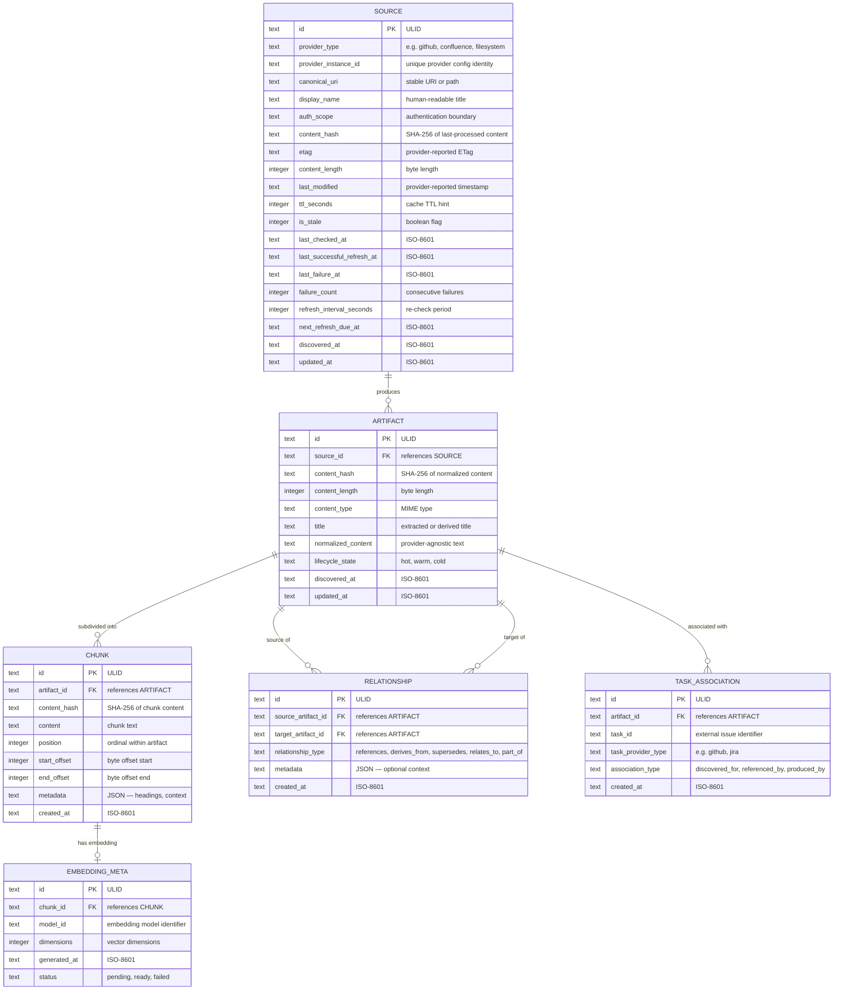
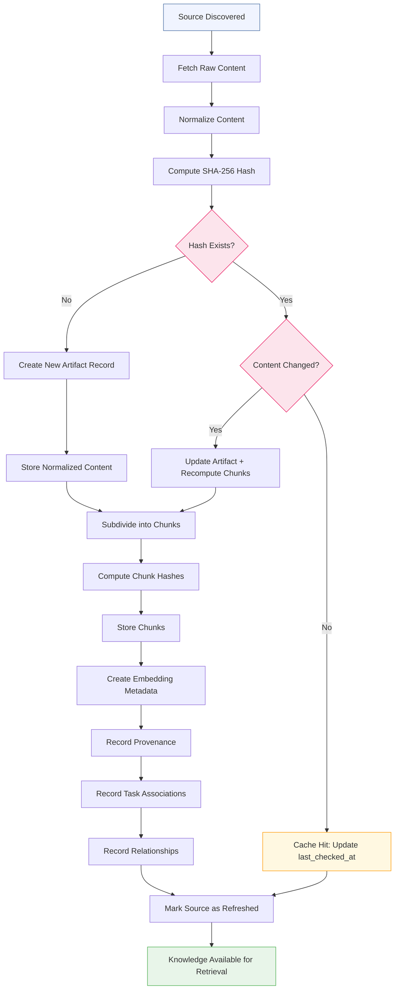

# H06 — Knowledge Persistence & Provenance

> **Project:** Virgil
> **Artifact type:** Child handoff
> **Parent:** [`VIRGIL_HANDOFF_SEED.md`](../VIRGIL_HANDOFF_SEED.md)
> **Status:** Ready for assignment
> **Normative agent behavior:** [`AGENTS.md`](../AGENTS.md)

## Menú

- [Progress Tracker](#progress-tracker)
- [Objective](#objective)
- [Scope](#scope)
- [Out of Scope](#out-of-scope)
- [Preconditions](#preconditions)
- [Deliverables](#deliverables)
- [Knowledge Data Model](#knowledge-data-model)
- [Content Ingestion Lifecycle](#content-ingestion-lifecycle)
- [ORM vs Direct-SQL Boundary](#orm-vs-direct-sql-boundary)
- [Verification Requirements](#verification-requirements)
- [Evidence Requirements](#evidence-requirements)
- [Risks and Constraints](#risks-and-constraints)
- [References](#references)

---

## Progress Tracker

- [ ] Assignment accepted
- [ ] Preconditions verified
- [ ] Drizzle ORM schema designed and implemented
- [ ] Source provenance model implemented
- [ ] Normalized artifact model implemented
- [ ] Content identity via SHA-256 hashing implemented
- [ ] Chunk model implemented
- [ ] Relationship graph model implemented
- [ ] Task association model implemented
- [ ] Cache identity and invalidation metadata implemented
- [ ] Refresh metadata implemented
- [ ] ORM vs direct-SQL boundary validated with evidence
- [ ] Migration infrastructure established
- [ ] Standard verification gates pass (see [SHARED_VERIFICATION.md](./SHARED_VERIFICATION.md))

[↑ Menú](#menú)

---

## Objective

Establish Virgil's knowledge persistence layer: the SQLite-backed data model that stores normalized artifacts, their provenance, content identity, relationships, and lifecycle metadata. After this handoff is complete, subsequent handoffs (H07 for RAG retrieval, H08 for progressive discovery, H15 for lifecycle management) can build upon a stable, well-tested persistence foundation with clear ORM and direct-SQL boundaries validated through evidence rather than assumption.

This handoff produces a **persistence schema, repository layer, and validated ORM boundary** — not a retrieval engine or ingestion pipeline.

[↑ Menú](#menú)

---

## Scope

### Included

1. **Drizzle ORM schema** defining the complete knowledge data model (sources, artifacts, chunks, embeddings metadata, relationships, provenance, task associations).
2. **Source provenance model** — every piece of knowledge tracks its origin provider, source URI/path, discovery timestamp, and refresh history.
3. **Normalized artifact model** — provider-agnostic representation of ingested content with stable identity.
4. **Content identity via hashing** — SHA-256 content hashes enabling deduplication and change detection.
5. **Chunk model** — subdivision of artifacts into retrieval-sized segments with positional metadata and parent reference.
6. **Relationship graph model** — typed edges between artifacts (references, derives-from, supersedes, relates-to) with directionality.
7. **Task association model** — linking artifacts and chunks to the work items that triggered their discovery.
8. **Cache identity and invalidation metadata** — content hash, ETag, last-modified, TTL, and staleness indicators enabling cache-hit detection.
9. **Refresh metadata** — last-checked timestamp, refresh interval, failure count, and next-refresh-due fields for lifecycle-aware re-ingestion.
10. **Embedding metadata table** — stores embedding model identity, vector dimensions, and generation timestamp per chunk (vector storage itself deferred to H07).
11. **Migration infrastructure** — Drizzle Kit or equivalent migration tooling configured for forward-only schema evolution.
12. **Repository layer** — typed data-access functions encapsulating persistence operations behind a clean interface.
13. **ORM vs direct-SQL boundary validation** — evidence-based determination of which operations use Drizzle's query builder and which require raw SQL, with documented rationale.

### Seed Definition of Done Coverage

This handoff addresses seed item 30 (required child handoffs generated) for the H06 responsibility area. It contributes to items 15, 16, 17, 18, 19, 20 (build, static, dynamic verification, coverage, artifacts) within its scope.

[↑ Menú](#menú)

---

## Out of Scope

The following responsibilities belong to other handoffs and must **not** be addressed here:

| Exclusion | Owner |
| --- | --- |
| Repository bootstrap, build pipeline, verification gates | H01 |
| Node SEA packaging and native addon co-location | H02 |
| Workspace identity and multi-workspace isolation | H03 |
| Provider contracts (Knowledge, Issue, Repo, Chat) | H04 |
| Local repository provider implementation | H05 |
| Vector storage, embedding generation, chunking strategies | H07 |
| Lexical search, semantic search, hybrid retrieval | H07 |
| Progressive discovery and issue-driven ingestion | H08 |
| Handoff protocol format | H09 |
| Product agent orchestration runtime | H10 |
| Model-tier routing runtime | H11 |
| Remote providers (Issue, Knowledge, Chat) | H12-H14 |
| Hot/warm/cold lifecycle policy, compaction, GC | H15 |
| CI/CD pipeline configuration | H18 |

The embedding metadata table stores identity and dimensional metadata only. Actual vector storage, similarity search, and embedding generation belong to H07.

[↑ Menú](#menú)

---

## Preconditions

1. H01 (Repository Bootstrap) is complete — the repository builds, tests, and verifies.
2. `packages/cli/` exists with NestJS + nest-commander infrastructure from H01.
3. Drizzle ORM 0.45.2 and better-sqlite3 13.0.3 are available as validated dependencies (POC-00).
4. Zod 4.5.4 is available for runtime validation of persistence inputs/outputs.
5. Node.js 24.16.0 and pnpm 11.24.0 are active in the development environment.
6. The POC reference branch `poc/ref` is available locally for Drizzle pattern consultation.

[↑ Menú](#menú)

---

## Deliverables

### D1 — Drizzle ORM Schema

Define the complete knowledge data model as Drizzle schema-as-code tables within `packages/cli/`.

**Acceptance criteria:**

- All tables defined in the [Knowledge Data Model](#knowledge-data-model) section are implemented as Drizzle table definitions.
- Every table has a primary key, creation timestamp, and update timestamp.
- Foreign key relationships are explicitly declared with appropriate cascade/restrict behaviour.
- Indexes are defined for all fields used in lookups: content hashes, source URIs, provider identifiers, task identifiers, and relationship endpoints.
- Schema files are co-located under a dedicated `drizzle/` or `db/schema/` directory within the package.

### D2 — Source Provenance Model

Implement the source provenance tracking layer.

**Acceptance criteria:**

- Every source record captures: provider type, provider instance identifier, canonical URI/path, original title/name, discovery timestamp, last-checked timestamp, and authentication scope.
- Source identity is stable across re-ingestion — the same provider + URI resolves to the same source record.
- Provenance metadata is sufficient to answer: "Where did this knowledge come from?"

### D3 — Content Identity and Deduplication

Implement content-addressable identity using cryptographic hashing.

**Acceptance criteria:**

- Artifacts store a SHA-256 hash of their normalized content.
- Hash computation is deterministic: identical content always produces identical hashes regardless of ingestion path.
- A content-addressed lookup can determine whether an artifact already exists before re-processing.
- Hash collisions are handled through content-length secondary comparison.

### D4 — Relationship Graph Model

Implement typed, directed relationships between knowledge artifacts.

**Acceptance criteria:**

- Relationships are stored as edges with: source artifact, target artifact, relationship type, creation timestamp, and optional metadata payload.
- Supported relationship types include at minimum: `references`, `derives_from`, `supersedes`, `relates_to`, `part_of`.
- Relationship types are extensible without schema migration (stored as constrained string, validated by Zod at the application layer).
- Bidirectional traversal queries are possible (find all artifacts that reference X, find all artifacts X references).

### D5 — Task Association Model

Implement the link between knowledge artifacts and the work items that triggered their discovery.

**Acceptance criteria:**

- Task associations record: artifact identifier, task identifier (external issue ID), provider type, association type (discovered-for, referenced-by, produced-by), and timestamp.
- An artifact can be associated with multiple tasks.
- A task can be associated with multiple artifacts.
- Queries support: "What knowledge was discovered for task X?" and "Which tasks reference artifact Y?"

### D6 — Cache Identity and Invalidation Metadata

Implement cache-aware metadata enabling intelligent re-ingestion decisions.

**Acceptance criteria:**

- Each source record stores: content hash of last-processed version, ETag (when available from provider), last-modified timestamp (provider-reported), TTL hint, staleness flag, and failure count.
- A cache-hit check compares stored content hash against freshly computed hash to detect unchanged sources.
- Staleness is computable from last-checked timestamp and TTL without requiring external state.
- Failed refresh attempts increment the failure count and record the last failure timestamp.

### D7 — Refresh Metadata

Implement refresh scheduling metadata for lifecycle-aware re-ingestion.

**Acceptance criteria:**

- Each source record stores: refresh interval (configurable per source or per provider default), next-refresh-due timestamp, last-successful-refresh timestamp, and consecutive failure count.
- Refresh-due queries can efficiently find all sources past their refresh deadline.
- Refresh intervals are configurable per provider type with per-source overrides.

### D8 — Repository Layer

Implement typed data-access functions encapsulating all persistence operations.

**Acceptance criteria:**

- CRUD operations for sources, artifacts, chunks, relationships, task associations, and embedding metadata are exposed through typed functions.
- Functions accept and return Zod-validated types, not raw SQL results.
- The repository layer is injectable via NestJS dependency injection.
- No Drizzle ORM types leak into the caller's interface — the repository abstracts persistence.
- Transaction support is available for multi-table operations (e.g., artifact + chunks + relationships in one atomic write).

### D9 — ORM vs Direct-SQL Boundary Evidence

Validate through measurement which operations use Drizzle's query builder and which require raw SQL.

**Acceptance criteria:**

- At least three candidate operations are benchmarked through both Drizzle query builder and raw SQL: (a) bulk chunk insertion, (b) recursive relationship traversal, (c) compound cache-hit query.
- Each benchmark reports: query plan, execution time across 100/1000/10000 rows, and code complexity comparison.
- A documented decision records the boundary: which operation types use the ORM and which use direct SQL, with evidence justifying each choice.
- The boundary is encoded in the repository layer (not left as an undocumented implementation detail).

### D10 — Migration Infrastructure

Establish forward-only schema migration tooling.

**Acceptance criteria:**

- Drizzle Kit (or equivalent) is configured for migration generation.
- An initial migration captures the complete schema from D1.
- Migrations are stored in version control and applied programmatically at startup.
- A `pnpm db:migrate` script (or equivalent) applies pending migrations.
- Migration files are generated, not hand-written (Drizzle Kit introspection from schema-as-code).

[↑ Menú](#menú)

---

## Knowledge Data Model

The following entity-relationship diagram defines the persistence schema. All tables, columns, and relationships specified here are normative for D1 implementation.

Key design decisions:

- **ULID primary keys** — sortable, collision-resistant, no auto-increment dependency. Compatible with SQLite text columns.
- **ISO-8601 timestamps** — stored as text for SQLite compatibility and human readability; indexed for range queries.
- **SHA-256 content hashes** — deterministic, cryptographically strong, enabling content-addressable deduplication.
- **Lifecycle state on ARTIFACT** — enables H15 hot/warm/cold management without schema changes.
- **JSON metadata fields** — extensible without migration for relationship context and chunk metadata; validated by Zod at the application layer.

[↑ Menú](#menú)

---

## Content Ingestion Lifecycle

The following diagram defines the flow from source discovery through persistence. This lifecycle is the contract that ingestion implementations (H07, H08) must follow when writing to the persistence layer defined by this handoff.

Key lifecycle invariants:

1. **Normalize before hashing** — content normalization (whitespace, encoding, provider-specific markup removal) must precede hash computation to ensure stable identity across re-ingestion.
2. **Hash-first deduplication** — the content hash is checked against existing artifacts before any chunking or embedding work begins.
3. **Atomic multi-table writes** — artifact creation, chunk storage, provenance recording, and relationship creation occur within a single transaction.
4. **Cache-hit short circuit** — when the content hash matches and content has not changed, only the `last_checked_at` timestamp updates. No re-chunking or re-embedding occurs.
5. **Provenance always recorded** — every artifact retains a link to its source with discovery and refresh timestamps, regardless of whether it was a cache hit or new content.

[↑ Menú](#menú)

---

## ORM vs Direct-SQL Boundary

Drizzle ORM is the validated persistence abstraction (POC-00). However, the boundary between ORM-mediated and direct-SQL operations must be established through evidence, not assumption.

### Expected ORM-suitable Operations

These operations are expected to perform well through Drizzle's query builder, but this must be validated:

- Single-row CRUD on all tables
- Simple filtered queries (by hash, by source ID, by task ID)
- Joins between source-artifact-chunk (two-level depth)
- Transaction-wrapped multi-table inserts

### Candidate Direct-SQL Operations

These operations may benefit from raw SQL, which must be validated through benchmarking:

- **Bulk chunk insertion** — inserting hundreds of chunks for a single artifact may benefit from a single prepared statement with batched bindings rather than individual ORM insert calls.
- **Recursive relationship traversal** — SQLite's `WITH RECURSIVE` CTE for multi-hop relationship graph queries may not be expressible through Drizzle's query builder.
- **Compound cache-hit queries** — joining source + artifact + content hash comparison across multiple sources in a single query for batch staleness detection.

### Validation Protocol

The implementing agent must:

1. Implement each candidate operation in both ORM and raw SQL forms.
2. Benchmark with representative data volumes (100, 1000, 10000 rows).
3. Compare query plans via `EXPLAIN QUERY PLAN`.
4. Document the measured difference in execution time and code complexity.
5. Record the decision in a `docs/decisions/` ADR or equivalent evidence file.
6. Encode the chosen boundary in the repository layer implementation.

The boundary is a living decision — H07 and H15 may identify additional operations that warrant re-evaluation.

[↑ Menú](#menú)

---

## Verification Requirements

Standard static, dynamic, and build verification gates apply — see [SHARED_VERIFICATION.md](./SHARED_VERIFICATION.md).

### Persistence-Specific Dynamic Tests

Tests must cover:

- Schema creation and migration application on a fresh SQLite database.
- CRUD operations for every table through the repository layer.
- Content-hash deduplication: identical content produces a cache hit, different content creates a new artifact.
- Relationship creation with bidirectional traversal.
- Task association creation with both forward and reverse queries.
- Cache-hit detection with unchanged and changed content.
- Staleness computation from refresh metadata.
- Transaction atomicity: partial failure rolls back all tables.
- Zod validation rejection of malformed inputs at the repository boundary.
- ORM vs direct-SQL benchmark assertions (performance ratios documented, not necessarily enforced as pass/fail).

[↑ Menú](#menú)

---

## Evidence Requirements

Standard evidence items apply — see [SHARED_VERIFICATION.md](./SHARED_VERIFICATION.md).

Handoff-specific evidence:

1. Schema definition files showing the complete Drizzle table definitions.
2. Migration file(s) showing the initial schema migration.
3. Repository layer interface showing typed function signatures with no ORM type leakage.
4. ORM vs direct-SQL benchmark results: query plans, execution times, and decision rationale.
5. Test output demonstrating content-hash deduplication (cache hit vs new artifact).
6. Test output demonstrating relationship graph bidirectional traversal.
7. Test output demonstrating transaction atomicity on partial failure.

[↑ Menú](#menú)

---

## Risks and Constraints

| Risk | Mitigation |
| --- | --- |
| Drizzle ORM may not support SQLite recursive CTEs natively | Validate with raw SQL fallback; document the boundary in D9. Drizzle's `sql` template literal supports arbitrary SQL within the ORM ecosystem. |
| ULID generation adds a dependency | Use a lightweight ULID library (e.g. `ulidx`) pinned to an exact version, or implement the 48-bit timestamp + 80-bit random spec directly. Evaluate bundle size impact. |
| JSON metadata columns bypass type safety | Validate all JSON fields with Zod schemas at the repository layer boundary. Store as `text` in SQLite, parse/validate on read. |
| SHA-256 computation on large artifacts may be slow | Benchmark with realistic document sizes (1KB-10MB). Consider streaming hash computation for artifacts above a configurable threshold. |
| Migration tooling may conflict with SEA packaging | Migrations must be embeddable or applied before SEA binary is sealed. Coordinate with H02 on migration strategy for packaged binaries. |
| better-sqlite3 synchronous API may block the event loop on large batch operations | Benchmark bulk inserts; consider chunked batch sizes with periodic `setImmediate` yields if measured blocking exceeds acceptable thresholds. |
| Embedding metadata without vector storage creates an incomplete abstraction | The EMBEDDING_META table is intentionally metadata-only. H07 owns vector storage. The schema is designed so H07 can extend without migrating existing tables. |

[↑ Menú](#menú)

---

## References

- [`AGENTS.md`](../AGENTS.md) — normative agent behavior contract (immutable)
- [`VIRGIL_HANDOFF_SEED.md`](../VIRGIL_HANDOFF_SEED.md) — architectural seed and parent handoff
- [`H01_REPOSITORY_BOOTSTRAP.md`](./H01_REPOSITORY_BOOTSTRAP.md) — repository bootstrap (prerequisite)
- Branch `poc/ref` (local) — POC-00 reference with validated Drizzle ORM + better-sqlite3 patterns
- [Drizzle ORM documentation](https://orm.drizzle.team/) — schema-as-code, query builder, raw SQL, migrations
- [SQLite documentation](https://sqlite.org/docs.html) — CTE, `EXPLAIN QUERY PLAN`, JSON functions

[↑ Menú](#menú)
