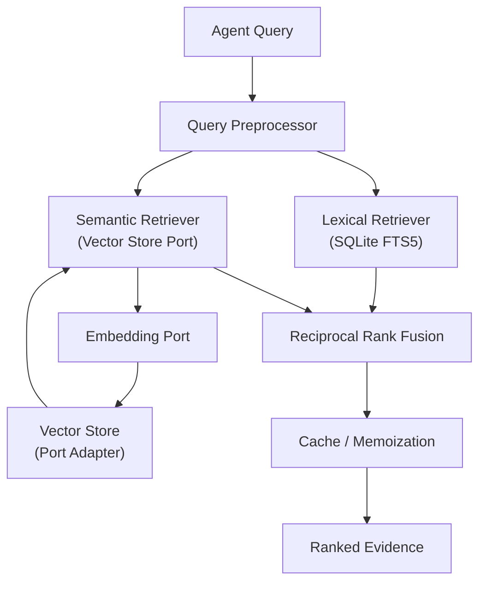
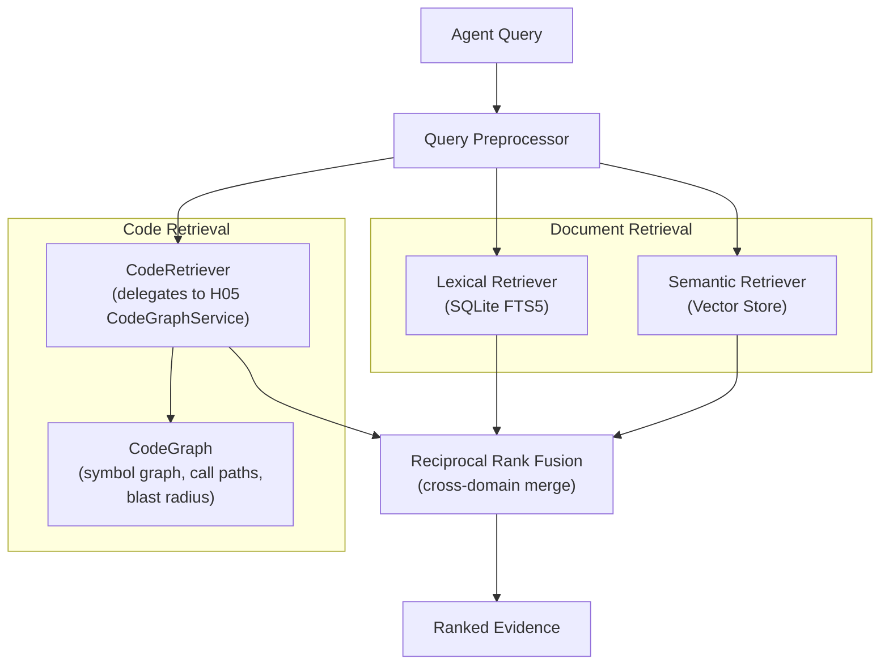
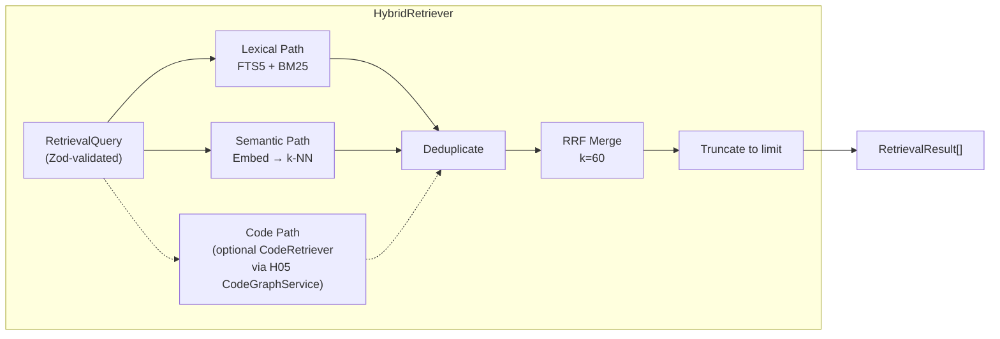

# H07 — RAG Core & Retrieval

> **Project:** Virgil
> **Artifact type:** Child handoff
> **Parent:** [`VIRGIL_HANDOFF_SEED.md`](../VIRGIL_HANDOFF_SEED.md)
> **Status:** Ready for assignment
> **Normative agent behavior:** [`AGENTS.md`](../AGENTS.md)

## Menú

- [Progress Tracker](#progress-tracker)
- [Objective](#objective)
- [Scope](#scope)
- [Dual Retrieval Strategy](#dual-retrieval-strategy)
- [Out of Scope](#out-of-scope)
- [Preconditions](#preconditions)
- [Deliverables](#deliverables)
- [Verification Requirements](#verification-requirements)
- [Evidence Requirements](#evidence-requirements)
- [Risks and Constraints](#risks-and-constraints)
- [References](#references)

---

## Progress Tracker

- [ ] Assignment accepted
- [ ] Preconditions verified
- [ ] Chunking port and default adapter implemented
- [ ] Embedding port and default adapter implemented
- [ ] Vector store port and default adapter implemented
- [ ] Lexical search implemented against SQLite FTS
- [ ] Semantic/vector search implemented behind port
- [ ] Hybrid retrieval with reciprocal rank fusion implemented
- [ ] Query contract defined and consumed by agents
- [ ] Cache and memoization layer implemented
- [ ] Vector library spike completed with documented findings
- [ ] RAG library evaluation spike completed with documented findings
- [ ] All ports verified with in-memory/stub adapters
- [ ] Dual retrieval strategy (text RAG + CodeGraph) designed
- [ ] CodeRetriever port defined and stubbed
- [ ] Standard verification gates pass (see [SHARED_VERIFICATION.md](./SHARED_VERIFICATION.md))

[↑ Menú](#menú)

---

## Objective

Deliver the core retrieval engine that powers Virgil's shared agent memory. After this handoff is complete, any Virgil agent can issue a query and receive ranked evidence drawn from both lexical and semantic search paths, fused into a single scored result set.

Every component is defined behind a port abstraction so that the specific embedding model, vector storage engine, and chunking strategy can be replaced without modifying consuming agents. Vector extensions and RAG libraries are currently **unvalidated** — this handoff includes the required evaluation spikes before any library is committed to the architecture.

The following diagram illustrates the hybrid retrieval flow that this handoff must implement:

[↑ Menú](#menú)

---

## Scope

### Included

1. **Chunking port** (`Chunker`) — defines a strategy-agnostic boundary for splitting normalized artifacts into indexable chunks. The default adapter implements fixed-size overlapping windows with configurable token count and overlap ratio. Metadata (source identity, position, content hash) must travel with each chunk.

2. **Embedding port** (`EmbeddingProvider`) — accepts text chunks and returns dense vector representations. The default adapter is a stub/mock during development; the spike (D7) determines which real embedding library or API to adopt. The port contract must define dimensionality, batch size limits, and error semantics.

3. **Vector store port** (`VectorStore`) — persists, indexes, and queries embedding vectors. The default adapter uses SQLite-backed storage. The spike (D7) evaluates `sqlite-vec`, `sqlite-vss`, or equivalent extensions and documents whether they survive the SEA packaging pipeline. The port must support insert, delete, and k-nearest-neighbour queries.

4. **Lexical search** — full-text retrieval using SQLite FTS5 over chunk content. Must support boolean queries, phrase matching, and BM25 ranking. Operates on the same chunk corpus as the vector path.

5. **Semantic/vector search** — k-nearest-neighbour retrieval against stored embeddings, returning chunks ranked by cosine similarity (or the metric dictated by the selected vector extension). Operates entirely through the `VectorStore` port.

6. **Hybrid retrieval with fusion** — a `HybridRetriever` that dispatches the query to both the lexical and semantic paths in parallel, then merges the two ranked lists using Reciprocal Rank Fusion (RRF). The fused list is the single output surface consumed by agents.

7. **Query contract** (`RetrievalQuery` / `RetrievalResult`) — Zod-validated request and response types consumed by Virgil agents. The contract hides all retrieval internals; callers specify natural-language query text, optional filters (source, recency, provider), and a result limit. Results include chunk content, relevance score, and provenance metadata.

8. **Cache and memoization** — identical queries within a configurable TTL return cached results without re-executing search. Cache keys incorporate query text, filters, and corpus version (content hash of the latest write to the chunk corpus). Cache invalidation occurs on any chunk write.

9. **Vector library spike** (D7) — structured evaluation of at least two candidate vector extensions (e.g. `sqlite-vec`, `sqlite-vss`, or a pure-JS fallback) covering: installation, API surface, SQLite integration, SEA compatibility, index size, and query latency. Results documented as spike evidence.

10. **RAG library evaluation spike** (D8) — structured evaluation of at least two candidate RAG/retrieval frameworks (e.g. LangChain.js, LlamaIndex.TS, or no-framework approach) covering: bundle size, tree-shakability, port compatibility, SEA bundling, and lock-in risk. Results documented as spike evidence.

### Seed Definition of Done Coverage

This handoff addresses seed item 27 (vector extension risks documented) and contributes to items 13 (port-based architecture) and 30 (required child handoffs generated).

[↑ Menú](#menú)

---

## Dual Retrieval Strategy

Virgil handles two fundamentally different content types that require different retrieval strategies:

### Document/Prose Retrieval (Traditional RAG)

Content from H17 local indexers and knowledge providers — documentation, wiki content, meeting notes, chat history — flows through the traditional RAG pipeline: chunk, embed, vector store, hybrid retrieval (FTS5 + semantic). The fixed-window chunker (D1) is appropriate for this content because prose has a relatively uniform information density.

### Source Code Retrieval (CodeGraph)

Source code from H05's LocalRepoProvider should NOT be naively chunked into fixed windows. Fixed-window chunking destroys structural meaning by splitting functions across chunks, losing import context, and severing the relationship between a symbol and its call sites. Instead, code retrieval delegates to CodeGraph (via H05's `CodeGraphService`) for symbol-level queries, call-path traversal, and blast-radius analysis.

### Retriever Contracts

The retriever layer supports both channels through distinct ports:

- **`TextRetriever`** — traditional RAG for documents and prose. This is the hybrid retrieval pipeline that H07 already specifies (lexical FTS5 + semantic vector search, fused via RRF).
- **`CodeRetriever`** — delegates to CodeGraph via H05's `CodeGraphService`. Queries are expressed as symbol names, file paths, or natural-language descriptions that CodeGraph resolves to structural results.
- **`HybridRetriever`** (updated) — merges results from both the `TextRetriever` and the `CodeRetriever` using Reciprocal Rank Fusion when a query spans both domains.

This means H07's chunking pipeline (D1) applies ONLY to document/prose content. Code content flows through CodeGraph's structural index, not through the embedding pipeline.

[↑ Menú](#menú)

---

## Out of Scope

The following responsibilities belong to other handoffs and must **not** be addressed here:

| Exclusion | Owner |
| --- | --- |
| SQLite persistence model, schema, Drizzle ORM setup, content identity/hash, provenance tables | H06 |
| Normalized artifact model and relationship graph | H06 |
| Provider contracts (Knowledge, Issue, Repo, Chat) | H04 |
| Ingestion pipelines and provider crawling | H08 |
| Progressive discovery logic | H08 |
| Knowledge lifecycle (hot/warm/cold), compaction, rehydration | H15 |
| SEA packaging and native addon co-location | H02 |
| Workspace identity and configuration management | H03 |
| Handoff protocol format | H09 |
| Product agent orchestration | H10 |
| Model-tier routing and embedding model selection policy | H11 |
| CI/CD pipeline setup | H18 |

H07 consumes the persistence layer that H06 provides. It does not own schema migrations, table definitions, or Drizzle configuration — it owns the retrieval, indexing, and query surfaces built on top of them.

[↑ Menú](#menú)

---

## Preconditions

1. H01 (Repository Bootstrap) is complete — the monorepo structure, pnpm workspace, static and dynamic verification gates, and TypeScript strict mode are operational.
2. H06 (Knowledge Persistence) is complete or sufficiently advanced — the SQLite database, Drizzle ORM layer, normalized artifact table, chunk storage table, and content-hash infrastructure exist.
3. Node.js 24.16.0 and pnpm 11.24.0 are available in the development environment.
4. The POC reference branch `poc/ref` is available locally for SQLite/native-addon patterns.
5. The `packages/cli/` package within the monorepo is the target location for RAG core modules.
6. H05 (optional) — the `CodeRetriever` (D10) requires H05's `CodeGraphService` for structural code retrieval. When H05 is unavailable, code retrieval degrades to text-based search.

[↑ Menú](#menú)

---

## Deliverables

### D1 — Chunking Port and Default Adapter

Define the `Chunker` port and a default fixed-window adapter for document/prose content. Source code content uses CodeGraph structural retrieval (via D10) instead of the chunking pipeline.

**Acceptance criteria:**

- A `Chunker` interface/abstract class exists under `packages/cli/src/rag/ports/`.
- The interface defines `chunk(content: string, metadata: ChunkMetadata): Chunk[]`.
- `Chunk` includes: `id`, `content`, `contentHash`, `sourceId`, `position` (start/end offsets), `tokenCount`.
- The default `FixedWindowChunker` adapter splits content into windows of configurable size (default 512 tokens) with configurable overlap (default 20%).
- Chunk boundaries respect sentence boundaries when possible (do not split mid-sentence).
- All types are Zod-validated.
- Tests cover edge cases: empty input, content shorter than window size, overlap correctness, sentence-boundary snapping.

### D2 — Embedding Port and Stub Adapter

Define the `EmbeddingProvider` port with a deterministic stub for testing.

**Acceptance criteria:**

- An `EmbeddingProvider` interface exists under `packages/cli/src/rag/ports/`.
- The interface defines `embed(texts: string[]): Promise<Float32Array[]>` (batch) and `embedQuery(text: string): Promise<Float32Array>` (single).
- The port contract specifies `dimensions: number` as a provider property.
- A `StubEmbeddingProvider` returns deterministic vectors (e.g. hash-derived) for testing without network calls.
- Error semantics: batch failures surface per-item errors; transient failures are retryable.
- All types are Zod-validated.
- Tests verify the stub adapter produces consistent, dimensionally correct output.

### D3 — Vector Store Port and SQLite Adapter

Define the `VectorStore` port and implement a SQLite-backed adapter.

**Acceptance criteria:**

- A `VectorStore` interface exists under `packages/cli/src/rag/ports/`.
- The interface defines: `insert(id: string, vector: Float32Array, metadata: Record<string, unknown>): Promise<void>`, `delete(id: string): Promise<void>`, `search(query: Float32Array, k: number, filter?: VectorFilter): Promise<VectorMatch[]>`.
- `VectorMatch` includes: `id`, `score`, `metadata`.
- The SQLite adapter uses the vector extension selected by the spike (D7), or falls back to a brute-force cosine-similarity scan over stored vectors if no viable extension is found.
- The adapter is injectable via NestJS DI and configured through the workspace configuration surface.
- Tests verify insert, delete, and k-NN search correctness using the stub embedding provider.

### D4 — Lexical Search Module

Implement BM25-ranked full-text search over the chunk corpus.

**Acceptance criteria:**

- An FTS5 virtual table is created over chunk content (coordinated with H06 schema ownership — H07 owns the FTS index definition, H06 owns the base chunk table).
- The module supports boolean queries, phrase matching, and BM25 ranking.
- Results return `ChunkMatch` objects with: `chunkId`, `score`, `snippet` (highlighted match context).
- Query input is sanitised to prevent FTS5 syntax injection.
- Tests cover: single-term, multi-term, phrase, boolean, and empty-result queries.

### D5 — Hybrid Retriever with Reciprocal Rank Fusion

Implement the `HybridRetriever` that merges lexical and semantic results.

**Acceptance criteria:**

- The retriever dispatches the query to both the lexical and semantic paths concurrently.
- Reciprocal Rank Fusion (RRF) merges the two ranked lists using the formula: `score(d) = sum(1 / (k + rank_i(d)))` with a configurable `k` constant (default 60).
- Results are deduplicated by chunk ID before fusion.
- The fused result list is truncated to the requested limit.
- Each result carries its component scores (lexical score, vector score) alongside the fused score.
- The retriever is the sole entry point for agent queries — agents never call lexical or semantic paths directly.
- Tests verify fusion correctness with known ranked inputs, including partial overlaps and disjoint result sets.

The following diagram shows the internal composition of the hybrid retriever module:

### D6 — Query Contract

Define the Zod-validated query and result types consumed by Virgil agents.

**Acceptance criteria:**

- `RetrievalQuery` schema includes: `text` (required), `filters` (optional: `sourceIds`, `providers`, `afterDate`, `beforeDate`), `limit` (optional, default 10), `minScore` (optional threshold).
- `RetrievalResult` schema includes: `chunkId`, `content`, `score` (fused), `lexicalScore` (nullable), `vectorScore` (nullable), `sourceId`, `provenance` (provider, URI, contentHash, discoveredAt).
- Types are exported from `packages/cli/src/rag/contracts/`.
- The contract is the only public surface — internal retrieval types are not exported.
- Agents interact through `retrieve(query: RetrievalQuery): Promise<RetrievalResult[]>`.
- Tests validate schema acceptance and rejection of malformed queries.

### D7 — Vector Library Spike

Evaluate candidate vector extensions for SQLite.

**Acceptance criteria:**

- At least two candidates evaluated (e.g. `sqlite-vec`, `sqlite-vss`, pure-JS cosine fallback).
- Each candidate evaluated on: installation procedure, API surface, SQLite integration pattern, SEA compatibility (native addon co-location), index creation and size, k-NN query latency on 1K/10K/100K vectors, dimensionality support.
- SEA compatibility explicitly tested or justified as testable (coordinated with H02 if the SEA build pipeline is available).
- Findings documented as structured spike evidence including a recommendation and risk summary.
- If no candidate survives SEA packaging, a pure-JS brute-force fallback path is documented with performance bounds.

### D8 — RAG Library Evaluation Spike

Evaluate whether an external RAG framework adds value over the port-based approach.

**Acceptance criteria:**

- At least two candidates evaluated (e.g. LangChain.js retrieval modules, LlamaIndex.TS, no-framework baseline).
- Each candidate evaluated on: bundle size impact, tree-shakability, compatibility with Virgil's port architecture, SEA bundling feasibility, degree of vendor lock-in, maintenance health.
- A clear recommendation is documented: adopt a specific library behind ports, adopt selectively (specific utilities only), or proceed without a framework.
- Risk of hard-coupling to a RAG library is explicitly addressed per the seed's anti-goals.

### D9 — Cache and Memoization Layer

Implement query-result caching with TTL and invalidation.

**Acceptance criteria:**

- An in-memory LRU cache stores recent query results keyed by a hash of `(queryText, filters, corpusVersion)`.
- `corpusVersion` is derived from the latest write timestamp or content hash of the chunk corpus.
- TTL is configurable (default 5 minutes).
- Any chunk write (insert, update, delete) invalidates all cached results.
- Cache hit/miss metrics are exposed through a queryable interface (not OTEL — just a method returning counts).
- Tests verify: cache hit on identical query, cache miss on changed corpus, TTL expiry, manual invalidation.

### D10 — CodeRetriever Port

Define the `CodeRetriever` port — a structural code retrieval adapter that delegates to H05's `CodeGraphService`.

**Acceptance criteria:**

- A `CodeRetriever` interface exists under `packages/cli/src/rag/ports/`.
- The interface defines `retrieveCode(query: CodeRetrievalQuery): Promise<CodeRetrievalResult[]>` accepting symbol names, file paths, or natural-language descriptions.
- `CodeRetrievalResult` includes: `symbolId`, `filePath`, `lineRange`, `content`, `score`, `callPaths` (optional), `blastRadius` (optional), and `provenance` metadata.
- The adapter delegates to H05's `CodeGraphService` methods (`explore`, `querySymbols`, `callers`, `callees`, `impact`, `affected`).
- Graceful degradation: when CodeGraph is unavailable, returns an empty result set with a structured notice rather than throwing an error.
- The `HybridRetriever` (D5) is updated to accept an optional `CodeRetriever` alongside the existing lexical and semantic paths, merging code results into the RRF fusion when available.
- All types are Zod-validated.
- App-level integration tests verify the port contract using a stub adapter (per `AGENTS.md` Testing Policy).

[↑ Menú](#menú)

---

## Verification Requirements

Standard static, dynamic, and build verification gates apply — see [SHARED_VERIFICATION.md](./SHARED_VERIFICATION.md).

### Integration

- The hybrid retriever must be exercised end-to-end in a test that: indexes a set of known chunks, embeds them through the stub provider, runs a query, and verifies the fused result ordering matches expected RRF output.
- Lexical and semantic paths must be independently testable through their respective port interfaces.

### Port Isolation

- Every port adapter must be replaceable by a test double without modifying any consuming module.
- No RAG module may import a concrete adapter directly — all access flows through NestJS DI.

[↑ Menú](#menú)

---

## Evidence Requirements

Standard evidence items apply — see [SHARED_VERIFICATION.md](./SHARED_VERIFICATION.md).

Handoff-specific evidence:

1. Integration test output demonstrating end-to-end hybrid retrieval with known inputs and verified RRF ordering.
2. Spike evidence document for vector library evaluation (D7) with structured comparison table and recommendation.
3. Spike evidence document for RAG library evaluation (D8) with structured comparison table and recommendation.
4. Proof that all ports are consumed exclusively through DI — no direct adapter imports in consuming modules.
5. Proof that the query contract rejects malformed input (Zod validation test output).
6. Cache behaviour evidence: test output demonstrating hit, miss, TTL expiry, and invalidation scenarios.

[↑ Menú](#menú)

---

## Risks and Constraints

| Risk | Mitigation |
| --- | --- |
| No SQLite vector extension survives SEA native-addon packaging | D7 spike must explicitly test SEA co-location; document a pure-JS brute-force fallback with performance bounds if no extension works |
| Vector extension is unavailable on all three target platforms (macOS, Linux, Windows) | Spike must test or document platform availability; the `VectorStore` port allows platform-specific adapters |
| RAG framework introduces hard coupling that violates the port architecture | D8 spike evaluates lock-in risk; the recommendation may be to use no framework and compose utilities manually |
| Embedding model choice creates a runtime dependency on an external API | The `EmbeddingProvider` port must support both local and remote embeddings; model selection is deferred to workspace configuration (H03) |
| FTS5 is not available in the compiled SQLite used by `better-sqlite3` | Verify FTS5 availability in `better-sqlite3` 13.0.3 during precondition check; FTS5 is enabled by default in recent builds |
| Chunking strategy produces poor retrieval quality for code vs prose | Mitigated by the dual retrieval strategy: code content is retrieved via CodeGraph (structural queries through H05's `CodeGraphService`), not through the fixed-window chunking pipeline. The `Chunker` port remains extensible for future prose-specific strategies. |
| Cache invalidation on every write creates performance overhead under heavy ingestion | Cache is optional and can be bypassed; TTL-only mode (no write-triggered invalidation) is a documented fallback configuration |
| CodeRetriever depends on H05's CodeGraph integration being available | Fallback: degrade to text-based retrieval for code when the CodeGraph index is unavailable. The `CodeRetriever` port returns an empty result set with a structured degradation notice, and the `HybridRetriever` proceeds with document-only results. |
| H06 persistence schema is not yet available when H07 begins | H07 can develop and test against in-memory stubs and mock tables; integration with real H06 tables is a late-stage wiring concern |

[↑ Menú](#menú)

---

## References

- [`AGENTS.md`](../AGENTS.md) — normative agent behavior contract
- [`VIRGIL_HANDOFF_SEED.md`](../VIRGIL_HANDOFF_SEED.md) — architectural seed and parent handoff (sections: Shared Knowledge and RAG, Retrieval Direction, Technology Direction, Anti-Goals)
- [`H01_REPOSITORY_BOOTSTRAP.md`](./H01_REPOSITORY_BOOTSTRAP.md) — repository foundation (precondition)
- [`H06_KNOWLEDGE_PERSISTENCE.md`](./H06_KNOWLEDGE_PERSISTENCE.md) — persistence layer (precondition)
- Branch `poc/ref` (local) — POC-00 reference for SQLite/native-addon patterns
- POC-00 validated stack (validated versions in [SHARED_VERIFICATION.md](./SHARED_VERIFICATION.md))

[↑ Menú](#menú)
