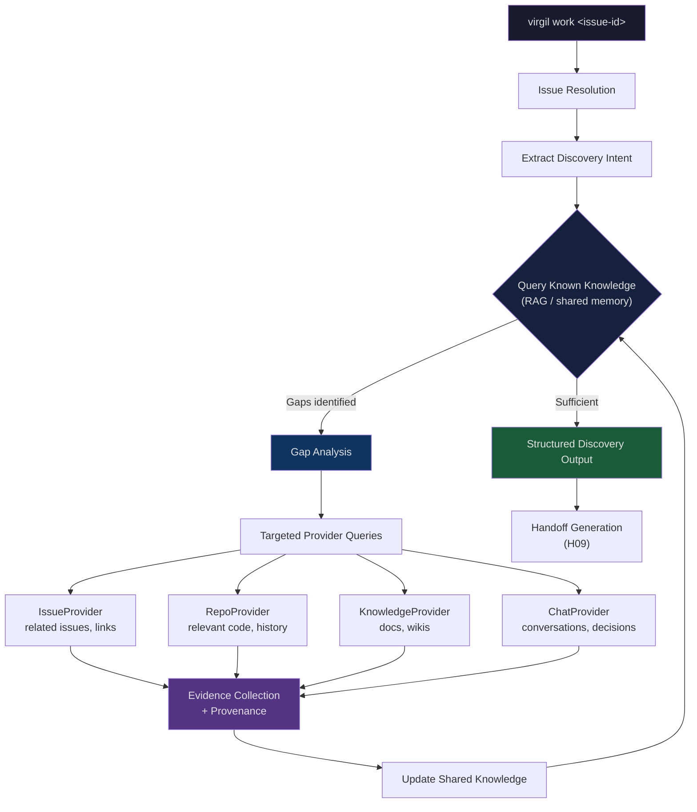
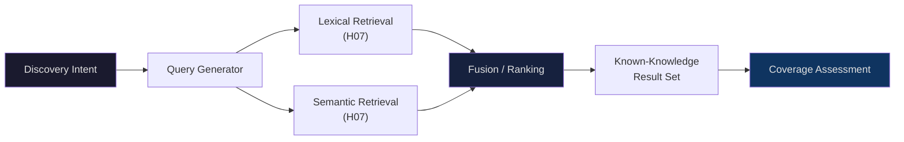

# H08 — Issue-Driven Progressive Discovery

> **Project:** Virgil
> **Artifact type:** Child handoff
> **Parent:** [`VIRGIL_HANDOFF_SEED.md`](../VIRGIL_HANDOFF_SEED.md)
> **Status:** Ready for assignment
> **Normative agent behavior:** [`AGENTS.md`](../AGENTS.md)

## Menú

- [Progress Tracker](#progress-tracker)
- [Objective](#objective)
- [Scope](#scope)
- [Out of Scope](#out-of-scope)
- [Preconditions](#preconditions)
- [Deliverables](#deliverables)
- [Verification Requirements](#verification-requirements)
- [Evidence Requirements](#evidence-requirements)
- [Risks and Constraints](#risks-and-constraints)
- [References](#references)

---

## Progress Tracker

- [ ] Assignment accepted
- [ ] Preconditions verified
- [ ] Issue resolution service implemented
- [ ] Known-knowledge query layer implemented
- [ ] Gap analysis engine implemented
- [ ] Targeted provider discovery implemented
- [ ] Evidence collection with provenance implemented
- [ ] Crawl-boundary enforcement verified
- [ ] Structured discovery output produced
- [ ] Discovery pipeline integration tested end-to-end
- [ ] Standard verification gates pass (see [SHARED_VERIFICATION.md](./SHARED_VERIFICATION.md))

[↑ Menú](#menú)

---

## Objective

Implement the issue-driven progressive discovery pipeline that transforms an issue identifier into a structured, evidence-backed discovery output. This is the core intelligence loop described in the seed's Initial Work Flow: given `virgil work <issue-id>`, Virgil resolves the issue, queries existing knowledge first, identifies gaps, discovers only what is missing from the minimum necessary providers, preserves evidence with provenance, and produces structured output suitable for downstream handoff generation.

Progressive discovery is not bulk ingestion. The pipeline must expand outward from the issue only as far as evidence indicates relevance, and it must never crawl an entire provider.

The feedback loop between evidence collection, knowledge update, and gap re-evaluation is intentional. Discovery terminates when the gap analysis finds no remaining gaps that justify further provider queries, or when configured depth/budget limits are reached.

[↑ Menú](#menú)

---

## Scope

### Included

1. **Issue resolution service** --- accept an issue identifier (e.g. `US-1234`, `GH-42`, `PROJ-100`), route it to the configured IssueProvider, and return a normalized issue representation including title, description, acceptance criteria, labels, relationships, and linked resources.
2. **Discovery intent extraction** --- derive from the resolved issue what categories of knowledge are needed: affected components, referenced documentation, related issues, architectural areas, and relevant conversations.
3. **Known-knowledge query layer** --- before any external provider query, query the local RAG/knowledge store (H06/H07) for existing evidence matching the discovery intent. Evidence already present is reused, not re-fetched.
4. **Gap analysis engine** --- compare discovery intent against known-knowledge results to identify specific, bounded gaps: missing documentation, unresolved references, unknown components, absent conversation context.
5. **Targeted provider discovery** --- for each identified gap, select the minimum provider(s) capable of filling it and issue bounded, scoped queries. Each query must have an explicit scope boundary preventing whole-provider crawling.
6. **Evidence collection with provenance** --- every piece of discovered evidence must carry provenance metadata: provider identity, source identity, original URI/path/reference, content hash, discovery timestamp, and task association.
7. **Crawl-boundary enforcement** --- configurable depth and breadth limits on discovery expansion. The pipeline must halt expansion when limits are reached, even if gaps remain, and report the remaining gaps as unresolved.
8. **Knowledge update** --- newly discovered evidence is persisted to the shared knowledge store (H06) with full provenance, making it available for future discovery cycles without re-fetching.
9. **Structured discovery output** --- produce a machine-readable output containing: resolved issue context, discovered evidence references, remaining unresolved gaps, provenance trail, and RAG query hints. This output feeds H09 (Handoff Protocol) for implementation handoff generation.
10. **Discovery orchestration** --- coordinate the expand-query-collect-update cycle, managing provider concurrency where the provider contracts (H04) allow parallel queries without coordination risk.

### Seed Definition of Done Coverage

This handoff directly addresses the discovery-related aspects of seed items referenced by: Core Product Principles (Progressive Discovery, Evidence Over Assumptions, Handoffs Instead of Context Dumps), Initial Work Flow (steps 1--5), and the H08 child handoff specification.

[↑ Menú](#menú)

---

## Out of Scope

| Exclusion | Owner |
| --- | --- |
| Repository bootstrap and development infrastructure | H01 |
| Node SEA packaging and runtime isolation | H02 |
| Workspace identity, configuration, and provider registration | H03 |
| Provider port definitions (IssueProvider, KnowledgeProvider, RepoProvider, ChatProvider) | H04 |
| Local repository provider implementation | H05 |
| SQLite persistence model, content identity, and provenance schema | H06 |
| RAG core, embedding, chunking, and retrieval implementation | H07 |
| Machine-readable handoff format (Zod-validated) | H09 |
| Product agent orchestration (agent creation, delegation, accept/reject) | H10 |
| Model-tier routing and escalation runtime | H11 |
| Specific remote issue provider implementation (e.g. Jira, GitHub Issues) | H12 |
| Specific remote knowledge provider implementation (e.g. Confluence) | H13 |
| Specific chat provider implementation (e.g. Slack, Teams) | H14 |
| Knowledge lifecycle, storage pressure, and compaction | H15 |
| CI/CD pipeline configuration | H18 |

This handoff consumes the ports and services delivered by H04, H06, and H07. It does not implement them. If a provider or persistence capability is missing, the gap must be reported as a blocked precondition.

[↑ Menú](#menú)

---

## Preconditions

1. **H01 complete** --- repository bootstrap, build, and verification infrastructure are operational.
2. **H04 complete** --- stable provider contracts exist for `IssueProvider`, `KnowledgeProvider`, `RepoProvider`, and `ChatProvider`. Discovery consumes these ports.
3. **H06 complete** --- the knowledge persistence layer is operational. Discovery writes newly collected evidence and reads existing knowledge.
4. **H07 complete** --- the RAG retrieval layer is operational. Discovery queries known knowledge through hybrid retrieval before issuing provider requests.
5. **At least one IssueProvider adapter available** --- at minimum, the first remote issue provider from H12 (or a stub/fixture adapter) must be resolvable so the pipeline can exercise issue resolution.
6. Node.js 24.16.0, pnpm 11.24.0 available in the development environment.
7. POC-00 reference branch `poc/ref` available locally for consultation.

[↑ Menú](#menú)

---

## Deliverables

### D1 --- Issue Resolution Service

Accept an issue identifier and resolve it through the configured IssueProvider into a normalized representation.

**Acceptance criteria:**

- Accepts string-form issue identifiers (e.g. `US-1234`, `GH-42`).
- Routes to the workspace's configured IssueProvider via the H04 port contract.
- Returns a normalized issue object validated by Zod: title, description, acceptance criteria (when present), labels, relationships (parent, children, blocks, blocked-by, relates-to), and linked resources (URLs, document references, repository references).
- Handles provider errors gracefully: network failures, authentication failures, and not-found conditions produce typed error results, not unhandled exceptions.
- Does not cache the raw issue indefinitely; the resolved representation is input to the discovery pipeline, not a permanent knowledge artifact (knowledge artifacts are created downstream by evidence collection).

### D2 --- Discovery Intent Extraction

Derive structured discovery intent from a resolved issue.

**Acceptance criteria:**

- Produces a Zod-validated intent object containing: affected components or modules (extracted from labels, title, description), documentation references (URLs, wiki page names, document identifiers), related issue identifiers, architectural areas (inferred from component names and repository structure), and conversation references (channel names, thread identifiers, mentioned people).
- Uses configurable extraction strategies: keyword extraction, reference pattern matching (URL patterns, issue-key patterns, path patterns), and label-based classification.
- The intent object is an intermediate data structure consumed by gap analysis. It is not persisted directly to the knowledge store.

### D3 --- Known-Knowledge Query Layer

Query the local knowledge store before any provider-directed discovery.

**Acceptance criteria:**

- Translates discovery intent into one or more retrieval queries against the H07 RAG layer.
- Uses hybrid retrieval (lexical + semantic) as defined by H07's query contract.
- Assesses coverage: for each element of the discovery intent, reports whether existing knowledge addresses it (fully, partially, or not at all).
- Returns a structured result containing matched knowledge references with relevance scores, coverage assessment per intent element, and the set of intent elements with insufficient coverage (the gaps).
- Never issues provider queries for intent elements already covered by known knowledge.

### D4 --- Gap Analysis Engine

Compare discovery intent against known-knowledge results to identify specific, actionable gaps.

**Acceptance criteria:**

- Accepts a discovery intent and a known-knowledge result set.
- Produces a Zod-validated gap list where each gap specifies: the intent element it relates to, the category (documentation, code, issue-context, conversation, architectural-context), a natural-language description, the provider type(s) that could fill it, and an estimated priority (based on the gap's relevance to the original issue's acceptance criteria).
- Gaps are deduplicated: if the same evidence would fill multiple intent elements, it produces one gap with multiple intent-element references.
- Returns an empty gap list when known knowledge fully covers the discovery intent, signaling that discovery can proceed directly to output generation.

### D5 --- Targeted Provider Discovery

For each gap, issue bounded, scoped queries to the minimum necessary providers.

**Acceptance criteria:**

- Selects the provider type(s) indicated by each gap and routes queries through the H04 port contracts.
- Every query carries an explicit scope boundary: maximum number of results, maximum traversal depth for linked resources, and a relevance threshold below which results are discarded.
- Queries are issued per-gap, not per-provider. A single provider may receive multiple bounded queries for different gaps, but no query requests "everything" from a provider.
- Provider queries that return no useful results are recorded as attempted-but-empty, preventing repeated futile queries in subsequent discovery cycles for the same issue.
- Supports concurrent provider queries when provider contracts allow, with configurable concurrency limits.
- Does not follow reference chains beyond the configured depth limit, even if discovered references appear relevant.

### D6 --- Evidence Collection with Provenance

Collect, normalize, and annotate discovered evidence.

**Acceptance criteria:**

- Every evidence artifact carries the provenance metadata required by the seed: provider identity, source identity, original URI/path/reference, content hash (SHA-256), discovery timestamp, and task association (the originating issue identifier).
- Evidence is normalized into the artifact format defined by H06 before persistence.
- Duplicate detection: if an artifact with the same content hash already exists in the knowledge store, the existing artifact is reused and its task-association list is extended rather than creating a duplicate.
- Relationships between evidence artifacts (e.g. "this code file is referenced by this documentation page") are preserved as relationship edges in the knowledge store.

### D7 --- Crawl-Boundary Enforcement

Enforce configurable limits on discovery expansion.

**Acceptance criteria:**

- Discovery configuration accepts: maximum total provider queries per discovery cycle, maximum traversal depth for reference chains, maximum evidence artifacts collected per cycle, and a per-provider query budget.
- When any limit is reached, discovery halts expansion for the affected dimension and records the remaining gaps as unresolved with a reason (e.g. "depth limit reached", "query budget exhausted").
- Unresolved gaps are included in the structured discovery output so downstream consumers (H09 handoff generation, human reviewers) can decide whether additional discovery is warranted.
- Default limits must be conservative enough to prevent accidental whole-provider crawling even with a misconfigured workspace.

### D8 --- Structured Discovery Output

Produce the final machine-readable output of a discovery cycle.

**Acceptance criteria:**

- Output is a Zod-validated object containing: resolved issue context (from D1), discovery intent (from D2), known-knowledge coverage summary (from D3), resolved gaps with evidence references (from D4--D6), unresolved gaps with reasons (from D7), full provenance trail, and RAG query hints (suggested queries for downstream agents to retrieve the discovered evidence efficiently).
- The output is self-contained enough for H09 (Handoff Protocol) to generate an implementation handoff without re-running discovery.
- The output does not embed raw evidence content. It contains references (knowledge-store identifiers, URIs, content hashes) and query hints. Downstream consumers retrieve full content through the knowledge store.
- The output format is versioned (starting at `1.0.0`) to support evolution without breaking downstream consumers.

[↑ Menú](#menú)

---

## Verification Requirements

Standard static, dynamic, and build verification gates apply — see [SHARED_VERIFICATION.md](./SHARED_VERIFICATION.md).

### Integration

The discovery pipeline must be tested end-to-end with fixture providers:

- A fixture IssueProvider returning a known issue with predictable references.
- A fixture KnowledgeProvider returning known documentation.
- A pre-populated knowledge store with partial coverage of the fixture issue's intent.
- The test must verify that: known knowledge is queried first, gaps are correctly identified, only gap-filling queries are issued to providers, evidence is collected with correct provenance, crawl boundaries are respected, and the structured output contains all expected sections.

### Crawl-boundary verification

- A dedicated test must configure a low query budget and verify that discovery halts and reports unresolved gaps rather than exceeding the budget.
- A dedicated test must configure a low depth limit and verify that reference chains are not followed beyond the limit.

[↑ Menú](#menú)

---

## Evidence Requirements

Standard evidence items apply — see [SHARED_VERIFICATION.md](./SHARED_VERIFICATION.md).

Handoff-specific evidence:

1. End-to-end test output demonstrating the discovery pipeline with fixture providers: issue resolution, known-knowledge query, gap analysis, targeted discovery, evidence collection, and structured output generation.
2. Test output demonstrating crawl-boundary enforcement halting discovery when limits are reached.
3. Test output demonstrating that known knowledge prevents redundant provider queries.
4. Example structured discovery output (from fixture data) showing all required sections: resolved issue, intent, coverage summary, resolved gaps, unresolved gaps, provenance, and query hints.

[↑ Menú](#menú)

---

## Risks and Constraints

| Risk | Mitigation |
| --- | --- |
| Discovery intent extraction quality depends on issue content quality | Design extraction as configurable and extensible; support multiple extraction strategies; accept that low-quality issues produce low-quality intents and surface this as a gap rather than guessing |
| Gap analysis may produce false gaps when known knowledge is semantically relevant but lexically different | Rely on H07's hybrid retrieval (lexical + semantic) to maximize coverage detection; configure conservative relevance thresholds; accept false gaps as safe (they cause extra queries, not missed knowledge) |
| Provider query latency may make discovery cycles slow | Support concurrent provider queries; enforce per-provider timeouts; report timed-out queries as unresolved gaps rather than blocking indefinitely |
| Reference chains in issues can expand combinatorially | Enforce strict depth and breadth limits; prioritize gaps by relevance to the original issue's acceptance criteria; halt expansion when limits are reached |
| H04/H06/H07 port contracts may evolve during H08 implementation | Program against the port interfaces, not implementations; flag contract mismatches as blocked preconditions rather than working around them |
| Circular references between issues may cause infinite discovery loops | Track visited issue identifiers and provider-source pairs; skip already-visited references; detect cycles and report them in the discovery output |
| Large issues with many references may exceed knowledge-store write capacity | Batch evidence persistence; respect H06's write contract; report persistence failures as partial-discovery results rather than silent data loss |

[↑ Menú](#menú)

---

## References

- [`AGENTS.md`](../AGENTS.md) --- normative agent behavior contract (immutable)
- [`VIRGIL_HANDOFF_SEED.md`](../VIRGIL_HANDOFF_SEED.md) --- architectural seed and parent handoff
- [`H01_REPOSITORY_BOOTSTRAP.md`](./H01_REPOSITORY_BOOTSTRAP.md) --- repository foundation (prerequisite)
- [`H04_PROVIDER_CONTRACTS.md`](./H04_PROVIDER_CONTRACTS.md) --- provider port definitions (prerequisite)
- [`H06_KNOWLEDGE_PERSISTENCE.md`](./H06_KNOWLEDGE_PERSISTENCE.md) --- knowledge persistence and provenance (prerequisite)
- [`H07_RAG_CORE_RETRIEVAL.md`](./H07_RAG_CORE_RETRIEVAL.md) --- RAG retrieval layer (prerequisite)
- [`H09_HANDOFF_PROTOCOL.md`](./H09_HANDOFF_PROTOCOL.md) --- handoff format (downstream consumer)
- Branch `poc/ref` (local) --- POC-00 reference implementation with validated stack

[↑ Menú](#menú)
