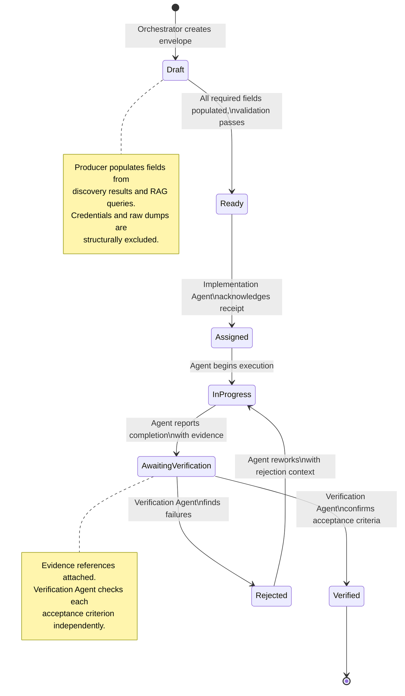
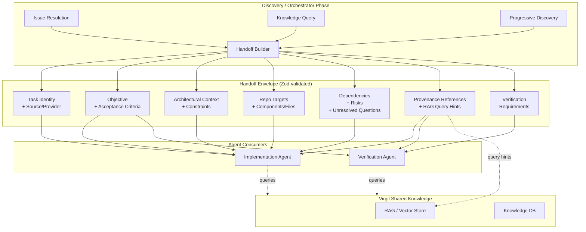

# H09 — Handoff Protocol

> **Project:** Virgil
> **Artifact type:** Child handoff
> **Parent:** [`VIRGIL_HANDOFF_SEED.md`](../VIRGIL_HANDOFF_SEED.md)
> **Status:** Ready for assignment
> **Normative agent behavior:** [`AGENTS.md`](../AGENTS.md)

## Menú

- [Progress Tracker](#progress-tracker)
- [Objective](#objective)
- [Handoff Lifecycle Flow](#handoff-lifecycle-flow)
- [Scope](#scope)
- [Out of Scope](#out-of-scope)
- [Preconditions](#preconditions)
- [Deliverables](#deliverables)
- [Verification Requirements](#verification-requirements)
- [Evidence Requirements](#evidence-requirements)
- [Risks and Constraints](#risks-and-constraints)
- [References](#references)

---

## Progress Tracker

- [ ] Assignment accepted
- [ ] Preconditions verified
- [ ] Handoff envelope Zod schema defined
- [ ] Required fields implemented (task identity through verification requirements)
- [ ] Exclusion constraints enforced (no credentials, no dumps, no chat history)
- [ ] Handoff status lifecycle type defined
- [ ] Handoff factory/builder utility implemented
- [ ] Serialization and deserialization proven (JSON round-trip)
- [ ] Handoff validation rejects malformed envelopes
- [ ] Handoff validation rejects excluded content patterns
- [ ] Discovery/Orchestrator producer path proven
- [ ] Implementation Agent consumer path proven
- [ ] Verification Agent consumer path proven
- [ ] RAG query hints structure validated
- [ ] Provenance reference structure validated
- [ ] Unit tests cover all schema branches
- [ ] Standard verification gates pass (see [SHARED_VERIFICATION.md](./SHARED_VERIFICATION.md))

[↑ Menú](#menú)

---

## Objective

Define the machine-readable, Zod-validated handoff envelope format that Virgil uses to transfer structured execution context between agent phases. This handoff protocol is the contract through which the Discovery/Orchestrator phase produces actionable work packages, Implementation Agents consume them to perform bounded development tasks, and Verification Agents validate the results against the original acceptance criteria.

The protocol must be:

- **machine-readable** — serializable to JSON, parseable without ambiguity,
- **schema-validated** — every field governed by a Zod schema with strict parsing,
- **minimal-sufficient** — carries exactly what the receiving agent needs, references shared knowledge instead of duplicating it,
- **exclusion-aware** — structurally prevents credentials, raw dumps, chat history, and duplicated queryable knowledge from entering the envelope,
- **lifecycle-tracked** — each handoff carries a status reflecting its progression through the agent pipeline.

After this handoff is complete, Virgil has a typed, validated, testable handoff contract that H08 (Progressive Discovery), H10 (Product Agent Orchestration), and all downstream agent-facing features can depend on.

[↑ Menú](#menú)

---

## Handoff Lifecycle Flow

The following diagram shows the handoff envelope's lifecycle as it moves through Virgil's agent pipeline.

The following diagram shows the data flow between Virgil's agent phases and the handoff envelope.

[↑ Menú](#menú)

---

## Scope

### Included

1. **Handoff envelope Zod schema** — a single, strict Zod schema defining every field the handoff envelope carries, with required vs optional field boundaries.
2. **Task identity fields** — unique handoff identifier, human-readable title, creation timestamp, last-modified timestamp.
3. **Source/provider fields** — originating provider type (issue, knowledge, repo, chat), provider instance identifier, source reference (issue ID, document path, URL).
4. **Objective field** — a single bounded natural-language objective statement.
5. **Acceptance criteria** — an ordered list of individually verifiable criterion statements.
6. **Known constraints** — technical, policy, time, or resource constraints that bound the implementation.
7. **Repository targets** — workspace identifier, package names, branch references.
8. **Components/files** — relevant source paths, module identifiers, or architectural areas when known from discovery.
9. **Architectural context** — discovered design patterns, dependency relationships, and domain boundaries relevant to the task.
10. **Known dependencies** — prerequisite handoffs, upstream deliverables, or external system dependencies.
11. **Risks** — identified risks with optional mitigation suggestions.
12. **Unresolved questions** — open questions that the implementation agent may need to escalate or resolve.
13. **Provenance references** — typed references to source evidence (provider, source ID, content hash, URI, discovery timestamp).
14. **RAG query hints** — suggested query strings and topic keys for retrieving relevant knowledge from Virgil's shared store.
15. **Verification requirements** — machine-readable verification expectations (static gates, dynamic gates, coverage thresholds, specific assertions).
16. **Handoff status lifecycle** — a finite state type (`draft`, `ready`, `assigned`, `in-progress`, `awaiting-verification`, `verified`, `rejected`) with transition validation.
17. **Exclusion validation** — schema-level or utility-level guards that reject envelopes containing credential patterns, excessively large inline content, raw chat transcripts, or content duplicating existing knowledge entries.
18. **Handoff factory/builder** — a programmatic utility for constructing valid handoff envelopes with sensible defaults and progressive field population.
19. **JSON serialization round-trip** — proven serialization to JSON and deserialization back to a validated Zod type with no data loss.

### Seed Definition of Done Coverage

This handoff contributes to seed item 30 (required child handoffs generated) and directly implements the Handoff Protocol section of the seed.

[↑ Menú](#menú)

---

## Out of Scope

The following responsibilities belong to other handoffs and must **not** be addressed here:

| Exclusion | Owner |
| --- | --- |
| Node SEA packaging and runtime isolation | H02 |
| Workspace identity and configuration management | H03 |
| Provider contracts (Issue, Knowledge, Repo, Chat) | H04 |
| Local repository provider implementation | H05 |
| SQLite persistence / Drizzle ORM schema for handoffs | H06 |
| RAG core, embedding, and vector store implementation | H07 |
| Progressive discovery orchestration logic | H08 |
| Product agent orchestration runtime (agent lifecycle, delegation) | H10 |
| Model-tier routing and capability escalation runtime | H11 |
| Remote providers (Issue, Knowledge, Chat) | H12--H14 |
| Knowledge lifecycle and storage pressure | H15 |
| Playwright CDP browser automation (`packages/pw-cdp/`) | H16 |
| Local folder indexers (`packages/local-indexers/`) | H17 |
| CI/CD pipeline configuration | H18 |
| Handoff persistence to SQLite | H06 (schema) + H09 consumers |
| Agent creation, role assignment, and accept/reject protocol runtime | H10 |

This handoff defines the **envelope schema and validation**. It does not implement the orchestration logic that produces handoffs (H08, H10), the persistence layer that stores them (H06), or the agent runtime that consumes them (H10).

[↑ Menú](#menú)

---

## Preconditions

1. H01 (Repository Bootstrap) is complete — monorepo workspace, TypeScript strict mode, static and dynamic verification gates are operational.
2. `packages/cli/` contains the NestJS + nest-commander scaffold with working build and test infrastructure.
3. Zod 4.5.4 is available as a dependency within `packages/cli/` (validated by POC-00).
4. The seed's Handoff Protocol section and `AGENTS.md` Handoff Rules are available as normative references.
5. Provider contract interfaces from H04 are defined or at minimum their identity types are available for the source/provider fields. If H04 is not yet complete, the schema must use string-based provider type identifiers that H04 can later narrow.

[↑ Menú](#menú)

---

## Deliverables

### D1 — Handoff Envelope Zod Schema

Define the core Zod schema for the handoff envelope with all required and optional fields.

**Acceptance criteria:**

- A Zod schema named `HandoffEnvelopeSchema` (or equivalent) exists in `packages/cli/src/handoff/` (or a domain-appropriate module path).
- The schema includes all fields specified in the seed's Handoff Protocol section:
  - `id` — unique handoff identifier (string, UUID or ULID format).
  - `title` — human-readable title (string, non-empty, max 200 characters).
  - `status` — lifecycle status (enum: `draft`, `ready`, `assigned`, `in-progress`, `awaiting-verification`, `verified`, `rejected`).
  - `createdAt` — creation timestamp (ISO 8601 string or Date).
  - `updatedAt` — last-modified timestamp (ISO 8601 string or Date).
  - `source` — object containing `providerType` (string enum), `providerId` (string), `sourceRef` (string), and optional `sourceUrl` (string URL).
  - `objective` — single bounded objective statement (string, non-empty).
  - `acceptanceCriteria` — ordered array of criterion objects, each with `id` (string), `description` (string), and `verified` (boolean, default false).
  - `constraints` — array of constraint strings (may be empty).
  - `repoTargets` — object containing `workspaceId` (string), `packages` (string array), `branch` (optional string).
  - `components` — array of component reference objects, each with `path` (string) and optional `description` (string).
  - `architecturalContext` — array of context entry objects, each with `domain` (string), `description` (string), and optional `references` (string array).
  - `dependencies` — array of dependency objects, each with `type` (enum: `handoff`, `deliverable`, `external`), `id` (string), and `description` (string).
  - `risks` — array of risk objects, each with `description` (string) and optional `mitigation` (string).
  - `unresolvedQuestions` — array of question strings.
  - `provenanceRefs` — array of provenance reference objects (see D3).
  - `ragQueryHints` — array of RAG hint objects (see D4).
  - `verificationRequirements` — verification requirements object (see D5).
- Zod strict parsing is enabled — unknown fields cause validation failure.
- The inferred TypeScript type (`HandoffEnvelope`) is exported alongside the schema.

### D2 — Handoff Status Lifecycle

Define the status lifecycle as a validated finite state machine.

**Acceptance criteria:**

- A Zod enum or union type defines the valid statuses: `draft`, `ready`, `assigned`, `in-progress`, `awaiting-verification`, `verified`, `rejected`.
- A transition validation function or map defines which transitions are legal:
  - `draft` may transition to `ready`.
  - `ready` may transition to `assigned`.
  - `assigned` may transition to `in-progress`.
  - `in-progress` may transition to `awaiting-verification`.
  - `awaiting-verification` may transition to `verified` or `rejected`.
  - `rejected` may transition to `in-progress`.
- Attempting an illegal transition produces a typed error with the current status, attempted target, and the set of valid targets.
- The transition function updates `updatedAt` on successful transition.

### D3 — Provenance Reference Schema

Define the typed structure for evidence provenance references.

**Acceptance criteria:**

- A Zod schema named `ProvenanceRefSchema` exists with fields:
  - `provider` — provider type string (aligned with H04 provider families when available).
  - `sourceId` — unique identifier within the provider (issue number, document ID, file path).
  - `uri` — optional full URI or path to the source.
  - `contentHash` — optional content hash (SHA-256 hex string) for change detection.
  - `version` — optional version identifier (commit SHA, document version number).
  - `discoveredAt` — timestamp when the evidence was discovered.
  - `refreshedAt` — optional timestamp of last refresh.
  - `taskAssociations` — optional array of handoff IDs this evidence is associated with.
- The schema is reusable and imported by the main `HandoffEnvelopeSchema`.

### D4 — RAG Query Hints Schema

Define the structure for RAG query hints that help receiving agents retrieve relevant shared knowledge.

**Acceptance criteria:**

- A Zod schema named `RagQueryHintSchema` exists with fields:
  - `query` — suggested natural-language query string.
  - `topicKeys` — optional array of topic key strings for scoped retrieval.
  - `providers` — optional array of provider type filters.
  - `maxResults` — optional positive integer suggesting result count.
  - `relevanceNote` — optional string explaining why this query is relevant.
- Hints are advisory — they guide the consuming agent but do not mandate retrieval behavior.
- The schema is reusable and imported by the main `HandoffEnvelopeSchema`.

### D5 — Verification Requirements Schema

Define the machine-readable verification expectations embedded in each handoff.

**Acceptance criteria:**

- A Zod schema named `VerificationRequirementsSchema` exists with fields:
  - `staticGates` — optional array of static gate identifiers (e.g., `audit`, `lint`, `format`, `typescript`, `exact-deps`).
  - `dynamicGates` — optional array of dynamic gate identifiers or test suite names.
  - `coverageThreshold` — optional object with `statements`, `lines`, `functions`, `branches` as optional percentage numbers.
  - `specificAssertions` — optional array of assertion description strings that the verification agent must check.
  - `evidenceRequired` — array of evidence type strings (e.g., `terminal-output`, `test-report`, `coverage-summary`, `diff`).
- The schema is reusable and imported by the main `HandoffEnvelopeSchema`.

### D6 — Exclusion Validation

Implement guards that structurally prevent excluded content from entering handoff envelopes.

**Acceptance criteria:**

- A validation utility or Zod refinement rejects envelopes where:
  - Any string field matches common credential patterns (API keys, tokens, passwords, connection strings with embedded credentials). Detection uses pattern matching, not exhaustive secret scanning.
  - The `objective` or any `acceptanceCriteria` entry exceeds a configurable maximum length (default: 4096 characters for objective, 2048 per criterion) — preventing inline context dumps.
  - Any field named or shaped like raw chat history, full crawled output, or unprocessed document content is present (enforced by strict schema — no catch-all `additionalProperties`).
- Validation errors identify the specific field and exclusion reason.
- The exclusion list is documented in code comments referencing the seed's Handoff Protocol section.

### D7 — Handoff Factory/Builder

Provide a programmatic utility for constructing valid handoff envelopes.

**Acceptance criteria:**

- A factory function or builder class constructs a `HandoffEnvelope` with:
  - Auto-generated `id` (UUID v4 or ULID).
  - Auto-populated `createdAt` and `updatedAt`.
  - Initial status of `draft`.
  - Required fields accepted as constructor/factory arguments.
  - Optional fields populated via chained methods or partial input.
- The builder validates the envelope against the Zod schema before returning it.
- Invalid construction attempts produce typed Zod validation errors, not runtime exceptions.
- The builder is injectable as a NestJS provider.

### D8 — JSON Serialization Round-Trip

Prove that handoff envelopes serialize to JSON and deserialize back without data loss.

**Acceptance criteria:**

- A serialize function converts a `HandoffEnvelope` to a JSON string.
- A deserialize function parses a JSON string, validates it against `HandoffEnvelopeSchema`, and returns a typed `HandoffEnvelope`.
- Round-trip tests prove `deserialize(serialize(envelope))` produces a deeply equal envelope for envelopes containing all field combinations (required-only, fully populated, edge-case values).
- Deserialization of malformed JSON or schema-violating JSON produces typed validation errors.

[↑ Menú](#menú)

---

## Verification Requirements

Standard static, dynamic, and build verification gates apply — see [SHARED_VERIFICATION.md](./SHARED_VERIFICATION.md).

### Schema Validation

- Valid envelopes pass strict Zod parsing without warnings.
- Envelopes with unknown fields are rejected.
- Envelopes with missing required fields are rejected with field-specific errors.
- Envelopes containing credential patterns are rejected.
- Envelopes exceeding content length limits are rejected.
- Illegal status transitions are rejected with descriptive errors.

### Serialization

- JSON round-trip preserves all field values including timestamps, arrays, nested objects.
- Malformed JSON input produces parse errors, not runtime crashes.

[↑ Menú](#menú)

---

## Evidence Requirements

Standard evidence items apply — see [SHARED_VERIFICATION.md](./SHARED_VERIFICATION.md).

Handoff-specific evidence:

1. The exported `HandoffEnvelopeSchema` Zod definition (source listing or path).
2. The exported `HandoffEnvelope` TypeScript type (inferred from Zod).
3. Test output showing valid envelope construction via the factory/builder.
4. Test output showing rejection of envelopes with credential patterns.
5. Test output showing rejection of envelopes with excessive inline content.
6. Test output showing rejection of illegal status transitions with descriptive errors.
7. Test output showing successful JSON round-trip for fully populated envelopes.
8. Test output showing deserialization failure for malformed input.
9. Confirmation that no credentials, raw dumps, or chat history structures exist in the schema as permissible fields.

[↑ Menú](#menú)

---

## Risks and Constraints

| Risk | Mitigation |
| --- | --- |
| Credential pattern detection may produce false positives on legitimate field content | Use conservative patterns targeting well-known formats (Bearer tokens, AWS keys, connection strings). Provide an escape mechanism or allowlist for known false-positive patterns. Document the pattern set. |
| Zod 4.x API differences from Zod 3.x may affect schema design | Use Zod 4.5.4 as validated by POC-00. Consult Zod 4 documentation for strict mode, refinements, and transform APIs before implementation. |
| Provider type identifiers may not align with H04 contracts if H04 is incomplete | Use string-based provider types initially. Define a mapping type that H04 can narrow to a discriminated union once provider contracts are finalized. Document the planned narrowing. |
| Content length limits may be too restrictive for legitimate complex tasks | Make limits configurable with documented defaults. Allow per-field override at envelope construction time. |
| Handoff schema may become a coupling point between all agent-facing modules | Keep the schema in its own module with no imports from provider, persistence, or orchestration layers. Depend on the schema, never on its consumers. |
| Status lifecycle transitions may need extension for future agent phases | Design the transition map as data (a record/map), not hard-coded conditionals. New states and transitions can be added by extending the map without restructuring the validation logic. |
| UUID/ULID generation strategy affects handoff identity across distributed agents | Use a single generation utility injectable via NestJS DI. Default to UUID v4 for simplicity; document ULID as a future option if time-sortable IDs become valuable. |
| Envelope size may grow beyond practical limits for large discovery outputs | Enforce that the envelope carries references and query hints, not inline content. The exclusion validation (D6) enforces content length limits. The architectural context and components fields carry summaries, not source code. |

[↑ Menú](#menú)

---

## References

- [`AGENTS.md`](../AGENTS.md) — normative agent behavior contract, including Handoff Rules and Agent Delegation Contract sections
- [`VIRGIL_HANDOFF_SEED.md`](../VIRGIL_HANDOFF_SEED.md) — architectural seed, Handoff Protocol section (defines required/excluded fields)
- [`H01_REPOSITORY_BOOTSTRAP.md`](./H01_REPOSITORY_BOOTSTRAP.md) — repository foundation (precondition)
- [`H04_PROVIDER_CONTRACTS.md`](./H04_PROVIDER_CONTRACTS.md) — provider contracts (provider type alignment)
- [`H06_KNOWLEDGE_PERSISTENCE.md`](./H06_KNOWLEDGE_PERSISTENCE.md) — persistence layer (future handoff storage)
- [`H08_PROGRESSIVE_DISCOVERY.md`](./H08_PROGRESSIVE_DISCOVERY.md) — discovery orchestration (primary handoff producer)
- [`H10_PRODUCT_ORCHESTRATION.md`](./H10_PRODUCT_ORCHESTRATION.md) — agent orchestration (handoff consumer runtime)
- Branch `poc/ref` (local) — POC-00 reference implementation (Zod 4.5.4 validation patterns)

[↑ Menú](#menú)
