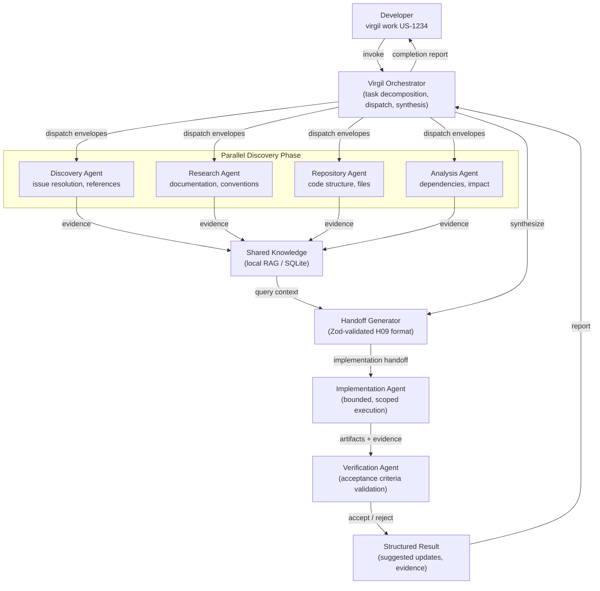
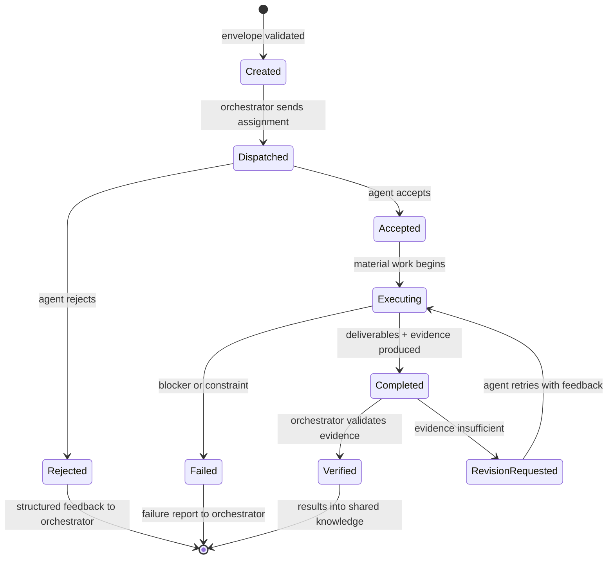

# H10 — Product Agent Orchestration

> **Project:** Virgil
> **Artifact type:** Child handoff
> **Parent:** [`VIRGIL_HANDOFF_SEED.md`](../VIRGIL_HANDOFF_SEED.md)
> **Status:** Ready for assignment
> **Normative agent behavior:** [`AGENTS.md`](../AGENTS.md)

## Menú

- [Progress Tracker](#progress-tracker)
- [Objective](#objective)
- [Product Orchestration Flow](#product-orchestration-flow)
- [Scope](#scope)
- [Out of Scope](#out-of-scope)
- [Preconditions](#preconditions)
- [Deliverables](#deliverables)
- [Verification Requirements](#verification-requirements)
- [Evidence Requirements](#evidence-requirements)
- [Risks and Constraints](#risks-and-constraints)
- [References](#references)

---

## Progress Tracker

- [ ] Assignment accepted
- [ ] Preconditions verified
- [ ] Orchestrator runtime contract defined
- [ ] Agent creation contract implemented with Zod-validated envelopes
- [ ] Role and persona assignment module implemented
- [ ] Task envelope schema defined and enforced
- [ ] Accept/reject protocol implemented with structured responses
- [ ] Parallelizable work identification strategy implemented
- [ ] Child handoff generation capability implemented
- [ ] Vendor-neutral execution contract defined
- [ ] Agent lifecycle state machine implemented
- [ ] Orchestrator dispatches and collects agent results via shared knowledge
- [ ] Standard verification gates pass (see [SHARED_VERIFICATION.md](./SHARED_VERIFICATION.md))

[↑ Menú](#menú)

---

## Objective

Define and implement the **product-level** agent orchestration runtime that Virgil exposes to its users. This is the multi-agent coordination system that powers the `virgil work <issue-id>` flow: an orchestrator that decomposes developer tasks into bounded agent assignments, dispatches them, collects structured results into shared knowledge, produces implementation handoffs, and validates completed work.

This handoff is explicitly **distinct from the repository-development orchestration rules** defined in `AGENTS.md`. Those rules govern how agents develop Virgil itself. H10 governs the orchestration capabilities that Virgil provides as a product to the developers who use it.

After this handoff is complete, Virgil will have a runtime orchestration layer capable of:

- creating agents with typed, validated assignment envelopes,
- assigning roles and optional personas to those agents,
- enforcing an accept/reject protocol before material work begins,
- identifying and dispatching parallelizable work,
- routing agent results through shared knowledge,
- generating structured child handoffs for implementation agents,
- executing the entire flow through a vendor-neutral contract that does not couple to any specific LLM provider or agent harness.

[↑ Menú](#menú)

---

## Product Orchestration Flow

The following diagram shows the complete product orchestration lifecycle. This is the runtime flow that Virgil manages when a developer invokes a work command.

### Agent Lifecycle State Machine

Each agent dispatched by the orchestrator follows a deterministic lifecycle. The orchestrator tracks every agent through these states.

[↑ Menú](#menú)

---

## Scope

### Included

1. **Orchestrator runtime contract** — the core service that receives a developer work request, decomposes it into bounded agent assignments, dispatches agents, collects results, and synthesizes a completion report. Implemented as a NestJS module within `packages/cli/`.
2. **Agent creation contract** — a typed, Zod-validated schema for creating agent instances. Each agent receives a fully specified assignment envelope before execution.
3. **Role and persona assignment** — an open-ended role taxonomy (not a closed enum) with optional persona attachment. Roles describe capability expectations; personas describe behavioural style when useful for the task.
4. **Task envelope schema** — a Zod-validated data structure containing: agent name, role, optional persona, objective, scope, out-of-scope boundaries, inputs, expected deliverables, acceptance criteria, evidence requirements, and applicable constraints.
5. **Accept/reject protocol** — every agent must explicitly accept or reject its assignment before performing material work. Rejections carry structured reasons. The orchestrator routes rejections into clarification, scope narrowing, prerequisite creation, or reassignment.
6. **Parallelizable work identification** — the orchestrator analyses task decomposition to identify independent assignments that can be dispatched concurrently. Dependencies between agents are expressed as explicit edges, and only truly independent work runs in parallel.
7. **Child handoff generation** — the orchestrator generates structured handoffs (conforming to the H09 handoff protocol format) when implementation requires delegation to a separate execution phase. Handoffs reference shared knowledge via query hints rather than embedding raw context.
8. **Vendor-neutral execution contract** — the orchestration layer defines capability requirements (model tiers, tool access, context budget) without coupling to any specific LLM provider, agent harness, or vendor SDK. Adapters translate these abstract requirements to concrete provider capabilities.
9. **Agent lifecycle state machine** — deterministic state transitions (Created, Dispatched, Accepted/Rejected, Executing, Completed/Failed, Verified) tracked by the orchestrator with auditable transition records.
10. **Result collection and knowledge integration** — agent results flow into shared knowledge (H06/H07) with provenance metadata. The orchestrator synthesizes results from multiple agents into coherent output.

### Seed Definition of Done Coverage

This handoff addresses seed item 30 (required child handoffs generated) for the product agent orchestration domain.

[↑ Menú](#menú)

---

## Out of Scope

| Exclusion | Owner |
| --- | --- |
| Repository bootstrap and workspace structure | H01 |
| CLI runtime, SEA packaging, and global usage | H02 |
| Workspace identity and configuration management | H03 |
| Provider port contracts (Issue, Knowledge, Repo, Chat) | H04 |
| Local repository provider implementation | H05 |
| SQLite persistence model and knowledge storage | H06 |
| RAG core, embeddings, and vector retrieval | H07 |
| Issue-driven progressive discovery logic | H08 |
| Machine-readable handoff protocol format (Zod schema) | H09 |
| Model-tier runtime mapping (worker/reasoning/pro) | H11 |
| Remote issue provider implementation | H12 |
| Remote knowledge provider implementation | H13 |
| Chat provider implementation | H14 |
| Knowledge lifecycle and storage pressure | H15 |
| Playwright CDP browser automation | H16 |
| Local folder indexers | H17 |
| CI/CD pipeline configuration | H18 |
| Repository-development orchestration rules (governed by `AGENTS.md`) | `AGENTS.md` |
| Specific LLM provider integrations (OpenAI, Anthropic, etc.) | Future adapters |

H10 defines the **orchestration contract and runtime**. It does not implement specific providers, persistence, or discovery logic. It consumes those capabilities through their respective ports.

[↑ Menú](#menú)

---

## Preconditions

1. **H01 complete** — the monorepo workspace, NestJS scaffold, TypeScript strict mode, static and dynamic verification gates are operational in `packages/cli/`.
2. **H04 complete or in progress** — provider port contracts (at minimum the interfaces) must exist so the orchestrator can reference provider capabilities without implementing them.
3. **H09 complete or in progress** — the handoff protocol format must be defined (at minimum the Zod schema) so the orchestrator can generate conformant handoffs.
4. **H06/H07 interfaces available** — shared knowledge read/write interfaces must be defined so agent results can be routed into persistent knowledge. Concrete implementations are not required; ports suffice.
5. **AGENTS.md available** — the normative contract is consulted for design inspiration but is not imported or re-exported as a product runtime dependency. The product orchestration contract is independent.

[↑ Menú](#menú)

---

## Deliverables

### D1 — Task Envelope Schema

Define the Zod-validated schema for agent assignment envelopes.

**Acceptance criteria:**

- A Zod schema defines the complete assignment envelope: `name` (string, unique per orchestration session), `role` (string, open-ended), `persona` (optional string), `objective` (string), `scope` (array of strings), `outOfScope` (array of strings), `inputs` (array of typed references), `deliverables` (array of strings), `acceptanceCriteria` (array of strings), `evidenceRequired` (array of strings), `constraints` (array of strings), `tier` (enum: `worker` | `reasoning` | `pro`), `dependencies` (array of agent names, default empty).
- The schema is exported from a dedicated module within `packages/cli/src/orchestration/`.
- Invalid envelopes are rejected at creation time with structured Zod error messages.
- The schema is extensible without breaking existing validated envelopes.

### D2 — Agent Creation Contract

Implement the service that creates agent instances from validated envelopes.

**Acceptance criteria:**

- An `AgentFactory` (or equivalent NestJS injectable) accepts a validated task envelope and produces an agent instance with a deterministic initial state (`Created`).
- The factory validates the envelope against the D1 schema before creating the agent.
- Each created agent has a unique identifier within its orchestration session.
- The factory rejects duplicate agent names within the same session.
- Agent creation is logged with sufficient metadata for auditability.

### D3 — Role and Persona Assignment

Implement role and persona assignment as part of agent creation.

**Acceptance criteria:**

- Roles are open-ended strings with no closed taxonomy. Any role string is valid.
- A set of well-known role constants is provided for convenience (e.g., `DISCOVERY`, `RESEARCH`, `REPOSITORY`, `ANALYSIS`, `IMPLEMENTATION`, `VERIFICATION`, `TECHNICAL_WRITER`) without restricting the domain to those values.
- Personas are optional. When provided, they describe a behavioural style that may influence agent prompting or tool selection.
- Role and persona are immutable after agent creation. Changing them requires creating a new agent.
- The combination of role + persona is included in all agent audit records and handoff metadata.

### D4 — Accept/Reject Protocol

Implement the structured accept/reject protocol for agent assignments.

**Acceptance criteria:**

- After dispatch, every agent must respond with either `ACCEPTED` or `REJECTED` before performing material work.
- Rejection responses carry a structured reason from a defined set: `insufficient_information`, `missing_access`, `conflicting_constraints`, `exceeds_authority`, `not_auditable`, `upstream_dependency`, `unavailable_capability`, `safety_conflict`, `other` (with required free-text explanation).
- The orchestrator never allows an agent to begin material work without an explicit acceptance.
- Rejected assignments are routed back to the orchestrator with the full rejection context.
- The orchestrator can respond to rejections by: clarifying the task, narrowing scope, adding inputs, changing role, creating prerequisite work, or reassigning to a different agent.
- Accept/reject transitions are recorded in the agent lifecycle state machine.

### D5 — Parallelizable Work Identification

Implement the dependency analysis that determines which agent assignments can run concurrently.

**Acceptance criteria:**

- The orchestrator builds a directed acyclic graph (DAG) from agent `dependencies` fields.
- Agents with no dependencies (or whose dependencies are all satisfied) are eligible for parallel dispatch.
- The orchestrator identifies the maximum set of parallelizable agents at each dispatch wave.
- Circular dependencies are detected and rejected at task decomposition time with a clear error.
- The dependency graph is available for inspection (serializable to JSON for audit/debugging).
- Independent discovery agents (e.g., Discovery, Research, Repository, Analysis) are dispatched in parallel by default when they have no inter-dependencies.

### D6 — Agent Lifecycle State Machine

Implement the deterministic state machine that tracks each agent through its lifecycle.

**Acceptance criteria:**

- States: `Created`, `Dispatched`, `Accepted`, `Rejected`, `Executing`, `Completed`, `Failed`, `RevisionRequested`, `Verified`.
- Transitions follow the state diagram defined in this handoff. Invalid transitions are rejected.
- Every transition is timestamped and recorded with the triggering event.
- The orchestrator can query the current state of any agent by name or identifier.
- The state machine is implemented as a pure, testable module independent of NestJS DI for core logic (NestJS wiring is a thin adapter).
- Terminal states (`Rejected`, `Failed`, `Verified`) cannot be re-entered or transitioned from (except `Rejected` to `Created` via a new agent creation).

### D7 — Vendor-Neutral Execution Contract

Define the abstraction layer that decouples orchestration from specific agent/LLM providers.

**Acceptance criteria:**

- An `AgentExecutor` port (interface) defines the contract for dispatching an agent envelope to an execution backend. The interface accepts a validated envelope and returns a structured result.
- The port specifies capability requirements (model tier, tool access needs, maximum context budget) without naming any vendor or model.
- A `NullExecutor` (no-op/mock implementation) is provided for testing and development.
- The orchestrator interacts exclusively through the `AgentExecutor` port, never through concrete provider implementations.
- Adapter registration uses NestJS dependency injection so that concrete executors can be swapped without modifying orchestration logic.
- The execution contract supports both synchronous (await result) and asynchronous (dispatch and poll) execution patterns.
- Model-tier requirements (`worker`, `reasoning`, `pro`) from the envelope are forwarded to the executor without the orchestrator interpreting them. Tier-to-model mapping is the executor adapter's responsibility (see H11).

### D8 — Child Handoff Generation

Implement the capability for the orchestrator to generate structured implementation handoffs.

**Acceptance criteria:**

- The orchestrator generates handoffs conforming to the H09 handoff protocol format when implementation requires delegation.
- Generated handoffs include: task identity, objective, acceptance criteria, constraints, relevant component/file references, discovery context references (as RAG query hints, not raw dumps), dependency list, risks, unresolved questions, and evidence requirements.
- Handoffs reference shared knowledge through query hints rather than embedding full context.
- Generated handoffs never include credentials, raw chat history, or uncontrolled document dumps.
- Each generated handoff includes a Progress Tracker with checkboxes.
- The generation service accepts orchestrator synthesis output and produces a serializable handoff structure.

### D9 — Result Collection and Knowledge Integration

Implement the result aggregation pipeline from completed agents into shared knowledge.

**Acceptance criteria:**

- Completed agent results are validated against the deliverables and evidence requirements declared in their envelopes.
- Results that meet acceptance criteria are routed to the shared knowledge layer (via the KnowledgeProvider port from H04/H06) with provenance metadata: agent name, role, task identity, timestamp, and source references.
- The orchestrator synthesizes results from multiple parallel agents into a coherent discovery context before handoff generation.
- Results from failed or rejected agents are preserved as audit records but not injected into shared knowledge as validated facts.
- The orchestrator produces a completion report summarising: agents dispatched, acceptance/rejection counts, completion status per agent, evidence summary, unresolved risks, and architectural decisions.

[↑ Menú](#menú)

---

## Verification Requirements

Standard static, dynamic, and build verification gates apply — see [SHARED_VERIFICATION.md](./SHARED_VERIFICATION.md).

### Orchestration-Specific Dynamic Tests

Tests must exercise: envelope validation (valid and invalid inputs), agent creation (including duplicate rejection), accept/reject protocol (all rejection reasons), lifecycle state transitions (all valid transitions and invalid transition rejection), dependency graph construction (including cycle detection), parallel dispatch identification, handoff generation (conformance to H09 format), result collection pipeline, vendor-neutral executor port (via `NullExecutor`).

### Integration

- The orchestration module integrates with the NestJS application module without circular dependencies.
- The `AgentExecutor` port is injectable and replaceable via standard NestJS DI.
- Provider port dependencies (knowledge, handoff protocol) are satisfied through interfaces, not concrete implementations.

[↑ Menú](#menú)

---

## Evidence Requirements

Standard evidence items apply — see [SHARED_VERIFICATION.md](./SHARED_VERIFICATION.md).

Handoff-specific evidence:

1. The Zod task envelope schema source with inline documentation of each field.
2. Proof that invalid envelopes are rejected with structured errors (test output showing rejection cases).
3. Proof that the accept/reject protocol prevents execution before acceptance (test output).
4. Proof that circular dependencies in the agent DAG are detected and rejected (test output).
5. Proof that the lifecycle state machine rejects invalid transitions (test output).
6. Proof that the `NullExecutor` satisfies the `AgentExecutor` port contract (test output).
7. Proof that generated handoffs conform to the H09 schema (test output or validation log).

[↑ Menú](#menú)

---

## Risks and Constraints

| Risk | Mitigation |
| --- | --- |
| H09 handoff protocol schema not yet defined when H10 begins | Define a minimal handoff structure interface within H10; replace with the canonical H09 schema once available. Use a shared types package or barrel export to avoid duplication. |
| H04 provider port contracts not yet available | Define minimal port interfaces (knowledge write, knowledge query) locally; replace with canonical H04 ports once available. Document the temporary interfaces as provisional. |
| Agent lifecycle state machine complexity may exceed test coverage targets | Implement the state machine as a pure function with exhaustive transition table testing. Property-based tests can verify that no invalid transition is silently accepted. |
| Open-ended role taxonomy may lead to inconsistent agent behaviour | Provide well-known role constants as recommended defaults. Document expected capability implications for each well-known role without restricting the domain. |
| Vendor-neutral execution contract may be too abstract to validate without a concrete adapter | The `NullExecutor` mock and a simulated orchestration session (dispatch, accept, execute, complete, verify) prove the contract is exercisable. Real adapter validation belongs to future provider handoffs. |
| Parallel dispatch may introduce race conditions in result collection | Use deterministic dispatch waves (all agents in a wave must complete before the next wave). Result collection is sequential per wave. Concurrency within a wave is managed by the executor adapter, not the orchestrator. |
| Product orchestration patterns may be confused with repository-development orchestration in `AGENTS.md` | H10 module is namespaced under `packages/cli/src/orchestration/`. Documentation and code comments explicitly state this is a product capability. No imports from or re-exports of `AGENTS.md` rules. |
| Zod 4 API may differ from Zod 3 patterns used in community examples | Reference POC-00 validated version (Zod 4.5.4). Consult Zod 4 documentation for schema definition patterns. |

[↑ Menú](#menú)

---

## References

- [`AGENTS.md`](../AGENTS.md) — normative agent behaviour contract for repository development (design inspiration, not runtime dependency)
- [`VIRGIL_HANDOFF_SEED.md`](../VIRGIL_HANDOFF_SEED.md) — architectural seed, sections: Product Agent Orchestration, Handoff Protocol, Product Intent
- [`H01_REPOSITORY_BOOTSTRAP.md`](./H01_REPOSITORY_BOOTSTRAP.md) — monorepo foundation (precondition)
- [`H04_PROVIDER_CONTRACTS.md`](./H04_PROVIDER_CONTRACTS.md) — provider port contracts (dependency)
- [`H06_KNOWLEDGE_PERSISTENCE.md`](./H06_KNOWLEDGE_PERSISTENCE.md) — knowledge persistence and provenance (dependency for result integration)
- [`H09_HANDOFF_PROTOCOL.md`](./H09_HANDOFF_PROTOCOL.md) — machine-readable handoff format (dependency for child handoff generation)
- [`H11_AGENT_GOVERNANCE.md`](./H11_AGENT_GOVERNANCE.md) — model-tier runtime mapping (related, tier interpretation)
- Branch `poc/ref` (local) — POC-00 reference (Zod 4.5.4 validation patterns)
- [AGENTS.md Open Standard](https://agents.md/) — Linux Foundation open agentic standard

[↑ Menú](#menú)
