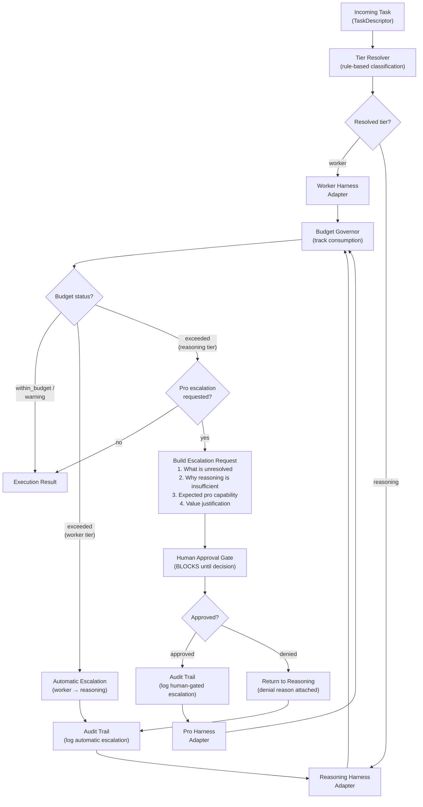
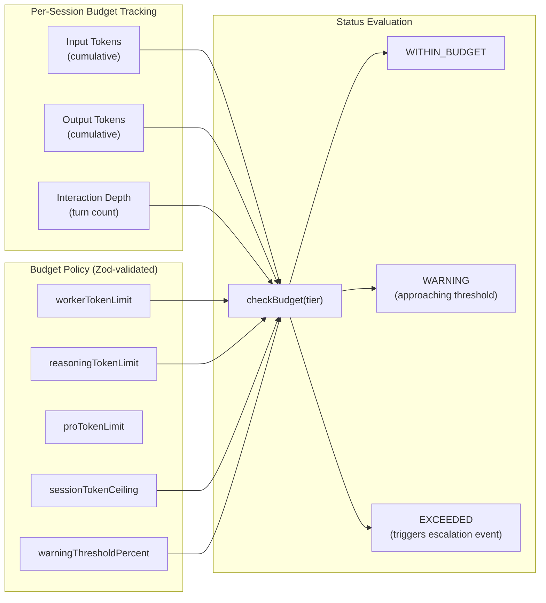
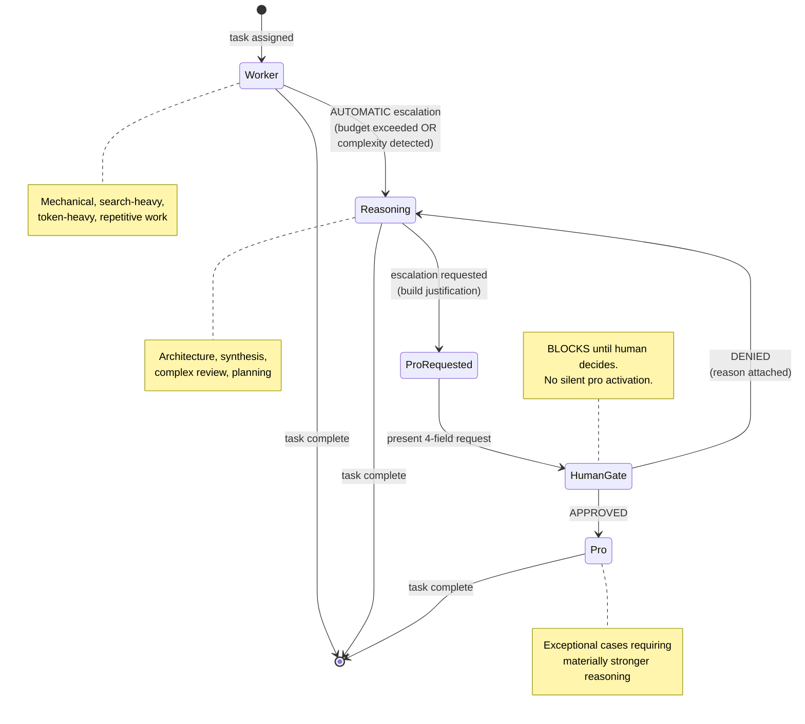

# H11 — Agent Execution Governance Runtime Mapping

> **Project:** Virgil
> **Artifact type:** Child handoff
> **Parent:** [`VIRGIL_HANDOFF_SEED.md`](../VIRGIL_HANDOFF_SEED.md)
> **Status:** Ready for assignment
> **Normative agent behavior:** [`AGENTS.md`](../AGENTS.md)

## Menú

- [Progress Tracker](#progress-tracker)
- [Objective](#objective)
- [Scope](#scope)
- [Out of Scope](#out-of-scope)
- [Preconditions](#preconditions)
- [Deliverables](#deliverables)
- [Tier Routing Architecture](#tier-routing-architecture)
- [Context Budget Governance](#context-budget-governance)
- [Capability Escalation Protocol](#capability-escalation-protocol)
- [Verification Requirements](#verification-requirements)
- [Evidence Requirements](#evidence-requirements)
- [Risks and Constraints](#risks-and-constraints)
- [References](#references)

---

## Progress Tracker

- [ ] Assignment accepted
- [ ] Preconditions verified
- [ ] Capability tier port defined (`CapabilityTier` enum: `worker`, `reasoning`, `pro`)
- [ ] Tier resolver port defined (`TierResolver` interface)
- [ ] Harness adapter contract defined (`HarnessAdapter` interface)
- [ ] Runtime tier-routing module implemented in `packages/cli/`
- [ ] Context budget governor implemented
- [ ] Budget threshold configuration schema defined (Zod-validated)
- [ ] Automatic worker-to-reasoning escalation gate implemented
- [ ] Human-gated reasoning-to-pro escalation implemented
- [ ] Escalation audit trail persisted
- [ ] Tier routing integration with H10 orchestration contract verified
- [ ] Standard verification gates pass (see [SHARED_VERIFICATION.md](./SHARED_VERIFICATION.md))

[↑ Menú](#menú)

---

## Objective

Define how Virgil maps abstract capability tiers (`worker`, `reasoning`, `pro`) to available agent/model harnesses at runtime without encoding vendor-specific model names into domain contracts.

This handoff establishes:

1. A **vendor-neutral tier abstraction** that decouples orchestration logic from specific model providers.
2. **Context budget governance rules** that enforce signal density and cost control across agent execution.
3. **Capability escalation gates** that govern tier transitions, including automatic worker-to-reasoning promotion and human-gated pro-tier access.
4. An **audit trail** ensuring every escalation decision is traceable.

The runtime mapping is the bridge between the abstract tier policy defined in `AGENTS.md` and the concrete harness/model selection that occurs when Virgil dispatches agent work.

[↑ Menú](#menú)

---

## Scope

### Included

1. **Capability tier enum** — a vendor-neutral `CapabilityTier` with three values: `worker`, `reasoning`, `pro`. No model names, no provider identifiers.
2. **Tier resolver port** — a `TierResolver` interface that accepts a task descriptor and returns the appropriate `CapabilityTier` based on task characteristics (token weight, complexity signal, task type classification).
3. **Harness adapter contract** — a `HarnessAdapter` interface that maps a `CapabilityTier` to an available runtime execution target. Adapters are pluggable; the domain never references a concrete model or vendor.
4. **Harness registry** — a runtime registry where available `HarnessAdapter` implementations are registered per workspace, each declaring which tiers it can serve.
5. **Context budget governor** — a module that tracks cumulative context consumption per agent session and enforces configurable thresholds (token budget, output budget, session depth).
6. **Budget threshold configuration** — a Zod-validated schema for workspace-level budget policies (per-tier token limits, session-level ceilings, warning thresholds).
7. **Automatic escalation gate (worker to reasoning)** — when a worker-tier task exceeds defined complexity or budget thresholds, the system automatically promotes it to reasoning tier and logs the escalation.
8. **Human-gated escalation gate (reasoning to pro)** — pro-tier access requires an explicit human approval step. The system must present the four required justification fields from `AGENTS.md` (what remains unresolved, why the current tier is insufficient, what additional capability is expected, why the value justifies escalation) and block until approval is received.
9. **Escalation audit log** — every tier transition (automatic or human-gated) is persisted with timestamp, task identity, source tier, target tier, justification, and approval status.
10. **Tier routing NestJS module** — implemented within `packages/cli/` as a NestJS module exposing the tier resolver, budget governor, and escalation gates as injectable services.

### Seed Definition of Done Coverage

This handoff contributes to seed items that require vendor-neutral model-tier routing and capability escalation as product-level runtime behavior, extending the repository-development policy in `AGENTS.md` into Virgil's product orchestration.

[↑ Menú](#menú)

---

## Out of Scope

The following responsibilities belong to other handoffs and must **not** be addressed here:

| Exclusion | Owner |
| --- | --- |
| Repository bootstrap, workspace setup, verification gates | H01 |
| Node SEA packaging and runtime isolation | H02 |
| Workspace identity and configuration management | H03 |
| Provider contracts (Issue, Knowledge, Repo, Chat) | H04 |
| SQLite persistence / Drizzle ORM schema for knowledge | H06 |
| RAG / vector / embedding layer | H07 |
| Handoff protocol format (machine-readable) | H09 |
| Product agent orchestration (creation, roles, task envelopes, accept/reject) | H10 |
| Concrete model provider adapters (e.g. OpenAI, Anthropic, local LLM) | Future adapter handoffs |
| Billing, metering, or cost allocation beyond budget governance | Future handoff |
| CI/CD pipeline configuration | H18 |

H11 defines the **governance layer** that H10's orchestration consumes. H10 owns agent lifecycle (creation, assignment, acceptance); H11 owns tier selection, budget enforcement, and escalation gates.

[↑ Menú](#menú)

---

## Preconditions

1. H01 is complete — the monorepo workspace, NestJS scaffold, and verification gates exist in `packages/cli/`.
2. H10 (Product Agent Orchestration) contract is at least defined at the port level, so H11 can integrate tier routing into the orchestration lifecycle.
3. `AGENTS.md` sections on Model-Tier Routing, Context Budget Governance, and Capability Escalation are the normative policy source.
4. Zod 4.5.4 is available for configuration schema validation (validated by POC-00).
5. Node.js 24.16.0 and pnpm 11.24.0 are available in the development environment.

[↑ Menú](#menú)

---

## Deliverables

### D1 — Capability Tier Abstraction

Define the vendor-neutral tier enum and task descriptor types.

**Acceptance criteria:**

- A `CapabilityTier` enum with exactly three values: `worker`, `reasoning`, `pro`.
- A `TaskDescriptor` type capturing the properties used for tier selection: task type classification, estimated token weight, complexity signal, whether the task involves mechanical/repetitive work versus synthesis/architecture.
- No model names, vendor identifiers, or pricing information appear in the type definitions.
- All types are exported from a dedicated domain module (e.g. `packages/cli/src/governance/`).
- Types are validated with Zod schemas.

### D2 — Tier Resolver Port

Define the interface that maps task descriptors to capability tiers.

**Acceptance criteria:**

- A `TierResolver` interface with a method signature equivalent to `resolve(descriptor: TaskDescriptor): CapabilityTier`.
- The default implementation applies rule-based classification: mechanical/search/extraction tasks resolve to `worker`; architecture/synthesis/review tasks resolve to `reasoning`; `pro` is never returned by default resolution — it is only reachable through explicit escalation.
- The resolver is injectable as a NestJS provider.
- Resolution logic is unit-tested with representative task descriptors for each tier.

### D3 — Harness Adapter Contract

Define the pluggable adapter interface that bridges tiers to runtime execution targets.

**Acceptance criteria:**

- A `HarnessAdapter` interface declaring: supported tiers, an execution method accepting a task payload and returning a result, and a capability declaration method reporting available tiers.
- A `HarnessRegistry` service that holds registered adapters and selects the appropriate one for a given tier.
- When no adapter is registered for a requested tier, the registry returns a typed error (not a silent fallback).
- A stub/mock adapter is provided for testing that covers all three tiers.
- The adapter interface does not reference any vendor SDK, model name, or API endpoint.

### D4 — Context Budget Governor

Implement the module that tracks and enforces context consumption budgets.

**Acceptance criteria:**

- A `BudgetGovernor` service tracking cumulative input tokens, output tokens, and interaction depth per agent session.
- Budget thresholds are defined in a Zod-validated `BudgetPolicy` schema with fields: `workerTokenLimit`, `reasoningTokenLimit`, `proTokenLimit`, `sessionTokenCeiling`, `warningThresholdPercent`.
- The governor exposes methods: `recordConsumption(tokens: TokenConsumption)`, `checkBudget(tier: CapabilityTier): BudgetStatus`, `remainingBudget(tier: CapabilityTier): number`.
- `BudgetStatus` is a discriminated union: `within_budget`, `warning`, `exceeded`.
- When a budget is exceeded, the governor emits a structured event (not a thrown exception) so the orchestrator can decide the response (escalate, pause, or terminate).
- Budget state is per-session, not persisted across sessions (session-scoped NestJS provider).

### D5 — Escalation Gates

Implement the automatic and human-gated escalation mechanisms.

**Acceptance criteria:**

- **Automatic gate (worker to reasoning):** when the budget governor reports `exceeded` for worker tier, or when the tier resolver detects complexity exceeding worker capability, the system promotes the task to `reasoning` tier automatically. The escalation is logged with justification.
- **Human-gated gate (reasoning to pro):** when escalation to `pro` is requested, the system constructs an `EscalationRequest` containing the four fields required by `AGENTS.md`: (1) what remains unresolved, (2) why reasoning tier is insufficient, (3) what additional capability is expected from pro, (4) why the value justifies escalation. The system blocks execution until the human responds with approval or denial.
- An `EscalationDecision` type captures: `approved`, `denied`, or `deferred`, with optional human-provided rationale.
- Denied escalation returns the task to the originating tier with the denial reason attached.
- No silent pro-tier activation is possible — any code path that would set `pro` without passing through the human gate is a test failure.

### D6 — Escalation Audit Trail

Persist a record of every tier transition for traceability.

**Acceptance criteria:**

- An `EscalationRecord` type with fields: `id`, `timestamp`, `taskId`, `sourceTier`, `targetTier`, `triggerType` (`automatic` | `human_requested`), `justification`, `approvalStatus` (`approved` | `denied` | `not_required`), `approvedBy` (optional human identifier).
- Records are collected by an `AuditTrail` service injectable in the governance module.
- The audit trail is queryable by task ID and by time range.
- The storage mechanism is abstracted behind a port (not coupled to SQLite directly — H06 owns persistence).
- An in-memory implementation is provided for testing and initial integration.

### D7 — Governance NestJS Module

Package all governance components as a cohesive NestJS module.

**Acceptance criteria:**

- A `GovernanceModule` in `packages/cli/src/governance/` that exports: `TierResolver`, `HarnessRegistry`, `BudgetGovernor`, `EscalationGate`, `AuditTrail`.
- All services are injectable and testable in isolation.
- The module can be imported by the orchestration module (H10) without circular dependencies.
- Module integration is verified by a test that bootstraps the NestJS application context and resolves all governance providers.

[↑ Menú](#menú)

---

## Tier Routing Architecture

The following diagram shows how an incoming task flows through tier resolution, budget governance, and escalation gates before reaching a concrete harness adapter.

**Key design invariants:**

- The tier resolver never returns `pro` directly. Pro is reachable only through the human-gated escalation path.
- Every tier transition passes through the audit trail before execution continues.
- The budget governor is consulted after every harness execution, not before, ensuring consumption is tracked even for successful single-pass tasks.
- Harness adapters are interchangeable. The governance layer knows tiers; adapters know vendors.

[↑ Menú](#menú)

---

## Context Budget Governance

The budget governor enforces the context-management principles defined in `AGENTS.md`. The goal is dual: lower repeated token consumption and higher reasoning signal quality.

### Governance Model

### Budget Rules

1. **Per-tier limits** are independent. A worker task may exhaust its worker budget without affecting the reasoning budget.
2. **Session ceiling** is a hard cap across all tiers for a single agent session. When reached, the session must terminate or request human intervention.
3. **Warning threshold** triggers an advisory event at a configurable percentage (e.g. 80%) of the per-tier or session limit, allowing the orchestrator to take preventive action.
4. **Budget exceeded** emits a structured event. The orchestrator decides the response: escalate tier, terminate task, or request human guidance. The governor does not make policy decisions — it reports state.
5. **Compact evidence preferred** — the budget governor incentivises the `bounded worker exploration → compact evidence → orchestrator synthesis` pattern by making raw-crawl-heavy sessions visibly approach budget limits.

[↑ Menú](#menú)

---

## Capability Escalation Protocol

Escalation is the mechanism by which a task moves from a lower capability tier to a higher one. The protocol distinguishes two paths with different authority requirements.

### Escalation Paths

### Automatic Escalation (Worker to Reasoning)

Triggers:

- Worker budget exceeded (token consumption surpasses `workerTokenLimit`).
- Tier resolver detects mid-task complexity increase (e.g. a search task discovers architectural ambiguity that requires synthesis).
- Worker harness adapter reports a capability limitation for the current task payload.

Requirements:

- The escalation is logged in the audit trail with trigger type `automatic`.
- The task continues on the reasoning tier without human intervention.
- The original worker-tier context is summarized (not forwarded raw) to the reasoning harness, preserving the compact-evidence principle.

### Human-Gated Escalation (Reasoning to Pro)

Triggers:

- The reasoning-tier agent or orchestrator explicitly requests pro-tier capability.
- The budget governor alone does not trigger pro escalation — a reasoning budget exceeded event terminates or pauses the task; pro is not an automatic overflow target.

Requirements:

- The system constructs an `EscalationRequest` with four mandatory fields (from `AGENTS.md`):
  1. What remains unresolved.
  2. Why the current tier (reasoning) is insufficient.
  3. What additional capability is expected from pro.
  4. Why the expected value justifies the escalation.
- The request is presented to the human operator through the CLI interaction surface.
- Execution **blocks** until the human responds with `approved` or `denied`.
- Approval includes an optional rationale from the human.
- Denial returns the task to reasoning tier with the denial reason attached to the task context.
- The escalation decision is logged in the audit trail with trigger type `human_requested`.

### Invariants

- No code path may activate pro tier without passing through the human gate.
- Denied pro escalation never silently retries.
- Escalation audit records are immutable once written.
- The governance module never selects a concrete model — it selects a tier, and the harness adapter translates that to a runtime target.

[↑ Menú](#menú)

---

## Verification Requirements

Standard static, dynamic, and build verification gates apply — see [SHARED_VERIFICATION.md](./SHARED_VERIFICATION.md).

### Governance-Specific Verification

- No vendor model names or provider identifiers appear in governance domain types (enforceable via a grep-based or lint-rule check).

Test cases must cover at minimum:

- Tier resolver correctly classifies representative task descriptors for `worker` and `reasoning`.
- Tier resolver never returns `pro` directly.
- Budget governor transitions through `within_budget`, `warning`, and `exceeded` states at correct thresholds.
- Budget governor emits structured events on threshold crossings.
- Automatic escalation from worker to reasoning triggers on budget exceeded.
- Human-gated escalation blocks until approval and rejects on denial.
- Audit trail records all escalation events with correct fields.
- Harness registry returns typed error when no adapter is registered for a tier.
- Denied pro escalation returns task to reasoning tier with denial reason.
- NestJS application context resolves all governance providers without circular dependencies.

[↑ Menú](#menú)

---

## Evidence Requirements

Standard evidence items apply — see [SHARED_VERIFICATION.md](./SHARED_VERIFICATION.md).

Handoff-specific evidence:

1. Test output demonstrating tier resolver classification for worker and reasoning task descriptors.
2. Test output demonstrating tier resolver never returns `pro` directly.
3. Test output demonstrating budget governor state transitions (`within_budget` to `warning` to `exceeded`).
4. Test output demonstrating automatic worker-to-reasoning escalation on budget exceeded.
5. Test output demonstrating human-gated pro escalation blocks and respects approval/denial.
6. Test output demonstrating audit trail records contain all required fields.
7. Test output demonstrating harness registry error on missing adapter.
8. Proof that no model names, vendor identifiers, or provider-specific strings appear in governance domain types (grep or lint output).

[↑ Menú](#menú)

---

## Risks and Constraints

| Risk | Mitigation |
| --- | --- |
| Governance module may create circular dependency with H10 orchestration module | Define governance as a standalone module that exports ports; orchestration imports governance, never the reverse. Use NestJS `forwardRef` only as a last resort and document it. |
| Human-gated escalation UX may be unclear in a CLI context | Define a structured prompt format with the four justification fields clearly labeled. Acceptance criteria require the prompt to be testable via mock stdin. |
| Budget thresholds may be difficult to calibrate without real workload data | Ship conservative defaults with the Zod schema. Mark thresholds as workspace-configurable so operators can tune them. Document that initial values are provisional. |
| Token counting accuracy depends on harness adapter reporting | Define `TokenConsumption` as a required return field from `HarnessAdapter.execute()`. If an adapter cannot report tokens, it must return an estimate with an `estimated: true` flag. |
| Vendor-neutrality constraint may limit useful tier metadata | The constraint is intentional (from `AGENTS.md`). If an adapter needs vendor-specific metadata, it belongs in the adapter implementation, never in the governance domain types. |
| Audit trail storage is abstracted but has no persistence adapter until H06 | Provide an in-memory implementation for testing and initial integration. The port is ready for a persistent adapter when H06 delivers the persistence layer. |
| Automatic escalation from worker to reasoning may cause unexpected cost increases | Log every automatic escalation. The budget governor's session ceiling provides a hard stop. Warn at configurable threshold before escalation occurs. |
| Pro-tier gate bypass through misconfigured harness adapter | Unit tests must verify that no code path reaches pro execution without a recorded human approval in the audit trail. Integration tests must cover the full escalation flow. |

[↑ Menú](#menú)

---

## References

- [`AGENTS.md`](../AGENTS.md) — normative agent behavior contract (sections: Model-Tier Routing, Context Budget Governance, Capability Escalation)
- [`VIRGIL_HANDOFF_SEED.md`](../VIRGIL_HANDOFF_SEED.md) — architectural seed and parent handoff (section: H11 — Agent Execution Governance Runtime Mapping)
- [`H01_REPOSITORY_BOOTSTRAP.md`](./H01_REPOSITORY_BOOTSTRAP.md) — repository foundation and monorepo structure
- [H10 — Product Agent Orchestration](./H10_PRODUCT_ORCHESTRATION.md) — upstream dependency for orchestration contract integration
- Branch `poc/ref` (local) — POC-00 reference implementation (validated versions in [SHARED_VERIFICATION.md](./SHARED_VERIFICATION.md))

[↑ Menú](#menú)
