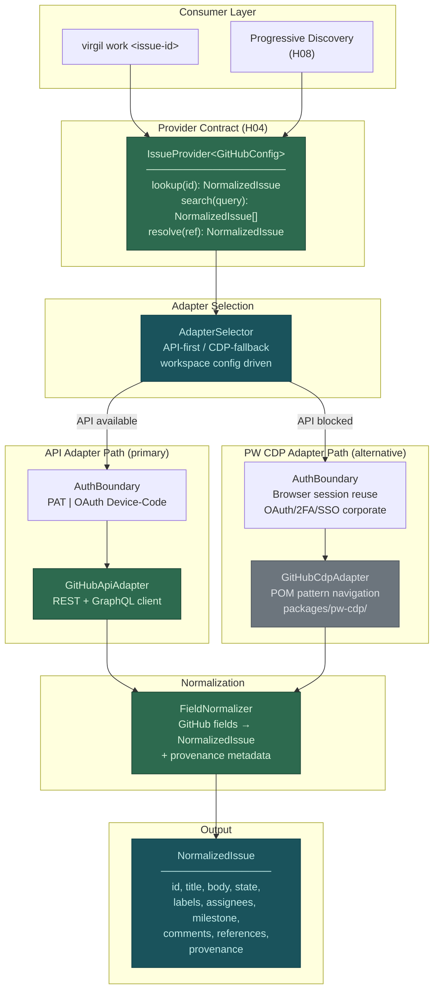
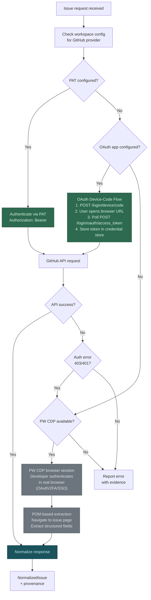

# H12 — First Remote Issue Provider

> **Project:** Virgil
> **Artifact type:** Child handoff
> **Parent:** [`VIRGIL_HANDOFF_SEED.md`](../VIRGIL_HANDOFF_SEED.md)
> **Status:** Ready for assignment
> **Normative agent behavior:** [`AGENTS.md`](../AGENTS.md)

## Menú

- [Progress Tracker](#progress-tracker)
- [Objective](#objective)
- [Dual Adapter Architecture](#dual-adapter-architecture)
- [Authentication Flow](#authentication-flow)
- [Scope](#scope)
- [Out of Scope](#out-of-scope)
- [Preconditions](#preconditions)
- [Deliverables](#deliverables)
- [Verification Requirements](#verification-requirements)
- [Evidence Requirements](#evidence-requirements)
- [Risks and Constraints](#risks-and-constraints)
- [References](#references)

---

## Progress Tracker

- [ ] Assignment accepted
- [ ] Preconditions verified
- [ ] IssueProvider contract reviewed (from H04)
- [ ] GitHub Issues API adapter implemented
- [ ] Authentication boundary established (token, OAuth device-code)
- [ ] PW CDP alternative adapter path established
- [ ] Issue lookup by identifier implemented
- [ ] Issue resolution (search/filter) implemented
- [ ] Field normalization to provider-neutral format implemented
- [ ] Provenance metadata preserved on normalized issues
- [ ] Progressive-discovery integration verified
- [ ] Adapter selection logic implemented (API-first, CDP fallback)
- [ ] Standard verification gates pass (see [SHARED_VERIFICATION.md](./SHARED_VERIFICATION.md))

[↑ Menú](#menú)

---

## Objective

Prove the IssueProvider architecture by implementing the first real remote issue adapter: **GitHub Issues**. GitHub Issues is selected as the primary candidate because it is the highest-value open-source issue tracker, has a well-documented REST and GraphQL API surface, supports multiple authentication mechanisms, and directly serves Virgil's own development workflow.

This handoff delivers two adapter paths for the same provider contract:

1. **API adapter** (primary) — direct GitHub REST/GraphQL API access using personal access tokens or OAuth device-code flow.
2. **PW CDP adapter** (alternative) — browser-based access via Playwright CDP from `packages/pw-cdp/` using the POM pattern, for enterprise environments where API authentication is blocked by corporate security policies (OAuth/2FA/SSO restrictions, IP allowlists, VPN-gated endpoints).

Both paths produce identical normalized issue output conforming to the provider-neutral `NormalizedIssue` format defined by the `IssueProvider` contract from H04.

[↑ Menú](#menú)

---

## Dual Adapter Architecture

The following diagram shows the adapter architecture where both the API path and the PW CDP path converge on the same normalized output.

**Legend:**

- Green nodes: primary API adapter path (implemented in `packages/cli/`).
- Grey nodes: alternative PW CDP adapter path (delegates to `packages/pw-cdp/`).
- Teal nodes: shared contract and selection logic.
- Both paths converge at the `FieldNormalizer` before producing a `NormalizedIssue`.

[↑ Menú](#menú)

---

## Authentication Flow

The following diagram details the authentication decision tree, showing how the adapter selection determines which authentication mechanism is used.

**Authentication mechanisms:**

| Mechanism | Adapter | Use case |
| --- | --- | --- |
| Personal Access Token (PAT) | API | Developer has a token with appropriate scopes (`repo`, `read:org`) |
| OAuth Device-Code Flow | API | Organization requires OAuth; no browser available in terminal context |
| Browser session reuse via CDP | PW CDP | Enterprise blocks API tokens; corporate SSO/2FA/OAuth required |

[↑ Menú](#menú)

---

## Scope

### Included

1. **GitHub Issues API adapter** — REST and/or GraphQL client implementing the `IssueProvider` contract from H04 within `packages/cli/`.
2. **Authentication boundary** — PAT-based authentication and OAuth device-code flow, with credential storage delegated to the workspace credential reference mechanism from H03.
3. **PW CDP alternative adapter** — browser-based GitHub Issues extraction using POM pattern from `packages/pw-cdp/`, activated when API authentication is blocked by enterprise security policies.
4. **Adapter selection logic** — configuration-driven selection with API-first preference and CDP fallback on authentication failure.
5. **Issue lookup by identifier** — resolve a single issue by its owner/repo/number or full URL (e.g. `owner/repo#123`, `https://github.com/owner/repo/issues/123`).
6. **Issue search and filtering** — query issues by state, labels, assignees, milestone, and text search within a configured repository scope.
7. **Field normalization** — map GitHub-specific fields (labels as objects, user objects, milestone objects, reactions, timeline events) to the provider-neutral `NormalizedIssue` format.
8. **Provenance preservation** — every `NormalizedIssue` carries provenance metadata: provider identity, source URL, content hash, discovery timestamp, API version used.
9. **Progressive-discovery integration** — issue references (mentioned issues, linked PRs, cross-repo references) are surfaced as discovery hints for H08, not eagerly resolved.
10. **Browser selection support** — PW CDP adapter must support browser selection (Chrome, Firefox, Edge, Safari) per workspace configuration.
11. **Rate-limit awareness** — respect GitHub API rate limits; surface remaining quota and reset time in adapter responses.
12. **Zod validation** — all configuration, API responses, and normalized output validated with Zod schemas.

### Seed Definition of Done Coverage

This handoff addresses seed item 30 (required child handoffs generated) for the H12 responsibility boundary.

[↑ Menú](#menú)

---

## Out of Scope

The following responsibilities belong to other handoffs and must **not** be addressed here:

| Exclusion | Owner |
| --- | --- |
| IssueProvider contract definition (port interface) | H04 |
| Workspace configuration and credential storage | H03 |
| Knowledge persistence of discovered issues | H06 |
| RAG indexing and embedding of issue content | H07 |
| Progressive-discovery orchestration logic | H08 |
| Jira, Monday, or other issue provider adapters | Future H12 variants |
| Product agent orchestration consuming issues | H10 |
| PW CDP package scaffolding and shared POM framework | H16 |
| Local folder indexers | H17 |
| CI/CD pipeline for adapter tests | H18 |
| Full GitHub API surface (PRs as work items, discussions, projects) | Future handoff |
| Issue mutation (creating, updating, closing issues) | Future handoff |
| Webhook-based real-time issue updates | Future handoff |

[↑ Menú](#menú)

---

## Preconditions

1. H01 (Repository Bootstrap) is complete — monorepo workspace with `packages/cli/` exists, build and verification gates are operational.
2. H04 (Provider Contracts) is complete — the `IssueProvider` port interface is defined with its `NormalizedIssue` output type.
3. H03 (Workspace & Configuration) is complete — workspace identity, provider registration, and credential reference mechanisms are available.
4. H16 (PW CDP package) has at minimum scaffolded `packages/pw-cdp/` with the shared POM framework and browser selection support, sufficient for this handoff to implement a GitHub-specific page object.
5. Node.js 24.16.0, pnpm 11.24.0 are available in the development environment.
6. A GitHub account with at least one repository containing issues is available for integration testing.

[↑ Menú](#menú)

---

## Deliverables

### D1 — GitHub Issues API Adapter

Implement the primary API-based adapter for GitHub Issues within `packages/cli/`.

**Acceptance criteria:**

- Implements the `IssueProvider` contract from H04.
- Supports authentication via PAT (personal access token) passed through workspace credential references.
- Supports authentication via OAuth device-code flow with interactive terminal prompt for user authorization.
- `lookup(id)` resolves a single issue by owner/repo/number or full GitHub URL.
- `search(query)` returns issues filtered by state, labels, assignees, milestone, and/or text search.
- All GitHub API responses are validated with Zod schemas before normalization.
- Rate-limit headers (`X-RateLimit-Remaining`, `X-RateLimit-Reset`) are parsed and surfaced in adapter metadata.
- HTTP client is injected as a dependency (not hard-coded `fetch`) to enable boundary mocking in tests.
- No dependency on external GitHub SDK libraries (e.g. Octokit) unless the implementer demonstrates a material advantage — prefer a thin HTTP client wrapper to preserve adapter simplicity.

### D2 — Field Normalizer

Implement the mapping from GitHub-specific issue fields to the provider-neutral `NormalizedIssue` format.

**Acceptance criteria:**

- Maps GitHub fields: `number`, `title`, `body`, `state`, `state_reason`, `labels` (array of objects to string array), `assignees` (user objects to identifiers), `milestone` (object to name/id), `created_at`, `updated_at`, `closed_at`, `user` (author), `comments_url`, `html_url`.
- Extracts issue references from body text (e.g. `#123`, `owner/repo#456`, full URLs) and surfaces them as `discoveryHints` — structured references for H08 progressive discovery, not eagerly resolved content.
- Extracts linked pull request references when available via timeline or events.
- Attaches provenance metadata to every `NormalizedIssue`: `provider: "github"`, `sourceUrl`, `contentHash` (SHA-256 of body + title + state), `discoveredAt` (ISO timestamp), `apiVersion`.
- Normalization is a pure function with no side effects — it receives raw GitHub data and returns a `NormalizedIssue`.
- Zod schema validates the normalized output.

### D3 — PW CDP Alternative Adapter

Implement a browser-based GitHub Issues adapter using the PW CDP framework from `packages/pw-cdp/`.

**Acceptance criteria:**

- Implements the same `IssueProvider` contract as D1 — both adapters are interchangeable behind the port.
- Uses the POM (Page Object Model) pattern with structured navigation steps: navigate to issue URL, wait for content load, extract fields from DOM structure.
- Supports browser selection (Chrome, Firefox, Edge, Safari) configured at the workspace level.
- Developer authenticates in a real browser session; the CDP adapter reuses that authenticated session to access GitHub.
- `lookup(id)` navigates to the issue page and extracts structured fields from the rendered DOM.
- `search(query)` navigates to the issues list with query parameters and extracts the result set.
- Extracted fields pass through the same `FieldNormalizer` (D2) to produce identical `NormalizedIssue` output.
- Page objects are defined in `packages/pw-cdp/` following the shared POM framework conventions.
- Adapter handles GitHub's dynamic page rendering (JavaScript-loaded content, lazy-loaded comments).

### D4 — Adapter Selection Logic

Implement the configuration-driven adapter selection with API-first preference.

**Acceptance criteria:**

- Workspace provider configuration determines the default adapter: `api` (default) or `cdp`.
- When set to `api`, the API adapter is used. If authentication fails (401/403), the selector checks whether a CDP adapter is configured and available before falling back.
- When set to `cdp`, the CDP adapter is used directly (for environments where API access is permanently blocked).
- Fallback from API to CDP is logged with a clear reason for auditability.
- Selection logic is a separate concern from the adapters themselves — it composes them, not extends them.
- Configuration schema is validated with Zod.

### D5 — Progressive-Discovery Integration

Ensure that resolved issues surface discovery hints for downstream consumption by H08.

**Acceptance criteria:**

- Every `NormalizedIssue` includes a `discoveryHints` array containing structured references extracted from the issue body, comments URL, linked PRs, and cross-references.
- Each hint carries: `type` (issue, pull_request, url, mention), `ref` (the raw reference string), `provider` (github), `resolved` (boolean, initially `false`).
- Hints are data — they do not trigger any resolution or fetching. H08 owns the decision to follow a hint.
- Hints are deduplicated within a single issue.
- The hint format is validated with a Zod schema.

[↑ Menú](#menú)

---

## Verification Requirements

Standard static, dynamic, and build verification gates apply — see [SHARED_VERIFICATION.md](./SHARED_VERIFICATION.md).

### Adapter Tests

- **API adapter:** tests mock the HTTP client at the boundary. Tests verify correct request construction (URL, headers, query parameters), response parsing, Zod validation of raw responses, normalization output, rate-limit extraction, and error handling (401, 403, 404, 422, 5xx).
- **Field normalizer:** tests use fixture data representing real GitHub API responses. Tests verify field mapping, reference extraction, provenance attachment, and Zod validation of output.
- **CDP adapter:** tests mock the PW CDP page object methods at the boundary. Tests verify navigation calls, DOM extraction, normalization through the shared normalizer, and browser selection configuration.
- **Adapter selector:** tests verify selection logic for all configuration states (api-only, cdp-only, api-with-fallback) and fallback trigger conditions.
- **Progressive-discovery hints:** tests verify extraction of all reference types from fixture issue bodies and deduplication.

[↑ Menú](#menú)

---

## Evidence Requirements

Standard evidence items apply — see [SHARED_VERIFICATION.md](./SHARED_VERIFICATION.md).

Handoff-specific evidence:

1. Test output showing the API adapter correctly constructs GitHub API requests and normalizes responses from fixture data.
2. Test output showing the CDP adapter extracts and normalizes the same fields from mocked page objects.
3. Test output showing adapter selection logic correctly routes between API and CDP paths.
4. Test output showing field normalization produces identical `NormalizedIssue` output from both adapter paths given equivalent source data.
5. Test output showing progressive-discovery hints are correctly extracted and deduplicated.
6. Test output showing authentication boundary handles PAT, device-code, and CDP session modes.
7. Test output showing error handling for API rate limits, authentication failures, and missing issues.
8. Zod schema definitions for: GitHub API response, workspace provider configuration, `NormalizedIssue`, and discovery hints.

[↑ Menú](#menú)

---

## Risks and Constraints

| Risk | Mitigation |
| --- | --- |
| GitHub API rate limits (60/hour unauthenticated, 5000/hour authenticated) may constrain integration testing | Use fixture-based unit tests for normalization; reserve authenticated calls for explicit integration test suite behind an environment flag |
| GitHub API v3 (REST) and v4 (GraphQL) have different field shapes | Choose one primary API version (REST v3 recommended for simplicity); document GraphQL as a future optimization path |
| OAuth device-code flow requires a registered GitHub OAuth App | Document the OAuth App setup as a prerequisite; provide a configuration example; do not require it for PAT-only workflows |
| PW CDP adapter depends on H16 (`packages/pw-cdp/`) being sufficiently scaffolded | Declare H16 as a precondition; if H16 is incomplete, the CDP adapter path may be delivered as a stub with interface compliance and test coverage against mocked page objects |
| GitHub DOM structure may change without notice, breaking CDP extraction | Page objects must use resilient selectors (data attributes, ARIA roles, semantic HTML) over brittle CSS class selectors; document known selector fragility |
| Enterprise GitHub instances (GHES) may have different API endpoints and authentication flows | Design the API adapter to accept a configurable base URL; do not hard-code `api.github.com` |
| Credential storage security — tokens must not leak into logs, handoffs, or test output | Credential values are opaque references resolved at runtime from the workspace credential store (H03); test fixtures use placeholder tokens; no real credentials in test code |
| CDP browser selection may not support all browsers on all platforms | Document supported browser/platform matrix; Safari via WebKit has limited CDP support — document the limitation rather than silently failing |

[↑ Menú](#menú)

---

## References

- [`AGENTS.md`](../AGENTS.md) — normative agent behavior contract
- [`VIRGIL_HANDOFF_SEED.md`](../VIRGIL_HANDOFF_SEED.md) — architectural seed and parent handoff (H12 section)
- [H04 — Provider Contracts](./H04_PROVIDER_CONTRACTS.md) — IssueProvider port interface definition
- [H03 — Workspace & Configuration](./H03_WORKSPACE_CONFIGURATION.md) — credential references and provider registration
- [H16 — PW CDP Adapters](./H16_PW_CDP_ADAPTERS.md) — shared POM framework in `packages/pw-cdp/`
- [H08 — Progressive Discovery](./H08_PROGRESSIVE_DISCOVERY.md) — consumer of discovery hints
- [GitHub REST API Documentation](https://docs.github.com/en/rest) — primary API reference
- [GitHub OAuth Device Flow](https://docs.github.com/en/apps/oauth-apps/building-oauth-apps/authorizing-oauth-apps#device-flow) — device-code authentication
- Branch `poc/ref` (local) — POC-00 reference implementation (validated versions in [SHARED_VERIFICATION.md](./SHARED_VERIFICATION.md))

[↑ Menú](#menú)
