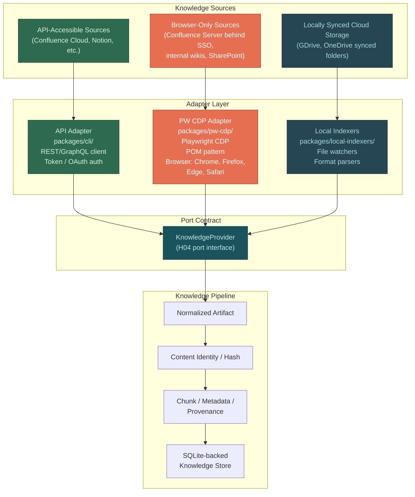
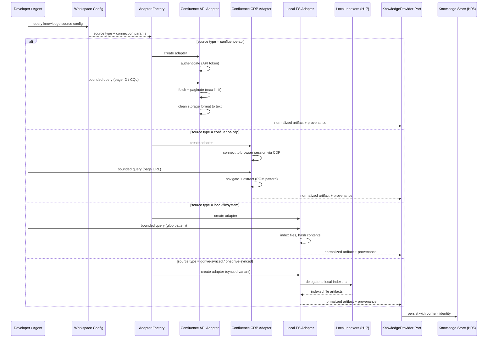

# H13 — First Remote Knowledge Provider

> **Project:** Virgil
> **Artifact type:** Child handoff
> **Parent:** [`VIRGIL_HANDOFF_SEED.md`](../VIRGIL_HANDOFF_SEED.md)
> **Status:** Ready for assignment
> **Normative agent behavior:** [`AGENTS.md`](../AGENTS.md)

## Menú

- [Progress Tracker](#progress-tracker)
- [Objective](#objective)
- [Knowledge Source Taxonomy](#knowledge-source-taxonomy)
- [Scope](#scope)
- [Out of Scope](#out-of-scope)
- [Preconditions](#preconditions)
- [Deliverables](#deliverables)
- [Verification Requirements](#verification-requirements)
- [Evidence Requirements](#evidence-requirements)
- [Risks and Constraints](#risks-and-constraints)
- [References](#references)

---

## Progress Tracker

- [ ] Assignment accepted
- [ ] Preconditions verified
- [ ] Knowledge source taxonomy documented and validated
- [ ] Confluence selected as primary remote knowledge provider candidate
- [ ] Confluence API adapter implemented behind KnowledgeProvider port
- [ ] PW CDP adapter implemented for browser-only Confluence/wiki access
- [ ] Local filesystem KnowledgeProvider adapter implemented
- [ ] Local synced folder adapter delegates to `packages/local-indexers/`
- [ ] Progressive discovery enforced — no bulk ingestion
- [ ] Content identity and provenance metadata preserved
- [ ] Authentication boundary validated (API token + PW CDP paths)
- [ ] Adapter selection logic routes sources to correct path
- [ ] Unit tests cover all three adapter paths
- [ ] Integration test proves Confluence API adapter against mock server
- [ ] Integration test proves PW CDP adapter against mock browser target
- [ ] Standard verification gates pass (see [SHARED_VERIFICATION.md](./SHARED_VERIFICATION.md))

[↑ Menú](#menú)

---

## Objective

Prove the KnowledgeProvider architecture by implementing the first remote knowledge provider — Confluence — while establishing the taxonomy that governs how all knowledge sources route through the system. After this handoff is complete, Virgil will have:

- a working Confluence adapter behind the KnowledgeProvider port,
- two access paths for Confluence (API adapter for token-authenticated instances, PW CDP adapter for browser-only enterprise-auth instances),
- a local filesystem adapter as a first-class KnowledgeProvider,
- delegation to `packages/local-indexers/` for synced cloud storage folders (GDrive/OneDrive),
- progressive discovery without bulk ingestion,
- and a documented taxonomy that future knowledge providers follow.

This handoff validates the provider architecture end-to-end with one real remote source. It does not implement every possible knowledge provider.

[↑ Menú](#menú)

---

## Knowledge Source Taxonomy

Virgil classifies knowledge sources into three access paths based on how content is reachable. Each path uses a different adapter strategy while all converge on the same KnowledgeProvider port contract.

**Path descriptions:**

| Path | Adapter | Package | Auth mechanism | Examples |
| --- | --- | --- | --- | --- |
| API-accessible | API adapter (REST/GraphQL) | `packages/cli/` | API token, OAuth, device-code flow | Confluence Cloud, Notion API, public wikis |
| Browser-only | PW CDP adapter (Playwright CDP, POM pattern) | `packages/pw-cdp/` | Developer authenticates in real browser; CDP reuses session. Supports Chrome, Firefox, Edge, Safari | Confluence Server behind SSO/2FA, internal wikis, SharePoint |
| Locally synced | Local indexers | `packages/local-indexers/` | Local filesystem access (no remote auth) | GDrive synced folder, OneDrive synced folder |

All three paths produce normalized artifacts conforming to the same KnowledgeProvider port contract defined in H04. The adapter selection is determined by the workspace configuration for each knowledge source.

[↑ Menú](#menú)

---

## Scope

### Included

1. **Confluence API adapter** — a KnowledgeProvider adapter that queries Confluence Cloud via REST API (v2 preferred, v1 fallback). Supports API token authentication. Implements progressive discovery: given a page ID, space key, or search query, retrieves only the targeted content and its immediate references — never an entire space.
2. **Confluence PW CDP adapter** — a KnowledgeProvider adapter that extracts content from Confluence instances accessible only through a browser (enterprise SSO/2FA/OAuth). Uses the PW CDP package (`packages/pw-cdp/`) with POM (Page Object Model) pattern for structured navigation and extraction. Developer authenticates in a real browser; CDP reuses the authenticated session. Must support browser selection: Chrome, Firefox, Edge, Safari.
3. **Local filesystem adapter** — a KnowledgeProvider adapter for plain local directory paths. Indexes configured directories, respects `.gitignore`-style exclusion patterns, and produces normalized artifacts from supported file formats (Markdown, text, HTML, PDF).
4. **Local synced folder delegation** — when a knowledge source is configured as a GDrive or OneDrive synced folder, the adapter delegates file discovery and parsing to `packages/local-indexers/` (delivered by H17). H13 defines the integration contract and a stub/interface that H17 fulfills.
5. **Adapter selection logic** — workspace configuration determines which adapter path a knowledge source uses. The selection is explicit (configured per source), not auto-detected.
6. **Content identity and provenance** — every artifact produced by a knowledge adapter carries: source provider identity, source URI/path, content hash, discovery timestamp, and refresh metadata. This metadata feeds into the persistence layer (H06).
7. **Progressive discovery enforcement** — adapters must not perform bulk ingestion. Each adapter method accepts a bounded query (page ID, search term, directory glob) and returns only matching results.
8. **Normalized artifact output** — all adapters produce artifacts conforming to the normalized artifact schema defined by the KnowledgeProvider port (H04), regardless of source format.

### Seed Definition of Done Coverage

This handoff addresses seed item 30 (required child handoffs generated) for the H13 responsibility boundary.

[↑ Menú](#menú)

---

## Out of Scope

The following responsibilities belong to other handoffs and must **not** be addressed here:

| Exclusion | Owner |
| --- | --- |
| Repository bootstrap and monorepo structure | H01 |
| Node SEA packaging and runtime isolation | H02 |
| Workspace identity and configuration management | H03 |
| KnowledgeProvider port contract definition | H04 |
| Local repository provider (RepoProvider) | H05 |
| SQLite persistence, Drizzle schema, content storage | H06 |
| RAG, embeddings, vector store, retrieval | H07 |
| Issue-driven progressive discovery orchestration | H08 |
| Handoff protocol format | H09 |
| Product agent orchestration runtime | H10 |
| Model-tier routing runtime | H11 |
| Remote issue provider (Jira, GitHub Issues) | H12 |
| Chat provider (Slack, Teams) | H14 |
| Knowledge lifecycle and storage pressure | H15 |
| Playwright CDP package implementation (`packages/pw-cdp/`) | H16 |
| Local folder indexers package implementation (`packages/local-indexers/`) | H17 |
| CI/CD pipeline configuration | H18 |
| Bulk ingestion of entire Confluence spaces | Anti-goal |
| Crawling all pages in a wiki | Anti-goal |
| Full-text search index construction | H07 |
| Embedding generation for knowledge artifacts | H07 |

[↑ Menú](#menú)

---

## Preconditions

1. H01 is complete — monorepo workspace with `packages/cli/` is buildable and testable.
2. H04 is complete — the KnowledgeProvider port contract is defined and stable.
3. H06 is complete or its normalized artifact schema is available — content identity, provenance, and metadata structures are defined.
4. H16 has delivered `packages/pw-cdp/` — the Playwright CDP browser automation package is available with POM support and browser selection (Chrome, Firefox, Edge, Safari).
5. H17 has delivered `packages/local-indexers/` — or at minimum, the integration interface/contract is defined so H13 can code against it.
6. Node.js 24.16.0 and pnpm 11.24.0 are available in the development environment.
7. A Confluence Cloud instance (or sandbox) is available for manual integration validation.
8. The POC reference branch `poc/ref` is available locally for consultation on stack patterns.

[↑ Menú](#menú)

---

## Deliverables

### D1 — Confluence API Adapter

Implement a KnowledgeProvider adapter that queries Confluence Cloud via REST API.

**Acceptance criteria:**

- Implements the KnowledgeProvider port interface from H04.
- Authenticates via API token (email + token pair) read from workspace credential references (H03).
- Supports bounded queries: retrieve a page by ID, search pages within a space by CQL query, retrieve a page's child pages (one level).
- Returns normalized artifacts with full provenance metadata (source URI, content hash, discovery timestamp, space key, page ID).
- Does not retrieve entire spaces or perform unbounded crawling.
- Handles Confluence API pagination internally but respects a configurable maximum result count per query.
- Handles API rate limiting with exponential backoff.
- Returns structured errors (authentication failure, page not found, permission denied, rate limited) rather than raw HTTP errors.
- Extracts page content as cleaned text/Markdown (strips Confluence storage format markup).
- Registered via NestJS dependency injection within `packages/cli/`.

### D2 — Confluence PW CDP Adapter

Implement a KnowledgeProvider adapter that extracts content from browser-only Confluence instances using Playwright CDP.

**Acceptance criteria:**

- Implements the KnowledgeProvider port interface from H04.
- Delegates browser automation to `packages/pw-cdp/` using the POM (Page Object Model) pattern.
- Developer authenticates manually in a real browser; the adapter connects via CDP to the authenticated session.
- Supports browser selection: Chrome, Firefox, Edge, Safari (per `packages/pw-cdp/` capability).
- Supports bounded queries: navigate to a specific page URL, extract content from the rendered page, follow explicitly requested links (one level).
- Returns normalized artifacts with provenance metadata (source URL, content hash, extraction timestamp).
- Does not spider or crawl the wiki. Extracts only explicitly requested pages.
- Handles common Confluence page structures: page title, body content, labels, breadcrumb path.
- Page Object Model classes are defined for Confluence page structures (page view, space directory, search results).
- Registered via NestJS dependency injection within `packages/cli/`.

### D3 — Local Filesystem Adapter

Implement a KnowledgeProvider adapter for plain local directory paths.

**Acceptance criteria:**

- Implements the KnowledgeProvider port interface from H04.
- Accepts a configured local directory path and optional glob/exclusion patterns.
- Indexes files matching supported formats: `.md`, `.txt`, `.html`, `.pdf`.
- Respects `.gitignore`-style exclusion patterns if an exclusion file is configured.
- Produces normalized artifacts with provenance metadata (absolute file path, content hash via SHA-256, file modification timestamp, file size).
- Detects unchanged files via content hash comparison — previously processed files with matching hashes are cache hits, not re-ingested.
- Does not traverse symlinks outside the configured directory boundary.
- Registered via NestJS dependency injection within `packages/cli/`.

### D4 — Local Synced Folder Integration Contract

Define the integration interface between H13 knowledge adapters and `packages/local-indexers/` (H17).

**Acceptance criteria:**

- A TypeScript interface defines the contract between the KnowledgeProvider adapter in `packages/cli/` and the indexer implementation in `packages/local-indexers/`.
- The interface covers: file discovery (list files matching criteria), file content extraction (read and parse file content), change detection (detect new/modified/deleted files since last index).
- The KnowledgeProvider adapter in `packages/cli/` delegates to this interface when the knowledge source is configured as a GDrive or OneDrive synced folder.
- A stub/mock implementation of the interface exists for testing until H17 delivers the real implementation.
- The integration contract is documented with JSDoc comments explaining each method's responsibility.

### D5 — Adapter Selection and Registration

Implement the configuration-driven adapter selection logic.

**Acceptance criteria:**

- Workspace configuration (from H03) specifies for each knowledge source: the source type (`confluence-api`, `confluence-cdp`, `local-filesystem`, `gdrive-synced`, `onedrive-synced`), connection parameters, and credential references.
- A factory or registry resolves the correct adapter based on the configured source type.
- The factory is a NestJS provider registered in the knowledge module.
- Adding a new adapter type requires only: implementing the KnowledgeProvider interface and registering it in the factory — no modification to existing adapters.
- Zod schemas validate the configuration for each source type.
- Invalid or unsupported source types produce a clear error message naming the unsupported type and listing available types.

### D6 — Knowledge Adapter Flow Diagram

Document the runtime flow from workspace configuration through adapter selection to normalized artifact output.

**Acceptance criteria:**

- A Mermaid sequence diagram shows the runtime flow: workspace config lookup, adapter selection, authentication, bounded query execution, content extraction, normalization, provenance attachment, and output.
- The diagram is included in developer documentation within `packages/cli/` or in this handoff's completion report.
- The diagram covers all three adapter paths (API, CDP, local).

[↑ Menú](#menú)

---

## Verification Requirements

Standard static, dynamic, and build verification gates apply — see [SHARED_VERIFICATION.md](./SHARED_VERIFICATION.md).

### Adapter-Specific Tests

- **Confluence API adapter:** unit tests with mocked HTTP responses covering success, pagination, authentication failure, rate limiting, page not found, and permission denied scenarios. At least one integration-style test against a mock HTTP server proving the full request/response cycle.
- **Confluence PW CDP adapter:** unit tests with mocked CDP session covering page navigation, content extraction, and authentication session reuse. POM classes tested with fixture HTML.
- **Local filesystem adapter:** unit tests with a fixture directory containing sample `.md`, `.txt`, `.html` files. Tests verify file discovery, content hashing, cache-hit detection for unchanged files, exclusion pattern enforcement, and symlink boundary enforcement.
- **Synced folder delegation:** unit tests proving the adapter delegates to the `packages/local-indexers/` interface and correctly wraps returned artifacts with KnowledgeProvider provenance.
- **Adapter factory:** unit tests proving correct adapter resolution for each configured source type and clear error for unsupported types.

[↑ Menú](#menú)

---

## Evidence Requirements

Standard evidence items apply — see [SHARED_VERIFICATION.md](./SHARED_VERIFICATION.md).

Handoff-specific evidence:

1. Test output proving the Confluence API adapter handles: successful page retrieval, pagination, authentication failure, rate limiting, and bounded query enforcement.
2. Test output proving the Confluence PW CDP adapter handles: CDP session connection, POM-based page extraction, and browser selection configuration.
3. Test output proving the local filesystem adapter handles: file discovery, content hashing, cache hits, exclusion patterns, and symlink boundaries.
4. Test output proving the adapter factory resolves the correct adapter for each source type and rejects unsupported types.
5. Test output proving the synced folder adapter delegates to the `packages/local-indexers/` interface.
6. Proof that all adapters produce normalized artifacts conforming to the KnowledgeProvider port interface.
7. Proof that no adapter performs unbounded crawling or bulk ingestion (query bounds are enforced).

[↑ Menú](#menú)

---

## Risks and Constraints

| Risk | Mitigation |
| --- | --- |
| Confluence REST API v2 may have limited feature coverage compared to v1 | Attempt v2 first; fall back to v1 endpoints where v2 lacks required capabilities. Document which endpoints use which version |
| Confluence storage format (XHTML) is complex to parse cleanly | Use a lightweight HTML-to-text/Markdown converter; accept minor formatting loss in exchange for reliable extraction. Do not build a full Confluence storage format parser |
| Enterprise Confluence instances may require SAML/SSO that API tokens cannot bypass | The PW CDP adapter path exists precisely for this scenario. Document when to use CDP vs API in adapter selection guidance |
| PW CDP session may expire or be invalidated during extraction | Detect session expiry (redirect to login page) and surface a clear re-authentication prompt. Do not silently retry with stale credentials |
| `packages/pw-cdp/` (H16) may not be available when H13 begins | Define the integration interface early. Code against the interface with a mock. Coordinate with H16 on delivery timeline |
| `packages/local-indexers/` (H17) may not be available when H13 begins | Define the integration contract (D4) as a TypeScript interface. Use a stub implementation for testing until H17 delivers |
| Confluence page content may contain macros, embedded media, or dynamic content that CDP cannot extract | Extract static rendered text only. Document unsupported content types rather than attempting to handle every macro |
| Local filesystem adapter may encounter very large files | Enforce a configurable maximum file size. Skip files exceeding the limit with a warning log entry |
| Browser selection (Chrome, Firefox, Edge, Safari) may have different CDP capabilities | Rely on `packages/pw-cdp/` to abstract browser differences. Report any browser-specific limitations discovered during testing |
| Progressive discovery boundary may be ambiguous for wiki-style content with many cross-references | Define "one level" of reference following. The adapter retrieves the requested page and lists (but does not fetch) linked pages. Deeper traversal requires explicit subsequent queries |

[↑ Menú](#menú)

---

## References

- [`AGENTS.md`](../AGENTS.md) — normative agent behavior contract
- [`VIRGIL_HANDOFF_SEED.md`](../VIRGIL_HANDOFF_SEED.md) — architectural seed and parent handoff (H13 section, Provider Families, Provider Authentication)
- [`H01_REPOSITORY_BOOTSTRAP.md`](./H01_REPOSITORY_BOOTSTRAP.md) — monorepo structure and workspace conventions
- [H04 — Provider Contracts](./H04_PROVIDER_CONTRACTS.md) (KnowledgeProvider port definition) — prerequisite
- [H06 — Knowledge Persistence & Provenance](./H06_KNOWLEDGE_PERSISTENCE.md) (normalized artifact schema, content identity) — prerequisite
- [H16 — Playwright CDP Browser Automation](./H16_PW_CDP_ADAPTERS.md) (`packages/pw-cdp/`, POM pattern, browser selection) — prerequisite
- [H17 — Local Folder Indexers](./H17_LOCAL_INDEXERS.md) (`packages/local-indexers/`, GDrive/OneDrive) — prerequisite
- Branch `poc/ref` (local) — POC-00 reference implementation
- [Confluence Cloud REST API v2](https://developer.atlassian.com/cloud/confluence/rest/v2/) — primary API reference
- [Confluence Cloud REST API v1](https://developer.atlassian.com/cloud/confluence/rest/v1/) — fallback API reference
- [Playwright CDP Documentation](https://playwright.dev/docs/api/class-browsertype#browser-type-connect-over-cdp) — CDP connection reference

[↑ Menú](#menú)
