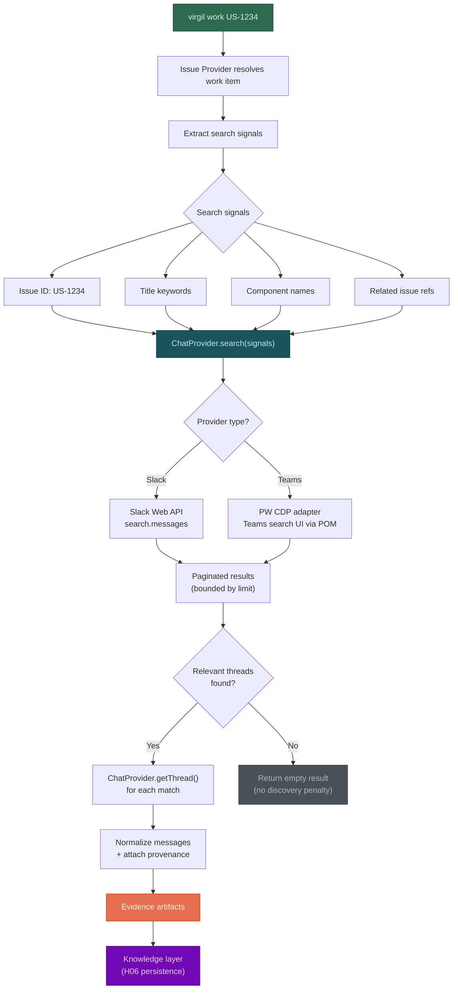
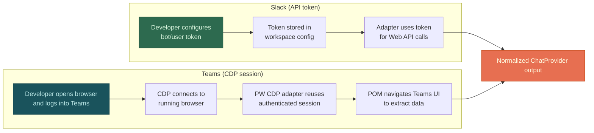

# H14 — First Chat Provider

> **Project:** Virgil
> **Artifact type:** Child handoff
> **Parent:** [`VIRGIL_HANDOFF_SEED.md`](../VIRGIL_HANDOFF_SEED.md)
> **Status:** Ready for assignment
> **Normative agent behavior:** [`AGENTS.md`](../AGENTS.md)

## Menú

- [Progress Tracker](#progress-tracker)
- [Objective](#objective)
- [Scope](#scope)
- [Out of Scope](#out-of-scope)
- [Preconditions](#preconditions)
- [Deliverables](#deliverables)
- [Targeted Chat Discovery Flow](#targeted-chat-discovery-flow)
- [Provider Authentication Strategy](#provider-authentication-strategy)
- [Verification Requirements](#verification-requirements)
- [Evidence Requirements](#evidence-requirements)
- [Risks and Constraints](#risks-and-constraints)
- [References](#references)

---

## Progress Tracker

- [ ] Assignment accepted
- [ ] Preconditions verified
- [ ] ChatProvider port contract reviewed (from H04)
- [ ] Slack adapter implemented with targeted discovery
- [ ] Microsoft Teams adapter implemented via PW CDP
- [ ] Targeted message retrieval proven (not bulk ingestion)
- [ ] Issue-reference-driven channel discovery verified
- [ ] Evidence extraction with provenance metadata implemented
- [ ] Rate limiting and pagination boundaries respected
- [ ] Authentication flows validated (API token for Slack, CDP session for Teams)
- [ ] Unit tests cover adapter public behaviour (> 97% coverage)
- [ ] Integration boundary tests mock external APIs at the HTTP/CDP boundary
- [ ] Standard verification gates pass (see [SHARED_VERIFICATION.md](./SHARED_VERIFICATION.md))

[↑ Menú](#menú)

---

## Objective

Prove that organizational chat can serve as a **targeted discovery source** for Virgil without requiring bulk archival ingestion of entire channel histories.

Chat discovery is issue-driven. When Virgil processes a work item (e.g. `virgil work US-1234`), the chat provider searches for relevant conversations by following references found in the issue, related code, or existing knowledge. It retrieves only the messages and threads that contain actionable evidence, extracts that evidence with full provenance, and stores it in the shared knowledge layer.

This handoff validates the ChatProvider architecture with two adapters:

1. **Slack** (primary candidate) -- API-token-based access, well-documented search API, widely adopted in development teams.
2. **Microsoft Teams** (enterprise candidate) -- browser-session-based access via Playwright CDP from `packages/pw-cdp/`, representative of enterprise chat systems behind SSO/OAuth/2FA.

After this handoff is complete, Virgil can discover relevant chat context for a given work item without crawling entire workspaces or tenant histories.

[↑ Menú](#menú)

---

## Scope

### Included

1. **Slack ChatProvider adapter** -- implements the ChatProvider port using the Slack Web API with bot/user token authentication.
2. **Microsoft Teams ChatProvider adapter** -- implements the ChatProvider port using Playwright CDP browser automation from `packages/pw-cdp/` for enterprise environments behind SSO.
3. **Targeted channel discovery** -- given an issue reference or search terms derived from a work item, locate channels and threads where relevant discussion occurred.
4. **Targeted message retrieval** -- fetch only messages and threads matching the discovery criteria, with configurable result limits.
5. **Evidence extraction with provenance** -- each retrieved message carries provenance metadata: provider identity, channel/team, thread identity, author, timestamp, permalink/URI, and content hash.
6. **Normalization to ChatProvider port** -- both adapters produce the same normalized output shape defined by the ChatProvider contract from H04.
7. **Rate limiting and pagination** -- respect provider API rate limits; paginate results within bounded retrieval windows.
8. **POM-based CDP navigation for Teams** -- structured Page Object Model steps for Teams search, channel navigation, and message extraction via the `packages/pw-cdp/` adapter layer.
9. **Browser selection support for Teams CDP** -- Chrome, Firefox, Edge, and Safari must be selectable for the CDP-based Teams adapter.
10. **Unit and boundary tests** -- adapters tested with mocked HTTP/CDP boundaries; no live provider dependency in CI.

### Seed Definition of Done Coverage

This handoff does not directly address seed DoD items (the seed is concerned with repository bootstrap). It validates the ChatProvider port architecture established by H04 with real adapter implementations.

[↑ Menú](#menú)

---

## Out of Scope

| Exclusion | Owner |
| --- | --- |
| ChatProvider port contract definition | H04 |
| Bulk channel history ingestion or archival | Anti-goal (never) |
| Full-text indexing of entire chat workspaces | Anti-goal (never) |
| Knowledge persistence and provenance storage schema | H06 |
| RAG indexing of retrieved chat evidence | H07 |
| Issue-driven progressive discovery orchestration | H08 |
| Product agent orchestration runtime | H10 |
| Playwright CDP package scaffolding (`packages/pw-cdp/`) | H16 |
| Local folder indexers (`packages/local-indexers/`) | H17 |
| CI/CD pipeline configuration | H18 |
| Slack bot installation/management UI | Out of product scope |
| Microsoft Teams app registration automation | Out of product scope |
| Real-time chat monitoring or webhook listeners | Future consideration |
| Chat provider beyond Slack and Teams | Future handoff |

[↑ Menú](#menú)

---

## Preconditions

1. H01 (Repository Bootstrap) is complete -- monorepo workspace, build, and verification gates are operational.
2. H04 (Provider Contracts) is complete -- the `ChatProvider` port interface is defined, stable, and importable from `packages/cli/`.
3. H06 (Knowledge Persistence) is complete or in progress -- provenance metadata shape is defined so chat evidence can be stored.
4. H16 (Playwright CDP package) is complete -- `packages/pw-cdp/` provides the CDP adapter layer with POM pattern support and browser selection.
5. A Slack workspace with bot/user token is available for manual validation (not required for automated tests).
6. A Microsoft Teams tenant accessible via browser is available for manual CDP validation (not required for automated tests).

[↑ Menú](#menú)

---

## Deliverables

### D1 -- Slack ChatProvider Adapter

Implement a Slack adapter that satisfies the ChatProvider port contract using the Slack Web API.

**Acceptance criteria:**

- Adapter implements the ChatProvider port interface from H04.
- Authentication uses a configured bot token or user token (no hardcoded credentials).
- `search(query)` calls Slack's `search.messages` API with the provided terms, returning normalized results.
- `getThread(channelId, threadTs)` retrieves a complete thread with all replies.
- Results are normalized to the ChatProvider output shape with full provenance metadata.
- Rate limiting respects Slack API tier limits with exponential backoff.
- Pagination retrieves up to a configurable maximum result count, not unbounded.
- No bulk channel listing or history crawling is performed.

### D2 -- Microsoft Teams ChatProvider Adapter (CDP)

Implement a Teams adapter that satisfies the ChatProvider port contract using Playwright CDP browser automation from `packages/pw-cdp/`.

**Acceptance criteria:**

- Adapter implements the ChatProvider port interface from H04.
- Authentication reuses an existing browser session established by the developer (CDP attaches to a running browser; it does not manage credentials directly).
- POM (Page Object Model) classes encapsulate Teams navigation: search bar interaction, channel navigation, message list extraction, thread expansion.
- `search(query)` navigates the Teams search UI, extracts matching messages, and returns normalized results.
- `getThread(channelId, messageId)` navigates to a specific thread and extracts the full conversation.
- Results are normalized to the same ChatProvider output shape as the Slack adapter.
- Browser selection (Chrome, Firefox, Edge, Safari) is configurable via workspace settings.
- CDP connection reuses an existing browser session; it does not launch or manage the browser lifecycle.

### D3 -- Targeted Discovery Integration

Prove that chat discovery is issue-driven and bounded, not archival.

**Acceptance criteria:**

- Given an issue reference (e.g. `US-1234`, `PROJ-567`), the adapter searches for messages mentioning that reference.
- Given search terms derived from issue context (title keywords, component names), the adapter searches for relevant discussions.
- Retrieved messages include provenance sufficient to answer: who said what, when, where, and how to find the original.
- Discovery stops after retrieving bounded results (configurable limit, default sensible for a single work item).
- No channel enumeration, workspace scan, or unbounded history traversal occurs during targeted discovery.

### D4 -- Provenance Metadata Shape

Define and validate the provenance metadata attached to every retrieved chat message.

**Acceptance criteria:**

- Every normalized message includes at minimum: `providerId`, `channelId`, `channelName`, `threadId`, `messageId`, `authorId`, `authorName`, `timestamp`, `permalink`, `contentHash`, `retrievedAt`.
- Provenance is validated with Zod at the adapter boundary.
- The shape is compatible with the knowledge persistence schema from H06.

[↑ Menú](#menú)

---

## Targeted Chat Discovery Flow

The following diagram illustrates how chat discovery is triggered by an issue reference and produces bounded, provenance-bearing evidence -- explicitly not bulk ingestion.

**Key design constraints visible in the flow:**

- Discovery begins from an issue reference, never from a workspace scan.
- Search signals are derived from the work item, not generated by enumerating channels.
- Results are bounded by a configurable limit at every pagination step.
- An empty result is a valid outcome -- the absence of chat evidence is not a failure.
- Provenance metadata is attached at normalization time, before storage.

[↑ Menú](#menú)

---

## Provider Authentication Strategy

Chat providers require authentication, but the mechanisms differ significantly between API-based and enterprise-SSO-based systems.

| Aspect | Slack | Microsoft Teams |
| --- | --- | --- |
| Auth mechanism | Bot or user OAuth token | Browser session via CDP |
| Credential management | Token in workspace config (encrypted at rest by H03) | No credentials stored; developer authenticates in browser |
| SSO/2FA compatibility | Handled by Slack's OAuth flow | Fully compatible -- browser handles enterprise SSO/2FA/MFA |
| Session lifetime | Token valid until revoked | Browser session valid until expired or cleared |
| Adapter package | `packages/cli/` (direct HTTP calls) | `packages/pw-cdp/` (CDP + POM) |
| Browser dependency | None | Chrome, Firefox, Edge, or Safari (selectable) |

[↑ Menú](#menú)

---

## Verification Requirements

Standard static, dynamic, and build verification gates apply — see [SHARED_VERIFICATION.md](./SHARED_VERIFICATION.md).

### Adapter-Specific

- Slack adapter tests must mock the Slack Web API at the HTTP boundary (no live Slack calls in CI).
- Teams adapter tests must mock the CDP connection and POM interactions at the Playwright boundary (no live browser in CI).
- Both adapters must be tested against the same ChatProvider port contract to verify normalization parity.
- Targeted discovery tests must prove that no unbounded enumeration or history crawl occurs by asserting specific API call patterns (e.g. `toHaveBeenCalledWith` matching search endpoints, not list/history endpoints).

[↑ Menú](#menú)

---

## Evidence Requirements

Standard evidence items apply — see [SHARED_VERIFICATION.md](./SHARED_VERIFICATION.md).

Handoff-specific evidence:

1. Test output demonstrating that the Slack adapter calls `search.messages` (not `conversations.history` or `conversations.list`) for targeted discovery.
2. Test output demonstrating that the Teams CDP adapter navigates to Teams search (not channel listing) for targeted discovery.
3. Proof that both adapters produce identical normalized output shapes for the same logical message.
4. Proof that provenance metadata passes Zod validation at the adapter boundary.
5. Proof that discovery respects the configured result limit (pagination stops at the bound).
6. Proof that an empty search result is handled gracefully (no error, no retry loop, no fallback to bulk retrieval).
7. List of all new direct dependencies and devDependencies with their exact versions.

[↑ Menú](#menú)

---

## Risks and Constraints

| Risk | Mitigation |
| --- | --- |
| Slack API rate limits may throttle search during high-volume discovery | Implement exponential backoff with jitter; respect `Retry-After` headers; bound total retries |
| Slack search API may return low-relevance results for short issue IDs | Combine issue ID with contextual keywords (project prefix, component name) to improve precision |
| Microsoft Teams UI may change without notice, breaking POM selectors | Encapsulate all selectors in POM classes; version POM definitions; monitor for selector drift in integration tests |
| CDP connection may fail if no browser session is active | Surface a clear error directing the developer to open and authenticate in a browser before retrying |
| Enterprise SSO session cookies may expire during long discovery runs | Detect authentication failures mid-run; pause and prompt the developer to re-authenticate rather than failing silently |
| Teams Graph API could be an alternative to CDP | CDP is the architectural decision for enterprise SSO compatibility; Graph API may be explored in a future handoff if Teams registers an app with admin consent |
| Chat messages may contain sensitive information not appropriate for knowledge persistence | Provenance includes content hash but knowledge layer controls retention policy; sensitivity filtering is deferred to H15 (Knowledge Lifecycle) |
| Browser selection (Safari) may have limited CDP support | Document supported CDP capabilities per browser; degrade gracefully when a browser lacks required CDP features |
| Slack bot token may lack `search:read` scope | Document required OAuth scopes in workspace configuration instructions; validate scopes on adapter initialization |

[↑ Menú](#menú)

---

## References

- [`AGENTS.md`](../AGENTS.md) -- normative agent behaviour contract
- [`VIRGIL_HANDOFF_SEED.md`](../VIRGIL_HANDOFF_SEED.md) -- architectural seed and parent handoff
- [`H04_PROVIDER_CONTRACTS.md`](./H04_PROVIDER_CONTRACTS.md) -- ChatProvider port interface definition
- [`H06_KNOWLEDGE_PERSISTENCE.md`](./H06_KNOWLEDGE_PERSISTENCE.md) -- provenance metadata and persistence schema
- [`H16_PW_CDP_ADAPTERS.md`](./H16_PW_CDP_ADAPTERS.md) -- Playwright CDP browser automation package
- [Slack Web API — search.messages](https://api.slack.com/methods/search.messages) -- targeted message search endpoint
- [Playwright CDP documentation](https://playwright.dev/docs/api/class-browsertype#browser-type-connect-over-cdp) -- CDP connection reference

[↑ Menú](#menú)
