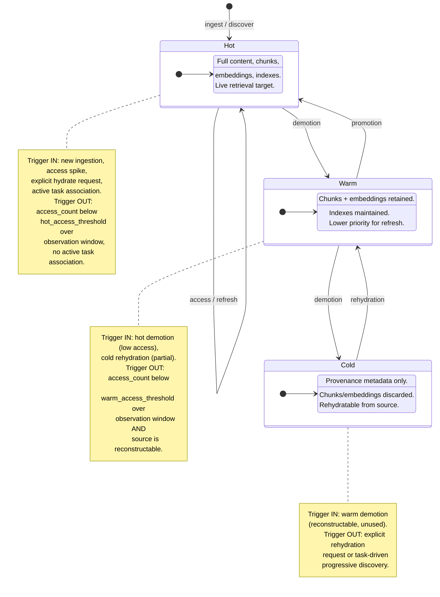
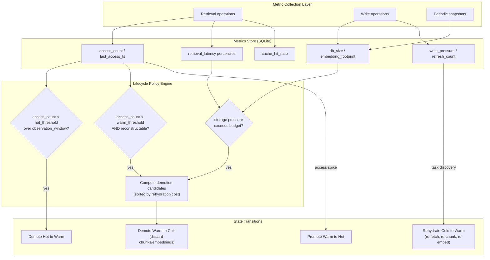

# H15 — Knowledge Lifecycle & Storage Pressure

> **Project:** Virgil
> **Artifact type:** Child handoff
> **Parent:** [`VIRGIL_HANDOFF_SEED.md`](../VIRGIL_HANDOFF_SEED.md)
> **Status:** Ready for assignment
> **Normative agent behavior:** [`AGENTS.md`](../AGENTS.md)

## Menú

- [Progress Tracker](#progress-tracker)
- [Objective](#objective)
- [Knowledge Lifecycle State Machine](#knowledge-lifecycle-state-machine)
- [Metrics Framework](#metrics-framework)
- [Scope](#scope)
- [Out of Scope](#out-of-scope)
- [Preconditions](#preconditions)
- [Deliverables](#deliverables)
- [Verification Requirements](#verification-requirements)
- [Evidence Requirements](#evidence-requirements)
- [Risks and Constraints](#risks-and-constraints)
- [References](#references)

---

## Progress Tracker

- [ ] Assignment accepted
- [ ] Preconditions verified
- [ ] Knowledge lifecycle state model implemented (hot/warm/cold)
- [ ] State transition engine with evidence-driven triggers operational
- [ ] Database size monitoring instrumented
- [ ] Retrieval latency tracking instrumented
- [ ] Embedding footprint measurement instrumented
- [ ] Cache hit ratio tracking instrumented
- [ ] Refresh behaviour tracking instrumented
- [ ] Write pressure monitoring instrumented
- [ ] Compaction policy implemented
- [ ] Archive policy implemented
- [ ] Rehydration path implemented
- [ ] Lifecycle metrics query port defined and tested
- [ ] Standard verification gates pass (see [SHARED_VERIFICATION.md](./SHARED_VERIFICATION.md))

[↑ Menú](#menú)

---

## Objective

Implement an evidence-driven knowledge lifecycle system that manages storage pressure in Virgil's local SQLite knowledge store. Knowledge artifacts transition between hot, warm, and cold states based on observed metrics — never based on calendar cadence, sprint boundaries, or arbitrary retention windows.

This handoff delivers the instrumentation, policy engine, and state machine that allow Virgil to observe its own knowledge store and act on measured behaviour. It establishes the foundation for future user-facing commands (`virgil knowledge stats/gc/compact/hydrate`) without implementing those CLI surfaces directly.

The system must answer four questions continuously:

1. **What is being used?** — retrieval frequency, cache hit ratio, recency of access.
2. **What is growing?** — database size, embedding footprint, write pressure.
3. **What is slowing down?** — retrieval latency degradation correlated with store size.
4. **What can be safely reduced?** — reconstructability, provenance sufficiency, rehydration cost.

[↑ Menú](#menú)

---

## Knowledge Lifecycle State Machine

Every knowledge artifact in Virgil's store exists in exactly one lifecycle state. Transitions between states are triggered by measured metrics, not by time alone.

### Transition Triggers

All transitions are driven by the metrics described in the [Metrics Framework](#metrics-framework). The following table summarises the trigger conditions:

| Transition | Direction | Trigger Condition |
| --- | --- | --- |
| Hot to Warm | Demotion | `access_count` below `hot_access_threshold` over the configured observation window AND no active task association |
| Warm to Cold | Demotion | `access_count` below `warm_access_threshold` over the observation window AND source marked as reconstructable |
| Warm to Hot | Promotion | `access_count` exceeds `hot_access_threshold` OR explicit task association created OR explicit hydrate request |
| Cold to Warm | Rehydration | Explicit rehydration request OR task-driven progressive discovery references the artifact's provenance |
| Any to Hot | Ingestion | New artifact ingested through a provider; enters Hot by default |

### Design Principles

1. **No calendar-based transitions.** A sprint ending, a month passing, or a release shipping does not trigger demotion. Only measured access patterns and storage pressure do.
2. **Reconstructability gates cold demotion.** An artifact cannot be demoted to Cold unless its provenance metadata is sufficient to rehydrate it from the original source. Non-reconstructable artifacts remain Warm indefinitely.
3. **Rehydration is incremental.** Cold-to-Warm rehydration re-fetches content from the original provider, re-chunks, and re-embeds. It does not require a full re-ingestion of the entire knowledge store.
4. **State is per-artifact.** Each normalized knowledge artifact carries its own lifecycle state independently. Bulk transitions are policy-driven aggregations of per-artifact decisions.

[↑ Menú](#menú)

---

## Metrics Framework

Virgil must instrument and persist the following metrics to drive lifecycle decisions. All metrics are queryable through the lifecycle metrics port.

### Storage Metrics

| Metric | Unit | Description | Collection Frequency |
| --- | --- | --- | --- |
| `db_size_bytes` | bytes | Total SQLite database file size | Per write batch / periodic |
| `embedding_footprint_bytes` | bytes | Total storage consumed by embedding vectors | Per write batch / periodic |
| `chunk_count` | count | Total number of stored content chunks | Per write batch / periodic |
| `artifact_count_by_state` | count per state | Number of artifacts in each lifecycle state (hot/warm/cold) | Per state transition / periodic |

### Access Metrics

| Metric | Unit | Description | Collection Frequency |
| --- | --- | --- | --- |
| `retrieval_latency_ms` | milliseconds | Time from query submission to ranked result return | Per retrieval operation |
| `retrieval_latency_p50` | milliseconds | 50th percentile retrieval latency over observation window | Computed periodically |
| `retrieval_latency_p95` | milliseconds | 95th percentile retrieval latency over observation window | Computed periodically |
| `cache_hit_ratio` | ratio (0.0--1.0) | Fraction of retrieval queries satisfied from cached results | Per retrieval operation / periodic |
| `access_count` | count per artifact | Number of times an artifact contributed to a retrieval result | Per retrieval operation |
| `last_access_ts` | timestamp | Most recent retrieval that referenced the artifact | Per retrieval operation |

### Write Metrics

| Metric | Unit | Description | Collection Frequency |
| --- | --- | --- | --- |
| `write_pressure_ops_per_sec` | ops/s | Rate of write operations to the knowledge store | Per write batch |
| `write_batch_size_bytes` | bytes | Size of each write batch | Per write batch |
| `refresh_count` | count per artifact | Number of times an artifact has been re-ingested from source | Per refresh operation |
| `last_refresh_ts` | timestamp | Most recent refresh of an artifact from its source | Per refresh operation |

### Lifecycle Decision Metrics

| Metric | Unit | Description | Purpose |
| --- | --- | --- | --- |
| `observation_window` | duration | Configurable period over which access patterns are evaluated | Demotion trigger evaluation |
| `hot_access_threshold` | count | Minimum access count within observation window to remain Hot | Hot-to-Warm demotion gate |
| `warm_access_threshold` | count | Minimum access count within observation window to remain Warm | Warm-to-Cold demotion gate |
| `reconstructability` | boolean per artifact | Whether provenance metadata is sufficient to rehydrate from source | Cold demotion gate |
| `rehydration_cost_estimate` | relative score | Estimated cost (time/tokens) to rehydrate a cold artifact | Rehydration prioritisation |

### Metrics Interaction With State Transitions

The following diagram illustrates how collected metrics feed into lifecycle decisions:

[↑ Menú](#menú)

---

## Scope

### Included

1. **Knowledge lifecycle state model** — schema additions to the knowledge persistence layer (H06) that track per-artifact lifecycle state (`hot`, `warm`, `cold`), transition history, and associated timestamps.
2. **Metrics instrumentation** — collection of all metrics defined in the Metrics Framework section, persisted in SQLite alongside the knowledge store.
3. **Lifecycle policy engine** — a service that evaluates configured thresholds against collected metrics and produces transition recommendations.
4. **State transition executor** — executes approved transitions: demotion (content/embedding pruning for cold), promotion (priority restoration), and rehydration (re-fetch, re-chunk, re-embed from provenance).
5. **Compaction** — a compaction operation that reclaims storage by purging discarded chunks/embeddings from Cold artifacts and running SQLite `VACUUM` or equivalent.
6. **Archive metadata** — Cold artifacts retain provider identity, source URI, content hash, version, relationships, task associations, and provenance metadata sufficient for rehydration.
7. **Rehydration path** — given a Cold artifact's provenance, re-fetch content from the original provider, re-chunk, re-embed, and transition to Warm or Hot.
8. **Lifecycle metrics query port** — a domain port that exposes current lifecycle metrics and per-artifact state for consumption by future CLI commands and internal agents.
9. **Configuration surface** — workspace-scoped configuration for observation window duration, access thresholds, storage budget, and compaction policy parameters via Zod-validated schemas.
10. **Evidence-driven transition logging** — every state transition records the metric values that triggered it, enabling audit and policy tuning.

### Seed Definition of Done Coverage

This handoff does not directly address seed DoD items (those are covered by H01/H02). It implements the Knowledge Lifecycle direction from the seed section "Knowledge Lifecycle" and the H15 child handoff specification.

[↑ Menú](#menú)

---

## Out of Scope

| Exclusion | Owner |
| --- | --- |
| CLI commands (`virgil knowledge stats/gc/compact/hydrate`) | Future handoff (post-H15 CLI surface) |
| SQLite persistence schema and Drizzle ORM setup | H06 |
| RAG chunking, embedding, and retrieval implementation | H07 |
| Provider contracts and authentication | H04, H12--H14 |
| Workspace configuration management | H03 |
| Node SEA packaging | H02 |
| Repository bootstrap and monorepo structure | H01 |
| Product agent orchestration | H10 |
| Progressive discovery logic | H08 |
| CI/CD pipeline configuration | H18 |
| Playwright CDP browser automation (`packages/pw-cdp/`) | H16 |
| Local folder indexers (`packages/local-indexers/`) | H17 |
| Distributed storage or remote database migration | Deferred (no demonstrated need) |
| Automatic background scheduling of compaction/demotion | Future handoff (requires runtime daemon design) |

[↑ Menú](#menú)

---

## Preconditions

1. **H06 complete** — Knowledge persistence schema exists in SQLite via Drizzle ORM, including normalized artifacts, content identity/hash, source provenance, relationships, and task associations.
2. **H07 complete** — RAG core is operational: chunking, embedding, vector storage, and retrieval are functional. Retrieval latency and cache behaviour are observable.
3. **H03 complete** — Workspace configuration is available for storing lifecycle policy parameters.
4. **H04 complete** — Provider contracts are stable, enabling rehydration to invoke the appropriate provider for re-fetching content.
5. **Repository builds and passes static/dynamic verification** — the monorepo foundation from H01 is intact and the `packages/cli/` package compiles cleanly.

[↑ Menú](#menú)

---

## Deliverables

### D1 — Lifecycle State Schema Extension

Extend the knowledge persistence schema (H06) with per-artifact lifecycle state tracking.

**Acceptance criteria:**

- Each knowledge artifact row includes a `lifecycle_state` column with allowed values `hot`, `warm`, `cold`.
- A `lifecycle_transitions` table records every state change with: artifact ID, previous state, new state, timestamp, and a JSON column capturing the metric snapshot that triggered the transition.
- Default state for newly ingested artifacts is `hot`.
- Drizzle ORM schema and migration cover the new columns/tables.
- Zod validation enforces the state enum at the domain boundary.

### D2 — Metrics Collection Instrumentation

Instrument all metrics defined in the Metrics Framework section.

**Acceptance criteria:**

- Storage metrics (`db_size_bytes`, `embedding_footprint_bytes`, `chunk_count`, `artifact_count_by_state`) are collected per write batch and on a configurable periodic interval.
- Access metrics (`retrieval_latency_ms`, `cache_hit_ratio`, `access_count`, `last_access_ts`) are collected per retrieval operation.
- Write metrics (`write_pressure_ops_per_sec`, `write_batch_size_bytes`, `refresh_count`, `last_refresh_ts`) are collected per write batch.
- Percentile latency metrics (`retrieval_latency_p50`, `retrieval_latency_p95`) are computed over the observation window.
- All metrics are persisted in SQLite and queryable through the lifecycle metrics port.
- Metric collection does not degrade retrieval latency by more than 5% compared to un-instrumented baseline (measured by benchmark).

### D3 — Lifecycle Policy Engine

Implement the policy engine that evaluates metrics against configured thresholds and produces transition recommendations.

**Acceptance criteria:**

- The engine evaluates demotion candidates by comparing per-artifact `access_count` against `hot_access_threshold` and `warm_access_threshold` over the configured `observation_window`.
- Reconstructability is verified before recommending Warm-to-Cold demotion.
- Storage pressure evaluation considers `db_size_bytes` and `embedding_footprint_bytes` against a configurable storage budget.
- The engine produces a ranked list of transition recommendations sorted by `rehydration_cost_estimate` (lowest cost first for demotions).
- Policy parameters are Zod-validated and configurable per workspace.
- The engine is a pure function of metrics and configuration — it does not execute transitions directly.

### D4 — State Transition Executor

Implement the executor that applies approved state transitions.

**Acceptance criteria:**

- **Hot-to-Warm demotion:** artifact state updated; no content is discarded; refresh priority is lowered.
- **Warm-to-Cold demotion:** artifact state updated; chunks and embeddings are marked for deletion; provenance metadata, relationships, content hash, and task associations are retained.
- **Warm-to-Hot promotion:** artifact state updated; refresh priority is restored.
- **Cold-to-Warm rehydration:** content is re-fetched from the original provider using provenance metadata; re-chunked and re-embedded; artifact state set to Warm (or Hot if triggered by active task association).
- Every transition records a `lifecycle_transitions` entry with the triggering metric snapshot.
- Transitions are atomic — a failed rehydration does not leave the artifact in an inconsistent state.
- The executor handles provider unavailability during rehydration gracefully: logs the failure, leaves the artifact in Cold state, and surfaces the error through the metrics port.

### D5 — Compaction Operation

Implement a compaction operation that reclaims storage from Cold artifacts.

**Acceptance criteria:**

- Compaction physically deletes chunks and embeddings that were marked for deletion during Warm-to-Cold demotion.
- After deletion, runs SQLite `VACUUM` (or equivalent) to reclaim disk space.
- Compaction reports: bytes reclaimed, artifacts affected, chunks removed, embeddings removed, time elapsed.
- Compaction is idempotent — running it twice produces no additional changes.
- Compaction does not affect Hot or Warm artifacts.
- Compaction is invocable programmatically through the lifecycle service port.

### D6 — Lifecycle Metrics Query Port

Define and implement a domain port for querying lifecycle metrics and per-artifact state.

**Acceptance criteria:**

- The port exposes current values for all metrics in the Metrics Framework.
- The port exposes per-artifact lifecycle state, last access timestamp, access count, and reconstructability.
- The port exposes aggregate statistics: artifact count by state, total storage by state, average retrieval latency by state.
- The port is consumed internally by the policy engine and is available for future CLI command implementations.
- The port contract is defined as a TypeScript interface with Zod validation on returned data.

### D7 — Workspace Lifecycle Configuration

Implement workspace-scoped lifecycle policy configuration.

**Acceptance criteria:**

- Configuration includes: `observation_window` (duration), `hot_access_threshold` (count), `warm_access_threshold` (count), `storage_budget_bytes` (bytes), `compaction_policy` (manual/on-pressure).
- Configuration is validated by Zod schema.
- Sensible defaults are provided so the system operates without explicit configuration.
- Configuration is loaded from the workspace configuration surface established by H03.
- Changing configuration does not retroactively trigger transitions; the next policy evaluation cycle uses the updated values.

[↑ Menú](#menú)

---

## Verification Requirements

Standard static, dynamic, and build verification gates apply — see [SHARED_VERIFICATION.md](./SHARED_VERIFICATION.md).

### Lifecycle-Specific Verification

1. **State transition correctness** — unit tests prove every valid transition (Hot-to-Warm, Warm-to-Cold, Warm-to-Hot, Cold-to-Warm) and reject invalid transitions (Hot-to-Cold direct, Cold-to-Hot direct without passing through Warm).
2. **Metric accuracy** — tests verify that access metrics are correctly incremented on retrieval operations, and that storage metrics reflect actual SQLite state.
3. **Policy engine determinism** — given identical metrics and configuration, the engine produces identical transition recommendations.
4. **Compaction idempotency** — running compaction twice on the same state produces no additional changes.
5. **Rehydration failure handling** — tests prove that a failed rehydration leaves the artifact in Cold state with an error recorded, not in an inconsistent intermediate state.
6. **Demotion gate enforcement** — tests prove that a non-reconstructable artifact cannot be demoted to Cold.
7. **Performance regression** — benchmark tests verify that metric collection overhead stays within the 5% latency budget.
8. **Transition audit trail** — tests verify that every executed transition creates a `lifecycle_transitions` record with the correct metric snapshot.

[↑ Menú](#menú)

---

## Evidence Requirements

Standard evidence items apply — see [SHARED_VERIFICATION.md](./SHARED_VERIFICATION.md).

Handoff-specific evidence:

1. Test output demonstrating each state transition (Hot-to-Warm, Warm-to-Cold, Warm-to-Hot, Cold-to-Warm) with metric snapshots logged.
2. Test output demonstrating that Cold demotion is blocked for non-reconstructable artifacts.
3. Test output demonstrating compaction reclaims storage and reports bytes reclaimed.
4. Test output demonstrating rehydration failure handling (provider unavailable scenario).
5. Benchmark result showing metric collection latency overhead is within the 5% budget.
6. Schema migration file showing lifecycle state column and transitions table.
7. Zod schema definition for workspace lifecycle configuration with defaults.

[↑ Menú](#menú)

---

## Risks and Constraints

| Risk | Mitigation |
| --- | --- |
| SQLite `VACUUM` locks the database during compaction, blocking concurrent reads/writes | Document compaction as a blocking operation; evaluate `VACUUM INTO` for copy-on-write alternative; expose compaction duration as a metric |
| Rehydration depends on provider availability; source may have moved or been deleted | Record rehydration failures; keep artifact in Cold state; surface unavailability through metrics port; do not discard provenance metadata on failure |
| Observation window duration affects demotion sensitivity — too short causes thrashing, too long delays reclamation | Provide sensible defaults; make observation window configurable per workspace; log transition frequency as a tuning signal |
| Metric collection overhead may degrade retrieval performance at scale | Enforce 5% latency budget via benchmark tests; use batch writes for metrics; consider sampling at high throughput |
| Embedding footprint measurement depends on vector storage internals from H07 | Define a clean measurement port in H07's vector store contract; if unavailable, estimate from chunk count and configured embedding dimensions |
| Compaction may interact poorly with WAL mode in SQLite | Test compaction under both WAL and journal-mode delete; document recommended SQLite configuration |
| Lifecycle state enum changes require schema migration | Use Drizzle ORM migrations; keep the enum small and stable; validate at the domain boundary with Zod |
| Warm-to-Cold demotion discards embeddings that are expensive to regenerate | Rehydration cost estimate should account for embedding generation cost; the policy engine ranks candidates by lowest rehydration cost first |
| No automatic scheduling — compaction and demotion require explicit invocation | Document that automatic scheduling is deferred to a future handoff; lifecycle metrics port enables callers to trigger operations programmatically |

[↑ Menú](#menú)

---

## References

- [`AGENTS.md`](../AGENTS.md) — normative agent behaviour contract
- [`VIRGIL_HANDOFF_SEED.md`](../VIRGIL_HANDOFF_SEED.md) — architectural seed and parent handoff (see: Knowledge Lifecycle section)
- [`H01_REPOSITORY_BOOTSTRAP.md`](./H01_REPOSITORY_BOOTSTRAP.md) — monorepo foundation
- [H06 — Knowledge Persistence & Provenance](./H06_KNOWLEDGE_PERSISTENCE.md) (prerequisite: persistence schema)
- [H07 — RAG Core & Retrieval](./H07_RAG_CORE_RETRIEVAL.md) (prerequisite: chunking, embedding, retrieval)
- [H03 — Workspace & Configuration](./H03_WORKSPACE_CONFIGURATION.md) (prerequisite: workspace configuration surface)
- [H04 — Provider Contracts](./H04_PROVIDER_CONTRACTS.md) (prerequisite: provider ports for rehydration)
- Branch `poc/ref` (local) — POC-00 reference (Drizzle 0.45.2, better-sqlite3 13.0.3, Zod 4.5.4)
- [SQLite VACUUM documentation](https://www.sqlite.org/lang_vacuum.html)

[↑ Menú](#menú)
