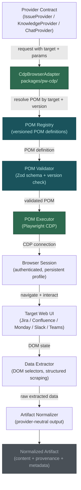
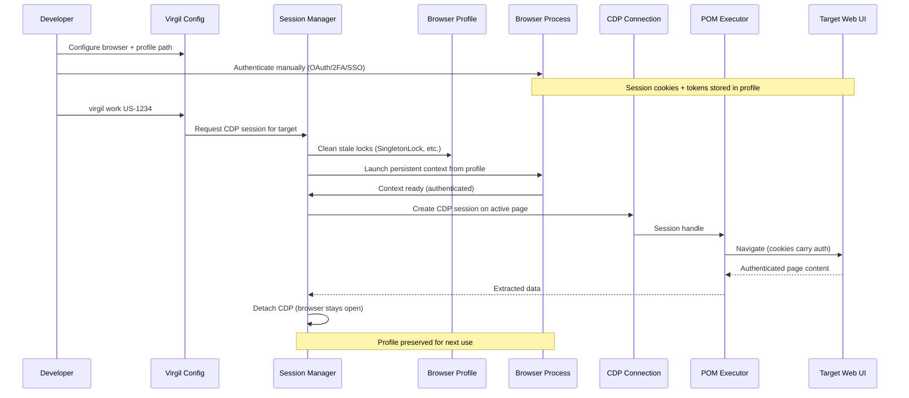
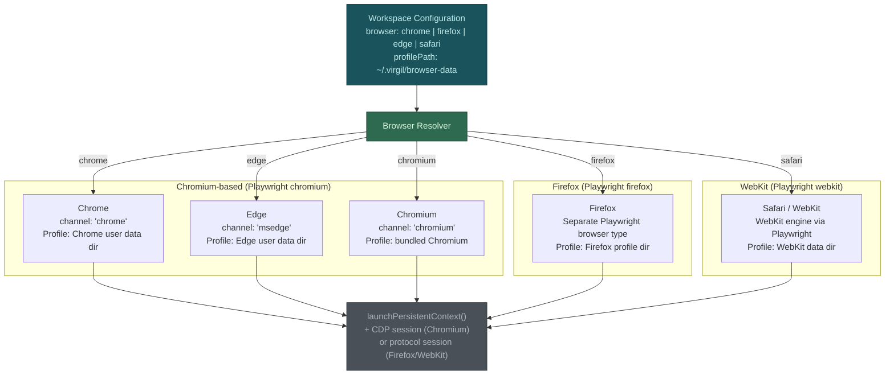

# H16 — PW CDP Browser Automation Package

> **Project:** Virgil
> **Artifact type:** Child handoff
> **Parent:** [`VIRGIL_HANDOFF_SEED.md`](../VIRGIL_HANDOFF_SEED.md)
> **Status:** Ready for assignment
> **Normative agent behavior:** [`AGENTS.md`](../AGENTS.md)

## Menú

- [Progress Tracker](#progress-tracker)
- [Objective](#objective)
- [POM Adapter Architecture](#pom-adapter-architecture)
- [Authentication and Session Flow](#authentication-and-session-flow)
- [Browser Selection Architecture](#browser-selection-architecture)
- [Scope](#scope)
- [Out of Scope](#out-of-scope)
- [Preconditions](#preconditions)
- [Deliverables](#deliverables)
- [POM Versioning and Validation Strategy](#pom-versioning-and-validation-strategy)
- [Verification Requirements](#verification-requirements)
- [Evidence Requirements](#evidence-requirements)
- [Risks and Constraints](#risks-and-constraints)
- [References](#references)

---

## Progress Tracker

- [ ] Assignment accepted
- [ ] Preconditions verified
- [ ] Package `packages/pw-cdp/` scaffolded in monorepo
- [ ] Provider contract (`CdpBrowserAdapter`) defined
- [ ] POM schema defined and Zod-validated
- [ ] POM executor implemented with Playwright CDP
- [ ] Browser selection architecture implemented (Chrome, Firefox, Edge, Safari)
- [ ] Browser profile management implemented with stale lock cleanup
- [ ] Session reuse strategy implemented (authenticated session persistence)
- [ ] Target POM definitions scaffolded (Jira, Confluence, Monday, Slack, Teams)
- [ ] POM versioning and validation strategy implemented
- [ ] Normalized artifact output contract defined
- [ ] Unit tests pass with > 97% coverage
- [ ] Integration test proves CDP session against a local test server
- [ ] Standard verification gates pass (see [SHARED_VERIFICATION.md](./SHARED_VERIFICATION.md))

[↑ Menú](#menú)

---

## Objective

Deliver `packages/pw-cdp/` as an independent monorepo package that provides Playwright CDP-based browser automation for enterprise web UIs. This package enables Virgil to extract structured data from authenticated web applications (Jira, Confluence, Monday, Slack, Teams) by reusing real browser sessions where the developer has already authenticated.

The package is intentionally separate from `packages/cli/` because Playwright with browser binaries is approximately 130 MB. Keeping it in its own package ensures the Node SEA binary for the CLI remains lean, and `pw-cdp` is consumed as an optional dependency activated only when browser-based provider adapters are configured.

The core abstraction is the **Page Object Model (POM)** pattern: structured, declarative navigation and extraction steps that describe HOW to navigate a web UI and extract data. POMs are versioned, validated, and decoupled from the executor so they can evolve independently as target web UIs change.

[↑ Menú](#menú)

---

## POM Adapter Architecture

The following diagram shows how a provider request flows through the POM adapter layer, from the abstract provider contract down to normalized output.



**Flow summary:**

1. A provider adapter (e.g. Jira issue provider) requests data through the `CdpBrowserAdapter`.
2. The adapter resolves the appropriate POM definition from the registry, matched by target application and version.
3. The POM validator confirms structural integrity and version compatibility via Zod schemas.
4. The POM executor translates the declarative POM steps into Playwright CDP calls against the authenticated browser session.
5. The data extractor collects structured data from the DOM.
6. The normalizer transforms raw extracted data into provider-neutral normalized artifacts with provenance metadata.

[↑ Menú](#menú)

---

## Authentication and Session Flow

Enterprise web applications use OAuth, 2FA, SSO, and corporate security policies that are impractical to automate programmatically. The CDP adapter sidesteps this entirely: the developer authenticates once in their real browser, and the CDP connection reuses that authenticated session.



**Key design decisions:**

1. **Persistent browser context** — Playwright's `launchPersistentContext()` reuses an existing browser profile directory, preserving cookies, local storage, and session tokens across invocations.
2. **Stale lock cleanup** — Before launching, the session manager removes `SingletonLock`, `SingletonCookie`, `SingletonSocket`, stale session files, and the `Sessions/` directory to prevent "browser already in use" errors. This pattern is validated by the `challenge-coach` reference project.
3. **CDP detach without close** — After extraction, the CDP session detaches but the browser process and profile remain intact, preserving the authenticated session for future use.
4. **Anti-detection** — The `navigator.webdriver` property is overridden via `addInitScript()` to reduce automation-detection friction on enterprise web applications.
5. **No credential storage** — Virgil never stores, transmits, or manages authentication credentials. The developer's browser owns the session lifecycle entirely.

[↑ Menú](#menú)

---

## Browser Selection Architecture

Users must be able to choose which browser to automate. Different enterprise environments mandate different browsers (e.g. Edge for Microsoft-centric organizations, Chrome for Google Workspace, Firefox for security-focused teams, Safari for macOS-native environments). The architecture supports all four browsers through a unified configuration and browser-specific profile resolution.



**Browser support details:**

| Browser | Playwright Type | Channel | CDP Support | Profile Pattern |
| --- | --- | --- | --- | --- |
| Chrome | `chromium` | `chrome` | Full | User data dir with `--profile-directory=Default` |
| Edge | `chromium` | `msedge` | Full | User data dir with `--profile-directory=Default` |
| Chromium | `chromium` | `chromium` | Full | Bundled Chromium profile |
| Firefox | `firefox` | N/A | Limited (Playwright abstracts) | Firefox profile directory |
| Safari | `webkit` | N/A | None (WebKit protocol) | WebKit data directory |

**Implementation notes:**

1. Chrome and Edge share the Chromium engine and have full CDP support, making them the primary targets.
2. Firefox uses Playwright's internal protocol bridge rather than raw CDP. POM execution is identical at the Playwright API level, but CDP-specific features (e.g. `Page.javascriptDialogOpening`) require protocol-specific adapters.
3. Safari/WebKit support uses Playwright's WebKit engine. CDP is not available; all interaction goes through Playwright's unified API. Some CDP-specific observability features may be unavailable.
4. Browser-specific chromium arguments (e.g. `--no-first-run`, `--hide-crash-restore-bubble`, `--disable-features=...`) are applied only for Chromium-based browsers. Firefox and WebKit have their own launch option sets.
5. Profile path defaults are browser-specific (e.g. `~/.virgil/chrome-data`, `~/.virgil/firefox-data`) but user-configurable.

[↑ Menú](#menú)

---

## Scope

### Included

1. **Package scaffold** — `packages/pw-cdp/` initialized as a monorepo package with its own `package.json`, `tsconfig.json` (extending `../../tsconfig.base.json`), and source/test directories.
2. **Provider contract** — `CdpBrowserAdapter` interface defining the contract between Virgil provider adapters and the CDP browser automation layer.
3. **POM schema** — Zod-validated POM definition schema describing navigation steps, extraction selectors, wait conditions, interaction sequences, and expected output shapes.
4. **POM registry** — A registry that resolves POM definitions by target application name and version.
5. **POM executor** — Playwright CDP executor that translates declarative POM steps into browser automation actions.
6. **Browser selection** — Configuration-driven browser selection supporting Chrome, Firefox, Edge, and Safari through Playwright's browser type and channel abstraction.
7. **Session management** — Persistent context management including profile path resolution, stale lock cleanup, CDP session creation/detachment, and anti-detection measures.
8. **Browser profile management** — Per-browser profile directories with configurable paths, stale lock cleanup for Chromium-based browsers, and session file management.
9. **Target POM scaffolds** — Initial POM definitions (structural scaffolds, not full production POMs) for: Jira (issue fields), Confluence (wiki content), Monday (board items), Slack (channel messages), Teams (chat messages).
10. **POM versioning** — Version metadata on every POM definition with compatibility validation against the target application.
11. **Normalized output** — Extracted data transformed into provider-neutral normalized artifacts with source provenance, content hash, and extraction timestamp.
12. **Error taxonomy** — Typed error classes for: browser launch failure, authentication expired, POM validation failure, POM version mismatch, selector not found, navigation timeout, extraction failure.
13. **Playwright as a peer dependency** — Playwright is declared as a peer dependency so consumers control browser binary installation.

### Seed Definition of Done Coverage

This handoff is a post-seed addition (H16) created by owner decision. It does not map to original seed DoD items but extends the monorepo architecture established by H01.

[↑ Menú](#menú)

---

## Out of Scope

The following responsibilities belong to other handoffs and must **not** be addressed here:

| Exclusion | Owner |
| --- | --- |
| CLI commands that invoke PW CDP adapters | H02 / H12 / H14 |
| Monorepo workspace setup and shared TypeScript config | H01 |
| Node SEA packaging (pw-cdp is never bundled into SEA) | H02 |
| Provider contracts (IssueProvider, KnowledgeProvider, ChatProvider) | H04 |
| Knowledge persistence and provenance storage | H06 |
| RAG indexing of extracted content | H07 |
| Issue-driven progressive discovery orchestration | H08 |
| Full production POM definitions for all target UIs | Future maintenance |
| Headless browser testing / E2E test automation | Not in scope |
| Credential storage or management | Explicitly excluded |
| CI/CD pipeline configuration | H18 |
| Local folder indexers (`packages/local-indexers/`) | H17 |

[↑ Menú](#menú)

---

## Preconditions

1. H01 is complete: the monorepo workspace exists with `pnpm-workspace.yaml` declaring `packages: ["packages/*"]` and `tsconfig.base.json` at the root.
2. Node.js 24.16.0 is available in the development environment.
3. pnpm 11.24.0 is available in the development environment.
4. The reference project `~/projects/nodejs/challenge-coach/` is accessible for consulting existing PW CDP patterns, particularly browser profile configuration and stale lock cleanup.
5. At least one Chromium-based browser (Chrome or Edge) is installed on the development machine for integration testing.

[↑ Menú](#menú)

---

## Deliverables

### D1 — Package Scaffold

Initialize `packages/pw-cdp/` as a workspace package.

**Acceptance criteria:**

- `packages/pw-cdp/package.json` exists with name `@virgil/pw-cdp` and exact dependency versions.
- `packages/pw-cdp/tsconfig.json` extends `../../tsconfig.base.json`.
- `packages/pw-cdp/src/` and `packages/pw-cdp/test/` directories exist.
- Playwright is declared as a `peerDependency` with an exact version.
- `pnpm build` at the workspace root compiles `packages/pw-cdp/` without errors.
- `pnpm test:static` passes across the workspace including the new package.
- The package is listed in the pnpm workspace and resolves correctly.

### D2 — CdpBrowserAdapter Contract

Define the adapter interface that provider implementations consume.

**Acceptance criteria:**

- The `CdpBrowserAdapter` interface is exported from `packages/pw-cdp/src/`.
- The interface defines methods for: launching a browser session, executing a POM against a target URL, extracting normalized data, and detaching/closing the session.
- The interface is independent of any specific target web UI.
- The interface accepts a POM definition and returns a typed extraction result.
- The contract is documented with JSDoc including parameter descriptions and return types.

### D3 — POM Schema and Registry

Define the Zod-validated POM schema and a registry for POM lookup.

**Acceptance criteria:**

- A Zod schema defines the POM structure: target application name, POM version, navigation steps (goto, click, wait, fill, select), extraction selectors (CSS/XPath with output field mapping), wait conditions (selector visible, network idle, timeout), and expected output shape.
- The POM registry resolves POM definitions by `(targetApp, version)` tuple.
- The registry supports registering and retrieving POM definitions.
- Invalid POM definitions are rejected at registration time via Zod validation.
- POM definitions are serializable (can be loaded from JSON/YAML configuration files).

### D4 — POM Executor

Implement the Playwright CDP executor that runs validated POM definitions.

**Acceptance criteria:**

- The executor accepts a validated POM definition and an active browser session.
- Navigation steps are executed sequentially in POM-defined order.
- Extraction selectors are applied after navigation completes.
- Wait conditions are respected between navigation steps.
- Timeout handling prevents indefinite hangs (configurable per-step and per-POM).
- Extraction results are returned as structured objects matching the POM's output shape.
- Errors during execution produce typed error objects (not unstructured strings).

### D5 — Browser Selection and Session Management

Implement browser-agnostic session management with configurable browser selection.

**Acceptance criteria:**

- A configuration schema (Zod-validated) accepts: browser type (`chrome`, `firefox`, `edge`, `safari`), profile path (with sensible defaults per browser), headless mode flag, and custom launch arguments.
- `launchPersistentContext()` is used for Chromium-based browsers (Chrome, Edge, Chromium).
- Firefox and WebKit use their respective Playwright browser types with persistent profile support.
- Stale lock cleanup runs before launch for Chromium-based browsers, removing `SingletonLock`, `SingletonCookie`, `SingletonSocket`, and stale session files.
- Anti-detection measures (`navigator.webdriver` override) are applied via `addInitScript()`.
- CDP session creation and detachment lifecycle is managed cleanly.
- Browser process survives CDP detachment (session reuse across invocations).
- Profile path supports `~` expansion to home directory.

### D6 — Target POM Scaffolds

Provide initial POM definition scaffolds for the five target web UIs.

**Acceptance criteria:**

- A structural POM scaffold exists for each target: Jira (issue view — summary, description, status, assignee, priority, comments), Confluence (wiki page — title, body content, labels, last modified), Monday (board item — name, status, assignee, timeline, updates), Slack (channel view — recent messages with author, timestamp, content), Teams (chat view — recent messages with author, timestamp, content).
- Each scaffold is a valid POM definition that passes Zod validation.
- Each scaffold includes a version identifier (e.g. `jira-cloud-v1`).
- Scaffolds are clearly marked as structural starting points, not production-ready selectors.
- Each scaffold documents known selector fragility and expected maintenance cadence.

### D7 — Normalized Artifact Output

Define the output contract for extracted data.

**Acceptance criteria:**

- Extracted data is returned as a `NormalizedArtifact` type with: content (structured extracted data), source provenance (target app, URL, POM version used), content hash (SHA-256 of extracted content), extraction timestamp, and extraction metadata (browser used, profile, duration).
- The type is Zod-validated and exported from the package.
- The normalized output is compatible with the artifact format expected by H06 (knowledge persistence).

### D8 — Error Taxonomy

Define typed error classes for the CDP automation domain.

**Acceptance criteria:**

- Error classes exist for: `BrowserLaunchError`, `SessionExpiredError`, `PomValidationError`, `PomVersionMismatchError`, `SelectorNotFoundError`, `NavigationTimeoutError`, `ExtractionError`.
- Each error class carries structured metadata (not just a message string).
- Errors are exported from the package for consumer handling.

[↑ Menú](#menú)

---

## POM Versioning and Validation Strategy

Web UIs change frequently — a Jira Cloud update can break CSS selectors overnight. The POM versioning strategy mitigates this risk without requiring full re-implementation on every UI change.

### Version Schema

Every POM definition carries a version tuple:

```text
<target>-<variant>-v<major>
```

Examples: `jira-cloud-v1`, `confluence-cloud-v2`, `monday-v1`, `slack-web-v1`, `teams-web-v1`.

- **target** — the application being automated (jira, confluence, monday, slack, teams).
- **variant** — the deployment variant when relevant (cloud, server, data-center, web, desktop).
- **major** — incremented when selectors or navigation flow change incompatibly.

### Validation Layers

1. **Schema validation** — Zod validates structural integrity of the POM definition at load/registration time. Malformed POMs never reach the executor.
2. **Version compatibility** — The executor checks that the POM version is compatible with the configured target before execution. A version mismatch produces a `PomVersionMismatchError` rather than silent extraction failure.
3. **Selector smoke test** — Before full extraction, the executor verifies that critical anchor selectors (identified in the POM as `required: true`) are present on the page. Missing anchors indicate a UI change and produce a `SelectorNotFoundError` with the specific missing selector.
4. **Extraction shape validation** — After extraction, the output is validated against the POM's declared output shape via Zod. Partial extraction (some fields missing) is allowed and reported; total extraction failure is an error.

### Maintenance Protocol

When a target web UI changes:

1. Run the existing POM against the target. The selector smoke test identifies broken selectors.
2. Update the POM definition with corrected selectors.
3. Increment the POM major version.
4. The old POM version remains in the registry for environments that have not updated.
5. Configuration can pin a POM version or use `latest` (default).

[↑ Menú](#menú)

---

## Verification Requirements

Standard static, dynamic, and build verification gates apply — see [SHARED_VERIFICATION.md](./SHARED_VERIFICATION.md).

### PW-CDP-Specific Dynamic Tests

- Unit tests cover: POM schema validation (valid/invalid POMs), POM registry (register/resolve/version mismatch), POM executor (with mocked Playwright API), browser resolver (all browser types), session manager (launch/detach/close lifecycle, stale lock cleanup), normalized artifact construction, error taxonomy (each error type).
- Integration test proves CDP session creation against a local HTTP test server (not a production web UI). The test must launch a browser, connect via CDP, navigate to the local server, extract known content, and verify the normalized output.

[↑ Menú](#menú)

---

## Evidence Requirements

Standard evidence items apply — see [SHARED_VERIFICATION.md](./SHARED_VERIFICATION.md).

Handoff-specific evidence:

1. Proof that the POM schema validates correct definitions and rejects malformed ones (test output).
2. Proof that the POM executor extracts structured data from a local test server via CDP (integration test output).
3. Proof that browser selection resolves correctly for all five browser types (test output).
4. Proof that stale lock cleanup handles the documented lock files (test output).
5. Proof that `packages/pw-cdp/package.json` declares Playwright as a `peerDependency` with an exact version.
6. List of all direct dependencies and devDependencies with their exact versions for `packages/pw-cdp/`.
7. Proof that all five target POM scaffolds pass Zod validation (test output).

[↑ Menú](#menú)

---

## Risks and Constraints

| Risk | Mitigation |
| --- | --- |
| Playwright is approximately 130 MB with browser binaries; must not bloat SEA binary | Package is a separate workspace package (`packages/pw-cdp/`) declared as an optional/peer dependency of `packages/cli/`, never bundled into the SEA binary |
| Browser profile flags vary across OS and browser versions; configuration is fragile | Consult `challenge-coach` reference project for validated Chromium launch arguments; document OS-specific profile path defaults; test on macOS at minimum |
| Stale browser lock files prevent launch after unclean shutdown | Implement proactive lock cleanup before every launch, matching the `challenge-coach` pattern (SingletonLock, SingletonCookie, SingletonSocket, session files) |
| Web UI selector changes break POM definitions silently | POM versioning with anchor selector smoke tests; extraction shape validation catches partial failures; `SelectorNotFoundError` identifies the specific broken selector |
| Firefox and WebKit have limited or no CDP support | Use Playwright's unified API for cross-browser POM execution; document CDP-specific features that are unavailable on Firefox/WebKit; mark CDP-only features in the adapter contract |
| Safari/WebKit persistent context support is limited in Playwright | Document WebKit limitations; Safari support may be best-effort rather than fully equivalent to Chromium-based browsers |
| Enterprise web UIs may detect and block automation | Anti-detection via `navigator.webdriver` override; persistent context uses real user profile with real cookies, reducing detection surface compared to fresh browser instances |
| Multiple concurrent CDP connections to the same profile cause corruption | Session manager enforces single-connection-per-profile; document that users must not have the same profile open in both manual browsing and Virgil simultaneously |
| Playwright version drift between `packages/pw-cdp/` and consumer | Playwright is a peer dependency; consumer controls the version; Zod-validated configuration prevents runtime mismatches |
| POM scaffold selectors will be immediately outdated for production use | Scaffolds are explicitly marked as structural starting points; acceptance criteria require validation passes, not production extraction accuracy |

[↑ Menú](#menú)

---

## References

- [`AGENTS.md`](../AGENTS.md) — normative agent behavior contract (immutable)
- [`VIRGIL_HANDOFF_SEED.md`](../VIRGIL_HANDOFF_SEED.md) — architectural seed and parent handoff
- [`H01_REPOSITORY_BOOTSTRAP.md`](./H01_REPOSITORY_BOOTSTRAP.md) — monorepo foundation (prerequisite)
- `~/projects/nodejs/challenge-coach/` — reference project with validated PW CDP patterns, particularly `src/browser/browser.service.ts` (persistent context, stale lock cleanup, CDP session, anti-detection) and `src/config/coach.config.ts` (browser channel configuration)
- Branch `poc/ref` (local) — POC-00 reference implementation (validated versions in [SHARED_VERIFICATION.md](./SHARED_VERIFICATION.md))
- [Playwright CDP documentation](https://playwright.dev/docs/api/class-cdpsession) — CDP session API reference
- [Playwright browser contexts](https://playwright.dev/docs/api/class-browsertype#browser-type-launch-persistent-context) — persistent context API reference

[↑ Menú](#menú)
