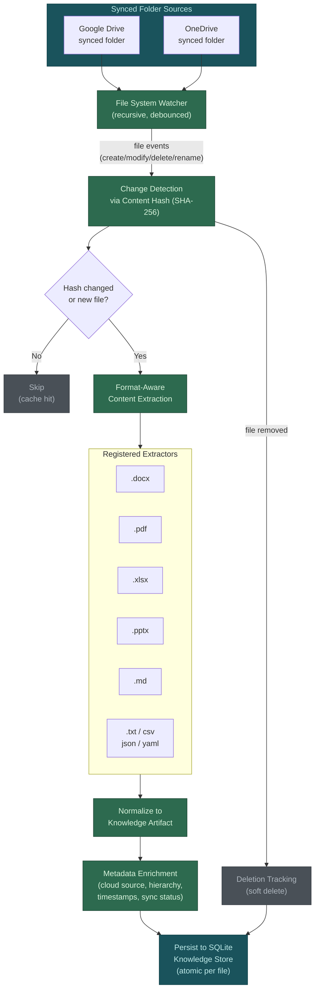
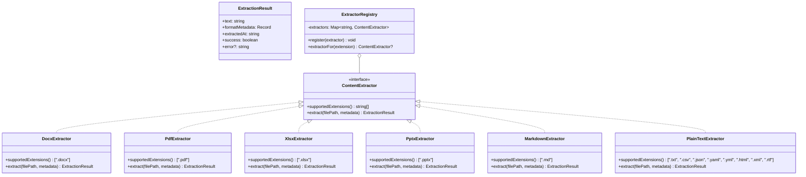

# H17 — Local Filesystem Indexers Package

> **Project:** Virgil
> **Artifact type:** Child handoff
> **Parent:** [`VIRGIL_HANDOFF_SEED.md`](../VIRGIL_HANDOFF_SEED.md)
> **Status:** Ready for assignment
> **Normative agent behavior:** [`AGENTS.md`](../AGENTS.md)

## Menú

- [Progress Tracker](#progress-tracker)
- [Objective](#objective)
- [Scope](#scope)
- [Out of Scope](#out-of-scope)
- [Preconditions](#preconditions)
- [Deliverables](#deliverables)
- [Indexing Pipeline Architecture](#indexing-pipeline-architecture)
- [Content Extraction Strategy](#content-extraction-strategy)
- [Verification Requirements](#verification-requirements)
- [Evidence Requirements](#evidence-requirements)
- [Risks and Constraints](#risks-and-constraints)
- [References](#references)

---

## Progress Tracker

- [ ] Assignment accepted
- [ ] Preconditions verified
- [ ] Package `packages/local-indexers/` scaffolded in monorepo
- [ ] `tsconfig.json` extends `../../tsconfig.base.json`
- [ ] KnowledgeProvider adapter interface implemented
- [ ] File system watcher operational for synced folders
- [ ] Content hashing for incremental indexing implemented
- [ ] Format-aware content extraction implemented (docx, pdf, xlsx, pptx, md, txt)
- [ ] Metadata preservation layer complete (cloud source, sync status, timestamps, hierarchy)
- [ ] Normalization to knowledge artifacts implemented
- [ ] SQLite knowledge store persistence integrated
- [ ] Google Drive synced folder indexing verified
- [ ] OneDrive synced folder indexing verified
- [ ] Standard verification gates pass (see [SHARED_VERIFICATION.md](./SHARED_VERIFICATION.md))

[↑ Menú](#menú)

---

## Objective

Deliver a dedicated `packages/local-indexers/` package that indexes locally synced cloud storage folders — Google Drive and OneDrive — as first-class knowledge sources for Virgil.

The seed establishes that local synchronized folders are first-class sources, not second-class fallbacks. This package makes that principle concrete by implementing a KnowledgeProvider adapter that watches synced folders for changes, extracts content from common document formats, and normalizes the results into knowledge artifacts persisted to the SQLite knowledge store.

The package must:

- detect changes efficiently through content hashing rather than re-processing unchanged files,
- extract content from the document formats that predominate in enterprise cloud storage,
- preserve metadata sufficient to trace each artifact back to its cloud source, folder hierarchy, and sync state,
- integrate with the KnowledgeProvider contract defined by H04 so the CLI can register local indexers as workspace knowledge sources.

This handoff produces a **library package** consumed by `packages/cli/`, not a standalone executable.

[↑ Menú](#menú)

---

## Scope

### Included

1. **Package scaffold** — `packages/local-indexers/` added to the pnpm workspace with its own `package.json`, `tsconfig.json` (extending `../../tsconfig.base.json`), source directory, and test directory.
2. **KnowledgeProvider adapter** — implementation of the KnowledgeProvider interface (H04) for local synced folders. The adapter registers with the workspace configuration system (H03) and responds to knowledge queries.
3. **File system watcher** — watches configured synced-folder root paths for file creation, modification, deletion, and rename events. Must handle debouncing of rapid sync-client writes.
4. **Incremental indexing via content hashing** — each file is identified by a content hash (SHA-256). Files whose hash has not changed since the last indexing pass are skipped. New and modified files are queued for extraction.
5. **Format-aware content extraction** — extracts text content from: `.docx`, `.pdf`, `.xlsx`, `.pptx`, `.md`, `.txt`, and other common plain-text formats (`.csv`, `.json`, `.yaml`, `.html`, `.xml`, `.rtf`). Binary formats that cannot be meaningfully extracted are recorded as metadata-only entries.
6. **Metadata preservation** — each indexed artifact retains: cloud source identity (Google Drive or OneDrive), original file path, folder hierarchy, file size, content hash, MIME type, creation timestamp, modification timestamp, sync status (synced/placeholder/conflict), and indexing timestamp.
7. **Normalization to knowledge artifacts** — extracted content is normalized into the knowledge artifact schema defined by H06, including content identity, provenance, and relationships (folder containment, sibling documents).
8. **SQLite knowledge store persistence** — normalized artifacts are written to the SQLite knowledge store using the persistence layer from H06. Content, metadata, and relationships are persisted atomically per file.
9. **Google Drive sync folder support** — detection and indexing of folders managed by Google Drive for Desktop. Handles the Google Drive sync client's directory structure conventions.
10. **OneDrive sync folder support** — detection and indexing of folders managed by OneDrive. Handles OneDrive's directory structure, including the Business and Personal folder conventions.
11. **Deletion tracking** — when a previously indexed file is removed from the synced folder, the corresponding knowledge artifact is marked as deleted (soft delete) rather than immediately purged, preserving provenance for knowledge lifecycle (H15).
12. **Error isolation** — extraction failure for a single file must not halt the indexing of remaining files. Failures are logged with the file path, error type, and timestamp.

### Seed Definition of Done Coverage

This handoff is a new addition (owner decision) not present in the original seed H01-H15. It addresses the seed's architectural direction that local synchronized folders are first-class knowledge sources (see [Provider Families](../VIRGIL_HANDOFF_SEED.md#provider-families) and [Shared Knowledge and RAG](../VIRGIL_HANDOFF_SEED.md#shared-knowledge-and-rag)).

[↑ Menú](#menú)

---

## Out of Scope

| Exclusion | Owner |
| --- | --- |
| KnowledgeProvider contract definition | H04 |
| SQLite persistence schema and Drizzle ORM setup | H06 |
| RAG chunking, embedding, and vector indexing | H07 |
| Knowledge lifecycle (hot/warm/cold transitions, compaction) | H15 |
| Playwright CDP browser authentication for cloud providers | H16 |
| CI/CD pipeline configuration | H18 |
| Node SEA packaging of the indexers package | H02 |
| Workspace and provider registration configuration | H03 |
| Remote API-based cloud storage access (Google Drive API, Microsoft Graph) | H13 |
| Real-time collaboration / conflict resolution with cloud sync clients | Future |
| OCR or image-based text extraction from PDFs | Future |
| Full-text search indexing (lexical/FTS5) | H07 |
| Embedding generation for extracted content | H07 |

[↑ Menú](#menú)

---

## Preconditions

1. H01 is complete — monorepo workspace, shared TypeScript config, build/test gates operational.
2. H04 is complete — KnowledgeProvider contract is defined and stable.
3. H06 is complete — SQLite persistence layer, knowledge artifact schema, and content identity model are available.
4. H03 is complete — workspace configuration system supports provider registration, including folder path configuration.
5. Node.js 24.16.0 is available in the development environment.
6. pnpm 11.24.0 is available in the development environment.

[↑ Menú](#menú)

---

## Deliverables

### D1 — Package Scaffold

Initialize `packages/local-indexers/` within the pnpm workspace.

**Acceptance criteria:**

- `packages/local-indexers/package.json` exists with name `@virgil/local-indexers` and all dependencies at exact versions.
- `packages/local-indexers/tsconfig.json` extends `../../tsconfig.base.json`.
- Source code resides in `packages/local-indexers/src/`.
- Tests reside in `packages/local-indexers/test/`.
- Build output targets `packages/local-indexers/dist/`.
- Coverage output targets `packages/local-indexers/coverage/`.
- Test artifacts target `packages/local-indexers/artifacts/`.
- `packages/cli/package.json` declares a workspace dependency on `@virgil/local-indexers`.

### D2 — File System Watcher

Implement a file system watcher that monitors configured synced-folder root paths.

**Acceptance criteria:**

- Watches one or more configured directory trees recursively.
- Detects file creation, modification, deletion, and rename events.
- Debounces rapid successive events for the same file path (configurable interval, default 500ms) to handle sync-client write patterns.
- Emits normalized change events consumed by the indexing pipeline.
- Handles watcher errors (permission denied, path not found) gracefully with structured error reporting.
- Supports starting, stopping, and restarting the watcher without resource leaks.
- Uses Node.js native `fs.watch` with recursive option (Node 24 supports recursive watching on macOS, Linux, and Windows) or a validated alternative.

### D3 — Content Hash and Incremental Indexing

Implement content-hash-based change detection to enable incremental indexing.

**Acceptance criteria:**

- Computes SHA-256 hash of file contents for each detected file.
- Compares the computed hash against the stored hash in the knowledge store.
- Files with unchanged hashes are skipped (cache hit).
- Files with changed or missing hashes are queued for extraction.
- Deleted files are detected by comparing the known file set against the current directory state.
- Hash computation is streaming (does not load entire file into memory) to handle large files.
- The initial indexing pass (cold start with no stored hashes) processes all files without requiring a separate bootstrap command.

### D4 — Format-Aware Content Extraction

Implement text extraction from common document formats found in enterprise cloud storage.

**Acceptance criteria:**

- Extracts text content from at least: `.docx`, `.pdf`, `.xlsx`, `.pptx`, `.md`, `.txt`.
- Additionally handles plain-text-compatible formats: `.csv`, `.json`, `.yaml`/`.yml`, `.html`, `.xml`, `.rtf`.
- Each format has a dedicated extractor behind a common extraction interface.
- New extractors can be registered without modifying the extraction pipeline.
- Extraction produces a normalized text representation plus format-specific metadata (e.g. sheet names for `.xlsx`, slide count for `.pptx`, heading structure for `.md`).
- Binary formats without a registered extractor produce a metadata-only artifact (file identity, size, MIME type) without failing the pipeline.
- Extraction errors for individual files are captured and reported without halting the pipeline.

### D5 — Metadata Preservation

Preserve cloud-source and filesystem metadata for each indexed file.

**Acceptance criteria:**

- Each indexed artifact records: cloud source identity (gdrive or onedrive), original absolute file path, relative path within the synced folder, folder hierarchy (parent chain), file size in bytes, content hash (SHA-256), MIME type, filesystem creation timestamp, filesystem modification timestamp, sync status, and indexing timestamp.
- Google Drive metadata detection: identifies the sync root (e.g. `~/Google Drive/My Drive/`, `~/Library/CloudStorage/GoogleDrive-*/My Drive/`) and derives the cloud-relative path.
- OneDrive metadata detection: identifies the sync root (e.g. `~/OneDrive/`, `~/OneDrive - <OrgName>/`, `~/Library/CloudStorage/OneDrive-*/`) and derives the cloud-relative path.
- Folder hierarchy is stored as a materialized path enabling queries like "all documents under folder X."
- Timestamps use ISO 8601 format in UTC.

### D6 — KnowledgeProvider Adapter

Implement the KnowledgeProvider interface for local synced-folder indexers.

**Acceptance criteria:**

- Implements the KnowledgeProvider contract from H04.
- Registers as a knowledge source within the workspace configuration system (H03).
- Supports configuration of one or more synced-folder root paths per provider instance.
- Supports configuration of include/exclude glob patterns for file filtering.
- Responds to knowledge queries by searching indexed content in the SQLite knowledge store (H06).
- Exposes provider identity and health status (last indexing timestamp, file count, error count).

### D7 — Knowledge Artifact Normalization and Persistence

Normalize extracted content into knowledge artifacts and persist them.

**Acceptance criteria:**

- Extracted content is normalized into the knowledge artifact schema from H06.
- Each artifact has a stable content identity derived from the file's content hash.
- Source provenance records the provider type (`local-indexer`), cloud source, and original path.
- Folder-containment relationships are persisted (parent folder contains child document).
- Sibling-document relationships are persisted (documents in the same folder).
- Persistence is atomic per file: content, metadata, and relationships are committed together.
- Soft deletion: removed files are marked as deleted with a deletion timestamp rather than physically purged.

[↑ Menú](#menú)

---

## Indexing Pipeline Architecture

The following diagram illustrates the end-to-end indexing pipeline from synced folder to knowledge store.

The pipeline is designed for incremental operation. After the initial cold-start pass, the watcher emits change events and only modified or new files pass through extraction and normalization. Unchanged files are short-circuited at the hash comparison step.

[↑ Menú](#menú)

---

## Content Extraction Strategy

The extraction layer uses a registry of format-specific extractors behind a common interface. This design allows new formats to be added without modifying the pipeline.

**Library selection guidance:**

- `.docx` / `.pptx` / `.xlsx` — Office Open XML formats are ZIP archives containing XML. Use a library capable of parsing OOXML without native dependencies (e.g. `mammoth` for docx, a streaming XML parser for pptx/xlsx). Prefer pure-JavaScript implementations for SEA compatibility.
- `.pdf` — PDF text extraction is inherently complex. Evaluate `pdf-parse` or equivalent. If a library requires native dependencies incompatible with SEA, document the constraint and fall back to metadata-only indexing for PDFs in the SEA artifact.
- `.md` / `.txt` / plain-text formats — read as UTF-8 text directly; no external library required.

Library choices must follow the exact-version policy and must be validated for SEA compatibility (no native addons unless co-located alongside the SEA binary per the pattern established by better-sqlite3 in POC-00).

[↑ Menú](#menú)

---

## Verification Requirements

Standard static, dynamic, and build verification gates apply — see [SHARED_VERIFICATION.md](./SHARED_VERIFICATION.md).

### Indexer-Specific Dynamic Tests

Tests must:

- Exercise the file system watcher using fixture directories with simulated sync-client behavior.
- Verify content hashing correctly identifies unchanged, modified, and new files.
- Verify each format extractor produces expected text output from fixture documents.
- Verify metadata preservation captures all required fields.
- Verify normalization produces valid knowledge artifacts conforming to the H06 schema.
- Verify deletion tracking marks removed files as soft-deleted.
- Verify error isolation: a corrupt file does not halt indexing of subsequent files.
- Mock the SQLite knowledge store at its boundary (Drizzle/repository layer).

[↑ Menú](#menú)

---

## Evidence Requirements

Standard evidence items apply — see [SHARED_VERIFICATION.md](./SHARED_VERIFICATION.md).

Handoff-specific evidence:

1. Proof that the file system watcher detects creation, modification, and deletion events in a fixture synced folder.
2. Proof that content hashing correctly skips unchanged files (cache-hit test).
3. Proof that each format extractor (docx, pdf, xlsx, pptx, md, txt) produces expected text from fixture files.
4. Proof that metadata includes cloud source identity, folder hierarchy, timestamps, and sync status.
5. Proof that a corrupt or unsupported file does not halt the indexing pipeline (error-isolation test).
6. Proof that the KnowledgeProvider adapter satisfies the H04 contract (interface compliance).

[↑ Menú](#menú)

---

## Risks and Constraints

| Risk | Mitigation |
| --- | --- |
| PDF extraction libraries may require native dependencies incompatible with SEA | Evaluate pure-JS options first; if native dependency is unavoidable, document the SEA co-location requirement and validate with H02's packaging strategy |
| Sync client directory structures vary across OS and cloud-provider version | Build detection heuristics for known paths (macOS CloudStorage, Windows user profile, Linux XDG); document unsupported configurations as known limitations |
| Sync clients may write placeholder/shortcut files instead of full content (e.g. OneDrive on-demand files, Google Drive streaming) | Detect placeholder files via file attributes or size heuristics; record as `placeholder` sync status and skip extraction until content is materialized |
| Large synced folders may produce high watcher event volume during bulk sync operations | Debouncing and batched processing mitigate event storms; consider configurable concurrency limits for extraction |
| File system watcher reliability varies across operating systems | Use Node.js 24 native recursive `fs.watch` which is stable on macOS, Linux, and Windows; add integration tests on CI across platforms |
| OOXML libraries (docx/pptx/xlsx) may have large dependency trees | Evaluate lightweight alternatives; prefer libraries with minimal transitive dependencies to keep bundle size manageable for SEA |
| Content extraction from complex documents (nested tables, embedded objects) may produce low-quality text | Accept best-effort extraction; preserve format metadata so downstream consumers can identify extraction quality |
| Google Drive and OneDrive may use different sync root paths per OS and account configuration | Implement configurable sync-root override alongside auto-detection; auto-detection covers common defaults, manual override covers enterprise/custom setups |
| Concurrent file writes by the sync client during indexing | Use streaming hash computation and retry on read errors; treat partial reads as transient failures eligible for retry on the next watcher cycle |

[↑ Menú](#menú)

---

## References

- [`AGENTS.md`](../AGENTS.md) — normative agent behavior contract (immutable)
- [`VIRGIL_HANDOFF_SEED.md`](../VIRGIL_HANDOFF_SEED.md) — architectural seed and parent handoff
- [H01 — Repository Bootstrap](./H01_REPOSITORY_BOOTSTRAP.md) — monorepo foundation and workspace setup
- [H04 — Provider Contracts](./H04_PROVIDER_CONTRACTS.md) — KnowledgeProvider interface definition
- [H06 — Knowledge Persistence](./H06_KNOWLEDGE_PERSISTENCE.md) — SQLite schema, knowledge artifact model, content identity
- [H03 — Workspace & Configuration](./H03_WORKSPACE_CONFIGURATION.md) — provider registration and workspace configuration
- Branch `poc/ref` (local) — POC-00 reference for SEA-compatible native addon patterns
- [Provider Families (seed)](../VIRGIL_HANDOFF_SEED.md#provider-families) — local synchronized folders as first-class knowledge sources
- [Shared Knowledge and RAG (seed)](../VIRGIL_HANDOFF_SEED.md#shared-knowledge-and-rag) — knowledge pipeline architecture direction

[↑ Menú](#menú)
