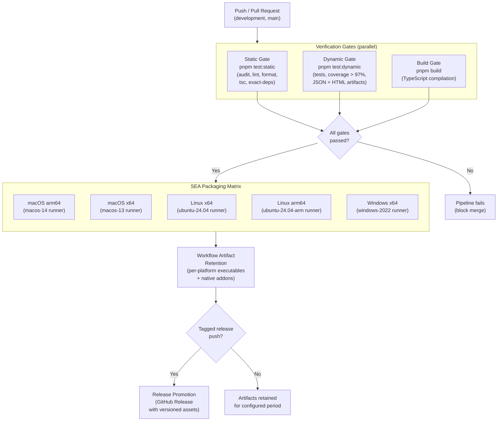
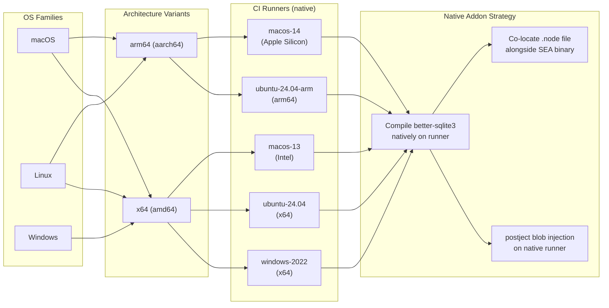

# H18 — CI/CD Delivery Pipeline

> **Project:** Virgil
> **Artifact type:** Child handoff
> **Parent:** [`VIRGIL_HANDOFF_SEED.md`](../VIRGIL_HANDOFF_SEED.md)
> **Status:** Ready for assignment
> **Normative agent behavior:** [`AGENTS.md`](../AGENTS.md)

## Menú

- [Progress Tracker](#progress-tracker)
- [Objective](#objective)
- [CI/CD Pipeline Architecture](#cicd-pipeline-architecture)
- [Platform Build Matrix](#platform-build-matrix)
- [Scope](#scope)
- [Out of Scope](#out-of-scope)
- [Preconditions](#preconditions)
- [Deliverables](#deliverables)
- [Verification Requirements](#verification-requirements)
- [Evidence Requirements](#evidence-requirements)
- [Risks and Constraints](#risks-and-constraints)
- [References](#references)

---

## Progress Tracker

- [ ] Assignment accepted
- [ ] Preconditions verified
- [ ] GitHub Actions workflow directory established (`.github/workflows/`)
- [ ] Static verification gate configured (`pnpm test:static`)
- [ ] Dynamic verification gate configured (`pnpm test:dynamic`)
- [ ] Build gate configured (`pnpm build`)
- [ ] SEA packaging matrix implemented (macOS, Linux, Windows)
- [ ] Architecture/CPU variants selected from evidence
- [ ] Native addon compilation verified per platform (`better-sqlite3` `.node` files)
- [ ] Workflow artifact retention configured for generated executables
- [ ] Release automation implemented (validated artifacts promoted to versioned releases)
- [ ] Pipeline triggers and branch protection configured
- [ ] All workflows pass on a representative push
- [ ] Standard verification gates pass (see [SHARED_VERIFICATION.md](./SHARED_VERIFICATION.md))

[↑ Menú](#menú)

---

## Objective

Establish the authoritative CI/CD delivery pipeline for Virgil using GitHub Actions. This is the final handoff in the Virgil sequence and addresses seed Definition of Done item 21: **GitHub Actions runs authoritative development gates**.

After this handoff is complete, every push and pull request triggers a gated pipeline that verifies static correctness, dynamic behaviour, and build integrity before producing platform-specific SEA binaries. Validated binaries are retained as workflow artifacts and can be promoted into versioned GitHub Releases through release automation.

This handoff makes the CI/CD pipeline the single source of truth for release readiness. Local Husky hooks (established in H01) remain as fast developer guardrails; GitHub Actions is authoritative.

[↑ Menú](#menú)

---

## CI/CD Pipeline Architecture

The following diagram shows the end-to-end CI/CD pipeline from push trigger through release promotion.

[↑ Menú](#menú)

---

## Platform Build Matrix

The platform build matrix defines OS families, architecture variants, native addon strategy, and runner selection. Architecture/CPU variants are selected from evidence (GitHub Actions runner availability and Node SEA binary portability constraints), not assumed.

### Matrix Summary

| OS | Architecture | Runner | Native Addon | Signing | Notes |
| --- | --- | --- | --- | --- | --- |
| macOS | arm64 | `macos-14` | Compile on runner | `codesign --remove-signature` + re-sign | Apple Silicon native build |
| macOS | x64 | `macos-13` | Compile on runner | `codesign --remove-signature` + re-sign | Intel native build |
| Linux | x64 | `ubuntu-24.04` | Compile on runner | N/A | Primary server/developer target |
| Linux | arm64 | `ubuntu-24.04-arm` | Compile on runner | N/A | ARM server/container target |
| Windows | x64 | `windows-2022` | Compile on runner | `signtool` placeholder | Primary Windows target |

**Why native runners:** SEA binary injection (`postject`), native addon compilation (`better-sqlite3` `.node` files via `node-gyp`), and platform-specific codesigning make cross-compilation unreliable. Each platform/architecture combination builds on a runner matching the target to guarantee binary compatibility.

**Why no Windows arm64:** GitHub Actions does not offer a Windows arm64 runner. This variant may be added when runner availability changes or cross-compilation is validated with evidence.

[↑ Menú](#menú)

---

## Scope

### Included

1. **GitHub Actions workflow directory** -- `.github/workflows/` with CI/CD workflow definitions.
2. **Static verification gate** -- a workflow job running `pnpm test:static` (dependency audit, linting, formatting, TypeScript verification, exact dependency-spec validation).
3. **Dynamic verification gate** -- a workflow job running `pnpm test:dynamic` (test suite, coverage > 97%, JSON and HTML/SPA artifact production).
4. **Build gate** -- a workflow job running `pnpm build` (TypeScript compilation across the workspace).
5. **SEA packaging matrix** -- parallel jobs building Node SEA binaries on native runners for macOS (arm64, x64), Linux (x64, arm64), and Windows (x64).
6. **Architecture/CPU variant selection from evidence** -- runner selection based on documented GitHub Actions runner availability, not assumed portability.
7. **Native addon compilation per platform** -- `better-sqlite3` `.node` files compiled natively on each runner via `node-gyp`, co-located alongside the SEA binary.
8. **Workflow artifact retention** -- generated executables (SEA binary + co-located `.node` addon) uploaded as workflow artifacts with a configured retention period.
9. **Release automation** -- a release workflow triggered by version tags that promotes validated workflow artifacts into versioned GitHub Releases with per-platform downloadable assets.
10. **Pipeline trigger configuration** -- push and pull request triggers for `development` and `main` branches.
11. **Node and pnpm version pinning in CI** -- workflows pin exact Node 24.16.0 and pnpm 11.24.0 matching repository policy.
12. **SEA build pipeline steps in CI** -- `tsc` -> `esbuild` (CJS bundle) -> `node --experimental-sea-config` -> `postject` (blob injection) -> platform-specific codesigning -> output binary.

### Seed Definition of Done Coverage

This handoff addresses seed item: **21** (GitHub Actions runs authoritative development gates).

[↑ Menú](#menú)

---

## Out of Scope

The following responsibilities belong to other handoffs and must **not** be addressed here:

| Exclusion | Owner |
| --- | --- |
| Repository bootstrap, workspace setup, Husky hooks | H01 |
| SEA packaging logic, native addon shims, runtime isolation proof | H02 |
| Workspace identity and configuration management | H03 |
| Provider contracts (Issue, Knowledge, Repo, Chat) | H04 |
| Local repository provider | H05 |
| SQLite persistence / Drizzle ORM schema | H06 |
| RAG / vector / embedding layer | H07 |
| Progressive discovery | H08 |
| Handoff protocol format | H09 |
| Product agent orchestration runtime | H10 |
| Model-tier routing runtime | H11 |
| Remote providers (Issue, Knowledge, Chat) | H12--H14 |
| Knowledge lifecycle and storage pressure | H15 |
| Playwright CDP browser automation (`packages/pw-cdp/`) | H16 |
| Local folder indexers (`packages/local-indexers/`) | H17 |

H18 consumes the SEA packaging logic established by H02 and the verification gates established by H01. It does **not** re-implement either; it wires them into GitHub Actions workflows.

[↑ Menú](#menú)

---

## Preconditions

1. H01 is complete: the monorepo workspace exists with `pnpm build`, `pnpm test:static`, and `pnpm test:dynamic` working at the workspace level.
2. H02 is complete: the SEA build pipeline (`tsc` -> `esbuild` -> `node --experimental-sea-config` -> `postject` -> codesigning) is proven and scripted within `packages/cli/`.
3. The repository is hosted on GitHub with Actions enabled.
4. `AGENTS.md` and `VIRGIL_HANDOFF_SEED.md` are present and unchanged.
5. POC-00 SEA workarounds (CJS bundle, SEA entry wrapper, native addon shim, NestJS optional peers) are implemented in `packages/cli/`.
6. Node 24.16.0 and pnpm 11.24.0 are available as exact versions on GitHub Actions runners.

[↑ Menú](#menú)

---

## Deliverables

### D1 -- Verification Gates Workflow

Create a GitHub Actions workflow that runs the three verification gates on every push and pull request.

**Acceptance criteria:**

- Workflow file exists at `.github/workflows/ci.yml` (or equivalent descriptive name).
- Triggers on push to `development` and `main` branches, and on pull requests targeting those branches.
- Installs Node 24.16.0 via `actions/setup-node` with exact version.
- Installs pnpm 11.24.0 via `pnpm/action-setup` (or equivalent) with exact version.
- Runs `pnpm i --frozen-lockfile` to ensure deterministic installs.
- Runs three parallel jobs: `pnpm test:static`, `pnpm test:dynamic`, `pnpm build`.
- Each job fails the pipeline independently on a non-zero exit code.
- Dynamic verification job uploads JSON and HTML/SPA artifacts from `packages/cli/artifacts/` as workflow artifacts.
- Coverage report summary is available in the workflow run.

### D2 -- SEA Packaging Matrix Workflow

Create a GitHub Actions workflow (or extend the CI workflow) that builds platform-specific SEA binaries after all verification gates pass.

**Acceptance criteria:**

- SEA packaging jobs run only after all three verification gates succeed (job dependency via `needs`).
- Uses a matrix strategy covering five target combinations: macOS arm64, macOS x64, Linux x64, Linux arm64, Windows x64.
- Each matrix entry runs on the corresponding native runner (see Matrix Summary table).
- Each job executes the full SEA build pipeline: `tsc` -> `esbuild` (CJS bundle) -> `node --experimental-sea-config` -> `postject` (blob injection) -> platform-specific codesigning.
- Each job compiles `better-sqlite3` natively on the runner via `node-gyp`, producing the platform-specific `.node` addon file.
- The output for each platform is a directory containing: the SEA binary (e.g. `virgil` or `virgil.exe`) and the co-located `better_sqlite3.node` file.
- macOS builds strip the existing signature (`codesign --remove-signature`) before `postject` blob injection, then re-sign with ad-hoc identity (`codesign -s -`).
- Windows builds use `signtool` as a placeholder (no production certificate required at this stage).
- Linux builds require no signing step.

### D3 -- Workflow Artifact Retention

Configure artifact upload and retention for all generated executables.

**Acceptance criteria:**

- Each SEA packaging matrix job uploads its output directory as a named workflow artifact (e.g. `virgil-macos-arm64`, `virgil-linux-x64`, `virgil-windows-x64`).
- Artifact names encode OS and architecture for unambiguous identification.
- Retention period is configured explicitly (recommended: 30 days for branch builds, 90 days for `main` builds).
- Artifact upload uses `actions/upload-artifact` with compression.
- Dynamic verification artifacts (JSON, HTML/SPA) are also retained with appropriate naming.

### D4 -- Release Automation Workflow

Create a GitHub Actions workflow that promotes validated artifacts into versioned GitHub Releases.

**Acceptance criteria:**

- Workflow triggers on push of a version tag matching `v*.*.*` (e.g. `v1.0.0`).
- The release workflow re-runs verification gates against the tagged commit to guarantee the release is validated, or reuses artifacts from a prior CI run on the same commit (implementer's choice, with rationale documented).
- Downloads all SEA packaging artifacts from the packaging matrix.
- Creates a GitHub Release with the tag name as the release title.
- Uploads per-platform executables as release assets with descriptive names (e.g. `virgil-macos-arm64`, `virgil-linux-x64.tar.gz`, `virgil-windows-x64.zip`).
- Release body includes a generated changelog or a placeholder for manual release notes.
- Pre-release flag is set for tags containing `-alpha`, `-beta`, or `-rc`.
- Uses `softprops/action-gh-release` or `gh release create` (implementer's choice).

### D5 -- Pipeline Documentation

Document the CI/CD pipeline for contributors.

**Acceptance criteria:**

- A `CONTRIBUTING.md` section or dedicated document describes: pipeline triggers, gate descriptions, how to read CI results, artifact download instructions, and release process.
- Documents the platform build matrix with runner justifications.
- Documents the native-runner rationale (why cross-compilation is avoided).
- Documents how to add a new platform/architecture variant to the matrix.
- All documentation follows Markdown authoring rules from `AGENTS.md`.

[↑ Menú](#menú)

---

## Verification Requirements

Standard static, dynamic, and build verification gates apply — see [SHARED_VERIFICATION.md](./SHARED_VERIFICATION.md).

### SEA Packaging

Each platform matrix entry must produce a functional SEA binary that:

- Starts and executes the trivial CLI command (e.g. `virgil version`) on the target platform.
- Loads the co-located `better-sqlite3` `.node` addon without error.
- Does not depend on an external `node` installation on the runner.

### Release

The release workflow must successfully create a GitHub Release with all platform assets attached when triggered by a version tag on a commit that passes all gates.

[↑ Menú](#menú)

---

## Evidence Requirements

Standard evidence items apply — see [SHARED_VERIFICATION.md](./SHARED_VERIFICATION.md).

Handoff-specific evidence:

1. Terminal output or log proving the CI workflow triggers on push and runs all three verification gates.
2. Green workflow run showing `pnpm test:static`, `pnpm test:dynamic`, and `pnpm build` passing in CI.
3. Proof that the SEA packaging matrix runs on all five platform/architecture combinations (workflow run summary or matrix output).
4. Proof that each matrix entry produces a SEA binary and co-located `.node` addon (artifact listing or download).
5. Proof that workflow artifacts are uploaded with correct names and configured retention.
6. Proof that the release workflow creates a GitHub Release with per-platform assets when triggered by a version tag (release page screenshot or `gh release view` output).
7. Proof that a failing gate blocks the SEA packaging matrix (deliberate failure test or job dependency evidence).
8. Proof that `pnpm i --frozen-lockfile` is used in CI (workflow file contents).
9. Proof that Node 24.16.0 and pnpm 11.24.0 are pinned exactly in all workflow files.
10. CI/CD documentation showing pipeline structure, matrix justifications, and contributor instructions.

[↑ Menú](#menú)

---

## Risks and Constraints

| Risk | Mitigation |
| --- | --- |
| GitHub Actions runner images may not include Node 24.16.0 by default | Use `actions/setup-node@v4` with `node-version: '24.16.0'` to install the exact version on every runner |
| `ubuntu-24.04-arm` runner may have limited availability or different billing | Verify runner availability in GitHub Actions documentation before implementation; fall back to `ubuntu-22.04-arm` or QEMU emulation with documented tradeoffs if unavailable |
| `better-sqlite3` native compilation may fail on specific runners due to missing build tools | Ensure `node-gyp` prerequisites (Python, C++ compiler) are installed as workflow steps; document per-platform prerequisites |
| `postject` blob injection may behave differently across platforms | Run SEA binary smoke test (e.g. `./virgil version`) on each runner after packaging; fail the matrix entry if the smoke test fails |
| macOS codesigning with ad-hoc identity may trigger Gatekeeper warnings for end users | Document that production releases require a paid Apple Developer certificate; ad-hoc signing is sufficient for CI validation |
| Windows `signtool` requires a certificate for production signing | Use placeholder signing for CI; document that production releases need a code-signing certificate |
| Release automation may race with in-progress CI runs on the same commit | Release workflow must either re-run gates or verify that the tagged commit has a passing CI run before proceeding |
| Large SEA binaries (Node embedded) may exceed GitHub artifact size limits | Monitor artifact sizes; if exceeded, consider compression or GitHub Releases direct upload instead of artifact intermediary |
| GitHub Actions runner architecture names may change | Pin runner labels in the matrix and document the mapping; review runner availability when updating GitHub Actions |
| Cross-package workspace dependencies may affect CI build order | Use `pnpm -r` with topological sorting; verify build order produces correct output for dependent packages |

[↑ Menú](#menú)

---

## References

- [`AGENTS.md`](../AGENTS.md) -- normative agent behavior contract (immutable)
- [`VIRGIL_HANDOFF_SEED.md`](../VIRGIL_HANDOFF_SEED.md) -- architectural seed and parent handoff
- [`H01_REPOSITORY_BOOTSTRAP.md`](./H01_REPOSITORY_BOOTSTRAP.md) -- repository bootstrap (establishes verification gates and Husky hooks)
- [`H02_CLI_RUNTIME_SEA.md`](./H02_CLI_RUNTIME_SEA.md) -- CLI runtime and SEA packaging (establishes SEA build pipeline)
- Branch `poc/ref` (local) -- POC-00 reference implementation with validated SEA build pipeline
- [GitHub Actions Runner Images](https://github.com/actions/runner-images) -- available runner specifications
- [GitHub Actions Upload Artifact](https://github.com/actions/upload-artifact) -- artifact upload action
- [GitHub Actions Setup Node](https://github.com/actions/setup-node) -- Node.js setup action
- [Node.js SEA Documentation](https://nodejs.org/api/single-executable-applications.html) -- Single Executable Applications API
- [postject](https://github.com/nicolo-ribaudo/postject) -- binary blob injection tool for SEA
- Seed Definition of Done item 21: GitHub Actions runs authoritative development gates

[↑ Menú](#menú)
