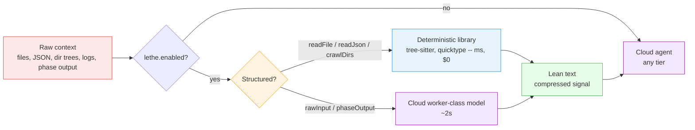
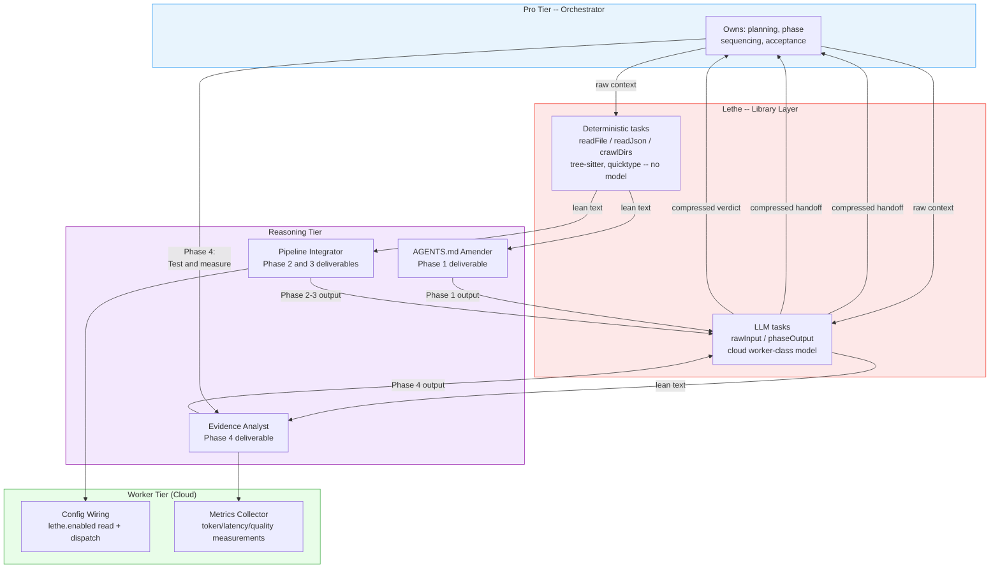

# H19 — Lethe: Hybrid Pre-Tokenization Filter

> **Project:** Virgil
> **Artifact type:** Feature handoff
> **Status:** Not started
> **Normative policy:** [`AGENTS.md`](../AGENTS.md)
> **Supersedes:** H19_MULTI_TIER_ORCHESTRATION (dropped — evidence absorbed into this handoff)
> **Predecessor:** SPIKE_MULTI_TIER_ORCHESTRATION, SPIKE_MULTI_TIER_ORCHESTRATION_DECISION,
> SPIKE_LOCAL_DMR_MINIONS (all dropped — evidence absorbed into this handoff)

The local, container-based model runner cannot act as a worker tier -- it lacks the reasoning capacity to
classify, review, or judge, and evidence has since shown it is not even the right tool for pre-tokenization
itself. This handoff formalizes a narrower, hybrid role: a pre-tokenization filter named Lethe that sits in
front of any cloud-tier agent, turning noisy raw context into lean text before a single cloud token is spent
on it. Structured raw material (source files, JSON payloads, directory trees) is reduced deterministically,
by parsing libraries, in milliseconds, with no model involved at all. Only unstructured text without a
deterministic shape -- raw logs, pasted output, phase-output prose -- still needs a model to compress, and
that model runs as a cloud worker-class agent, not on the local container runner.

## Menú

- [Allegory](#allegory)
- [Goal](#goal)
- [Supersession Note](#supersession-note)
- [AGENTS.md Amendment Scope](#agentsmd-amendment-scope)
- [Configuration](#configuration)
- [Pre-Tokenization Tasks](#pre-tokenization-tasks)
- [Pipeline Flow](#pipeline-flow)
- [Delegate Command as Execution Surface](#delegate-command-as-execution-surface)
- [Container Model Manifest](#container-model-manifest)
- [Implementation Plan](#implementation-plan)
- [Test Plan](#test-plan)
- [Progress Tracker](#progress-tracker)
- [Known Tradeoffs](#known-tradeoffs)
- [Out of Scope](#out-of-scope)

---

## Allegory

In Dante's *Purgatorio* (Canto XXVIII-XXXI), Lethe is the river that circles the summit of the mountain of
Purgatory. Before a soul may cross into Paradise, it drinks from Lethe and forgets the memory of its sin --
not everything, only what is unnecessary to carry forward. What remains is the essential self, unburdened
by the noise of what came before.

Virgil's architecture uses the same mechanism for context. Raw files, JSON payloads, directory trees, logs,
and other unstructured input are noisy: full of repetition, boilerplate, and low-signal bytes that cost
real money and real context window when handed directly to a cloud-tier agent. Lethe is the river a
codebase's raw material crosses before it reaches any cloud model. Deterministic parsing tools -- and, only
where no deterministic shape exists, a model -- read the raw input and compress it into lean, essential
text -- the noise is forgotten, only the signal survives. What flows out
the other side is small enough, and clean enough, to hand to any cloud agent regardless of which tier picks
up the work next.

[↑ Menú](#menú)

---

## Goal

Lethe is an **input filter**, not a worker with judgment. It is a `context → lean text` pipeline that runs
before the real model does anything. It never classifies, never reviews, never opines, never decides. It
only **reads** and **reduces**.

Lethe is a **hybrid** pipeline, not a local-model pipeline. Of its five task types, three compress
structured data with deterministic libraries -- no model, local or cloud, is involved at all -- and only two
compress genuinely unstructured text, where a deterministic parser has nothing to grab onto. Those two still
use a model, but that model runs as a cloud worker-class agent, not on the local container runner.

This is a hard design constraint, not a simplification for convenience. Evidence from three sources:

- **Spike decision** (`SPIKE_MULTI_TIER_ORCHESTRATION_DECISION.md`): the local pre-filter tier was
  configured but never exercised during Phase 2 — the cloud worker was faster and more capable for every
  mechanical task attempted. Verdict: DMR has no role as a general worker tier.
- **Session evidence** (spike/multi-tier-orchestration branch, 2026-09-03, Llama 3.2 3B via
  `pnpm delegate`): asked to *review* a policy diff, the model hallucinated three false findings in 12.8s
  (cited non-existent text, fabricated line references). Asked to *read and compress* file content into a
  structural summary, it produced correct and useful output in ~10s across 6 files -- but that took 10s
  where a deterministic parser takes milliseconds, with no hallucination risk at all.
- **Industry evidence**: Cursor removed embeddings from its retrieval pipeline in May 2025 in favor of a
  grep-first approach; Aider, Repomix, Stacklit, and ast-grep all converge on tree-sitter for structural
  code parsing rather than an LLM; and Virgil's own CodeGraph integration
  (`packages/cli/src/repo/codegraph.service.ts`) demonstrates measurable cost and token reductions from
  graph-based, deterministic indexing versus model-based summarization. The pattern across the
  industry is consistent: structured data is compressed deterministically, and a model is reserved for the
  genuinely unstructured remainder.

The local model can read; it cannot think, and for structured data it is not even the fastest or safest way
to read. Lethe is designed around both boundaries -- every task it is given is either a deterministic
extraction or, when no deterministic extraction exists, a compression task for a cloud model. Never a
judgment task, and never a task a library can already do in milliseconds.

[↑ Menú](#menú)

---

## Supersession Note

This handoff **replaces** the previous `H19_MULTI_TIER_ORCHESTRATION.md` (dropped — evidence absorbed
here). It is no longer the active plan.

The old H19 tried to make the local, container-based model runner a full worker tier inside the
orchestration topology -- routing mechanical tasks (reading, searching, classifying, formatting) to it
alongside cloud worker agents, on the assumption that a local model could substitute for a cheap cloud
worker on some fraction of tasks.

Evidence from the multi-tier orchestration spike decision and from this session disproved that
assumption:

- Phase 2 of the multi-tier spike completed four real tasks with zero rework using cloud worker and
  reasoning tiers only. The local pre-filter tier was configured but never exercised -- the cloud worker
  was faster and more capable for every mechanical task attempted.
- When this session directly tested the local model against a judgment task (reviewing a policy diff), it
  hallucinated three findings that did not exist.
- When tested against a compression task (reading and summarizing file content), it produced correct
  output.

The conclusion is narrower than the old plan assumed: the local model has exactly one defensible role --
pre-tokenization -- and no role as a general worker tier. H19 now documents that narrower role instead of
the abandoned general-worker ambition.

[↑ Menú](#menú)

---

## AGENTS.md Amendment Scope

The amendment narrows the local tier's definition in `AGENTS.md`. It does not add a new tier and does not
change the cloud tier boundaries (pro / reasoning / worker) established by the multi-tier decision.

**Following the hybrid pivot** (see [Goal](#goal)), the local tier has no role in Lethe's runtime path at
all: three task types run as deterministic library calls and two run against a cloud worker-class model.
The narrowing below still lands as a *ceiling* on `AGENTS.md` -- it defines what the local tier could be
trusted to do if a future implementation chose to exercise it (pre-tokenization only, never judgment) -- but
it no longer describes what Lethe invokes today. See [Out of Scope](#out-of-scope) for the status of
Docker Model Runner as a Lethe dependency.

| Before (old H19 assumption) | After (Lethe scope) |
| --- | --- |
| Local tier is a worker-tier candidate for mechanical tasks (reading, searching, classifying, formatting) | Local tier is scoped to pre-tokenization only: reading raw context and reducing it to lean text |
| "local-first for mechanical" routing language | "local for context reduction only" |
| Local tier competes with cloud worker tier for task assignment | Local tier is scoped to context reduction only and is routed pre-tokenization tasks exclusively, never general mechanical work |
| No explicit prohibition on judgment tasks | Explicit prohibition: local tier never classifies, triages, reviews, or opines |

Concrete edits required in `AGENTS.md`:

1. **Routing Heuristic** (Multi-Tier Orchestration Topology section): revert the numbered list from
   "Local first → Cloud worker fallback" to "Local for pre-tokenization only." Rule 1 must say the local
   tier handles context compression before cloud delegation, not mechanical tasks in general. Rules 2-4
   (cloud worker, reasoning, pro) remain unchanged.
2. **Common Routing table** (Model-Tier Routing section): update rows that say "Local model (preferred)"
   to "Local model (pre-tokenization only)" and remove local as an option for tasks beyond compression
   (classification, triage, documentation review).
3. **Tier Responsibility Table** (Multi-Tier Orchestration Topology section): narrow the `worker local`
   row's role to "Pre-tokenizes raw context" and its example tasks to the five Lethe task types only.
4. **Capability boundary**: add an explicit prohibition — the local tier reads and reduces; it does not
   classify, triage, review, or opine. Any task requiring judgment escalates to a cloud tier regardless of
   how mechanical it looks.
5. Leave the existing Local Minions Probe section as-is; Lethe narrows the local tier's routing role, it
   does not touch the probe's own findings.
6. Cite the design constraint evidence (session 2026-09-03: three hallucinated findings on a review task
   vs. correct summaries on compression tasks) as the rationale footnote for the boundary.

[↑ Menú](#menú)

---

## Configuration

Lethe is **optional and off by default**. It is controlled by a flag in `virgil.json`, with per-task-type
granularity so an adopter can enable the deterministic tasks (no infrastructure cost) independently of the
LLM-based tasks (cloud cost, network dependency):

```json
{
  "lethe": {
    "enabled": false,
    "tasks": {
      "readFile": true,
      "readJson": true,
      "crawlDirs": true,
      "rawInput": true,
      "phaseOutput": true
    }
  }
}
```

- **`lethe.enabled: false` (default):** all raw context flows directly to the cloud tier, unfiltered. This
  is the current, unchanged behavior -- Lethe introduces zero regression risk when off.
- **`lethe.enabled: true`:** the orchestrator **must** pass qualifying raw context (file content, JSON
  payloads, directory listings, raw text/logs, phase output) through Lethe before handing it to any
  cloud-tier agent, for every task type whose `lethe.tasks.<type>` flag is `true`. This is not a suggestion
  the orchestrator may skip when the flag is on -- enabling Lethe is a commitment to route through it.
- **Per-task granularity:** `readFile`, `readJson`, and `crawlDirs` gate deterministic library calls with no
  external dependency beyond the npm packages themselves. `rawInput` and `phaseOutput` gate calls to a cloud
  worker-class model and carry the latency and cost profile of any cloud-tier call. An adopter can enable
  the three deterministic tasks with confidence and leave the two LLM-based tasks off if cloud cost for
  pre-tokenization is a concern.

[↑ Menú](#menú)

---

## Pre-Tokenization Tasks

Lethe exposes five task types. Three are deterministic extractions with no model in the loop; two remain
LLM-based because their input has no deterministic shape to extract.

### readFile — deterministic (tree-sitter)

Compresses a single file's content into its essential structure: exports, functions, classes, key logic
flow, and notable constraints. Implemented as a **tree-sitter** AST parse followed by a query that extracts
exports, function/method signatures, and class shapes -- full method bodies and repeated boilerplate are
dropped in favor of shape and signal. No system prompt, no model call: the query is deterministic and runs
in roughly 10-50ms per file regardless of which downstream cloud agent consumes the result.

### readJson — deterministic (quicktype / json-to-zod)

Parses a JSON payload and extracts its shape rather than its full content: top-level keys, value types,
array element structure, and nesting depth. Implemented via **quicktype** or **json-to-zod** schema
inference -- deterministic schema extraction that runs in milliseconds with no model call.

### crawlDirs — deterministic (tree-sitter + file grouping, repo-map style)

Turns a raw directory listing into a lean manifest: files grouped by folder, counts by file type, and
notable naming patterns -- replacing a raw file-listing dump with a compact map. Implemented in the style of
Aider's repo-map: **tree-sitter** parses each file for top-level symbols and the results are grouped by
directory, producing a deterministic manifest in milliseconds. No system prompt, no model call.

### rawInput — LLM-based (cloud worker-class model)

Compresses unstructured text -- logs, pasted output, free-form notes -- down to unique, essential signal,
discarding repetition and boilerplate (repeated timestamps, stack trace noise, duplicate lines). This is the
only task type where LLM compression is justified: unstructured prose has no deterministic parser to lean
on. The model used is a **cloud worker-class model**, not the local container runner -- roughly 2s per call
versus 10-30s locally, with none of the hallucination risk a local model showed on judgment tasks.

```text
You are a compression filter. Read the raw text below and extract only the essential signal: key
facts, error messages, and unique content. Discard repetition, boilerplate, and noise. Do not
diagnose the cause, do not suggest a fix. Output only the compressed signal.
```

### phaseOutput — LLM-based (cloud worker-class model)

Compresses a reasoning-tier agent's phase output -- specifications, designs, task lists, analysis results --
into its essential deliverables and decisions, discarding intermediate reasoning and verbose prose. Like
`rawInput`, phase-output prose has no deterministic shape to extract, so it stays LLM-based, running against
a **cloud worker-class model** rather than the local runner.

```text
You are a compression filter. Read the phase output below and extract only the essential
deliverables: decisions made, artifacts produced, key findings, and unresolved items. Discard
intermediate reasoning, verbose justification, and redundant restatements. Output only the
compressed handoff summary.
```

[↑ Menú](#menú)

---

## Pipeline Flow



The pipeline branches twice: first on `lethe.enabled` (and its per-task `lethe.tasks` flags), then on task
type. When disabled, raw context flows straight to `E` unchanged. When enabled, `readFile`, `readJson`, and
`crawlDirs` payloads take the deterministic path (`B`) -- a library call, no network, no model, milliseconds.
`rawInput` and `phaseOutput` payloads take the cloud path (`C`) -- a worker-class model call, roughly 2s.
There is no local-model path in either branch. Lethe never sees the task the cloud agent is actually
solving -- it only sees the raw material and its task type
(`readFile` / `readJson` / `crawlDirs` / `rawInput` / `phaseOutput`).

[↑ Menú](#menú)

---

## Delegate Command as Execution Surface

`pnpm delegate` is Lethe's execution surface for exactly two of its five task types -- `rawInput` and
`phaseOutput`, the LLM-based tasks. It is **no longer the sole execution surface** for Lethe: the three
deterministic tasks (`readFile`, `readJson`, `crawlDirs`) call library APIs directly and never touch
`delegate` or any model backend.

### Deterministic tasks: library calls, not delegate

`readFile`, `readJson`, and `crawlDirs` are plain function calls against the relevant npm dependency (see
[Container Model Manifest](#container-model-manifest)):

```typescript
// readFile
const summary = extractStructuralSummary(fileContent); // tree-sitter query

// readJson
const schema = await inferSchema(jsonPayload); // quicktype or json-to-zod

// crawlDirs
const manifest = buildRepoMap(fileList); // tree-sitter + grouping, repo-map style
```

No CLI invocation, no system prompt, no model resolution chain. These are ordinary library calls the
orchestrator makes in-process.

### LLM tasks: `pnpm delegate`, targeting a cloud worker-class model

For `rawInput` and `phaseOutput`, the existing `delegate` command remains Lethe's CLI, run against a
**cloud worker-class model**, not the local container runner. No new command is introduced. Model resolution
for these two task types follows the existing cloud worker-tier resolution chain in `virgil.json`; it does
not use the `localMinions` local-model resolution path.

Existing options (already implemented, unchanged):

| Option | Required | Purpose |
| --- | --- | --- |
| `--prompt` | yes | The raw context to compress |
| `--system` | no | The task-type system prompt template |
| `--model` | no | Overrides the resolved model -- resolves to a cloud worker-class model, not a local one |
| `--max-tokens` | no | Caps output length |
| `--temperature` | no | Model sampling temperature |

Invocation per LLM task type:

```bash
# rawInput
pnpm delegate --prompt "$(cat raw-log.txt)" --system "$(cat prompts/raw-input.txt)"

# phaseOutput
pnpm delegate --prompt "$(cat phase-1-output.md)" --system "$(cat prompts/phase-output.txt)"
```

The result carries `content`, `model`, and `elapsed_ms` (existing `DelegateResultSchema`). The orchestrator
forwards `content` to the cloud tier and may log `elapsed_ms` for the latency measurement in the
[Test Plan](#test-plan).

[↑ Menú](#menú)

---

## Container Model Manifest

Docker Model Runner is **no longer a hard dependency** for Lethe. Of the five task types, three need no
model at all -- only npm dependencies -- and the remaining two need a cloud model, not a local container.

| Task type | Requirement | Detail |
| --- | --- | --- |
| `readFile` | npm dependency | `tree-sitter` + language grammars (native compilation required) |
| `readJson` | npm dependency | `quicktype` or `json-to-zod` |
| `crawlDirs` | npm dependency | `tree-sitter` + language grammars, reused from `readFile` |
| `rawInput` | cloud model config | Worker-class model, resolved via the existing cloud model-tier config -- no container, no compose manifest |
| `phaseOutput` | cloud model config | Same as `rawInput` |

The compose/Dockerfile infrastructure established during the local-runner spike (broker/executor isolation,
security hardening) is **not required to ship Lethe**. It remains available if a future local-model
alternative is added for the structured tasks (see [Out of Scope](#out-of-scope)), but Lethe's default path
carries no Docker dependency at all.

[↑ Menú](#menú)

---

## Implementation Plan

### Agent Topology



Lethe is now a **library layer**, not a model tier -- there is no "Local Tier" in the topology anymore.
It sits at two points in the pipeline:

1. **Before cloud ingestion**: raw context (files, JSON, directories, logs) is compressed before any cloud
   agent receives it. Structured context takes the deterministic path (`LD`); unstructured context takes
   the LLM path (`LM`).
2. **Between phase transitions**: when a reasoning-tier agent finishes a phase, its output is compressed
   via the `phaseOutput` task type (LLM-based, `LM`) before the orchestrator or the next phase receives it.
   This reduces token accumulation at handoff boundaries across multi-phase work.

The deterministic tasks are in-process library calls (see
[Container Model Manifest](#container-model-manifest)); only the two LLM tasks use the `pnpm delegate`
surface (see [Delegate Command as Execution Surface](#delegate-command-as-execution-surface)).

### Agent Roster

| Name | Tier | Scope |
| --- | --- | --- |
| Orchestrator | pro | Planning, phase sequencing, acceptance, synthesis across all phases |
| AGENTS.md Amender | reasoning | Phase 1: draft the narrowed local-tier scope and revert routing language |
| Pipeline Integrator | reasoning | Phase 2-3: wire the `lethe.enabled` check, deterministic/LLM task-type dispatch, and dependency wiring |
| Evidence Analyst | reasoning | Phase 4: synthesize test results into an adopt/adapt/abandon verdict |
| Config Wiring | worker (cloud) | Phase 2: implement the config read and per-task-type dispatch logic |
| Metrics Collector | worker (cloud) | Phase 4: record token, latency, and quality measurements per test run |
| Lethe -- deterministic (`readFile` / `readJson` / `crawlDirs`) | library | All phases: in-process compression via tree-sitter / quicktype, no model call |
| Lethe -- LLM (`rawInput` / `phaseOutput`) | worker (cloud) | All phases: the LLM-based pre-tokenization filter, invoked via `pnpm delegate` against a cloud worker-class model |

### Phases

**Phase 1 -- AGENTS.md Amendment**

1. Draft the narrowed local-tier scope per [AGENTS.md Amendment Scope](#agentsmd-amendment-scope).
2. Revert "local-first for mechanical" language to "local for context reduction only."
3. Update the Model-Tier Routing table's local-tier row.
4. Orchestrator reviews and accepts the amendment.

**Phase 2 -- Pipeline Wiring**

1. Implement the `lethe.enabled` and per-task `lethe.tasks` config read at context-assembly time.
2. Implement task-type classification of raw context (file / JSON / directory tree / raw text / phase output).
3. Wire the three deterministic task types (`readFile`, `readJson`, `crawlDirs`) to their library calls
   (tree-sitter, quicktype/json-to-zod); wire the two LLM task types (`rawInput`, `phaseOutput`) to their
   `pnpm delegate` invocation against a cloud worker-class model.
4. Implement graceful degradation for the LLM path: if the cloud model call fails, skip Lethe and route raw
   context directly to the cloud tier unfiltered instead of crashing. The deterministic path has no
   external service to degrade from -- a parse failure falls back to the raw file content directly.
5. Confirm the disabled-by-default fallback leaves existing behavior unchanged.

**Phase 3 -- Dependencies**

1. Add `tree-sitter` (with language grammars) and `quicktype` or `json-to-zod` as npm dependencies for the
   three deterministic tasks.
2. Configure the cloud worker-class model used by `rawInput` and `phaseOutput` via the existing cloud
   model-tier config -- no compose manifest, no container, no version pin required.
3. Confirm native compilation of the tree-sitter grammars succeeds in the target install environment (see
   [Known Tradeoffs](#known-tradeoffs)).

**Phase 4 -- Test and Validate**

1. Enable `lethe.enabled: true` for a test session.
2. Run the [Test Plan](#test-plan) matrix.
3. Evidence Analyst synthesizes results into an adopt/adapt/abandon verdict.
4. Orchestrator reviews and accepts the verdict.

[↑ Menú](#menú)

---

## Test Plan

The test plan's purpose is to force real orchestrator work through Lethe and measure whether the filter
earns its place in the pipeline.

### Forcing Lethe Usage

For the duration of the test, `lethe.enabled` is set to `true` and the orchestrator is required to route
every qualifying raw-context payload through the matching pre-tokenization task before any cloud-tier call.
No manual bypass is permitted during the test window -- a skipped Lethe call is a test failure, not a
convenience.

### Test Matrix

| Task type | Test scenario |
| --- | --- |
| `readFile` | Compress a real source file before handing it to a cloud reasoning-tier agent for review |
| `readJson` | Compress a real config or schema payload before a cloud agent needs its shape |
| `crawlDirs` | Compress a real directory listing before a cloud agent needs a repository map |
| `rawInput` | Compress a real log or paste-in before a cloud agent needs its signal |
| `phaseOutput` | Compress a reasoning-tier agent's phase output before the orchestrator or next phase receives it |

### Measurements

| Metric | How to Measure | What "no regression" means |
| --- | --- | --- |
| Cloud token savings | Approximate via `/cost` snapshots before and after each delegation (exact per-agent token accounting is not available in the current harness — directional comparison only) | Lethe-filtered run consumes directionally fewer cloud tokens than the unfiltered baseline |
| Latency overhead | Wall-clock time added by the pre-tokenization hop -- `elapsed_ms` from the delegate result for `rawInput`/`phaseOutput`, in-process timing for `readFile`/`readJson`/`crawlDirs` | Deterministic tasks should add single-digit-to-low-double-digit milliseconds; LLM tasks should stay low enough that token savings are not negated by wasted orchestrator wait time |
| Quality preservation | Compare the downstream cloud agent's output quality with vs. without Lethe pre-filtering | No loss of correctness or completeness attributable to information dropped during compression |

### Evidence

- Before/after token counts per task type.
- `elapsed_ms` per delegate call.
- A brief pass/fail assessment per task type: did compression preserve everything the downstream cloud
  agent needed?

[↑ Menú](#menú)

---

## Progress Tracker

- [x] Assignment accepted
- [x] Phase 1: `AGENTS.md` local-tier scope narrowed to pre-tokenization only
- [x] Phase 1: "local-first for mechanical" language reverted to "local for context reduction only"
- [x] Phase 1: Model-Tier Routing table local-tier row updated
- [ ] Phase 2: `lethe.enabled` and `lethe.tasks` config read wired at context-assembly time
- [ ] Phase 2: Deterministic dispatch implemented for `readFile` / `readJson` / `crawlDirs` (tree-sitter, quicktype/json-to-zod)
- [ ] Phase 2: LLM dispatch implemented for `rawInput` / `phaseOutput` against a cloud worker-class model
- [ ] Phase 2: Graceful degradation implemented for the LLM path (try/fallback on cloud model failure)
- [ ] Phase 2: Disabled-by-default fallback verified unchanged
- [ ] Phase 3: `tree-sitter` and `quicktype`/`json-to-zod` npm dependencies added and native compilation verified
- [ ] Phase 3: Cloud worker-class model wired for `rawInput` / `phaseOutput` via existing model-tier config
- [ ] Phase 4: Test matrix executed with `lethe.enabled: true`
- [ ] Phase 4: Token savings, latency overhead, and quality preservation measured per task type
- [ ] Phase 4: Adopt/adapt/abandon verdict written
- [ ] Handoff completion report produced

[↑ Menú](#menú)

---

## Known Tradeoffs

| Tradeoff | Detail |
| --- | --- |
| Latency cost (LLM tasks only) | `rawInput` and `phaseOutput` still cross a network hop to a cloud worker-class model, roughly 2s per call. The three deterministic tasks add no meaningful latency (~10-50ms) and carry no cost here at all. |
| Compression fidelity (LLM tasks only) | A cloud worker-class model may still drop signal a larger model would have kept when compressing `rawInput` or `phaseOutput`. Quality preservation is the primary risk for these two task types and must be measured in Phase 4. The three deterministic tasks have no fidelity risk of this kind -- they extract structure mechanically rather than summarizing it, so there is nothing to hallucinate. |
| Native dependency risk | `tree-sitter` and its language grammars require native compilation at install time. This can fail or behave inconsistently across operating systems, Node versions, or CI environments in ways a pure-JS dependency would not. This is a new class of installation risk that Lethe did not carry when every task type ran through a container. |
| Not all tasks benefit equally | Structured data (JSON schemas, directory trees, source files) now compresses deterministically and benefits fully. `rawInput` and `phaseOutput` remain LLM-based because no deterministic parser exists for free-form prose -- Phase 4 should still confirm these two task types earn their keep against the alternative of sending the raw text uncompressed. |

[↑ Menú](#menú)

---

## Out of Scope

- Making the local, container-based model runner a general worker tier -- this is the exact ambition the
  [Supersession Note](#supersession-note) retires. Lethe is a filter, not a worker.
- Any judgment task (review, triage, classification, opinion) assigned to the local tier, regardless of
  how mechanical it appears.
- New CLI surface beyond the existing `delegate` command for the two LLM-based task types -- Lethe reuses
  it rather than adding one.
- Selecting the specific cloud worker-class model for `rawInput` and `phaseOutput` -- that follows the
  existing cloud model-tier policy and is not a Lethe-specific decision.
- Docker Model Runner / the local container runner as part of Lethe. It is no longer a Lethe dependency for
  any of the five task types. If future local models improve enough to compete with deterministic libraries
  on accuracy and with cloud models on latency, they could be reconsidered as an alternative for the
  structured tasks, but that would be a separate decision made against fresh evidence, not a default path.

[↑ Menú](#menú)
