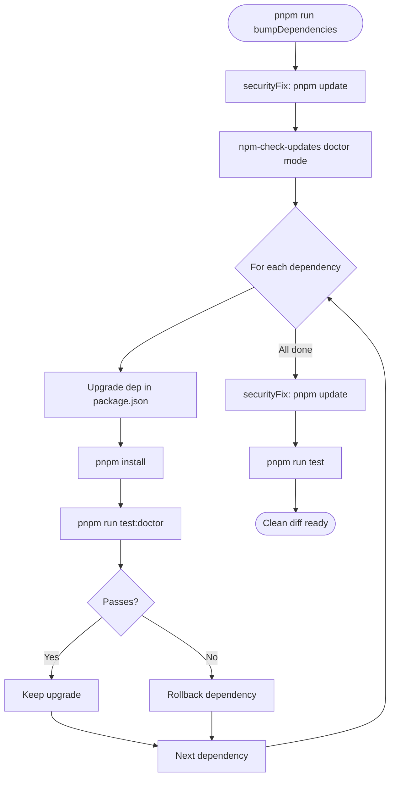
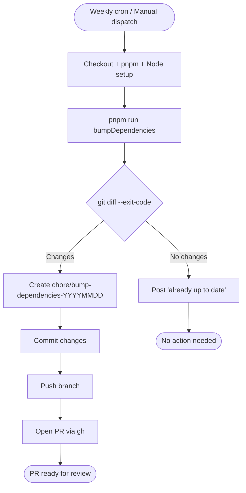

# H20 — Eunoe: Dependency Bump Pipeline

> **Project:** Virgil
> **Artifact type:** Feature handoff
> **Status:** Not started
> **Normative policy:** [`AGENTS.md`](../AGENTS.md)
> **Prior art:** `virgenherrera` (Gen 3), `fullstack-base` (Gen 2)

## Menú

- [Allegory](#allegory)
- [Goal](#goal)
- [Prior Art Summary](#prior-art-summary)
- [Echo System Integration](#echo-system-integration)
- [Configuration](#configuration)
- [Pipeline Flow](#pipeline-flow)
- [Security Sandwich Pattern](#security-sandwich-pattern)
- [CI Automation](#ci-automation)
- [Implementation Plan](#implementation-plan)
- [Test Plan](#test-plan)
- [Team Plan](#team-plan)
- [Acceptance Criteria](#acceptance-criteria)
- [Progress Tracker](#progress-tracker)
- [Known Tradeoffs](#known-tradeoffs)
- [Out of Scope](#out-of-scope)

---

## Allegory

In Dante's *Purgatorio* (Canto XXVIII–XXXIII), after souls drink from Lethe and forget their sins, they
cross to the other bank of the stream and drink from Eunoe — the river of good memory. What Lethe erases,
Eunoe restores: the memory of every virtuous act, every improvement earned. Without Eunoe, the soul would
be blank — cleansed but empty. The two rivers flow from a single spring in the Garden of Eden at the summit
of Mount Purgatory; Matelda guides Dante to drink from both.

Virgil's dependency pipeline works the same way. The project's dependencies are not static — upstream
maintainers fix bugs, patch CVEs, improve performance, add features. These improvements are the project's
"good memory" — earned by the ecosystem, waiting to be absorbed. Eunoe is the pipeline that remembers: it
checks the npm registry for what has improved since the last bump, tests each improvement against the
project's own quality gates, keeps what passes, and rolls back what doesn't. What flows out the other side
is a project that has absorbed every safe improvement the ecosystem offers — its dependencies renewed, not
just cleaned.

Where Lethe (H19) strips noise from raw context before a cloud token is spent, Eunoe carries forward what
the ecosystem has learned since the last cycle. One forgets; the other remembers. Both serve the same end:
a leaner, stronger project.

[↑ Menú](#menú)

---

## Goal

Eunoe is a **maintenance pipeline**, not a runtime feature. It reads the pnpm catalog and workspace
`package.json` files, queries the npm registry for newer versions, upgrades each dependency one at a time
while validating each upgrade against the project's quality gates, and produces a clean diff of all safe
upgrades. It never deploys, never releases, never changes behavior — it only updates version pins.

The pipeline has two operational modes:

1. **Local manual** — developer runs `pnpm run bumpDependencies` from root.
2. **CI automated** — GitHub Actions runs weekly on cron, opens a PR with the diff.

This is a **script composition**, not a NestJS command. The feature lives entirely in npm scripts,
`.ncurc.json`, and a GitHub Actions workflow. It does not belong in `packages/tools` or any NestJS module —
it orchestrates existing tooling (`npm-check-updates`, `pnpm update`, `pnpm audit`) through the echo system
pattern established across `virgenherrera`, `fullstack-base`, and other projects in the owner's ecosystem.

[↑ Menú](#menú)

---

## Prior Art Summary

The `bumpDependencies` pattern has evolved across the owner's repositories through three generations:

| Generation | Repos | Pattern | Key Addition |
|------------|-------|---------|-------------|
| Gen 1 | `typescript-base`, `react-base`, `jest-api-test-base`, `lan-file-share` | Inline NCU with doctor mode | `pnpm dlx npm-check-updates -u --doctor` |
| Gen 2 | `fullstack-base`, `nest-base`, `angular-base` | Security sandwich + `.ncurc.json` | `securityFix → NCU → securityFix` |
| Gen 3 | `virgenherrera` (profile monorepo) | Full pipeline + CI automation | `+ pnpm run test` final gate + GitHub Actions weekly cron + auto-PR |

**Key evolution decisions:**
- Gen 2 externalized NCU config to `.ncurc.json` — no more inline flags.
- Gen 2 introduced the security sandwich — `pnpm update` before AND after NCU.
- Gen 3 added a final `pnpm run test` after the sandwich — integrated validation.
- Gen 3 added GitHub Actions with weekly cron + manual dispatch + auto-PR.
- Gen 3 removed workspace-level `bumpDependencies` scripts — root orchestrates everything.

**Virgil inherits Gen 3** with adaptations for its own echo system and catalog-based dependency strategy.

[↑ Menú](#menú)

---

## Echo System Integration

The "echo system" is the pattern where every script name is reused identically across all contexts — root,
workspace, CI, pre-commit. `bumpDependencies` participates in this echo system through the following scripts:

### New Scripts (to be added)

| Script | Location | Definition | Category |
|--------|----------|------------|----------|
| `bumpDependencies` | root | `pnpm run securityFix && pnpm dlx npm-check-updates@22 && pnpm run securityFix && pnpm run test` | maintenance |
| `securityFix` | root | `pnpm update` | maintenance |
| `securityCheck` | root | `pnpm audit --audit-level high` | maintenance |
| `test:doctor` | root | `pnpm run cleanup && pnpm run build && pnpm -r run --if-present test:doctor && pnpm run validate:exact-deps` | composite |
| `test:doctor` | `packages/cli` | `pnpm run test:static && pnpm run test:dynamic` | composite |
| `test:doctor` | `packages/tools` | `pnpm run test:static && pnpm run test:dynamic` | composite |
| `test:doctor` | `packages/pw-cdp` | `pnpm run test:static && pnpm run build` | composite |
| `test:doctor` | `packages/local-indexers` | `pnpm run test:static && pnpm run build` | composite |

### Execution Context Matrix

| Script | Local manual | CI cron | lint-staged | pre-commit | pre-push |
|--------|-------------|---------|-------------|------------|----------|
| `bumpDependencies` | ✅ | ✅ | — | — | — |
| `securityFix` | ✅ (via bump) | ✅ (via bump) | — | — | — |
| `securityCheck` | ✅ (standalone) | — | — | — | — |
| `test:doctor` | ✅ (via NCU) | ✅ (via NCU) | — | — | — |

### Existing Scripts Leveraged

| Script | Role in Pipeline |
|--------|-----------------|
| `cleanup` | Fresh install before test:doctor |
| `build` | Compile all workspaces |
| `test:static` | Lint + prettier + tsc + validate-exact-deps + audit |
| `test:dynamic` | Vitest integration tests (97% threshold) |
| `test` | Full validation after all bumps |

[↑ Menú](#menú)

---

## Configuration

### `.ncurc.json` (new file at project root)

```json
{
  "$schema": "https://raw.githubusercontent.com/raineorshine/npm-check-updates/main/src/types/RunOptions.json",
  "doctor": true,
  "doctorTest": "pnpm run test:doctor",
  "enginesNode": true,
  "format": ["group"],
  "packageManager": "pnpm",
  "reject": ["pnpm"],
  "upgrade": true
}
```

### Configuration Rationale

| Field | Value | Why |
|-------|-------|-----|
| `doctor` | `true` | Upgrades one dep at a time, runs test:doctor after each, rolls back on failure |
| `doctorTest` | `pnpm run test:doctor` | Lighter than full `test` — skips final integration; fast enough for per-dep validation |
| `enginesNode` | `true` | Respects `engines.node` field — skips upgrades incompatible with Node 24 |
| `reject` | `["pnpm"]` | pnpm is managed via corepack, not NCU |
| `upgrade` | `true` | Applies upgrades directly to `package.json` |
| `format` | `["group"]` | Groups output by dependency type for readability |

### Existing Infrastructure (already in place)

| File | Relevant Setting | Role |
|------|-----------------|------|
| `pnpm-workspace.yaml` | `saveExact: true`, `savePrefix: ""` | Ensures bumped versions remain exact |
| `pnpm-workspace.yaml` | `minimumReleaseAge: 1440` | 24h quarantine for new packages |
| `pnpm-workspace.yaml` | `minimumReleaseAgeExclude: []` | Escape hatch for bump-cycle exceptions |
| `pnpm-workspace.yaml` | `catalog:` section | Single source of truth for shared dep versions |
| `scripts/validate-exact-deps.mjs` | Rejects `^`, `~`, `>=`, `*`, `latest` | Post-bump safety net via test:static |

[↑ Menú](#menú)

---

## Pipeline Flow

### Main Pipeline



### test:doctor Composite (root)


### CI Pipeline



[↑ Menú](#menú)

---

## Security Sandwich Pattern

`securityFix` (`pnpm update`) runs **before** and **after** NCU. This is not redundant — each pass serves a
distinct purpose:

- **Pre-fix**: resolves known CVEs in transitive dependencies BEFORE upgrades, so doctor mode does not fail
  on pre-existing audit issues that are unrelated to the dependency being tested.
- **Post-fix**: re-resolves transitive dependencies AFTER upgrades, cleaning up any new audit issues
  introduced by upgraded packages' dependency trees.

`securityFix` is intentionally **excluded** from `test:doctor` because audit failures would create a paradox
where current CVEs prevent their own remediation. If `test:doctor` included `pnpm audit` and a transitive
CVE existed, every single dependency upgrade would fail the doctor test — not because the upgrade is bad, but
because the audit was already failing before the upgrade started.

[↑ Menú](#menú)

---

## CI Automation

### `.github/workflows/bump-dependencies.yml`

```yaml
name: Bump Dependencies
on:
  schedule:
    - cron: '0 9 * * 1'  # Mondays 9:00 UTC
  workflow_dispatch:

concurrency:
  group: bump-dependencies
  cancel-in-progress: true

jobs:
  bump:
    runs-on: ubuntu-latest
    steps:
      - uses: actions/checkout@v4
      - uses: pnpm/action-setup@v4
      - uses: actions/setup-node@v4
        with:
          node-version-file: '.node-version'
          cache: 'pnpm'
      - run: pnpm install --frozen-lockfile
      - run: pnpm run bumpDependencies
      - name: Check for changes
        id: diff
        run: |
          if git diff --quiet; then
            echo "changes=false" >> "$GITHUB_OUTPUT"
          else
            echo "changes=true" >> "$GITHUB_OUTPUT"
          fi
      - name: Create PR
        if: steps.diff.outputs.changes == 'true'
        env:
          GH_TOKEN: ${{ secrets.GITHUB_TOKEN }}
        run: |
          BRANCH="chore/bump-dependencies-$(date +%Y%m%d)"
          git config user.name "github-actions[bot]"
          git config user.email "41898282+github-actions[bot]@users.noreply.github.com"
          git checkout -b "$BRANCH"
          git add -A
          git commit -m "chore: bump dependencies $(date +%Y-%m-%d)"
          git push -u origin "$BRANCH"
          gh pr create \
            --title "chore: bump dependencies $(date +%Y-%m-%d)" \
            --body "Automated dependency bump via Eunoe pipeline (H20)." \
            --base development
      - name: No changes
        if: steps.diff.outputs.changes == 'false'
        run: echo "All dependencies are up to date."
```

[↑ Menú](#menú)

---

## Implementation Plan

### Phase 1: Scripts and Configuration

Add the script composition and NCU configuration to the project.

**Deliverables:**
- `.ncurc.json` at project root
- Root `package.json`: add `bumpDependencies`, `securityFix`, `securityCheck`, `test:doctor`
- `packages/cli/package.json`: add `test:doctor`
- `packages/tools/package.json`: add `test:doctor`
- `packages/pw-cdp/package.json`: add `test:doctor`
- `packages/local-indexers/package.json`: add `test:doctor`

### Phase 2: Quality Gates Verification

Verify that the pipeline integrates correctly with existing quality infrastructure.

**Deliverables:**
- `test:doctor` root composite executes correctly (cleanup → build → test:static → test:dynamic)
- `validate-exact-deps.mjs` passes after a bump cycle
- `minimumReleaseAge` quarantine is respected by pnpm during bump
- Existing `test:static` and `test:dynamic` gates remain green

### Phase 3: CI Automation

Add the GitHub Actions workflow for automated weekly bumps.

**Deliverables:**
- `.github/workflows/bump-dependencies.yml`
- Weekly cron (Mondays 9:00 UTC) + manual dispatch trigger
- Auto-branch + auto-PR creation targeting `development`
- Concurrency guard (one run at a time)

### Phase 4: Validation

Manual validation of the full pipeline in both local and CI contexts.

**Deliverables:**
- Local bump cycle executed and verified
- Doctor rollback verified on intentionally breaking upgrade
- Security sandwich verified (transitive CVE resolution)
- CI workflow dry-run validated via `workflow_dispatch`

[↑ Menú](#menú)

---

## Test Plan

`bumpDependencies` is a script composition — its validation is the pipeline itself, not a NestJS test suite.

### Automated Validation (via doctor mode)

Each dependency upgrade is individually validated by `test:doctor`, which includes:
- `cleanup` — fresh `pnpm install`
- `build` — TypeScript compilation across all workspaces
- `test:static` — lint, prettier, tsc, `validate-exact-deps.mjs`, audit
- `test:dynamic` — Vitest integration tests (97% threshold)

### Manual Validation Matrix

| Scenario | Expected Result |
|----------|----------------|
| All deps up to date | NCU reports no upgrades, no diff |
| One outdated dep available | Upgrade applied, test:doctor passes, kept |
| Breaking upgrade available | test:doctor fails, upgrade rolled back |
| Transitive CVE exists | securityFix (pre) resolves it before NCU runs |
| Post-upgrade transitive CVE | securityFix (post) resolves it after NCU completes |
| Package published < 24h ago | pnpm install rejects it (minimumReleaseAge) |
| Floating version introduced | validate-exact-deps.mjs catches it in test:static |
| CI workflow with changes | Branch created, PR opened targeting development |
| CI workflow without changes | "Already up to date" summary posted |

[↑ Menú](#menú)

---

## Team Plan

### Phase 1: Implementation (2 parallel agents)

| Agent | Scope | Files |
|-------|-------|-------|
| **Agent A** — Scripts Writer | Add all scripts to root and workspace package.jsons | `package.json` (root + 4 workspaces) |
| **Agent B** — Config Writer | Create `.ncurc.json` | `.ncurc.json` |

### Phase 2: Verification (1 agent)

| Agent | Scope |
|-------|-------|
| **Agent C** — Pipeline Verifier | Run `test:doctor` from root, verify it executes the full composite, confirm all gates pass |

### Phase 3: CI (1 agent)

| Agent | Scope | Files |
|-------|-------|-------|
| **Agent D** — CI Writer | Create GitHub Actions workflow | `.github/workflows/bump-dependencies.yml` |

### Phase 4: Adversarial Review (2 parallel judges)

| Agent | Role |
|-------|------|
| **Judge A** | Review implementation against acceptance criteria — scripts, config, CI, echo system consistency |
| **Judge B** | Review implementation AND handoff quality — accuracy of diagrams, completeness of progress tracker, tradeoff honesty |

Judges work independently and blind to each other. Findings are synthesized by the orchestrator. Confirmed
issues are fixed before the handoff is marked complete.

[↑ Menú](#menú)

---

## Acceptance Criteria

### Implementation Quality

1. `pnpm run bumpDependencies` executes the full pipeline: securityFix → NCU doctor → securityFix → test
2. `.ncurc.json` exists at root with doctor mode, pnpm rejection, enginesNode
3. `test:doctor` script exists in root and all 4 workspace `package.json` files
4. `securityFix` and `securityCheck` scripts exist in root `package.json`
5. `validate-exact-deps.mjs` passes after a bump cycle (no floating versions)
6. `npm-check-updates` version is pinned exactly in the `bumpDependencies` script
7. Doctor mode rolls back a dependency that breaks `test:doctor`
8. `.github/workflows/bump-dependencies.yml` exists with weekly cron + manual dispatch
9. CI workflow creates a branch and PR targeting `development` when changes exist
10. CI workflow reports "already up to date" when no changes exist
11. No existing scripts are broken by the additions
12. Echo system consistency: script names match the established pattern across the owner's ecosystem

### Handoff Quality

13. Allegory follows Dante convention and connects meaningfully to the feature
14. Mermaid diagrams accurately represent the pipeline flow
15. Echo system integration table is complete and accurate
16. Security sandwich rationale is documented with the paradox explanation
17. All phases have clear deliverables and team assignments
18. Progress tracker covers all phases with granular checkboxes
19. Known tradeoffs section documents real limitations, not padding
20. Prior art summary accurately represents the three generations

[↑ Menú](#menú)

---

## Progress Tracker

- [ ] Assignment accepted
- [ ] Phase 1: `.ncurc.json` created at project root
- [ ] Phase 1: `bumpDependencies` script added to root `package.json`
- [ ] Phase 1: `securityFix` script added to root `package.json`
- [ ] Phase 1: `securityCheck` script added to root `package.json`
- [ ] Phase 1: `test:doctor` script added to root `package.json`
- [ ] Phase 1: `test:doctor` script added to `packages/cli/package.json`
- [ ] Phase 1: `test:doctor` script added to `packages/tools/package.json`
- [ ] Phase 1: `test:doctor` script added to `packages/pw-cdp/package.json`
- [ ] Phase 1: `test:doctor` script added to `packages/local-indexers/package.json`
- [ ] Phase 2: `test:doctor` root composite verified
- [ ] Phase 2: `validate-exact-deps.mjs` integration verified post-bump
- [ ] Phase 2: Existing `test:static` and `test:dynamic` gates remain green
- [ ] Phase 3: `.github/workflows/bump-dependencies.yml` created
- [ ] Phase 3: Weekly cron + manual dispatch configured
- [ ] Phase 3: Auto-branch + auto-PR logic implemented
- [ ] Phase 3: Concurrency guard configured
- [ ] Phase 4: Local bump cycle validated
- [ ] Phase 4: Doctor rollback verified on breaking upgrade
- [ ] Phase 4: Security sandwich verified
- [ ] Phase 4: CI workflow validated via `workflow_dispatch`
- [ ] Adversarial review completed
- [ ] Handoff completion report produced

[↑ Menú](#menú)

---

## Known Tradeoffs

1. **NCU doctor mode is slow.** It upgrades one dependency at a time, running the full test suite after each.
   For a project with 30+ catalog entries and a multi-minute test suite, a full bump cycle can take hours.
   This is intentional — safety over speed.

2. **Catalog-only bump.** NCU bumps the root `package.json` dependencies. Catalog entries in
   `pnpm-workspace.yaml` propagate to workspaces via the `catalog:` protocol, but non-catalog exact pins in
   individual workspace `package.json` files (e.g., `tree-sitter` in `packages/tools`) are NOT bumped by the
   root script. These require manual attention or a separate workspace-scoped NCU run.

3. **NCU cannot bump `catalog:` protocol entries.** Dependencies declared as `catalog:` in workspace
   `package.json` files resolve to versions in `pnpm-workspace.yaml`'s catalog section. NCU does not
   understand the `catalog:` protocol and cannot modify the catalog file. `securityFix` (`pnpm update -r`)
   resolves transitive updates within existing ranges, but bumping catalog entries to new major or minor
   versions requires manual editing of `pnpm-workspace.yaml` followed by running the test suite. Non-catalog
   exact pins in workspace `package.json` files (e.g., `tree-sitter` in `packages/tools`) are discoverable
   by NCU in workspace mode.

4. **No lockfile-only bumps.** NCU operates on `package.json` versions. Transitive dependency updates within
   existing semver ranges are handled by `securityFix` (`pnpm update`), not by NCU.

5. **minimumReleaseAge trades freshness for safety.** The 24h quarantine blocks the latest patches for a day.
   The `minimumReleaseAgeExclude` array is the escape hatch for verified-safe packages during a bump cycle.

6. **pnpm self-update excluded.** pnpm is rejected from NCU because it is managed via corepack. Requires
   separate manual update via `corepack up`.

7. **CI creates PRs, not direct commits.** The GitHub Actions workflow creates a branch and opens a PR — it
   never pushes directly to `development` or `main`. This is a deliberate safety boundary: a human reviews
   the diff before merging.

[↑ Menú](#menú)

---

## Out of Scope

- Automatic major version migration strategies (breaking changes require manual intervention)
- Breaking change detection beyond test:doctor pass/fail
- Dependency license auditing
- Dependency size or bundle impact analysis
- Custom NestJS command in `packages/tools` (script composition is sufficient for this feature)
- Changelog generation from dependency updates
- Notification system for failed bumps (CI handles this via PR status and GitHub notifications)
- Workspace-level `bumpDependencies` scripts (removed in Gen 3 — root orchestrates everything)

[↑ Menú](#menú)
