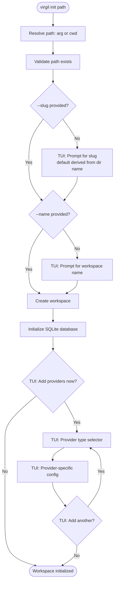

# H21 — Matelda: TUI/CLI Command Surface

> **Project:** Virgil
> **Artifact type:** Feature handoff
> **Status:** Not started
> **Normative policy:** [`AGENTS.md`](../AGENTS.md)
> **Dependencies:** H03, H04, H05, H06, H07, H13, H15
> **Prior art:** nest-commander 3.21.0, `@inquirer/prompts`, [`ideas-de-uso-tui.md`](../ideas-de-uso-tui.md)

## Menu

- [Allegory](#allegory)
- [Goal](#goal)
- [Prior Art](#prior-art)
- [Current CLI Surface](#current-cli-surface)
- [Dual-Mode Pattern](#dual-mode-pattern)
- [Command Taxonomy](#command-taxonomy)
- [Prerequisites and Gaps](#prerequisites-and-gaps)
- [Module Wiring Plan](#module-wiring-plan)
- [Init Flow](#init-flow)
- [Implementation Plan](#implementation-plan)
- [Test Plan](#test-plan)
- [Team Plan](#team-plan)
- [Acceptance Criteria](#acceptance-criteria)
- [Progress Tracker](#progress-tracker)
- [Known Tradeoffs](#known-tradeoffs)
- [Out of Scope](#out-of-scope)

---

## Allegory

In *Purgatorio* Canto XXVIII, after ascending through every terrace of Purgatory, Dante enters the Earthly
Paradise -- a perfect garden at the summit. There he meets **Matelda**, a woman who sings and gathers flowers
on the far bank of a clear stream. She explains the garden's nature, the origin of the two rivers -- Lethe,
which erases sin, and Eunoe, which restores the memory of good deeds -- and guides Dante to drink from both
in the correct order. Without her, Dante would stand at the edge of paradise and not know which water to
drink, or when, or why.

Matelda is the **interface**. She does not create the rivers (the services already exist in H03-H15). She
guides the traveler to them. When Dante knows where he is going, he walks directly -- that is CLI mode:

```text
virgil repo add ~/projects/api api-service
```

When he does not know, Matelda appears and guides him through -- that is TUI mode:

```text
virgil repo add
? Path to the repository: ~/projects/api
? Alias (optional): api-service
Repository registered in workspace "acme-corp".
```

Where Lethe (H19) strips noise from context and Eunoe (H20) carries forward ecosystem improvements,
Matelda is the moment of interaction -- the surface through which the developer (or agent) reaches every
capability Virgil has built.

[^ Menu](#menu)

---

## Goal

Virgil is a **tooling product** -- it provides CLI commands (and future MCP/skill exposure) for human
engineers and AI agents (Claude, Gemini, OpenCode) to manage workspaces, repos, knowledge, providers,
and governance. Virgil does not autonomously discover, orchestrate, or generate handoffs. Agents do that.
Virgil provides them the tools.

Build the **dual-mode TUI/CLI command surface** for the Virgil NestJS product using `@inquirer/prompts`
for interactive prompt integration.

Every command operates in two modes:

1. **CLI mode** -- all arguments and options provided directly. Scriptable, pipeable, agent-callable.
   ```text
   virgil repo add ~/projects/api api-service
   ```

2. **TUI mode** -- invoked without required arguments. Prompts guide the user through arrow-key
   selection, text input, confirmation dialogs, and multi-select checkboxes.
   ```text
   virgil repo add
   ? Path to the repository: ~/projects/api
   ? Alias (optional): api-service
   Repository "api-service" registered in workspace "acme-corp".
   ```

This is a **command-surface handoff**, not a service-layer handoff. Every command maps to an existing
NestJS service defined in a prior handoff (H03-H15). No new business logic is introduced. The commands
are thin wiring: parse args/options or ask via prompts, call the service, format the output.

The existing `workspace` commands (create, list, select, show, delete) already follow the CLI pattern.
Matelda adds prompt integration and extends the command surface to cover every domain module.

[^ Menu](#menu)

---

## Prior Art

### nest-commander

nest-commander 3.21.0 (already in use) provides the command registration framework. This handoff uses
nest-commander for command and subcommand registration (`@Command`, `@SubCommand`, `CommandRunner`) but
**does not use** its built-in inquirer integration (`@QuestionSet`, `@Question`, `InquirerService`).

nest-commander's inquirer integration bundles inquirer 8.2.7 (CJS) and uses a decorator-based question
set pattern. This pattern is skipped in favor of direct `@inquirer/prompts` usage for three reasons:

1. `InquirerService` is registered internally by `CommandRunnerModule.forModule()` during
   `CommandFactory.run()` and is **not** available in `Test.createTestingModule` bootstraps.
2. inquirer 8.x is CJS; `packages/cli` is ESM (`"type": "module"`).
3. The decorator pattern adds indirection without adding value over direct prompt calls.

### Prompt Library Evaluation

| Library | Status | Notes |
|---------|--------|-------|
| **`@inquirer/prompts`** | **Chosen** | ESM-native, same author as inquirer, native TypeScript, modular per-prompt imports, actively maintained |
| `inquirer` 8.x | Evaluated | Bundled by nest-commander as transitive dependency. CJS, aging, monolithic bundle |
| `@clack/prompts` | Evaluated | Beautiful DX, modern API, but fewer prompt types (no editor, no expand, no rawlist) |
| `prompts` (terkelg) | Evaluated | Lightweight, clean API, but low maintenance activity |

`@inquirer/prompts` is added as a **direct dependency** of `packages/cli`. No `@types/inquirer` is
needed -- `@inquirer/prompts` ships native TypeScript definitions. The exact version will be pinned
at implementation time per the project's Exact Dependency Policy.

### Available Prompt Types

| Function | UX | Use Case |
|----------|-----|----------|
| `input` | Free text | Paths, aliases, queries |
| `select` | Arrow-key selection | Provider type, workspace selection |
| `checkbox` | Multi-select with space toggle | Select repos, knowledge sources |
| `confirm` | Y/n | Destructive operations, overwrite prompts |
| `password` | Masked input | API tokens, credentials |
| `number` | Numeric input | Budget limits, tier configs |
| `editor` | Opens $EDITOR | Long-form input |
| `rawlist` | Numbered list | Quick selection by number |
| `expand` | Single-key shortcuts | Power-user menus |
| `search` | Searchable list | Large selection sets |

### ideas-de-uso-tui.md

The owner's TUI vision document defines the target interaction surface:

| Idea | Mapping |
|------|---------|
| `virgil init <path>` | Guided workspace + database + provider setup |
| CRUD Knowledge | Commands for knowledge sources, search, lifecycle |
| CRUD Governance | Commands for tier, budget, escalation |
| CRUD Repos | Commands for repo registration and management |
| Team/org roles | Future -- new knowledge type or dedicated module |
| Meeting assistant | Future -- interactive Q&A mode |
| Grooming/refinement | Future -- user story elaboration workflow |
| Agent interop | MCP/Skill -- near-future separate handoff |

### Existing Dual-Mode Example

The `ceiling` command in `packages/tools` already implements the pattern manually with bare `readline`:

```text
virgil-probe ceiling --max-minions 2 --tiers worker,reasoning    # CLI mode
virgil-probe ceiling                                              # TUI mode (readline prompts)
```

Matelda replaces this manual pattern with `PromptService` wrapping `@inquirer/prompts`, which is
testable through DI and consistent across all commands.

[^ Menu](#menu)

---

## Current CLI Surface

### `virgil` binary (packages/cli) -- 7 commands

| Command | Args | Options | Module |
|---------|------|---------|--------|
| `workspace` | -- | -- | WorkspaceModule (prints usage) |
| `version` | -- | -- | AppModule |
| `workspace create` | `<slug>` | `-n, --name` | WorkspaceModule |
| `workspace list` | -- | -- | WorkspaceModule |
| `workspace select` | `<slug>` | -- | WorkspaceModule |
| `workspace show` | `[slug]` | -- | WorkspaceModule |
| `workspace delete` | `<slug>` | -- | WorkspaceModule |

### `virgil-probe` binary (packages/tools) -- 8 commands

| Command | Args | Options | Module |
|---------|------|---------|--------|
| `probe` | -- | -- | ProbeModule |
| `detect` | -- | -- | ProbeModule |
| `fitness` | -- | -- | ProbeModule |
| `ceiling` | -- | `--max-minions`, `--tiers`, `--ram-reservation`, `--save` | ProbeModule |
| `benchmark` | `<model>` | -- | ProbeModule |
| `select` | `<model>` | -- | ProbeModule |
| `delegate` | -- | `--prompt`, `--system`, `--model`, `--max-tokens`, `--temperature` | ProbeModule |
| `lethe` | -- | `--task`, `--input` | ProbeModule |

### Modules in AppModule WITHOUT Commands

| Module | Service Layer | Source Handoff |
|--------|--------------|----------------|
| ChatModule | ChatProviderFactory, TargetedDiscoveryService | H14 |
| GitHubIssuesModule | GitHubAdapterSelectorService | H12 |
| GovernanceModule | RuleBasedTierResolver (TIER_RESOLVER), BudgetGovernor, EscalationGate, InMemoryAuditTrail (AUDIT_TRAIL_STORE) | H11 |
| KnowledgeModule | KnowledgeAdapterFactory (local-filesystem, confluence-api, confluence-cdp) | H06, H13 |
| LifecycleModule | LifecycleMetricsService, LifecyclePolicyService, StateTransitionService, CompactionService | H15 |
| ProviderRegistryModule | ProviderRegistryService (in-memory Map -- see GAP-004) | H04 |

> **Note:** ProviderRegistryModule is imported transitively via KnowledgeModule. Its in-memory Map is
> a portable contract for in-flight use only; provider persistence routes through WorkspaceService.

### Modules NOT in AppModule

| Module | Service Layer | Source Handoff |
|--------|--------------|----------------|
| RagModule | HybridRetrieverService, TextRetrieverService | H07 |
| RepoModule | LocalRepoProviderFactory, CodeGraphService (file discovery, not registration) | H05 |

DiscoveryModule (H08) and OrchestrationModule (H10) exist in the codebase but are out of scope for
this handoff -- they provide agent-level orchestration, not tooling commands.

HandoffProtocolModule (H09) is in AppModule but receives no CLI commands in this handoff.

[^ Menu](#menu)

---

## Dual-Mode Pattern

Every Matelda command follows this implementation pattern.

### PromptService Wrapper

`PromptService` wraps `@inquirer/prompts` directly -- no decorators, no question sets, no
`InquirerService`. Each prompt type maps to a method:

```typescript
import { input, select, confirm, checkbox } from '@inquirer/prompts';

@Injectable()
export class PromptService {
  async input(message: string, defaultValue?: string): Promise<string> {
    return input({ message, default: defaultValue });
  }

  async select<T>(message: string, choices: { name: string; value: T }[]): Promise<T> {
    return select({ message, choices });
  }

  async confirm(message: string, defaultValue = false): Promise<boolean> {
    return confirm({ message, default: defaultValue });
  }

  async checkbox<T>(message: string, choices: { name: string; value: T }[]): Promise<T[]> {
    return checkbox({ message, choices });
  }
}
```

This follows the same pattern as the existing `PromptService` in `packages/tools` that wraps bare
`readline` -- injectable, mockable, testable through DI.

### Command (dual-mode dispatch)

```typescript
@SubCommand({
  name: 'add',
  description: 'Register a repository in the active workspace.',
  arguments: '[path] [alias]',
})
class RepoAddCommand extends CommandRunner {
  constructor(
    private readonly workspaceService: WorkspaceService,
    private readonly promptService: PromptService,
  ) { super(); }

  async run(inputs: string[], options: Record<string, string>): Promise<void> {
    let [path, alias] = inputs;
    if (!path) {
      path = await this.promptService.input('Path to the repository:');
      alias = await this.promptService.input('Alias (optional):');
    }
    const result = this.workspaceService.registerRepo(path, alias);
    console.log(`Repository "${result.alias}" registered.`);
  }
}
```

### Key Rules

1. **Required args become optional** in the decorator (`[path]` not `<path>`).
2. **If args are present, skip prompts** -- go straight to service call.
3. **If args are missing, PromptService methods fill them** -- user sees interactive prompts.
4. **Output is human-readable text to stdout by default.** Machine-readable JSON is available via `--json` flag. TUI decorations go to stderr.
5. **PromptService is injectable** -- testable through DI, mockable in integration tests.
6. **Existing `workspace` commands are retrofitted** to support TUI mode in Phase 1.
7. **TBD commands are real stubs.** Commands marked TBD are registered as nest-commander commands (visible in `virgil --help`). They print a human-readable message referencing the gap ID (e.g., "repo remove is not yet available (GAP-002: WorkspaceService.removeRepo pending)") and exit with code 0.

[^ Menu](#menu)

---

## Command Taxonomy

The target command surface organised by domain. Each command maps to an existing NestJS service.

### Init

| Command | TUI Mode | CLI Mode | Service |
|---------|----------|----------|---------|
| `virgil init [path]` | Guided wizard: slug, name, provider setup. Path defaults to cwd | `virgil init ~/ai/project --slug acme --name "Acme Corp"` | WorkspaceService + PersistenceModule |

The `init` command combines:
1. Create workspace (H03)
2. Initialise SQLite database at workspace state directory (H06)
3. Prompt for initial provider paths (optional, skippable)

Path argument defaults to `./` (process.cwd()). Slug is derived from the directory name by default.
The derivation sanitises the directory name: lowercase, replace non-alphanumeric characters with
hyphens, collapse consecutive hyphens, trim leading/trailing hyphens, truncate to 64 characters.
The result must match `WorkspaceSlugSchema` (`/^[a-z][a-z0-9-]{0,63}$/`). If sanitisation produces
an invalid slug, TUI mode prompts the user; CLI mode requires `--slug` explicitly.
Only slug and name are prompted when not provided via CLI args.

### Repository

| Command | TUI Mode | CLI Mode | Service |
|---------|----------|----------|---------|
| `virgil repo add [path] [alias]` | Prompt for path and optional alias | `virgil repo add ~/projects/api api-svc` | WorkspaceService (registerRepo) |
| `virgil repo list` | -- (no input needed) | Same | WorkspaceService |
| `virgil repo remove [alias]` | List selector | `virgil repo remove api-svc` | **TBD** -- GAP-002 |
| `virgil repo show [alias]` | List selector | `virgil repo show api-svc` | WorkspaceService |

> **Note:** RepoModule (LocalRepoProviderFactory, CodeGraphService) provides file
> discovery and structural intelligence **after** a repo is registered via
> WorkspaceService. Repo registration and persistence live in WorkspaceModule.

### Knowledge

Knowledge source registration is handled through the provider system (`virgil provider add` with
provider type `knowledge`). The knowledge commands below operate on indexed content, not on source
registration. The `add`, `list`, and `remove` entries are TBD stubs that redirect users to the
provider system until knowledge-specific convenience wrappers are warranted.

| Command | TUI Mode | CLI Mode | Service |
|---------|----------|----------|---------|
| `virgil knowledge add [path-or-url]` | Prompt path/URL, type selector | `virgil knowledge add ~/docs --type local-filesystem` | **TBD** -- routes through `virgil provider add` |
| `virgil knowledge list` | -- | Same | **TBD** -- routes through `virgil provider list` |
| `virgil knowledge search [query]` | Prompt for query | `virgil knowledge search "auth middleware"` | HybridRetrieverService (RAG) |
| `virgil knowledge remove [id]` | List selector | `virgil knowledge remove src-42` | **TBD** -- routes through `virgil provider remove` |
| `virgil knowledge stats` | -- | Same | LifecycleMetricsService |
| `virgil knowledge compact` | Confirm dialog | `virgil knowledge compact --yes` | CompactionService |

### Provider

| Command | TUI Mode | CLI Mode | Service |
|---------|----------|----------|---------|
| `virgil provider add [type]` | Type selector (issue/knowledge/repo/chat), then type-specific config | `virgil provider add issue --adapter github --token $GH_TOKEN` | WorkspaceService (registerProvider) |
| `virgil provider list` | -- | Same | WorkspaceService |
| `virgil provider test [id]` | List selector | `virgil provider test github-issues` | **TBD** -- GAP-003 |
| `virgil provider remove [id]` | List selector with confirm | `virgil provider remove github-issues` | **TBD** -- GAP-003 |

### Governance

| Command | TUI Mode | CLI Mode | Service |
|---------|----------|----------|---------|
| `virgil governance budget` | -- | Same | BudgetGovernor |
| `virgil governance audit` | -- | Same | InMemoryAuditTrail (AUDIT_TRAIL_STORE) |

> **Note:** Tier resolution (`RuleBasedTierResolver`) is an internal service called
> programmatically by agents -- it does not belong in the CLI command surface.

### Workspace (retrofit existing)

Existing commands gain TUI mode:

| Command | TUI Addition |
|---------|-------------|
| `virgil workspace create [slug]` | Prompt for slug and name when not provided |
| `virgil workspace select [slug]` | List selector of available workspaces |
| `virgil workspace delete [slug]` | List selector + confirm dialog |

[^ Menu](#menu)

---

## Prerequisites and Gaps

### GAP-001: PersistenceModule static wiring (prerequisite)

`PersistenceModule.forRoot()` is currently wired statically in AppModule with `databasePath: ':memory:'`
-- a test hack, not a valid architecture. `WorkspaceService` persists via `WorkspaceFsService` (JSON
files on disk), not SQLite. For `virgil init` to initialise a per-workspace SQLite database,
`PersistenceModule` needs `forRootAsync()` with a factory that resolves the `databasePath` from the
active workspace's state directory at runtime. This is a prerequisite for H21 Phase 1 -- the init
command cannot create a workspace-scoped database without it. Integration tests must use temporary
directories with real SQLite files, not `:memory:`.

### GAP-002: WorkspaceService.removeRepo() -- Blocker

`WorkspaceService` currently has no `removeRepo()` method. `virgil repo remove` is included in the
taxonomy as a TBD stub (prints gap ID and exits) until this method is added to WorkspaceModule's
service layer.

### GAP-003: WorkspaceService provider methods -- Blocker

`WorkspaceService` has `registerProvider()` but no `removeProvider()` or `testProvider()` methods.
`virgil provider test` and `virgil provider remove` are TBD stubs until these methods are added to
`WorkspaceService`. Same pattern as GAP-002.

### GAP-004: ProviderRegistryService -- Tech Debt (H04)

`ProviderRegistryService` from ProviderRegistryModule (H04) is an in-memory `Map` -- not persistent
across CLI invocations. ProviderRegistryModule IS in AppModule (imported transitively via
KnowledgeModule), but its in-memory Map is a portable contract for in-flight use only, not a
persistence layer. This is drift from H04, not an architectural choice.

- `WorkspaceService.registerProvider()` IS the persistence layer.
- Everything must be persisted/queryable from SQLite.
- Provider commands route through `WorkspaceService`, not `ProviderRegistryService`.

[^ Menu](#menu)

---

## Module Wiring Plan

Modules must be wired into AppModule before their commands can be registered.

### Phase 1 Wiring

| Module | Current State | Action |
|--------|--------------|--------|
| WorkspaceModule | In AppModule | Add prompt integration to existing commands; repo and provider CRUD commands route here (WorkspaceService owns registerRepo and registerProvider) |
| -- | -- | Add `InitCommand` to WorkspaceModule (or new InitModule) |

### Phase 2 Wiring

| Module | Current State | Action |
|--------|--------------|--------|
| KnowledgeModule | In AppModule, no commands | Register knowledge commands (KnowledgeAdapterFactory) |
| LifecycleModule | In AppModule, no commands | Register lifecycle commands (LifecycleMetricsService for stats, CompactionService for compact) |
| RagModule | NOT in AppModule | Import into AppModule (HybridRetrieverService required by knowledge search) |

### Phase 3 Wiring

| Module | Current State | Action |
|--------|--------------|--------|
| GovernanceModule | In AppModule, no commands | Register governance commands (BudgetGovernor, InMemoryAuditTrail via AUDIT_TRAIL_STORE). Tier resolution (RuleBasedTierResolver) is internal -- no CLI command |
| ChatModule | In AppModule, no commands | Exposed through provider commands |
| GitHubIssuesModule | In AppModule, no commands | Exposed through provider commands |

[^ Menu](#menu)

---

## Init Flow

The `virgil init` command is the entry point to the product. It must be the most polished TUI experience.



CLI mode skips all prompts:

```text
virgil init ~/ai/project --slug acme --name "Acme Corp" --skip-providers
```

[^ Menu](#menu)

---

## Implementation Plan

### Phase 1: Prompt Foundation + Init + Workspace Retrofit

Add `@inquirer/prompts` integration to `packages/cli`, build the `init` command as the reference
implementation of the dual-mode pattern, and retrofit existing workspace commands with prompt
fallbacks.

**Deliverables:**
- `@inquirer/prompts` added as direct dependency to `packages/cli`
- PromptService wrapper created (injectable, delegates to `@inquirer/prompts`, mockable in tests)
- Dual-mode pattern established: PromptService injection, arg-check dispatch
- `virgil init [path]` command with full TUI wizard (path defaults to cwd, slug from dir name)
- Existing `workspace` commands retrofitted with prompt fallbacks (create, select, delete)
- Integration tests for both CLI and TUI paths (PromptService mocked in tests)

### Phase 2: CRUD Commands

Wire needed modules into AppModule and add CRUD commands for repos, knowledge, providers.

**Deliverables:**
- Repo commands using WorkspaceService (registerRepo) with dual-mode
- `virgil repo add|list|show` commands
- `virgil repo remove` as TBD stub (GAP-002)
- Provider commands using WorkspaceService (registerProvider) with dual-mode
- `virgil provider add|list` commands
- `virgil provider test|remove` as TBD stubs (GAP-003)
- Knowledge operational commands: `virgil knowledge search` (HybridRetrieverService), `virgil knowledge stats` (LifecycleMetricsService), `virgil knowledge compact` (CompactionService)
- Knowledge registration stubs: `virgil knowledge add|list|remove` as TBD stubs redirecting to provider system
- RagModule wired into AppModule (HybridRetrieverService required by knowledge search)
- Integration tests for all CRUD commands (including TBD stub behaviour)

### Phase 3: Governance + Consolidation

Add governance commands and consolidate the full command surface.

**Deliverables:**
- GovernanceModule commands: `virgil governance budget|audit` (BudgetGovernor, InMemoryAuditTrail)
- ChatModule and GitHubIssuesModule exposed through provider commands
- Command help text and usage documentation verified
- Full command surface smoke test
- Integration tests for governance commands

[^ Menu](#menu)

---

## Test Plan

### App-Level Integration Tests (97% threshold)

Following the project's Strict TDD mode, all tests are app-level integration tests bootstrapping the
NestJS module.

| Test Category | Description |
|--------------|-------------|
| CLI mode | Command receives args directly, calls service, returns human-readable text (or JSON with `--json`) |
| TUI mode | PromptService mocked to return predetermined answers, command processes them |
| Dual-mode dispatch | Command with args skips prompts; command without args calls PromptService |
| Output format | Stdout receives text by default (JSON with `--json`), stderr receives TUI decorations |
| TBD stubs | TBD commands print gap ID with explanation and exit with code 0 |
| Error handling | Missing workspace, invalid path, unavailable provider return structured errors |
| Module wiring | Each phase's modules resolve through DI after wiring |

### PromptService Testing Pattern

In tests using `Test.createTestingModule`, PromptService is overridden with a mock:

```typescript
const mockPromptService = {
  input: vi.fn(),
  select: vi.fn(),
  confirm: vi.fn(),
  checkbox: vi.fn(),
};

moduleRef = await Test.createTestingModule({
  imports: [WorkspaceModule],
  providers: [
    { provide: PromptService, useValue: mockPromptService },
  ],
}).compile();

mockPromptService.input.mockResolvedValue('/test/repo');
mockPromptService.input.mockResolvedValueOnce('test-alias');
```

This follows the same pattern as `packages/tools`, where `PromptService` wraps bare
`readline` and is overridden in tests with a mock.

### Manual Validation

| Scenario | Expected Result |
|----------|----------------|
| `virgil init` without args | TUI wizard with slug prompt (default from dir), name prompt, provider wizard |
| `virgil init --slug test --name Test` | No prompts, direct creation at cwd |
| `virgil init ~/test --slug test` | No prompts, direct creation at specified path |
| `virgil repo add` without args | TUI prompt for path and alias |
| `virgil repo add ~/proj my-alias` | No prompts, direct registration |
| Arrow-key navigation in select prompts | Up/down arrows move selection, Enter confirms |
| Ctrl+C during prompt | Graceful exit, no partial state |
| Pipe mode (`echo path \| virgil repo add`) | Detects non-TTY, falls back to CLI error with usage hint |

[^ Menu](#menu)

---

## Team Plan

### Pre-Flight Cost Estimation

Total fleet: 5 agents across 3 sequential waves. Estimated per-agent cost: ~50k tokens (reasoning tier).
Aggregate estimate: ~250k tokens. Waves are sequential -- max 2 concurrent per wave.

This estimate requires owner approval before Phase 1 launch per AGENTS.md fleet governance.

### Phase 1: Foundation + Init + Workspace Retrofit (2 parallel agents)

| Agent | Scope | Tier | Expected Output | Turn Limit |
|-------|-------|------|-----------------|------------|
| **Agent A** -- Prompt Integration + Workspace Retrofit | Add `@inquirer/prompts` dependency, create PromptService wrapper, dual-mode utilities, retrofit existing workspace commands with prompt fallbacks | reasoning | ~500 lines across 5-6 files | 20 |
| **Agent B** -- Init Command | `virgil init` with full TUI wizard (path defaults to cwd, slug from dir name) | reasoning | ~400 lines across 2-3 files | 20 |

### Phase 2: CRUD Commands (2 parallel agents)

| Agent | Scope | Tier | Expected Output | Turn Limit |
|-------|-------|------|-----------------|------------|
| **Agent C** -- Repo + Provider | Wire WorkspaceService for repo/provider CRUD, add commands (including TBD stubs for repo remove, provider test/remove) | reasoning | ~500 lines across 4-5 files | 20 |
| **Agent D** -- Knowledge + Lifecycle | Add knowledge operational commands (search, stats, compact), knowledge registration TBD stubs (add, list, remove), wire RagModule (HybridRetrieverService) | reasoning | ~500 lines across 4-5 files | 20 |

### Phase 3: Governance + Review (1 agent + adversarial)

| Agent | Scope | Tier | Expected Output | Turn Limit |
|-------|-------|------|-----------------|------------|
| **Agent E** -- Governance + Consolidation | Add governance commands (BudgetGovernor, InMemoryAuditTrail), consolidate full command surface | reasoning | ~350 lines across 3-4 files | 20 |

Adversarial review (2 judges) runs after Agent E completes. Judges work independently and blind to
each other. Findings are synthesised by the orchestrator. Confirmed issues are fixed before the
handoff is marked complete.

[^ Menu](#menu)

---

## Acceptance Criteria

### Prompt Integration

1. `@inquirer/prompts` declared as direct dependency in `packages/cli`
2. `PromptService` wrapper available in all command modules through standard NestJS injection
3. PromptService is testable -- mockable in integration tests without any `InquirerService` dependency

### Dual-Mode

4. Every command with required input works in BOTH CLI mode (args provided) and TUI mode (args omitted)
5. CLI mode never triggers prompts
6. TUI mode never requires args -- all input gathered through prompts
7. Non-TTY detection: commands error with usage hint when stdin is not a TTY and args are missing
8. Output contract: human-readable text by default, `--json` flag for machine-readable output, TUI decorations to stderr
9. TBD commands are registered as real nest-commander commands, print gap ID with explanation, and exit with code 0

### Init

10. `virgil init [path]` creates workspace, initialises database, optionally configures providers
11. Path defaults to `./` (process.cwd()) when not provided -- no path prompt
12. Slug derived from directory name by default; prompted only when `--slug` is omitted
13. CLI mode: `virgil init ~/path --slug name --name label` skips all prompts

### CRUD Commands

14. `virgil repo add|list|show` -- CRUD with dual-mode (`repo remove` is TBD stub -- GAP-002)
15. `virgil knowledge search|stats|compact` -- operational commands with dual-mode; `knowledge add|list|remove` are TBD stubs redirecting to provider system
16. `virgil provider add|list` -- provider CRUD with dual-mode via WorkspaceService; `provider test|remove` are TBD stubs (GAP-003)
17. Select prompts use `@inquirer/prompts` `select` function with arrow navigation for remove/show/test operations

### Governance

18. `virgil governance budget|audit` -- governance visibility commands

### Architecture

19. All commands follow the thin-command pattern: parse/prompt, service call, format output
20. No business logic in command classes -- logic belongs in source services
21. RagModule wired into AppModule (HybridRetrieverService for knowledge search)
22. Existing workspace commands retrofitted with TUI fallbacks without breaking current CLI behaviour

### Testing

23. App-level integration tests cover all commands in both CLI and TUI modes (97% threshold)
24. PromptService mocked in all tests -- no actual terminal I/O during test runs
25. TBD command stubs tested for correct gap ID output and exit code 0

### Prerequisites

26. GAP-001 documented: PersistenceModule requires `forRootAsync()` with workspace-scoped databasePath
27. GAP-002 documented: `WorkspaceService.removeRepo()` -- `repo remove` is TBD stub until method is added
28. GAP-003 documented: `WorkspaceService.testProvider()`/`removeProvider()` -- provider test/remove are TBD stubs
29. GAP-004 documented: ProviderRegistryService drift -- in-memory Map is tech debt, not architectural choice

[^ Menu](#menu)

---

## Progress Tracker

- [ ] Assignment accepted
- [ ] Phase 1: `@inquirer/prompts` added as direct dependency
- [ ] Phase 1: PromptService wrapper created (injectable, delegates to @inquirer/prompts)
- [ ] Phase 1: Dual-mode pattern established
- [ ] Phase 1: `virgil init` command with TUI wizard (path defaults to cwd)
- [ ] Phase 1: `virgil init` CLI mode (all args, no prompts)
- [ ] Phase 1: Existing workspace commands retrofitted with prompts
- [ ] Phase 1: Integration tests for init + workspace (CLI and TUI paths)
- [ ] Phase 2: Repo commands via WorkspaceService (registerRepo)
- [ ] Phase 2: `virgil repo add|list|show` commands
- [ ] Phase 2: `virgil repo remove` TBD stub (GAP-002)
- [ ] Phase 2: Provider commands via WorkspaceService (registerProvider)
- [ ] Phase 2: `virgil provider add|list` commands
- [ ] Phase 2: `virgil provider test|remove` TBD stubs (GAP-003)
- [ ] Phase 2: `virgil knowledge search` command (HybridRetrieverService)
- [ ] Phase 2: `virgil knowledge stats|compact` commands
- [ ] Phase 2: `virgil knowledge add|list|remove` TBD stubs (redirect to provider system)
- [ ] Phase 2: RagModule wired into AppModule
- [ ] Phase 2: Integration tests for all CRUD commands (including TBD stubs)
- [ ] Phase 3: `virgil governance budget|audit` commands
- [ ] Phase 3: ChatModule and GitHubIssuesModule exposed through provider commands
- [ ] Phase 3: Integration tests for governance commands
- [ ] Phase 3: Full command surface smoke test
- [ ] Coverage > 97%
- [ ] Adversarial review completed
- [ ] Handoff completion report produced

[^ Menu](#menu)

---

## Known Tradeoffs

### Genuine Tradeoffs

1. **No full-screen TUI.** `@inquirer/prompts` provides sequential prompt-based interaction, not
   persistent layouts, live dashboards, or split-pane views. Full-screen TUI (via ink, blessed, or
   terminal-kit) is a possible future evolution but is architecturally independent from the prompt
   command layer. The prompt-based TUI covers the owner's stated needs: arrow selection, dialogs,
   option selection.

2. **Service readiness assumption.** This handoff assumes the services defined in H03-H15 are
   implemented and functional. If a service is not ready when its command phase begins, the command
   can still be implemented with the service contract (interface) and tested with mocks. The command
   works end-to-end once the service is wired.

3. **Non-TTY fallback is error, not silent.** When stdin is not a TTY and required args are missing,
   the command prints usage and exits with code 1. It does not attempt to read from a pipe or guess
   defaults. This is deliberate: pipe mode should use CLI args, not interactive prompts.

4. **Post-seed handoff.** H21 is a post-seed handoff (like H20 Eunoe) and is not in the seed's
   dependency graph or wave system. The seed's Implementation Plan stops at H19. H21 depends on
   H03-H15 being implemented but is not scheduled within the seed's phased rollout.

### TBD / Tech Debt

5. **Two binaries persist (TBD).** `virgil` (packages/cli) and `virgil-probe` (packages/tools)
   remain separate binaries. tree-sitter (~48MB native addons) is incompatible with Node SEA, which
   is the technical blocker for consolidation. This is tech debt, not an acceptable permanent state.
   Probe functionality could potentially be replaced by async capabilities in agents if any emerge.
   Lethe (pre-tokenization) is product-adjacent and may need extraction to `packages/cli` in the
   future. The pure probe commands (detect, fitness, ceiling, benchmark, select, delegate) are
   dev-infra.

6. **ProviderRegistryService is ephemeral (drift).** The `ProviderRegistryService` from
   ProviderRegistryModule (H04) is an in-memory `Map` -- not persistent across CLI invocations.
   This is drift from H04, not an architectural choice. `WorkspaceService.registerProvider()` is the
   persistence layer. The in-memory Map is a portable contract for in-flight use only; everything
   must be persisted/queryable from SQLite.

[^ Menu](#menu)

---

## Out of Scope

- **Agent-scope commands** (`virgil work`, `virgil discover`, `virgil handoff generate`) -- Virgil is tooling; agents do orchestration
- **Probe command changes** -- separate binary, separate handoff (TBD)
- **MCP server / Skill exposure** -- near-future separate handoff
- Full-screen TUI (ink, blessed, terminal-kit) -- future evolution, architecturally independent
- Team/org roles CRUD -- requires new domain module, not just command wiring
- Meeting assistant mode -- requires new conversational interaction model
- Grooming/refinement mode -- requires new workflow orchestration
- RPA flows for Atlassian OTP/SSO -- H16 provides PW CDP infrastructure, specific flows are provider-level
- `virgil governance tier` -- tier resolution (RuleBasedTierResolver) is an internal service called programmatically by agents, not a CLI command
- New service-layer business logic -- commands are thin wiring only
- Rich table/tree output formatting -- future UX enhancement beyond the text/JSON dual output
- Shell completions (bash, zsh, fish) -- future DX improvement
- Command aliases -- future convenience layer

[^ Menu](#menu)
