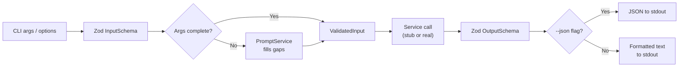
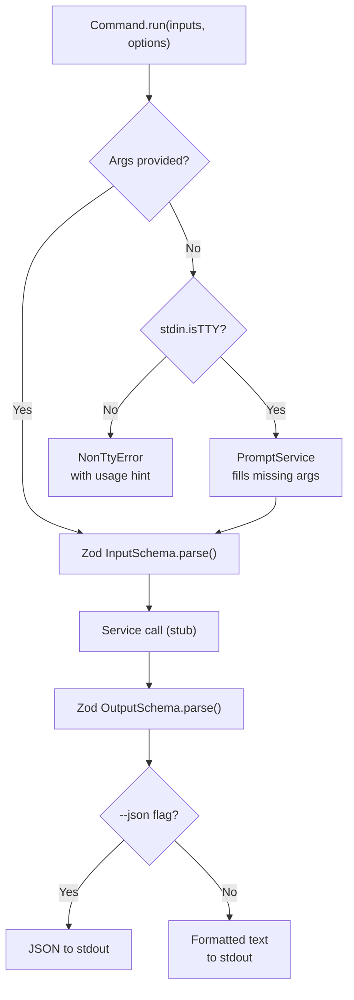
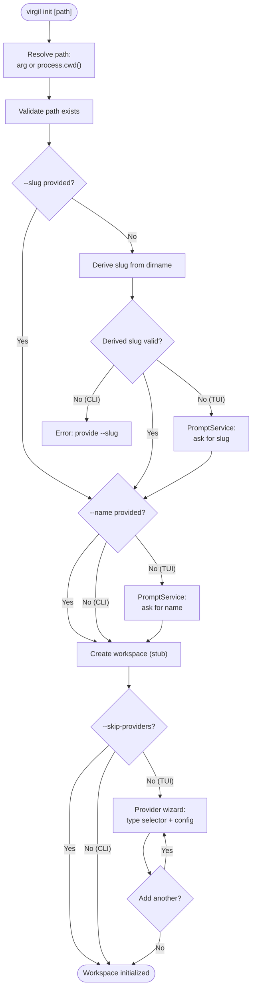
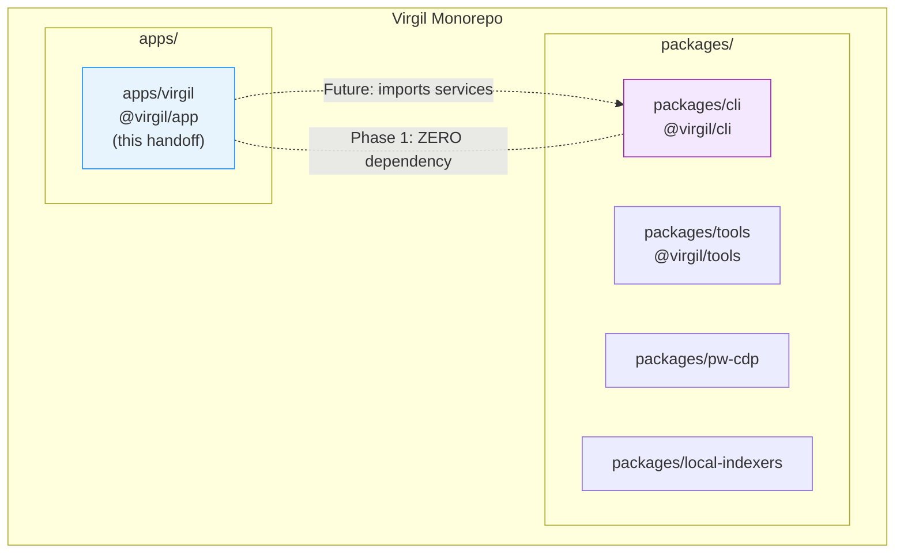

# H22 — Virgil TUI — Interactive Command Surface

> **Project:** Virgil
> **Artifact type:** Feature handoff
> **Status:** Not started
> **Normative policy:** [`AGENTS.md`](../AGENTS.md)
> **Supersedes:** H21_MATELDA (packages/cli approach -- dropped after adversarial review found 3 blockers, 6 critical issues)
> **Prior art:** nest-commander 3.21.0, `@inquirer/prompts`, [`ideas-de-uso-tui.md`](../ideas-de-uso-tui.md)

Virgil's product capabilities (H03--H15) exist as NestJS services in `packages/cli` but have no
interactive command surface. H21 attempted to add that surface directly inside `packages/cli`, but
adversarial review exposed fundamental issues with service wiring, persistence architecture, and the
attempt to retrofit dual-mode prompts onto a codebase carrying substantial tech debt.

H22 is a clean break. It builds a **new package** at `apps/virgil` whose entire Phase 1 scope is
functional stubs -- every command is registered, validates its arguments through Zod schemas,
supports dual-mode (CLI + TUI), outputs text or JSON, and calls a stub service that returns
schema-valid data. Real service wiring from `packages/cli` is deferred to future phases. This
approach isolates the command surface from the existing service-layer debt and delivers the full
`virgil --help` surface immediately.

## Menú

- [Allegory](#allegory)
- [Goal](#goal)
- [Package Identity](#package-identity)
- [Technology Stack](#technology-stack)
- [Architecture Pattern](#architecture-pattern)
- [Dual-Mode Pattern](#dual-mode-pattern)
- [Command Taxonomy](#command-taxonomy)
- [Package Structure](#package-structure)
- [Stub Services](#stub-services)
- [Test Infrastructure](#test-infrastructure)
- [Methodology](#methodology)
- [Prerequisites and Gaps](#prerequisites-and-gaps)
- [Implementation Plan](#implementation-plan)
- [Team Plan](#team-plan)
- [Acceptance Criteria](#acceptance-criteria)
- [Progress Tracker](#progress-tracker)
- [Known Tradeoffs](#known-tradeoffs)
- [Out of Scope](#out-of-scope)

---

## Allegory

In *Purgatorio* Canto XXVIII, after ascending through every terrace of Purgatory, Dante enters the
Earthly Paradise -- a perfect garden at the summit. There he meets **Matelda**, a woman who sings
and gathers flowers on the far bank of a clear stream. She explains the garden's nature, the origin
of the two rivers -- Lethe, which erases sin, and Eunoe, which restores the memory of good deeds --
and guides Dante to drink from both in the correct order. Without her, Dante would stand at the edge
of paradise and not know which water to drink, or when, or why.

Matelda is the **interface**. She does not create the rivers (the services already exist in
H03--H15). She guides the traveler to them. When Dante knows where he is going, he walks directly --
that is CLI mode:

```text
virgil repo add ~/projects/api api-service
```

When he does not know, Matelda appears and guides him through -- that is TUI mode:

```text
virgil repo add
? Path to the repository: ~/projects/api
? Alias (optional): api-service
Repository registered in workspace "acme-corp".
```

Where Lethe (H19) strips noise from context and Eunoe (H20) carries forward ecosystem improvements,
Matelda is the moment of interaction -- the surface through which the developer (or agent) reaches
every capability Virgil has built.

[↑ Menú](#menú)

---

## Goal

Virgil is a **tooling product** -- it provides CLI commands (and future MCP/skill exposure) for
human engineers and AI agents (Claude, Gemini, OpenCode) to manage workspaces, repos, knowledge,
providers, and governance. Virgil does not autonomously discover, orchestrate, or generate handoffs.
Agents do that. Virgil provides them the tools.

Build the **complete dual-mode TUI/CLI command surface** as a new package at `apps/virgil`. Every
command operates in two modes:

1. **CLI mode** -- all arguments and options provided directly. Scriptable, pipeable, agent-callable.
   ```text
   virgil repo add ~/projects/api api-service
   ```

2. **TUI mode** -- invoked without required arguments. Prompts guide the user through interactive
   input, arrow-key selection, and confirmation dialogs.
   ```text
   virgil repo add
   ? Path to the repository: ~/projects/api
   ? Alias (optional): api-service
   Repository "api-service" registered in workspace "acme-corp".
   ```

Phase 1 (this handoff) delivers the entire surface as **functional stubs** -- every command is
registered, validates input through Zod, supports both modes, outputs text or JSON, and calls a stub
service returning schema-valid data. Phase 1 has **zero dependency on `packages/cli`** -- all
service calls are stubs. Real service integration is a separate future handoff.

[↑ Menú](#menú)

---

## Package Identity

**Location:** `apps/virgil` -- a new package in the monorepo.

The `apps/` directory separates executable applications from library packages. This is a clean
break from the H21 approach of adding commands directly to `packages/cli`.

Requirements:

- `pnpm-workspace.yaml` must be updated to include `"apps/*"` in the `packages` array
- `apps/virgil` will eventually consume services from `packages/cli` as internal dependencies
- For Phase 1, there is ZERO dependency on `packages/cli` -- all service calls are stubs
- The package name is `@virgil/app` to distinguish it from `@virgil/cli`
- The `bin` entry is `"virgil": "./dist/main.js"`

> **Binary name.** The `bin` entry is `virgil` — the product name. Dual-mode behavior is
> determined at runtime: interactive TUI when args are missing, direct CLI when args are provided.

[↑ Menú](#menú)

---

## Technology Stack

| Component | Version | Notes |
|-----------|---------|-------|
| Runtime | Node.js 24.16.0 | Exact per AGENTS.md |
| Language | TypeScript 6.0.3 strict, ESM (`"type": "module"`) | Per catalog protocol |
| Framework | NestJS 12 + nest-commander 3.21.0 | Per catalog protocol |
| Prompts | `@inquirer/prompts` 8.7.1 (ESM-native, direct dependency) | NOT inquirer 8.x, NOT nest-commander's `@QuestionSet`. Must be added to `pnpm-workspace.yaml` catalog at implementation time. |
| Validation | Zod 4.5.4 | Contractual validation between layers |
| Reactive | RxJS 7.8.2 | Per catalog protocol |
| Package manager | pnpm 11.24.0 with catalog protocol | Per AGENTS.md |
| Test | Vitest 4.1.11 | App-level integration tests ONLY, 97% coverage threshold |

### Why @inquirer/prompts

nest-commander bundles inquirer 8.2.7 (CJS) and uses a decorator-based question set pattern
(`@QuestionSet`, `@Question`, `InquirerService`). This pattern is skipped for three reasons:

1. `InquirerService` is registered internally by `CommandRunnerModule.forModule()` during
   `CommandFactory.run()` and is **not** available in `Test.createTestingModule` bootstraps.
2. inquirer 8.x is CJS; `apps/virgil` is ESM (`"type": "module"`).
3. The decorator pattern adds indirection without adding value over direct prompt calls.

`@inquirer/prompts` is ESM-native, ships TypeScript definitions, and provides modular per-prompt
imports (`input`, `select`, `confirm`, `checkbox`, `password`, `editor`).

[↑ Menú](#menú)

---

## Architecture Pattern

Contractual validation between layers using Zod schemas. Every command defines typed contracts at
every boundary, and stubs return data matching those contracts.



Every command defines:

1. An `InputSchema` (Zod) that validates CLI args and options
2. A `ValidatedInput` type (inferred from schema) passed to the service
3. An `OutputSchema` (Zod) that validates the service response
4. A formatter that converts validated output to text (default) or JSON (`--json` flag)

This creates typed, verified contracts at every boundary. Stubs return data matching the
`OutputSchema`. When real services are wired later, the schemas guarantee compatibility.

[↑ Menú](#menú)

---

## Dual-Mode Pattern

### Dual-Mode Decision Flow



### PromptService Wrapper

`PromptService` wraps `@inquirer/prompts` directly -- no decorators, no question sets, no
`InquirerService`. Every method checks `process.stdin.isTTY` and throws `NonTtyError` when
stdin is not a terminal and arguments are missing.

```typescript
import { input, select, confirm, checkbox, password } from '@inquirer/prompts';

@Injectable()
export class PromptService {
  async input(message: string, opts?: { default?: string }): Promise<string> {
    if (!process.stdin.isTTY) throw new NonTtyError(message);
    return input({ message, default: opts?.default });
  }

  async select<T>(message: string, choices: { name: string; value: T }[]): Promise<T> {
    if (!process.stdin.isTTY) throw new NonTtyError(message);
    return select({ message, choices });
  }

  // confirm, checkbox, password follow the same TTY-guard pattern
}
```

### NonTtyError

When stdin is not a TTY and required arguments are missing, `NonTtyError` provides a usage hint
directing the user to supply arguments directly. Message format:
`Interactive prompt required for "<field>" but stdin is not a TTY. Provide the value as a CLI argument instead.`

### Key Rules

1. **Required args become optional** in the decorator (`[path]` not `<path>`).
2. **If args are present, skip prompts** -- go straight to validation and service call.
3. **If args are missing, PromptService methods fill them** -- user sees interactive prompts.
4. **Output is human-readable text to stdout by default.** Machine-readable JSON is available via
   `--json` flag. TUI decorations (spinners, progress indicators) go to stderr.
5. **PromptService is injectable** -- testable through DI, mockable in integration tests.
6. **TBD commands are real nest-commander stubs** -- visible in `virgil --help`, print GAP ID with
   explanation, and exit with code 0.

### Contractual Validation Flow Example

The `repo add` command illustrates the pattern. The command defines `RepoAddInputSchema` (path
required, alias optional) and `RepoAddOutputSchema` (workspace, path, alias, registered). The
`run()` method:

1. Checks if `path` is in args -- if not, calls `this.promptService.input()` for path and alias
2. Parses args through `RepoAddInputSchema.parse()`
3. Calls `this.repoService.add(validated)`
4. Parses result through `RepoAddOutputSchema.parse()`
5. Outputs JSON (`options.json`) or formatted text

Every command follows this exact five-step pattern. The schemas are the contract -- stubs and
real services alike must satisfy them.

[↑ Menú](#menú)

---

## Command Taxonomy

The complete command surface organized by domain. Every command has BDD IDs for its key behaviors.

### Init

| Command | Service (stub) | Phase |
|---------|---------------|-------|
| `virgil init [path]` | WorkspaceService + PersistenceModule | Stub |

Path defaults to `./` (process.cwd()). No path prompt. Slug derived from dirname, sanitized per
`WorkspaceSlugSchema` (`/^[a-z][a-z0-9-]{0,63}$/`). Sanitization: lowercase, non-alphanumeric
characters replaced with hyphens, consecutive hyphens collapsed, leading/trailing hyphens trimmed,
max 64 characters. If sanitization produces an invalid slug, TUI mode prompts; CLI mode requires
`--slug`.



| BDD ID | Specification |
|--------|--------------|
| BDD-001 | Given no path argument, when `virgil init` runs, then workspace is created at cwd |
| BDD-002 | Given `--slug acme --name "Acme Corp"`, when `virgil init ~/path` runs, then no prompts appear |
| BDD-003 | Given dirname "My_Project.v2", when slug is derived, then it becomes "my-project-v2" |
| BDD-004 | Given invalid derived slug, when TUI mode, then user is prompted for slug |
| BDD-005 | Given invalid derived slug, when CLI mode without `--slug`, then error with usage hint |
| BDD-006 | Given `--skip-providers`, when init runs, then provider wizard is skipped |
| BDD-007 | Given `--json` flag, when init runs, then output is JSON matching InitOutputSchema |
| BDD-008 | Given non-TTY stdin and no args, when init runs, then NonTtyError with usage hint |

### Repository

| Command | Service (stub) | Phase |
|---------|---------------|-------|
| `virgil repo add [path] [alias]` | RepoService.add() | Stub |
| `virgil repo list` | RepoService.list() | Stub |
| `virgil repo show [alias]` | RepoService.show() | Stub |
| `virgil repo remove [alias]` | **TBD -- GAP-002** | TBD Stub |

| BDD ID | Specification |
|--------|--------------|
| BDD-009 | Given path and alias args, when `repo add` runs, then service is called with validated input and no prompts appear |
| BDD-010 | Given no args, when `repo add` runs in TUI mode, then PromptService is called for path and alias |
| BDD-011 | Given `--json` flag, when `repo add` runs, then output is valid JSON matching RepoAddOutputSchema |
| BDD-012 | Given no args, when `repo list` runs, then all registered repos are listed |
| BDD-013 | Given `--json` flag, when `repo list` runs, then output is JSON array |
| BDD-014 | Given alias arg, when `repo show` runs, then repo details are displayed |
| BDD-015 | Given no alias arg in TUI mode, when `repo show` runs, then list selector prompts for alias |
| BDD-016 | Given `repo remove` is TBD, when command runs, then prints "repo remove is not yet available (GAP-002: WorkspaceService.removeRepo pending)" and exits 0 |

### Knowledge

Knowledge source registration goes through `virgil provider add` (type=knowledge). Knowledge
commands operate on indexed content.

| Command | Service (stub) | Phase |
|---------|---------------|-------|
| `virgil knowledge add [path-or-url]` | **TBD** -- redirects to `virgil provider add` | TBD Stub |
| `virgil knowledge list` | **TBD** -- redirects to `virgil provider list` | TBD Stub |
| `virgil knowledge search [query]` | KnowledgeService.search() (RAG stub) | Stub |
| `virgil knowledge remove [id]` | **TBD** -- redirects to `virgil provider remove` | TBD Stub |
| `virgil knowledge stats` | KnowledgeService.stats() | Stub |
| `virgil knowledge compact` | KnowledgeService.compact() | Stub |

| BDD ID | Specification |
|--------|--------------|
| BDD-017 | Given `knowledge add` is TBD, when command runs, then prints redirect message to `virgil provider add` and exits 0 |
| BDD-018 | Given `knowledge list` is TBD, when command runs, then prints redirect message to `virgil provider list` and exits 0 |
| BDD-019 | Given query arg, when `knowledge search` runs, then service returns search results |
| BDD-020 | Given no query arg in TUI mode, when `knowledge search` runs, then PromptService asks for query |
| BDD-021 | Given `--json` flag, when `knowledge search` runs, then output is JSON matching SearchOutputSchema |
| BDD-022 | Given no args, when `knowledge stats` runs, then lifecycle statistics are displayed |
| BDD-023 | Given `--yes` flag, when `knowledge compact` runs in CLI mode, then no confirmation prompt appears |
| BDD-024 | Given no `--yes` flag in TUI mode, when `knowledge compact` runs, then PromptService asks for confirmation |
| BDD-025 | Given `knowledge remove` is TBD, when command runs, then prints redirect message to `virgil provider remove` and exits 0 |
| BDD-056 | Given `--json` flag, when `knowledge stats` runs, then output is JSON matching StatsOutputSchema |

### Provider

| Command | Service (stub) | Phase |
|---------|---------------|-------|
| `virgil provider add [type]` | ProviderService.add() | Stub |
| `virgil provider list` | ProviderService.list() | Stub |
| `virgil provider test [id]` | **TBD -- GAP-003** | TBD Stub |
| `virgil provider remove [id]` | **TBD -- GAP-003** | TBD Stub |

| BDD ID | Specification |
|--------|--------------|
| BDD-026 | Given type arg, when `provider add` runs in CLI mode, then provider is registered without prompts |
| BDD-027 | Given no type arg in TUI mode, when `provider add` runs, then type selector prompt appears |
| BDD-028 | Given `--json` flag, when `provider add` runs, then output is JSON matching ProviderAddOutputSchema |
| BDD-029 | Given no args, when `provider list` runs, then all providers are listed |
| BDD-030 | Given `provider test` is TBD, when command runs, then prints "provider test is not yet available (GAP-003: WorkspaceService.testProvider pending)" and exits 0 |
| BDD-031 | Given `provider remove` is TBD, when command runs, then prints "provider remove is not yet available (GAP-003: WorkspaceService.removeProvider pending)" and exits 0 |
| BDD-054 | Given `--json` flag, when `provider list` runs, then output is JSON array matching ProviderListOutputSchema |

### Governance

| Command | Service (stub) | Phase |
|---------|---------------|-------|
| `virgil governance budget` | GovernanceService.budget() | Stub |
| `virgil governance audit` | GovernanceService.audit() | Stub |

`virgil governance tier` is **out of scope** -- tier resolution is an internal service called
programmatically by agents, not a CLI command.

| BDD ID | Specification |
|--------|--------------|
| BDD-032 | Given no args, when `governance budget` runs, then budget summary is displayed |
| BDD-033 | Given `--json` flag, when `governance budget` runs, then output is JSON matching BudgetOutputSchema |
| BDD-034 | Given no args, when `governance audit` runs, then audit trail is displayed |
| BDD-035 | Given `--json` flag, when `governance audit` runs, then output is JSON matching AuditOutputSchema |
| BDD-057 | Given `--json` flag, when `governance budget` runs with `--period` filter, then JSON includes period metadata |
| BDD-058 | Given `--json` flag, when `governance audit` runs with `--since` filter, then JSON includes filtered audit entries |

### Workspace

These commands already exist in `packages/cli` as CLI-only. `apps/virgil` reimplements them from
scratch with dual-mode (CLI + TUI) and Zod contracts.

| Command | Service (stub) | Phase |
|---------|---------------|-------|
| `virgil workspace create [slug]` | WorkspaceService.create() | Stub |
| `virgil workspace list` | WorkspaceService.list() | Stub |
| `virgil workspace select [slug]` | WorkspaceService.select() | Stub |
| `virgil workspace show [slug]` | WorkspaceService.show() | Stub |
| `virgil workspace delete [slug]` | WorkspaceService.delete() | Stub |

| BDD ID | Specification |
|--------|--------------|
| BDD-036 | Given slug arg, when `workspace create` runs, then workspace is created without prompts |
| BDD-037 | Given no slug arg in TUI mode, when `workspace create` runs, then PromptService asks for slug and optional name |
| BDD-038 | Given `--json` flag, when `workspace create` runs, then output is JSON matching WorkspaceOutputSchema |
| BDD-039 | Given no args, when `workspace list` runs, then all workspaces are listed |
| BDD-040 | Given slug arg, when `workspace select` runs, then workspace is activated without prompts |
| BDD-041 | Given no slug arg in TUI mode, when `workspace select` runs, then list selector prompt appears |
| BDD-042 | Given slug arg, when `workspace show` runs, then workspace details are displayed |
| BDD-043 | Given no slug arg in TUI mode, when `workspace show` runs, then list selector prompt appears |
| BDD-044 | Given slug arg, when `workspace delete` runs in CLI mode, then workspace is deleted |
| BDD-045 | Given no slug arg in TUI mode, when `workspace delete` runs, then list selector + confirm prompt appear |
| BDD-046 | Given `--json` flag, when `workspace list` runs, then output is JSON array |
| BDD-055 | Given `--json` flag, when `workspace show` runs, then output is JSON matching WorkspaceShowOutputSchema |

### Version

| Command | Service | Phase |
|---------|---------|-------|
| `virgil version` | package.json version | Implemented |
| `virgil --version` | package.json version | Implemented |

| BDD ID | Specification |
|--------|--------------|
| BDD-047 | Given `virgil version`, when command runs, then prints version from package.json |
| BDD-048 | Given `virgil --version`, when command runs, then prints version from package.json |

### Global Options

All commands support these options:

| BDD ID | Specification |
|--------|--------------|
| BDD-049 | Given `--json` flag on any command, when command runs, then output is JSON to stdout and TUI decorations go to stderr |
| BDD-050 | Given non-TTY stdin and missing required args on any command, when command runs, then NonTtyError with usage hint |
| BDD-051 | Given `virgil --help`, when command runs, then all command groups are listed |
| BDD-052 | Given `virgil <group> --help`, when command runs, then all subcommands in that group are listed |
| BDD-053 | Given Ctrl+C during any prompt, when the prompt is cancelled, then the command exits cleanly with no partial state (tested via mock rejection -- PromptService mock rejects with cancellation error, not real TTY signal) |

[↑ Menú](#menú)

---

## Package Structure



```
apps/virgil/
  package.json, tsconfig.json, tsconfig.build.json, vitest.config.ts, nest-cli.json
  src/
    main.ts, app.module.ts
    shared/          prompt.service.ts, non-tty.error.ts, output.formatter.ts, tbd-stub.util.ts, schemas.ts
    init/            init.module.ts, init.command.ts, init.schemas.ts, init.service.ts (STUB)
    workspace/       workspace.module.ts, workspace.command.ts, workspace-{create,list,select,show,delete}.command.ts, workspace.schemas.ts, workspace.service.ts (STUB)
    repo/            repo.module.ts, repo.command.ts, repo-{add,list,show}.command.ts, repo-remove.command.ts (TBD), repo.schemas.ts, repo.service.ts (STUB)
    knowledge/       knowledge.module.ts, knowledge.command.ts, knowledge-{search,stats,compact}.command.ts, knowledge-{add,list,remove}.command.ts (TBD), knowledge.schemas.ts, knowledge.service.ts (STUB)
    provider/        provider.module.ts, provider.command.ts, provider-{add,list}.command.ts, provider-{test,remove}.command.ts (TBD), provider.schemas.ts, provider.service.ts (STUB)
    governance/      governance.module.ts, governance.command.ts, governance-{budget,audit}.command.ts, governance.schemas.ts, governance.service.ts (STUB)
    version/         version.command.ts
  test/
    support/         mock-prompt.service.ts
    init.e2e-spec.ts, workspace.e2e-spec.ts, repo.e2e-spec.ts, knowledge.e2e-spec.ts
    provider.e2e-spec.ts, governance.e2e-spec.ts, tbd-stubs.e2e-spec.ts, version.e2e-spec.ts
    global-options.e2e-spec.ts
```

Tests live in `test/`, NEVER in `src/`. Unit tests are PROHIBITED per Testing Policy. All tests
bootstrap the NestJS module via `Test.createTestingModule` and validate behavior through the DI
container.

[↑ Menú](#menú)

---

## Stub Services

Every domain has a stub service that returns data matching its `OutputSchema`. Stubs are the default
implementation -- they exist so the full CLI surface works end-to-end from day one. Each stub
method is decorated with a JSDoc comment referencing the BDD ID it satisfies and the real service
it will eventually call.

Each stub method:

- Is an `@Injectable()` NestJS service
- Has a JSDoc comment naming the real service it will replace and the BDD IDs it satisfies
- Returns a hardcoded object that passes the command's `OutputSchema.parse()`
- Accepts the command's `ValidatedInput` type as its parameter

Stubs return deterministic data that satisfies the output schemas. When real services from
`packages/cli` are wired in future phases, the Zod output schemas guarantee that the real service
returns compatible data -- any mismatch is a Zod validation error caught at the boundary.

[↑ Menú](#menú)

---

## Test Infrastructure

### Pattern: App-Level Integration Tests with Mocked Boundaries

Every test bootstraps the NestJS module, overrides `PromptService` with a mock, and validates
behavior through the DI container. Tests verify both the service call (via `toHaveBeenCalledWith`
and `toHaveBeenCalledTimes`) and the command output (via `console.log` spy).

Each test file follows this setup pattern:

1. `Test.createTestingModule({ imports: [DomainModule] })` with `PromptService` overridden by
   `{ input: vi.fn(), select: vi.fn(), confirm: vi.fn() }`
2. `vi.spyOn(console, 'log').mockImplementation(() => undefined)` to capture output
3. For CLI mode tests: call `command.run([...args], options)` and assert service spy
4. For TUI mode tests: mock `promptService.input` return values and assert prompt calls
5. For `--json` tests: parse `logSpy.mock.calls[0][0]` and assert valid JSON
6. For TBD stub tests: assert output `stringContaining('GAP-NNN')` and `process.exitCode` undefined
7. For NonTtyError tests: temporarily set `process.stdin.isTTY = false` and assert rejection
8. For Ctrl+C cancellation tests: configure `promptService.input` (or other prompt method) to
   reject with an error simulating user cancellation, then assert the command exits cleanly

### Ctrl+C Cancellation Test Pattern (BDD-053)

Ctrl+C during a prompt is tested via mock rejection, not real TTY signal injection. The
`@inquirer/prompts` library throws an error when the user presses Ctrl+C; the test simulates this
by configuring the mocked PromptService to reject:

```typescript
// BDD-053: Ctrl+C simulation via mock rejection
it('exits cleanly when prompt is cancelled (BDD-053)', async () => {
  vi.mocked(promptService.input).mockRejectedValue(new Error('User force closed the prompt'));
  await command.run([], {});
  expect(process.exitCode).toBeUndefined(); // clean exit
  // assert no partial state was written
});
```

### Coverage Configuration

- Provider: `v8`
- Reports directory: `artifacts/coverage`
- Reporters: `json`, `html`, `text`
- Thresholds: 97% statements, 97% lines, 97% functions
- `test.include`: `['test/**/*.e2e-spec.ts']` -- tells Vitest which test files to run
- `coverage.include`: `['src/**/*.ts']` -- tells v8 which source files to measure coverage on

[↑ Menú](#menú)

---

## Methodology

### TDD -- Red/Green/Refactor

Each command group follows the red/green/refactor cycle:

1. **Red** -- write the test first. The test describes the expected behavior (BDD IDs map directly
   to test cases). It fails because the implementation does not exist yet.
2. **Green** -- implement the minimum code to make the test pass. The command, schema, and stub
   service are written to satisfy the test.
3. **Refactor** -- clean up duplication, extract shared patterns, improve naming. Tests still pass.

Tests and implementation are NOT separate waves -- they are paired per command group. An agent
that delivers commands without their tests has delivered incomplete work. An agent that writes
a failing test and then implements until it passes has followed the correct workflow.

A command without its test is incomplete. A test without its command is the starting point.

### CLI Tooling for Scaffolding

- Use `nest g module`, `nest g class`, and nest-commander patterns to generate boilerplate when
  a generator covers the pattern. Hand-writing files from scratch when generators exist wastes
  tokens and introduces inconsistency.
- When no generator covers the pattern, reference an existing implemented command as the template
  (copy-adapt, do not invent from zero). The first command implemented becomes the canonical
  reference for all subsequent commands.

### Options Validation Pattern

Boolean CLI options (`--json`, `--skip-providers`, `--confirm`, `--yes`) MUST be validated through
Zod at the command boundary, not manually coerced with ternary operators.

Canonical pattern:

```typescript
// In schemas.ts -- shared base
export const JsonOptionSchema = z.object({
  json: z.coerce.boolean().default(false),
});

// In command-specific schemas -- extend base
export const InitOptionsSchema = JsonOptionSchema.extend({
  slug: z.string().optional(),
  name: z.string().optional(),
  skipProviders: z.coerce.boolean().default(false),
});

// In command.run() -- one parse, clean types
const opts = InitOptionsSchema.parse(options ?? {});
console.log(formatOutput(output, opts.json));
```

The anti-pattern `options?.json ? true : false` is PROHIBITED -- it duplicates what Zod does and
is error-prone. Every boolean option goes through `z.coerce.boolean().default(false)` and is
consumed as a typed property from the parsed result.

### Error Handling Contract

`main.ts` must catch `NonTtyError` and `ZodError` at the bootstrap boundary:

- **`NonTtyError`** -- print the usage hint message to stderr, exit 1. The user sees actionable
  guidance ("provide the value as a CLI argument instead"), not a stack trace.
- **`ZodError`** -- format validation errors as a readable list to stderr, exit 1. Each issue
  includes the field path and the validation message. Raw Zod stack traces in CLI output are a
  bug, not a feature.
- **Uncaught errors** -- any error that reaches the bootstrap boundary without being one of the
  above is an unexpected failure. Log the message (not the full stack) to stderr, exit 1.

### Inter-Wave Review Gates

Between every wave, the orchestrator synthesizes results and presents a checkpoint to the owner.
No wave launches until the previous wave's deliverables are reviewed. This is not optional --
AGENTS.md Fleet governance (line 516) requires it:

> "the orchestrator must launch them in bounded waves, synthesize results between waves, and
> present a progress checkpoint to the owner before the next wave."

Each gate verifies:

1. All assigned deliverables are present and complete
2. Tests pass for the wave's scope
3. No regressions in previously completed waves
4. The owner acknowledges the checkpoint before the next wave begins

[↑ Menú](#menú)

---

## Prerequisites and Gaps

### GAP-001: PersistenceModule Static Wiring (Prerequisite)

`PersistenceModule.forRoot()` in `packages/cli` is statically wired with
`databasePath: ':memory:'` -- a test hack, not a valid architecture. For `virgil init` to create a
workspace-scoped SQLite database, this needs `forRootAsync()` with a factory that resolves the
`databasePath` from the active workspace's state directory at runtime. In `apps/virgil` Phase 1,
init is a STUB -- the real persistence wiring is deferred to the integration phase.

### GAP-002: WorkspaceService.removeRepo()

No `removeRepo()` method exists in `WorkspaceService`. `virgil repo remove` is a TBD stub that
prints the gap ID and exits 0.

### GAP-003: WorkspaceService Provider Methods

No `removeProvider()` or `testProvider()` methods exist in `WorkspaceService`. `virgil provider
test` and `virgil provider remove` are TBD stubs that print the gap ID and exit 0.

### GAP-004: ProviderRegistryService Drift (H04)

`ProviderRegistryService` from ProviderRegistryModule (H04) is an in-memory `Map` -- not
persistent across CLI invocations. This is drift from H04, not an architectural choice.
`WorkspaceService.registerProvider()` is the persistence layer. The in-memory Map is a portable
contract for in-flight use only; everything must be persisted/queryable from SQLite.

### GAP-005: TOON Output Format (NEW)

Token-Oriented Object Notation for agent-consumed output. `virgil knowledge search` results
consumed by agents could use TOON instead of JSON to save 30--60% tokens by eliminating braces,
quotes, and repeated keys. TBD -- not implemented in stub phase. The `--json` flag remains the
machine-readable format; TOON would be a separate `--toon` flag in a future phase.

### Schema Duplication (Phase 1)

`apps/virgil` defines its own `WorkspaceSlugSchema` and other shared Zod types independently of
`packages/cli`. This is intentional duplication for zero-dependency isolation in Phase 1. When
`apps/virgil` integrates with `packages/cli` services in future phases, shared schemas will be
extracted to a common package (e.g., `packages/contracts`) and both packages will import from there.
Until then, the schemas must be kept in sync manually -- any change to `WorkspaceSlugSchema` in
`packages/cli` must be reflected in `apps/virgil`.

[↑ Menú](#menú)

---

## Implementation Plan

### Phase 1: Full Stub Surface (this handoff's scope)

Everything in one phase. Build the entire CLI/TUI surface as functional stubs:

1. **Package scaffolding** -- create `apps/virgil` with package.json, tsconfig.json,
   tsconfig.build.json, vitest.config.ts, nest-cli.json, main.ts, app.module.ts
2. **Workspace update** -- add `"apps/*"` to `pnpm-workspace.yaml` packages array
3. **Shared infrastructure** -- PromptService wrapper, NonTtyError, OutputFormatter, TBD stub
   utility, shared Zod types (WorkspaceSlugSchema)
4. **Zod schemas** -- InputSchema and OutputSchema for every command (input + output contracts)
5. **All commands registered** -- including TBD stubs, all visible in `virgil --help`
6. **Dual-mode on every command** -- CLI path (args provided) and TUI path (args prompted)
7. **`--json` flag on every command** -- JSON output matching OutputSchema
8. **Non-TTY detection on every command** -- NonTtyError with usage hint
9. **Stub services** -- every domain has a service returning schema-valid data
10. **App-level integration tests** -- every command tested in both modes
11. **Coverage greater than 97%**

### Future Phases (separate handoffs)

| Phase | Scope |
|-------|-------|
| N+1 | Wire workspace/init to real WorkspaceService from packages/cli |
| N+2 | Wire repo/provider commands to real services |
| N+3 | Wire knowledge commands (RAG, lifecycle) |
| N+4 | Wire governance commands (BudgetGovernor, InMemoryAuditTrail) |
| N+5 | TOON format for search output (GAP-005) |
| N+6 | OTel instrumentation (spans defined below) |
| N+7 | MCP/skill exposure (separate handoff) |

[↑ Menú](#menú)

---

## Team Plan

### Pre-Flight Cost Estimation

Total fleet: 7 agents across 3 sequential waves plus 2 adversarial judges. Estimated per-agent
cost: ~50k tokens (reasoning tier for Agents B--E and judges, worker tier for Agent A). Aggregate
estimate: ~350k tokens. This estimate requires owner approval before launch per AGENTS.md fleet
governance.

> **Delegation envelope.** The table above summarizes agent scope for planning. At delegation time, the orchestrator provides the complete assignment envelope per AGENTS.md Agent Delegation Contract -- including role, persona, out-of-scope boundaries, acceptance criteria, and required evidence. Each agent must explicitly ACCEPT or REJECT per the Agent Acceptance Protocol before beginning work.

### Wave 1: Foundation + Tests (2 agents, parallel)

| Agent | Scope | Tier | Expected Output | Turn Limit |
|-------|-------|------|-----------------|------------|
| **Agent A** -- Package Scaffold + Config | Create `apps/virgil`, pnpm workspace update, add `@inquirer/prompts` to catalog and package.json, tsconfig, vitest config, nest-cli.json, main.ts, app.module.ts | worker | ~200 lines across 6--8 config files | 15 |
| **Agent B** -- Shared Infrastructure + Tests | PromptService, NonTtyError, OutputFormatter (with recursive text rendering), TBD stub utility, shared Zod types (WorkspaceSlugSchema, JsonOptionSchema), error handling in main.ts (NonTtyError + ZodError catch). ALSO writes test files: `test/support/mock-prompt.service.ts`, `test/global-options.e2e-spec.ts`, `test/prompt-service.e2e-spec.ts` | reasoning | ~600 lines across 8--10 files | 20 |

### GATE 1

Orchestrator reviews Wave 1 deliverables. Verifies: package builds, shared infrastructure tests
pass, test harness bootstraps correctly. Presents checkpoint to owner. No Wave 2 launch until
owner acknowledges.

### Wave 2: Commands + Tests (3 agents, parallel after Gate 1)

Each agent delivers commands AND their corresponding test files following red/green/refactor per
command group. A command without its test is incomplete work.

| Agent | Scope | Tier | Expected Output | Turn Limit |
|-------|-------|------|-----------------|------------|
| **Agent C** -- Commands Group 1 + Tests | init, workspace (5 commands), version -- schemas (including OptionsSchemas with `z.coerce.boolean()`), services, commands, AND test files: `test/init.e2e-spec.ts`, `test/workspace.e2e-spec.ts`, `test/version.e2e-spec.ts` | reasoning | ~1200 lines across 18--22 files | 25 |
| **Agent D** -- Commands Group 2 + Tests | repo (4 commands), provider (4 commands), governance (2 commands) -- schemas, services, commands, including TBD stubs, AND test files: `test/repo.e2e-spec.ts`, `test/provider.e2e-spec.ts`, `test/governance.e2e-spec.ts` | reasoning | ~1000 lines across 16--20 files | 25 |
| **Agent E** -- Commands Group 3 + Tests | knowledge (6 commands) -- operational + TBD stubs + schemas, AND test files: `test/knowledge.e2e-spec.ts`, `test/tbd-stubs.e2e-spec.ts` | reasoning | ~600 lines across 10--14 files | 20 |

### GATE 2

Orchestrator reviews Wave 2 deliverables. Runs full test suite across all command groups. Verifies:
all BDD IDs covered, coverage above 97%, no regressions in Wave 1 deliverables. Presents checkpoint
to owner. No Wave 3 launch until owner acknowledges.

### Wave 3: Adversarial Review (2 agents, parallel after Gate 2)

| Agent | Scope | Tier | Expected Output | Turn Limit |
|-------|-------|------|-----------------|------------|
| **Judge A** -- Blind Review | Independent adversarial code review of all deliverables. Checks: correctness, schema validation patterns, dual-mode compliance, error handling, test coverage gaps, project standards | reasoning | Findings report | 15 |
| **Judge B** -- Blind Review | Independent adversarial code review of all deliverables. Same scope as Judge A, reviewed blind (no access to Judge A findings) | reasoning | Findings report | 15 |

### Post-Review

Orchestrator synthesizes findings from both judges. Confirmed issues (agreed by both judges or
validated by orchestrator) are fixed. Fixes are verified against the original findings before the
handoff is marked complete.

[↑ Menú](#menú)

---

## Acceptance Criteria

### Package and Build

1. Package exists at `apps/virgil`, builds successfully, and runs
2. `pnpm-workspace.yaml` updated with `"apps/*"` in packages array
3. `@inquirer/prompts` 8.7.1 declared as direct dependency (exact version per catalog protocol)
4. Package uses TypeScript strict mode with ESM (`"type": "module"`)
5. No dependency on `packages/cli` in Phase 1

### Prompt Integration

6. `PromptService` injectable through standard NestJS DI and mockable in tests
7. `PromptService` delegates to `@inquirer/prompts` -- no `InquirerService`, no `@QuestionSet`
8. `NonTtyError` thrown when stdin is not TTY and required args are missing

### Dual-Mode

9. Every command with required input works in BOTH CLI mode and TUI mode
10. CLI mode never triggers prompts (BDD-002, BDD-009, BDD-026, BDD-036, BDD-040, BDD-044)
11. TUI mode never requires args -- all input gathered through PromptService (BDD-004, BDD-010, BDD-015, BDD-020, BDD-027, BDD-037, BDD-041, BDD-043, BDD-045)
12. Non-TTY detection on every command (BDD-008, BDD-050)

### Output

13. Output is human-readable text by default
14. `--json` flag produces JSON matching the command's OutputSchema (BDD-007, BDD-011, BDD-013, BDD-021, BDD-028, BDD-033, BDD-035, BDD-038, BDD-046, BDD-049, BDD-054, BDD-055, BDD-056, BDD-057, BDD-058)
15. TUI decorations go to stderr, not stdout (BDD-049)

### Commands

16. Every command registered and visible in `virgil --help` (BDD-051, BDD-052)
17. TBD stubs print GAP IDs with explanation and exit 0 (BDD-016, BDD-017, BDD-018, BDD-025, BDD-030, BDD-031)
18. Init defaults to cwd (BDD-001)
19. Slug sanitization works per WorkspaceSlugSchema (BDD-003, BDD-004, BDD-005)
20. Version command prints package.json version (BDD-047, BDD-048)

### Validation

21. Zod InputSchema validates every command's args at the command boundary
22. Zod OutputSchema validates every stub service response at the service boundary
23. Invalid input produces a structured error message (BDD-060)

### Testing

24. All tests are app-level integration tests in `test/` directory -- no `src/*.spec.ts` files
25. PromptService mocked in all tests
26. `toHaveBeenCalledWith` and `toHaveBeenCalledTimes` used for service call assertions
27. Coverage greater than 97% (statements, lines, functions)
28. JSON test artifact produced
29. HTML test artifact produced

### Documentation

30. All GAPs documented with IDs (GAP-001 through GAP-005)

[↑ Menú](#menú)

---

## Progress Tracker

### Wave 1: Foundation + Tests

- [ ] Assignment accepted
- [ ] `apps/virgil` package scaffolded (package.json, tsconfig, vitest, nest-cli)
- [ ] `pnpm-workspace.yaml` updated with `"apps/*"`
- [ ] `@inquirer/prompts` 8.7.1 added to catalog and as direct dependency
- [ ] `main.ts` and `app.module.ts` created (with NonTtyError + ZodError error handling)
- [ ] `PromptService` wrapper created (injectable, delegates to `@inquirer/prompts`)
- [ ] `NonTtyError` class created
- [ ] `OutputFormatter` created (with recursive text rendering)
- [ ] TBD stub utility created
- [ ] Shared Zod types created (`WorkspaceSlugSchema`, `JsonOptionSchema`)
- [ ] `test/support/mock-prompt.service.ts` created
- [ ] `test/global-options.e2e-spec.ts` covering BDD-049 through BDD-053, BDD-059, BDD-060
- [ ] `test/prompt-service.e2e-spec.ts` covering shared infrastructure

### Gate 1: Checkpoint

- [ ] Package builds successfully
- [ ] Shared infrastructure tests pass
- [ ] Owner acknowledges checkpoint

### Wave 2: Commands + Tests

- [ ] `virgil init` command + schemas + `test/init.e2e-spec.ts` (BDD-001 through BDD-008)
- [ ] `virgil workspace create|list|select|show|delete` commands + schemas + `test/workspace.e2e-spec.ts` (BDD-036 through BDD-046, BDD-055)
- [ ] `virgil version` command + `test/version.e2e-spec.ts` (BDD-047 through BDD-048)
- [ ] `virgil repo add|list|show` commands + schemas + `test/repo.e2e-spec.ts` (BDD-009 through BDD-015)
- [ ] `virgil repo remove` TBD stub (GAP-002)
- [ ] `virgil provider add|list` commands + schemas + `test/provider.e2e-spec.ts` (BDD-026 through BDD-029, BDD-054)
- [ ] `virgil provider test|remove` TBD stubs (GAP-003)
- [ ] `virgil knowledge search|stats|compact` commands + schemas + `test/knowledge.e2e-spec.ts` (BDD-019 through BDD-024, BDD-056)
- [ ] `virgil knowledge add|list|remove` TBD stubs (redirect to provider system)
- [ ] `virgil governance budget|audit` commands + schemas + `test/governance.e2e-spec.ts` (BDD-032 through BDD-035, BDD-057, BDD-058)
- [ ] `test/tbd-stubs.e2e-spec.ts` covering BDD-016, BDD-017, BDD-018, BDD-025, BDD-030, BDD-031
- [ ] `--json` flag on every command (validated through Zod, not manual coercion)
- [ ] Non-TTY detection on every command

### Gate 2: Checkpoint

- [ ] Full test suite passes
- [ ] Coverage greater than 97%
- [ ] No regressions in Wave 1 deliverables
- [ ] Owner acknowledges checkpoint

### Wave 3: Adversarial Review

- [ ] Judge A blind review completed
- [ ] Judge B blind review completed
- [ ] Findings synthesized by orchestrator
- [ ] Confirmed issues fixed and verified
- [ ] Handoff completion report produced

[↑ Menú](#menú)

---

## Observability (TBD)

Instrumentation points defined for future OTel integration. Implementation deferred to Phase N+6.
Every command gets a `virgil.command` span with attributes: `command_name`, `mode` (cli/tui),
`output_format` (text/json), `elapsed_ms`. Domain-specific spans (e.g., `virgil.knowledge.search`
with `query`, `result_count`) are defined per command in the schemas. The actual tracing backend
and exporter are out of scope for Phase 1.

[↑ Menú](#menú)

---

## Known Tradeoffs

### Genuine Tradeoffs

| # | Tradeoff | Detail |
|---|----------|--------|
| 1 | No full-screen TUI | `@inquirer/prompts` provides sequential prompt-based interaction, not persistent layouts or live dashboards. Full-screen TUI (ink, blessed, terminal-kit) is a possible future evolution, architecturally independent from this prompt command layer. |
| 2 | All services are stubs | Real service wiring deferred to future phases. The complete CLI surface works end-to-end with deterministic stub data from day one. |
| 3 | Non-TTY fallback is error, not silent | When stdin is not a TTY and required args are missing, the command prints usage and exits with code 1. It does not attempt to read from a pipe or guess defaults. Pipe mode should use CLI args, not interactive prompts. |
| 4 | Post-seed handoff | H22 is a post-seed handoff and is not in the seed's dependency graph or wave system. The seed's Implementation Plan stops at H19. |
| 5 | Two binaries persist | `virgil` (packages/cli, eventually apps/virgil) and `virgil-probe` (packages/tools) remain separate binaries. tree-sitter native addons (~48MB) are incompatible with Node SEA, which is the technical blocker for consolidation. Probe functionality could potentially be replaced by async agent capabilities. |
| 6 | Schema duplication in Phase 1 | `apps/virgil` defines its own Zod schemas (WorkspaceSlugSchema, etc.) independently of `packages/cli`. Intentional for zero-dependency isolation. Schemas will be extracted to `packages/contracts` when integration begins. See Prerequisites and Gaps. |

### TBD / Tech Debt

| # | Item | Reference |
|---|------|-----------|
| 7 | PersistenceModule static wiring | GAP-001 |
| 8 | WorkspaceService.removeRepo() missing | GAP-002 |
| 9 | WorkspaceService provider methods missing | GAP-003 |
| 10 | ProviderRegistryService ephemeral drift | GAP-004 |
| 11 | TOON output format for agent-consumed output | GAP-005 |
| 12 | OTel instrumentation defined but not wired | Phase N+6 |

[↑ Menú](#menú)

---

## BDD ID Summary

Total: **60 BDD IDs** (BDD-001 through BDD-060).

- BDD-001 to BDD-008: Init command
- BDD-009 to BDD-016: Repository commands
- BDD-017 to BDD-025: Knowledge commands
- BDD-026 to BDD-031: Provider commands
- BDD-032 to BDD-035: Governance commands
- BDD-036 to BDD-046: Workspace commands
- BDD-047 to BDD-048: Version command
- BDD-049 to BDD-053: Global options
- BDD-054: Provider list --json
- BDD-055: Workspace show --json
- BDD-056: Knowledge stats --json
- BDD-057: Governance budget --json (with period filter)
- BDD-058: Governance audit --json (with since filter)
- BDD-059: TUI decorations to stderr (AC 15)
- BDD-060: Zod validation error formatting for invalid input (AC 23)

[↑ Menú](#menú)

---

## Out of Scope

- **Agent-scope commands** (`virgil work`, `virgil discover`, `virgil handoff generate`) -- Virgil is tooling; agents do orchestration
- **Probe commands** -- separate binary (`virgil-probe`), separate package (`packages/tools`)
- **MCP server / Skill exposure** -- near-future separate handoff (Phase N+7)
- **Real service integration** -- commands wire to stubs in Phase 1; real services from `packages/cli` wired in future phases
- **Database / migrations** -- init stub does not create real SQLite databases (GAP-001)
- **`virgil governance tier`** -- tier resolution (RuleBasedTierResolver) is an internal service called programmatically by agents, not a CLI command
- **Full-screen TUI** (ink, blessed, terminal-kit) -- future evolution, architecturally independent
- **Shell completions** (bash, zsh, fish) -- future DX improvement
- **Command aliases** -- future convenience layer
- **RPA flows** -- H16 provides PW CDP infrastructure; specific flows are provider-level
- **Team/org roles CRUD** -- requires new domain module, not just command wiring
- **Meeting assistant mode** -- requires new conversational interaction model
- **Grooming/refinement mode** -- requires new workflow orchestration
- **Rich table/tree output formatting** -- future UX enhancement beyond text/JSON dual output
- **New service-layer business logic** -- commands are thin wiring only

[↑ Menú](#menú)
