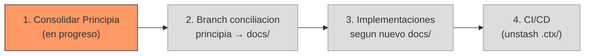
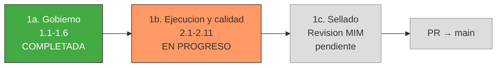

# Handoff: Recuperacion del Principia

## Contexto

Durante sucesivos refactors de Virgil, se perdieron capas conceptuales
completas del framework original (documentado en
`~/projects/nodejs/challenges/idea-to-mvp/docs/`). El dogma actual
(`docs/`) conservo contratos, schemas y tiers de testing, pero perdio la
filosofia rectora, el sistema de roles, el Echo System, el modelo de
ejecucion macro (Red/Green/Refactor por lotes) y los mecanismos de
gobierno (PDC, circuitBreaker, fitness functions).

El Principia es el documento fundacional que consolida TODOS estos
conceptos. Es auto-referencial: los mismos principios gobiernan tanto el
desarrollo de Virgil (Modo Desarrollo) como los proyectos que Virgil
gestiona (Modo Consumo).

## Fuentes

| Fuente | Ubicacion | Rol |
|--------|-----------|-----|
| Docs originales | `~/projects/nodejs/challenges/idea-to-mvp/docs/` | READ-ONLY. Fuente de conceptos perdidos |
| Dogma actual | `./docs/` | READ-ONLY. Lo que sobrevivio y evoluciono |
| Principia (destino) | `./principia/` | WRITE. Documentos consolidados |
| Engram | obs #1790 | Inventario completo de conceptos recuperados |

## Principio rector de la recuperacion

NO es copy-paste. Cada concepto se evalua contra el estado actual de
Virgil:

1. **Recuperar** — concepto perdido que sigue siendo valido
2. **Adaptar** — concepto perdido que necesita actualizarse (ej: Virgil
   ya tiene T0/T1/T2 que no existian en el original)
3. **Cherry-pick descarte** — si un concepto fue superado, se descarta
   en el momento con aprobacion del MIM (no anticipar)
4. **El Principia es agnostico al modo** — misma regla, diferente
   direccion de agencia

## Actores de esta mision

| Actor | Rol | Restricciones |
|-------|-----|---------------|
| MIM (Hugo) | Autoridad final. Aprueba/rechaza cada cherry-pick. Responde preguntas de definicion | Disponible via movil |
| Orquestador (Opus) | Coordina, sintetiza, escribe a `principia/`. Ownership del handoff y coherencia | NO lee archivos fuente directamente. Delega lectura a scouts |
| Scouts (Haiku) | Leen docs originales y dogma actual. Reportan hallazgos estructurados | READ-ONLY. No escriben a principia/ |
| Experto (Fable, opcional) | Conciliar/definir/refactorizar conceptos que presenten conflicto entre fuente original y dogma actual | Convocado solo con tarea bien acotada. Tokens valen oro |

## Inventario de conceptos a recuperar

### Capa 1 — Filosofia y gobierno (el PORQUE)

| # | Concepto | Fuente original | Estado |
|---|----------|-----------------|--------|
| 1.1 | 6 Principios de Gobierno | `docs/overview.md#dogma-rector` | RECUPERADO → `principia/governance-principles.md` |
| 1.2 | Arquitectura de Roles (SM, TPM, ad-hoc, Method Pack) | `docs/overview.md#actores-y-roles`, `docs/planning/roles/` | RECUPERADO (arquitectura, no perfiles) → `principia/role-architecture.md` |
| 1.3 | Delegation Contract + PDC | `docs/planning/behavior/delegation-pdc.md` | RECUPERADO → `principia/delegation-pdc.md` |
| 1.4 | FastForward gradient (F1-F4) | `docs/planning/behavior/fast-forward.md` | RECUPERADO → `principia/fast-forward.md` |
| 1.5 | Binding Layer states (declared/inferred/verified) | `docs/execution/contracts.md` | RECUPERADO → `principia/binding-layer.md` |
| 1.6 | circuitBreaker (3 fallos → escalar) | `docs/overview.md` | RECUPERADO → `principia/circuit-breaker.md` |

### Capa 2 — Ejecucion y calidad (el COMO)

| # | Concepto | Fuente original | Estado |
|---|----------|-----------------|--------|
| 2.1 | Echo System (5 pasos deterministas) | `docs/echo-system.md` | pendiente |
| 2.2 | Build Artifacts vs Planning Artifacts | `docs/artifact-system.md` | pendiente |
| 2.3 | Macro Red/Green/Refactor (batch TDD) | `docs/execution/red.md`, `green.md`, `refactor.md` | pendiente |
| 2.4 | Boundary Model (file mocks PROHIBIDOS) | `docs/execution/red.md` | pendiente |
| 2.5 | Fitness Functions con thresholds por tier | `docs/execution/refactor.md` | pendiente |
| 2.6 | highValueTesting | `docs/execution/red.md` | pendiente |
| 2.7 | abuseCases obligatorios | `docs/execution/red.md` | pendiente |
| 2.8 | droppableCode | `docs/execution/red.md` | pendiente |
| 2.9 | complianceByDesign | `docs/execution/red.md` | pendiente |
| 2.10 | compositeAgent | `docs/execution/README.md` | pendiente |
| 2.11 | Operation Mode (post-ejecucion) | `docs/operation/README.md` | pendiente |

### Ya consolidado

| # | Concepto | Ubicacion |
|---|----------|-----------|
| 0.1 | Actores y Modos (Desarrollador, Implementador, Virgil) | `principia/actors-and-modes.md` |

## Roadmap macro (4 pasos secuenciales)

### Paso 1 — Consolidar Principia (EN PROGRESO)

Definir el DOGMA completo: recuperar conceptos perdidos, RAG contra
docs originales, comentar como virgilPrincipia. Al terminar, cerrar con
PR e integrar a main.

Sub-fases internas:

| Sub-fase | Conceptos | Estado |
|----------|-----------|--------|
| 1a. Gobierno | 1.1-1.6 (dogmas, roles, PDC, FF, binding, CB) | COMPLETADA — 6 docs en principia/ |
| 1b. Ejecucion y calidad | 2.1-2.11 (Echo, R/G/R, fitness, etc.) | EN PROGRESO — scouts regresaron, cherry-pick con MIM pendiente |
| 1c. Sellado | Revision final del MIM, marca inmutable | pendiente |

**REGLA**: cada concepto de la sub-fase 1b se presenta al MIM uno por
uno para cherry-pick. NO se pre-clasifican ni se asumen decisiones.

### Paso 2 — Branch de conciliacion (NO INICIAR SIN PASO 1 COMPLETO)

Crear branch para aplicar los principios consolidados en Principia al
codigo y a `./docs/`. Posiblemente refactorizar `./docs/` usando
`principia/` como guia. NO pensar en esto hasta que Principia este
cerrado.

### Paso 3 — Implementaciones y refactors de codigo

Ejecutar cambios de codigo segun lo que dicte el nuevo `docs/`
resultante del paso 2.

### Paso 4 — CI/CD (unstash y feature)

Sacar lo que esta en `stash@{0}` (`.ctx/` con `resume-rc10.md` y
`handoff-rc11.md`) e implementar el feature de CI/CD. Sera una
instanciacion del Echo System ya consolidado en Principia.

## Estado actual

- Branch: `fix/meta-dogma-actors-modes`
- Staged: `principia/actors-and-modes.md`
- Stash: `stash@{0}` — `.ctx/` (CI/CD context, label: ctx-rc11-cicd-on-hold)
- Tests: 51/51 green (no se toca codigo en este paso)
- Paso activo: **1 (sub-fase 1b)** — cherry-pick de conceptos 2.1-2.11 con MIM
