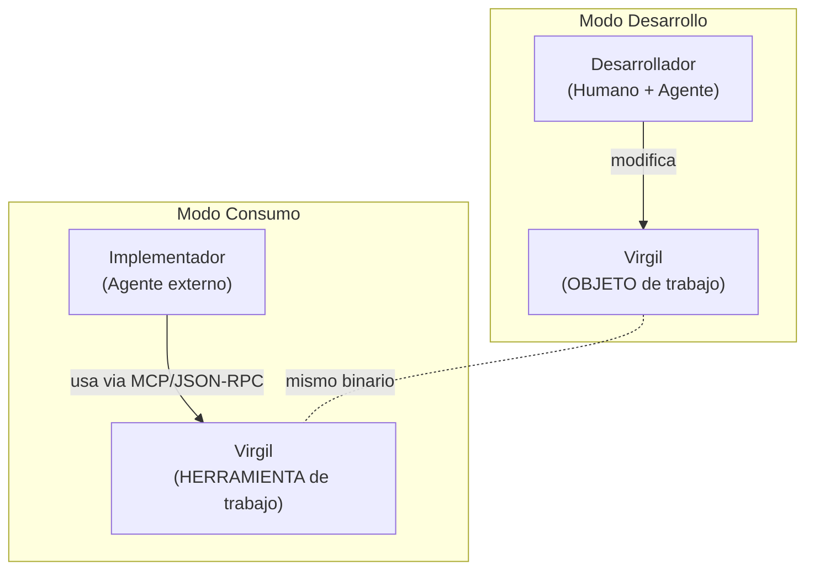

# Actores y Modos

Este documento define los actores y modos operacionales de Virgil.
Estas definiciones son fundacionales e inmutables una vez consolidadas.

## Actores

### Desarrollador

El humano y su agente (Claude, Codex, o cualquier asistente de IA)
trabajando DENTRO del repositorio de Virgil. El desarrollador modifica
codigo fuente, tests, dogma, infraestructura y documentacion. El
desarrollador es la autoridad (MIM) sobre la evolucion de Virgil.

### Implementador

Un agente externo que consume Virgil via MCP, JSON-RPC o stdin/stdout
JSON para planificar SU PROPIO proyecto (de idea a MVP). El
implementador no modifica Virgil. El implementador usa Virgil como
herramienta.

### Virgil

El binario Go autocontenido. Recibe requests estructurados, aplica
contratos, emite artefactos. El mismo binario sirve ambos modos. Virgil
es el plano de conocimiento y control; no ejecuta implementacion, dirige
la planificacion.

## Modos

### Modo Desarrollo

- **Actor principal**: Desarrollador
- **Interfaz**: IDE, terminal, `go test`, edicion directa del repositorio
- **Proposito**: Agregar features, corregir bugs, evolucionar dogma,
  extender contratos
- **Relacion**: Virgil es el OBJETO de trabajo
- **Ejemplos**: Escribir un nuevo handler MCP, agregar un test T0,
  actualizar un schema, refactorizar el runtime

### Modo Consumo

- **Actor principal**: Implementador
- **Interfaz**: MCP tools (`virgil_init`, `virgil_write`,
  `virgil_status`, `virgil_transition`) / `virgil serve` /
  stdin-stdout JSON envelope
- **Proposito**: Planificar un proyecto cliente de idea a MVP
- **Relacion**: Virgil es la HERRAMIENTA de trabajo
- **Ejemplos**: Un agente planificando una app Angular via
  `virgil_write`, transicionando tareas via `virgil_transition`,
  consultando estado via `virgil_status`

## Distincion Clave

En Modo Desarrollo, Virgil es el objeto que se construye.
En Modo Consumo, Virgil es el instrumento que se utiliza.

El mismo binario, los mismos contratos, las mismas quality gates aplican
en ambos modos. La diferencia es la direccion de la agencia: el
desarrollador da forma a Virgil; el implementador es guiado por la
metodologia de Virgil.

