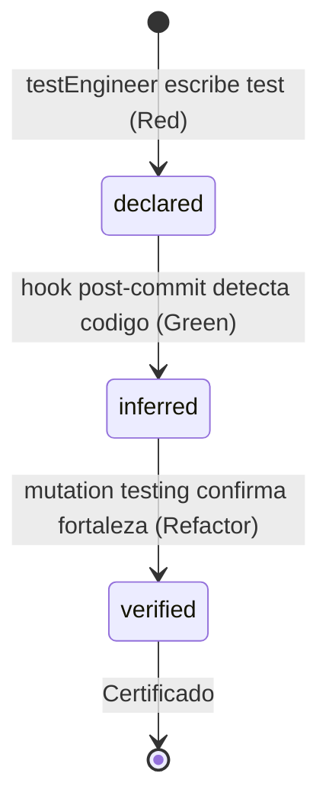
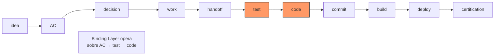

# Binding Layer

El binding layer es el contrato que conecta un AC con su test y con el
codigo que lo satisface. A diferencia de los contratos estaticos
(definidos una vez), el binding layer evoluciona durante la ejecucion.

## Estados

| Estado | Fase donde se alcanza | Que garantiza |
|--------|----------------------|---------------|
| declared | Red | El test existe y referencia un AC |
| inferred | Green | Un hook post-commit detecto que el codigo ejercita el test declarado |
| verified | Refactor | Mutation testing confirmo la fortaleza real del test |

## Transiciones

declared se alcanza cuando el testEngineer escribe un test mapeado a
un AC. El enlace existe pero no hay codigo que lo satisfaga.

inferred se alcanza cuando un hook post-commit detecta que codigo nuevo
ejercita un test declarado. El enlace tiene codigo, pero la fortaleza
del test no ha sido evaluada.

verified se alcanza cuando mutation testing, CRAP score y complejidad
ciclomatica confirman que el test detecta regresiones reales. Este es
el unico nivel que certifica fortaleza.

## Relacion con el TraceabilityGraph

El TraceabilityGraph (definido en `docs/architecture/role.md`) mantiene
relaciones tipadas entre intencion, decisiones, trabajo y evidencia.
El binding layer agrega la dimension de CONFIANZA: no solo que el
enlace existe (trazabilidad), sino que tan fuerte es (fortaleza).

El backbone del grafo es:

El binding layer opera sobre el segmento `AC -> test -> code`,
agregando el estado de confianza (declared/inferred/verified) a cada
enlace.

## Principio rector

Implementa el Dogma 2: "Trazabilidad Y fortaleza verificadas". La
trazabilidad confirma que un enlace existe. La fortaleza confirma que
el enlace es real — que el test detecta regresiones, no solo que pasa.
