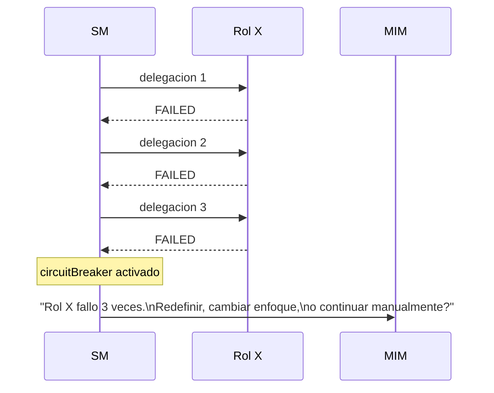
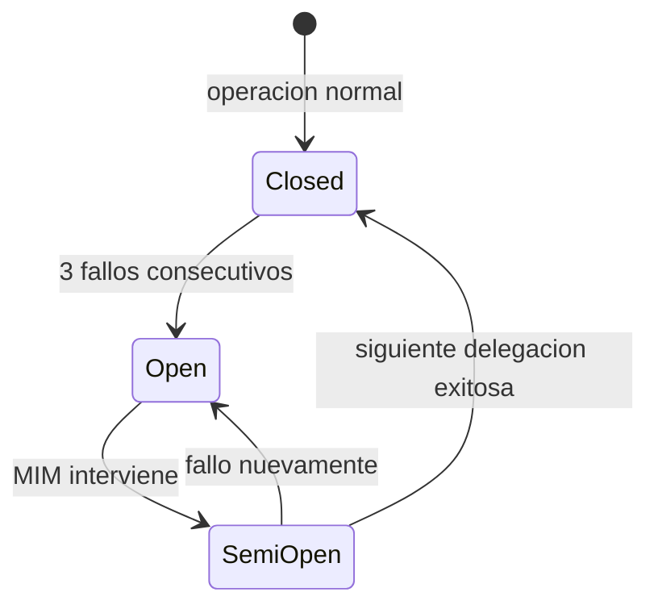

# Circuit Breaker

Mecanismo de proteccion que previene delegaciones infinitas a un rol
que falla repetidamente.

## Regla

Si 3 delegaciones consecutivas al mismo rol devuelven Status: FAILED,
el SM detiene la cadena y escala al MIM:

"El rol X fallo 3 veces consecutivas. Contexto: [...]
Redefinir el contrato, cambiar de enfoque, o continuar manualmente?"

NO hay reintento automatico despues del tercer fallo.

## PARTIAL estancado

Si 3 re-delegaciones consecutivas al mismo rol devuelven PARTIAL con
el mismo progreso (X/Y sin cambio), el SM trata la tercera como FAILED
y aplica el circuitBreaker. Progreso estancado equivale a fallo.

## Alcance del counter

El contador de fallos consecutivos es de sesion. Si hay compaction,
crash o nueva sesion, el counter se resetea a 0.

Cross-session, el TPM mantiene un historial de delegaciones fallidas
como metadata del artefacto afectado. El SM puede consultarlo al inicio
de sesion para ajustar la estrategia.

## Regla de historial obligatorio

Si un artefacto acumula 3 o mas fallos historicos del mismo tipo
(consultados via historial del artefacto), el SM DEBE escalar al MIM
antes de re-delegar. Esta consulta no es advisory — es obligatoria en
el protocolo de recovery.

## Maquina de estados

## Relacion con PlanningGapDetected

PlanningGapDetected (definido en `docs/protocol/core-contracts.md`) es
la senal de escalacion. El circuitBreaker es la politica que determina
CUANDO se activa esa senal basandose en patrones de fallo.

Son complementarios: PlanningGapDetected escala defectos de planning
detectados por execution. El circuitBreaker escala fallos operativos
detectados por el SM durante la orquestacion.
