<!-- Virgil Principia
document_type: "constitution"
title: "Principio Fundador — documento ancla"
status: sealed
sealed_commit: 1d2dfa7
total_chunks: 39
manifest: "principia/manifest.yaml"
layer: authority
constitutional: true
keywords:
  - Principio Fundador
  - documento ancla
  - fuente de verdad constitucional
  - sealed immutable
  - Virgil
-->

# Virgil — Principio Fundador

Documento ancla. Todo lo que Virgil es, hace y por que lo hace.
Si algo contradice este documento, este documento gana.

## Indice

### En este documento
- [1. Que es Virgil](#1-que-es-virgil)
  - [1a. Regla anti-drift interpretativa](#1a-regla-anti-drift-interpretativa)
- [2. Como es (estructura)](#2-como-es-estructura)
- [3. Como actua](#3-como-actua)
  - [3a. Ciclo de vida de un proyecto](#3a-ciclo-de-vida-de-un-proyecto)
  - [3b. Flujo de una invocacion](#3b-flujo-de-una-invocacion)
- [4. Por que actua asi](#4-por-que-actua-asi)
  - [4a. Gobierno — COMO se gobierna](#4a-gobierno--como-se-gobierna)
  - [4b. Arquitectura — COMO se construye](#4b-arquitectura--como-se-construye)
  - [4c. Como se relacionan las dos capas](#4c-como-se-relacionan-las-dos-capas)
- [5. Que partes lo componen](#5-que-partes-lo-componen)
- [6. Como interactuan las partes](#6-como-interactuan-las-partes)
  - [6a. Actores y modos](#6a-actores-y-modos)
  - [6b. Separacion de concerns](#6b-separacion-de-concerns)
  - [6c. Invariante fundamental](#6c-invariante-fundamental)
- [7. Como garantiza calidad](#7-como-garantiza-calidad)
  - [7a. Echo System — pipeline determinista](#7a-echo-system--pipeline-determinista)
  - [7b. Deliverables vs Build Artifacts](#7b-deliverables-vs-build-artifacts)
  - [7c. Macro Red/Green/Refactor — TDD por lotes](#7c-macro-redgreenrefactor--tdd-por-lotes)
  - [7d. Testing Matrix — modelo de boundaries](#7d-testing-matrix--modelo-de-boundaries)
  - [7e. QA / Acceptance Gates — certificacion](#7e-qa--acceptance-gates--certificacion)
  - [7f. droppableCode — cobertura como herramienta](#7f-droppablecode--cobertura-como-herramienta)
  - [7g. complianceByDesign — compliance como efecto secundario](#7g-compliancebydesign--compliance-como-efecto-secundario)
  - [7h. Supply Chain Integrity — dependencias seguras](#7h-supply-chain-integrity--dependencias-seguras)
  - [Ciclo cerrado](#ciclo-cerrado)
- [8. Donde vive el conocimiento](#8-donde-vive-el-conocimiento)
  - [8a. ArtifactStore — persistencia](#8a-artifactstore--persistencia)
  - [8b. Separacion de namespaces](#8b-separacion-de-namespaces)
  - [8c. RAG dual — DBMS de contexto](#8c-rag-dual--dbms-de-contexto)
  - [8d. Visibilidad escalonada](#8d-visibilidad-escalonada)
  - [8e. Memoizacion](#8e-memoizacion)
  - [8f. codebaseMemory — grafo estructural del codigo](#8f-codebasememory--grafo-estructural-del-codigo)
- [9. Como fluye el contexto](#9-como-fluye-el-contexto)
  - [9a. ContextBrief](#9a-contextbrief)
  - [9b. Dos patrones de entrega](#9b-dos-patrones-de-entrega)
  - [9c. Delegacion: SM → sub-agente → PDC](#9c-delegacion-sm--sub-agente--pdc)
- [10. Como se recupera](#10-como-se-recupera)
- [11. Como se ejecuta](#11-como-se-ejecuta)
  - [11a. Pipeline de ejecucion](#11a-pipeline-de-ejecucion)
  - [11b. Contratos primero — habilitador de paralelismo](#11b-contratos-primero--habilitador-de-paralelismo)
  - [11c. Git strategy — aislamiento y trazabilidad](#11c-git-strategy--aislamiento-y-trazabilidad)
  - [11d. Verificacion mecanica — review humano condicional](#11d-verificacion-mecanica--review-humano-condicional)
  - [11e. Accept/Reject — certificacion por gates](#11e-acceptreject--certificacion-por-gates)
  - [11f. Evidencia como dato queryable](#11f-evidencia-como-dato-queryable)
- [12. Como opera (opcional)](#12-como-opera-opcional)
  - [12a. Activacion y rol](#12a-activacion-y-rol)
  - [12b. Adapters de operacion](#12b-adapters-de-operacion)
  - [12c. Escalacion](#12c-escalacion)
- [Regla de auto-referencia](#regla-de-auto-referencia)
- [Glosario](#glosario)
- [Nota de autoridad](#nota-de-autoridad)

---

### Vocabulario de actores

| Actor | Que es | Cuando actua |
|-------|--------|-------------|
| MIM | Humano con autoridad final de decision | Siempre — aprueba, rechaza, desempata |
| Desarrollador | Humano + agente trabajando SOBRE Virgil | Modo Desarrollo |
| Implementador | Agente externo trabajando CON Virgil | Modo Consumo |
| Virgil | El binario — knowledge/control plane | Ambos modos |
| SM | SM (Session Manager) — Agente orquestador. El Method Pack inyecta este rol: en el Pack Scrum cumple funciones de Scrum Master; en otros Packs cumple el rol de orquestacion equivalente definido por ese Pack. Virgil (el binario) no ES el SM — el SM es un rol que opera DENTRO de Virgil. | Ejecucion — delega, verifica, decide |
| TPM | Funcion de tracking de deliverables | Ejecucion — persiste estado, reporta |
| PDC | Post-Delegation Checkpoint (ECHO → VERIFY → MARK → DECIDE) | Despues de cada delegacion del SM |

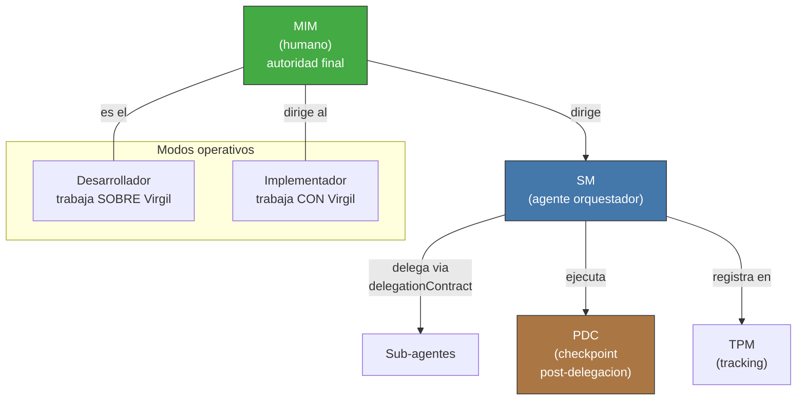

Detalle de delegacion y PDC en la seccion 9c de este documento.

> **Delegacion de aprobaciones MIM.** En equipos donde el MIM es tambien el unico desarrollador, los puntos de aprobacion MIM (excepciones de cobertura, declaracion de perfil de compliance del proyecto, break-glass) pueden consolidarse mediante autorizacion permanente documentada: el MIM emite una politica de proyecto que pre-autoriza categorias especificas, reduciendo la friccion sin eliminar la trazabilidad. Nota: lo delegable es la DECLARACION del perfil regulatorio del proyecto, no la activacion del gate de review humano — esa activacion es automatica e incondicional una vez declarado el perfil (ver seccion 7g).

## 1. Que es Virgil

[↑ Volver al indice](#indice)

Virgil es el knowledge/control plane de un proyecto. No es un
framework, no es un Scrum Master, no ejecuta codigo. Mantiene
identidad, trazabilidad, contexto y transiciones.

Virgil se apega al **Open Agentic Standard**: publica un `AGENTS.md`
en el proyecto consumidor como convención de discoverability, y se
comunica via **Model Context Protocol (MCP)** / JSON-RPC. Cualquier
agente compatible puede consumir Virgil sin acoplamiento a un
proveedor específico.

> **Clarificacion constitucional (CC-1):** Virgil se distribuye como un binario de servidor MCP independiente. Es un proceso autonomo que cualquier host puede descubrir e invocar sin acoplamiento adicional. Esta es la realizacion arquitectonica del compromiso con el Open Agentic Standard descrito en el parrafo anterior.

> **Clarificacion constitucional (CC-4):** El modelo de consumo es agnostico de agente por diseno constitucional. Cualquier agente compatible con MCP — Claude, GPT, Gemini, OpenCode, Cursor, Windsurf, Kiro u otros agentes futuros que cumplan con el protocolo — puede consumir las herramientas de Virgil. El HostAdapter (seccion 5) traduce entre las convenciones de cada host y el Virgil Kernel; agregar un nuevo agente requiere unicamente una nueva implementacion de HostAdapter, no cambios en las capas de Kernel ni de ArtifactStore.

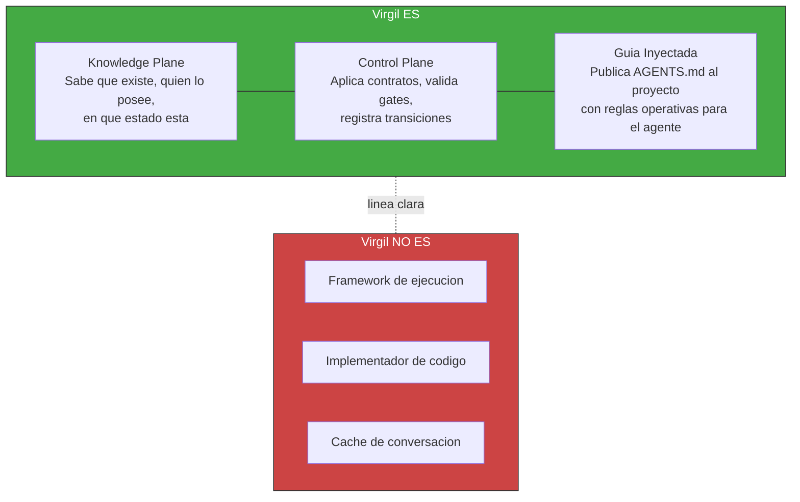

> **Clarificacion constitucional (CC-3):** Virgil opera como uno de tres pilares complementarios en el ecosistema de desarrollo asistido por IA: gentle-ai gestiona el COMO trabajan los agentes (review, receipt-driven development), engram gestiona la MEMORIA (contexto persistente entre sesiones), y Virgil gestiona el QUE y el DONDE (el puente entre planning y codebase, con trazabilidad). Los limites de "Virgil NO ES" enunciados arriba mapean directamente a esta separacion: "Framework de ejecucion" e "Implementador de codigo" corresponden al dominio de gentle-ai; "Cache de conversacion" corresponde al dominio de engram.

Virgil no adopta roles ceremoniales (no es Scrum Master). Pero SI inyecta
guia operativa al agente consumidor via AGENTS.md. Esa guia deberia
incluir:

- Patron orquestador-minion (como delegar trabajo a sub-agentes)
- Ownership y housekeeping de tokens (como gestionar contexto)
- Planning boundary y stop conditions (cuando detenerse)

> **Pendiente de definicion**: el AGENTS.md actual documenta wire protocol y operaciones. El patron de orquestacion y la gestion de tokens se especificaran en el Method Pack correspondiente, no en este documento ancla. Este item queda fuera del alcance del Principia.

> **Alcance de este documento.** El Principia es el dogma fundacional: filosofia, arquitectura e invariantes. NO es un documento de go-to-market, guia de adopcion ni manual de usuario. El perfil de consumidor objetivo (ICP), la estrategia de MVP, el posicionamiento competitivo y las guias de onboarding son deliverables separados que se derivan DEL Principia pero no forman parte de el. El Kernel + el Method Pack Scrum (el unico implementado) constituyen el slice minimo viable; los demas Method Packs, codebaseMemory y extensiones de Method Pack son provisiones arquitectonicas, no requisitos de v1 (los plugins de ArtifactStoreAdapter, en cambio, son parte de la arquitectura nuclear — ver CC-2).

### 1a. Regla anti-drift interpretativa

Este documento debe interpretarse preservando el **ciclo cerrado de accountability** de Virgil. Un revisor — humano o agente — NO debe abstraerlo hacia un framework generico de policies, observers o tooling intercambiable si esa abstraccion elimina o vuelve opcionales los mecanismos que el Principia declara constitucionales.

La frontera canonica es:

```text
planning deliverables
        ↓
R/G/R + Echo System
        ↓
canonical build artifacts
        ↓
EvidenceIngestion + Binding Layer
        ↓
certification gates
        ↓
Ledger / TraceabilityGraph
```

**No son detalles de implementacion y NO son overrideables por proyecto:**

- El Echo System de cinco pasos: Setup → Build → Static → Dynamic → E2E
- El orden de Echo; puede variar el scope, no la secuencia
- Macro Red/Green/Refactor y su independencia por fase
- La existencia de build artifacts regenerables como salida canonica de Echo
- La asociacion inequívoca `EchoRun + sourceRevision + buildArtifactSet`
- EvidenceIngestion, Binding Layer y las gates minimas de calidad del Kernel
- La regla de que certificacion se decide sobre evidencia producida por el camino canonico, no sobre afirmaciones del agente

**Si son sustituibles/configurables mientras preserven esos contratos:**

- Herramientas concretas usadas dentro de cada etapa de Echo
- Comandos, runners, scanners y proveedores CI/CD
- Triggers que disparan Echo (hooks, CI, CD u otros adapters)
- Estrategia Git, nombres de branches, worktrees y convenciones de commits
- Ubicacion fisica de build artifacts, siempre que conserven identidad, procedencia y reproducibilidad
- Backends de HostAdapter, ArtifactStoreAdapter, RAG y otras extensiones expresamente definidas por contrato

**Prueba anti-drift:** si una reinterpretacion permite que Virgil simplemente "observe lo que haya ocurrido" y certifique evidencia arbitraria sin pasar por Echo/build artifacts, esa reinterpretacion contradice este Principia. Virgil no es un auditor pasivo: define el protocolo mediante el cual la ejecucion adquiere evidencia certificable.

**Fuerza normativa deliberada.** Las declaraciones absolutas del Principia representan obligaciones de conformidad y direccion arquitectonica, no descripciones del estado actual de implementacion. Una IA o implementador NO debe: debilitarlas porque hoy una herramienta no pueda enforcearlas completamente; reemplazarlas por una abstraccion mas generica; reinterpretar mecanismos fundacionales como detalles accidentales; ni introducir salvedades operativas dentro del Principia cuando pertenecen al Dogma o adapters. La incapacidad actual de enforcement crea trabajo pendiente de implementacion, no una excepcion al principio.

> **Nota de nombres:** `ECHO` dentro del PDC (ECHO → VERIFY → MARK → DECIDE) es el paso de coherence check del checkpoint. No es el **Echo System** (Setup → Build → Static → Dynamic → E2E). Son conceptos distintos aunque compartan nombre.

---

## 2. Como es (estructura)

[↑ Volver al indice](#indice)

Tres capas concentricas. Cada capa interna gobierna a las externas.

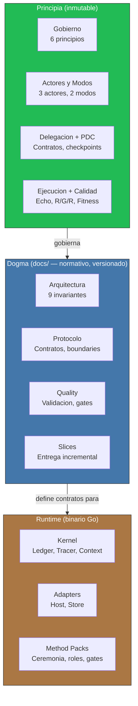

Con esta estructura inmutable como cimiento, Virgil se manifiesta a través de ciclos de vida predecibles: una máquina de estados que rige proyectos y un flujo de invocación que garantiza trazabilidad en cada transición.

---

## 3. Como actua

[↑ Volver al indice](#indice)

### 3a. Ciclo de vida de un proyecto

Cada fase itera hasta consolidar su deliverable. No es una linea recta —
es un loop que converge hacia un handoff bien acotado.

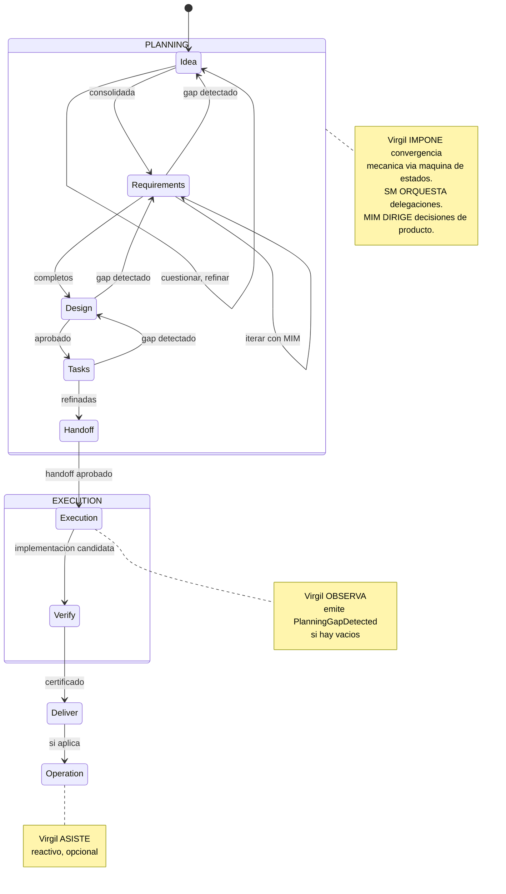

La maquina de estados del proyecto (via virgil_status) indica en que
fase esta cada feature y el proyecto en general. Un feature no avanza
hasta que su deliverable esta consolidado.

**PlanningGapDetected**: si execution descubre que un deliverable aprobado
es ambiguo, contradictorio o insuficiente, emite esta senal, bloquea
solo el scope afectado y devuelve el control a planning. Execution
nunca reescribe un deliverable aprobado.

**FastForward**: el SM no siempre ejecuta todas las fases con la misma
ceremonia. Evalua un gradiente de certeza (FF-1 a FF-4) sobre el contexto
existente y comprime las fases proporcionalmente — desde ceremonia
completa (score 0-2) hasta ejecucion directa (score 6-8). El SM computa el score sobre estado observable y verificable. La formula de scoring y los inputs + resultado se registran en el Ledger, haciendolo auditable. FastForward comprime CEREMONIA de planning (fases de deliberacion), no gates de calidad del Kernel — los gates de certificacion (R/G/R, mutation testing, fitness functions) se ejecutan integros en TODOS los niveles de FastForward, desde FF-1 hasta FF-4.

### 3b. Flujo de una invocacion

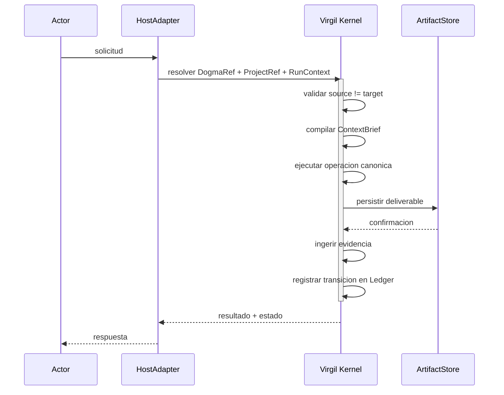

Este flujo canonico tiene pasos deterministas y pasos mediados por juicio. Las gates de certificacion (test pass/fail, mutation score, CRAP, coverage, CVE scan) son deterministas — binarias, sin subjetividad. Los pasos de planning, escalacion, compilacion de ContextBrief, alineacion arquitectonica y verificacion de coherencia (PDC) involucran juicio del agente orquestador, no son deterministas y deben dejar evidencia trazable. El Principia distingue ambos tipos explicitamente.

El PDC es un safeguard de coherencia de orquestacion que opera durante la ejecucion, pero NO es un gate de certificacion. La certificacion la determinan exclusivamente las gates del pipeline de QA definidas por el Kernel: gates mecanicas deterministas (seccion 7e, 11d) y verificacion estructurada de alineacion arquitectonica (seccion 7e, gate ARCH). Cuando el proyecto declara un perfil de compliance regulatoria, el review humano se agrega como gate blocking adicional (seccion 7g). El PDC puede detener una delegacion incoherente, pero no certifica ni aprueba codigo.

> **Identidades de invocacion**: `DogmaRef`, `ProjectRef` y `RunContext` son las tres identidades que el HostAdapter resuelve al inicio de cada invocacion. Este Principia las nombra como participantes del flujo canonico pero no especifica sus campos — ese contrato pertenece al layer de protocolo (docs/protocol/).

> **Atomicidad**: el flujo muestra pasos secuenciales (persistir →
> ingerir evidencia → registrar transicion). Si el proceso falla entre
> pasos, el mecanismo de recovery (seccion 10) reconcilia el estado
> derivando la fase actual desde los deliverables existentes, no desde
> un puntero almacenado. El Ledger implementa idempotencia: registrar
> una transicion ya registrada es un no-op.

Detras de cada paso hay un principio deliberado que descubrimos a continuación.

---

## 4. Por que actua asi

[↑ Volver al indice](#indice)

Dos capas de principios complementarias. No se mezclan.

### 4a. Gobierno — COMO se gobierna

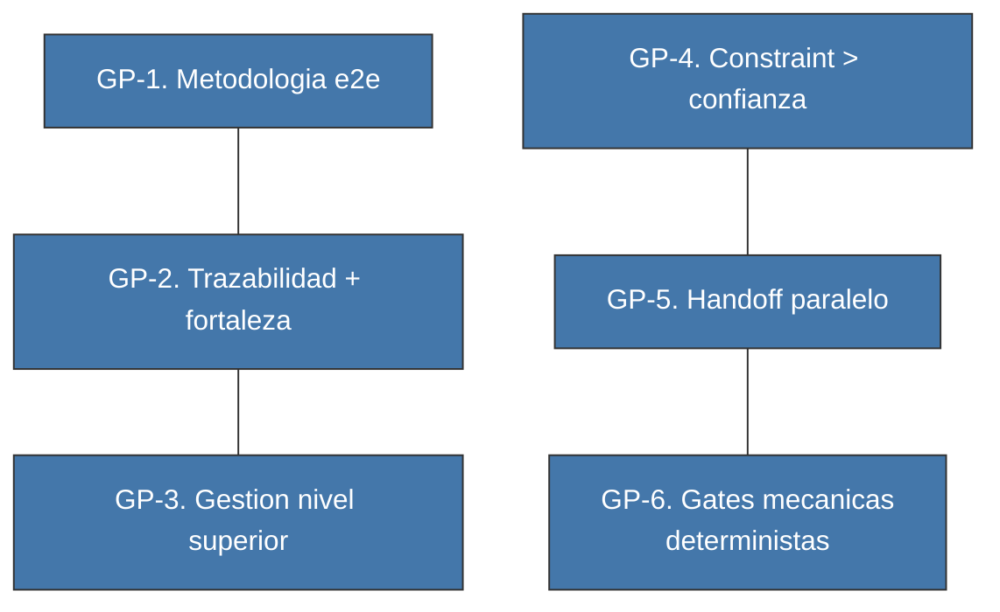

| # | Principio | En una frase |
|---|-----------|-------------|
| 1 | Metodologia e2e | Idea → codigo certificado → operacion. Sin saltos. |
| 2 | Trazabilidad + fortaleza | No basta que el enlace exista; debe ser fuerte. |
| 3 | Gestion nivel superior | Dashboard de salud, no revision linea a linea. |
| 4 | Constraint > confianza | Constraints enforceables y gates, no promesas del agente. |
| 5 | Handoff paralelo | Claiming sobre un handoff, no handoffs separados. |
| 6 | Gates mecanicas deterministas | Binario en ejecucion: pasa o no pasa. Planning y escalacion involucran juicio; la verificacion estructurada (ARCH) queda acotada y trazable (ver 7e). |

### 4b. Arquitectura — COMO se construye

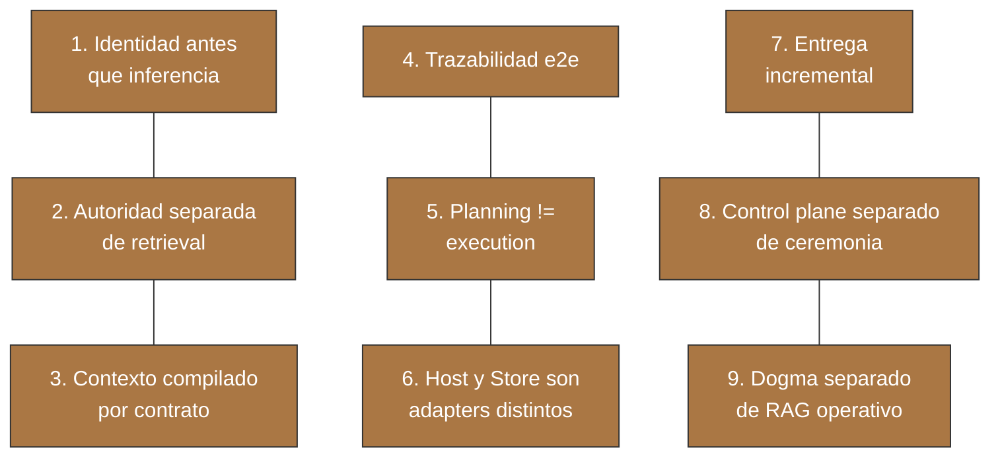

### 4c. Como se relacionan las dos capas

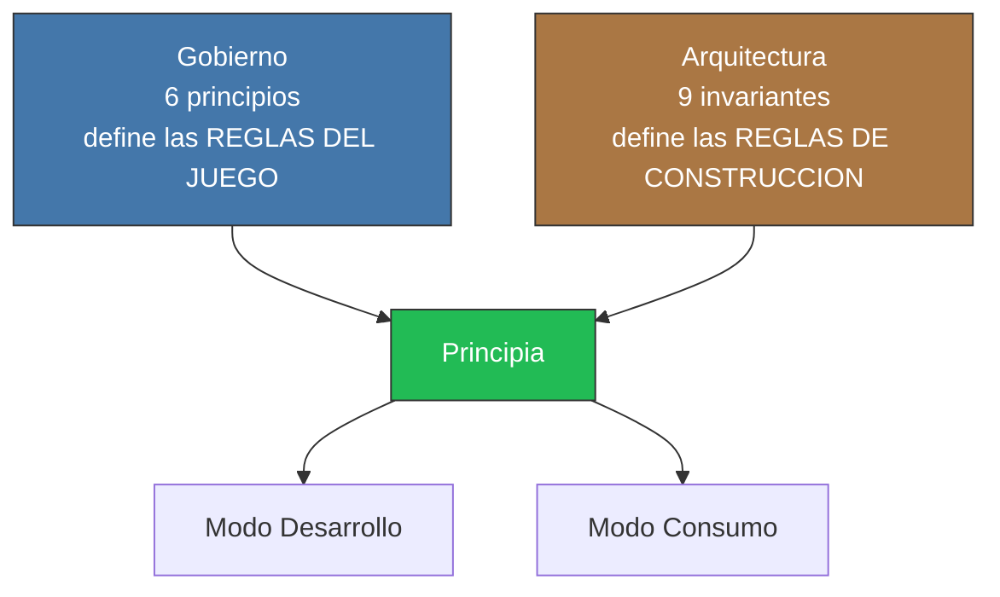

Ambas capas de principios confluyen en el Principia. Lo que falta es conocer sus componentes: qué piezas implementan estas reglas.

---

## 5. Que partes lo componen

[↑ Volver al indice](#indice)

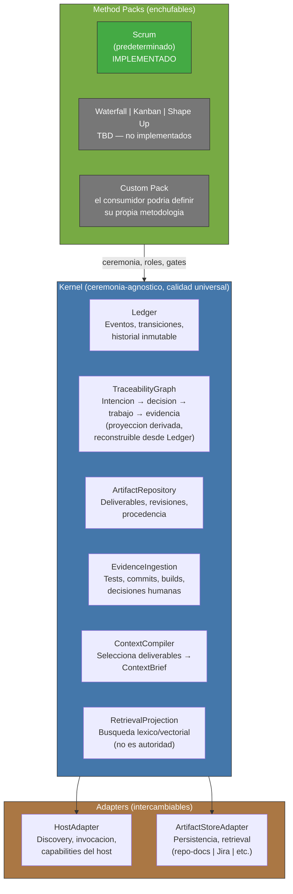

Cada componente tiene una responsabilidad clara. El Kernel impone invariantes de calidad universales (Echo, testing, binding layer) independientemente de la metodologia. El Method Pack define la ceremonia: cuantos roles participan, que gates ceremoniales se comprimen, como se itera. La calidad es del Kernel; la ceremonia es del Pack.

Los Method Packs heredan los gates de calidad (Red/Green/Refactor, mutation testing, fitness functions) como invariantes universales no negociables. Un Pack puede definir mecanismos de calidad ADICIONALES pero no puede reducir el minimo del Kernel. "Ceremonia-agnostico" significa que el Pack elige la ceremonia (sprints, kanban boards, ciclos de Shape Up); "calidad universal" significa que el pipeline de verificacion R/G/R + fitness functions aplica sin excepcion, independientemente de la ceremonia elegida.

> **Clarificacion constitucional (CC-5):** La cadena del TraceabilityGraph (Intencion → decision → trabajo → evidencia) es la realizacion arquitectonica de un puente entre herramientas de gestion de producto (PM) y el codebase. "Intencion" mapea a artefactos de herramientas PM (historias, tickets, epicas en Jira, Azure DevOps, GitLab, etc.); "decision" mapea a documentos de diseno y especificaciones; "trabajo" mapea a cambios de codigo; "evidencia" mapea a resultados de tests y artefactos de verificacion. Este puente — saber QUE trabajar y DONDE en el codebase — constituye la propuesta de valor central de Virgil, reforzada por GP-2: "No basta que el enlace exista; debe ser fuerte."

---

## 6. Como interactuan las partes

[↑ Volver al indice](#indice)

### 6a. Actores y modos

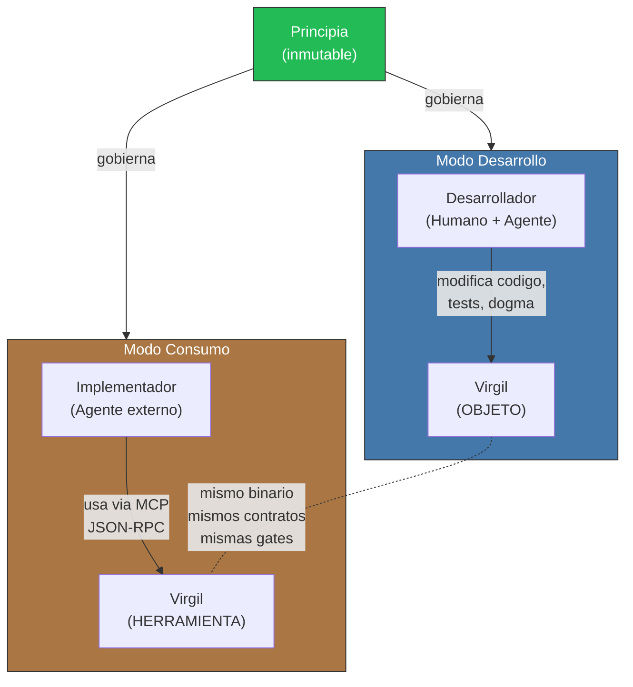

### 6b. Separacion de concerns

Cada pieza tiene un ownership claro. No se mezclan.

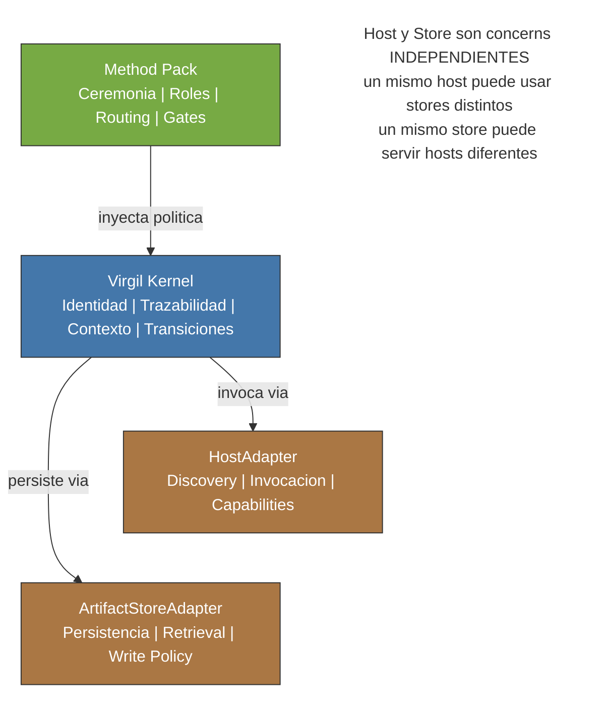

### 6c. Invariante fundamental

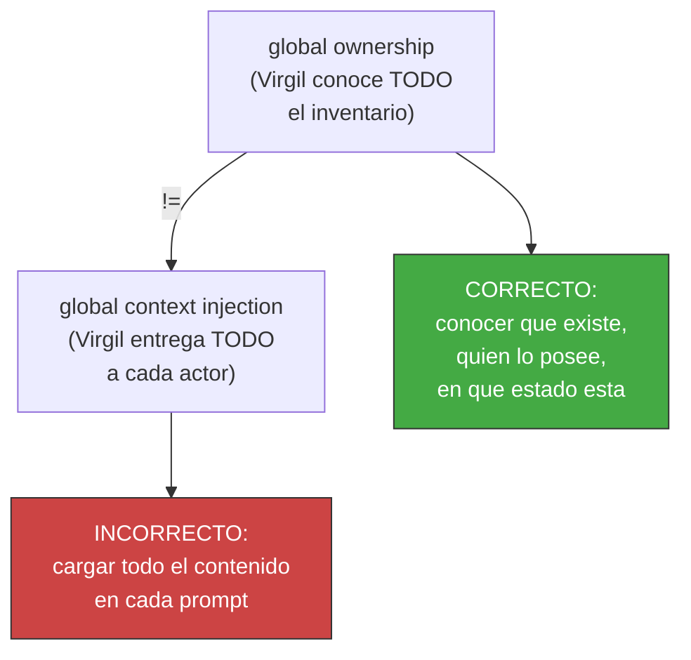

Estas invariantes fundamentales — que Virgil conoce sin inflar contextos — se aplican de forma idéntica en ambos modos operativos, generando una propiedad notable: Virgil es tanto herramienta como objeto bajo las mismas reglas.

---

## 7. Como garantiza calidad

[↑ Volver al indice](#indice)

Ocho mecanismos forman un ciclo de accountability anidado. Ninguno
funciona aislado.

### 7a. Echo System — pipeline determinista

Secuencia de 5 pasos que se ejecuta en TODO ambiente (dev, CI, CD).
Los pasos son siempre los mismos y en el mismo orden. Lo que varia
es el scope (dev prioriza feedback rapido, CI prioriza completitud).

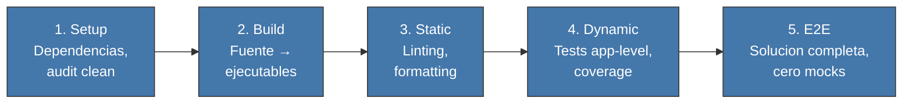

| Ambiente | Scope | Trigger por defecto | Enforcement |
|----------|-------|---------------------|-------------|
| Dev | Selectivo, feedback rapido | git hooks | Pre-commit, pre-push |
| CI | Completo | Push, PR | Pipeline stages |
| CD | Confianza absoluta | Tag, merge a main | Deployment gates |

Los triggers son adapters de operacion y pueden cambiar por proyecto; **Echo no cambia**. Un proyecto puede disparar el mismo scope mediante hooks, CI, un runner local u otro mecanismo siempre que: (a) produzca el mismo contrato de Echo y sus build artifacts identificados, y (b) el trigger sea automatico — no omitible por el agente ejecutor.

En la configuracion por defecto, los hooks de pre-commit ejecutan verificaciones ESTRUCTURALES de feedback rapido (lint, type-check, formato, analisis estatico). Los tests de integracion contra stack real (tier App/Servicio) se ejecutan en pre-push o en el pipeline de CI, no en pre-commit. "Feedback rapido" en el contexto de Dev se refiere a las verificaciones estructurales, no a la suite completa de integracion.

### 7b. Deliverables vs Build Artifacts

Dos tipos de outputs que no deben confundirse. Los documentos de
planning son **deliverables** (PMBOK/ISO 21500). Los outputs del build
pipeline son **build artifacts** (DevOps/CI-CD). Virgil gestiona
deliverables; el Echo System genera build artifacts.

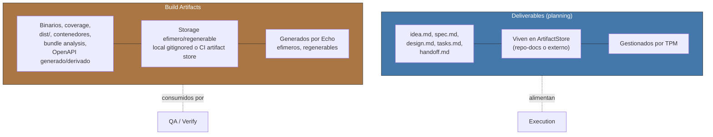

> **Nomenclatura**: el codigo de Virgil usa "Artifact" en entidades
> como ArtifactStore, ArtifactRepository y ArtifactStoreAdapter. Estas
> entidades gestionan **deliverables**, no build artifacts. La
> nomenclatura de codigo es historica; este Principia define la
> terminologia canonica.

> **Identidad de evidencia**: cada conjunto de build artifacts DEBE quedar ligado de forma inequívoca al `EchoRun` y a la `sourceRevision` que lo produjo. QA nunca certifica "el ultimo reporte" de forma implicita; certifica un `buildArtifactSet` atribuible a una revision concreta. La ubicacion fisica del artifact puede variar, su identidad y procedencia no.

> **OpenAPI**: el contrato fuente definido en `prePhase` es un deliverable/contrato normativo. Un OpenAPI JSON/YAML generado por build a partir de ese contrato o del codigo es un build artifact derivado. No comparten autoridad aunque puedan representar la misma interfaz.

### 7c. Macro Red/Green/Refactor — TDD por lotes

TDD a nivel de batch, no funcion por funcion. Primero TODA la suite de
tests, luego TODA la implementacion, luego TODO el refactoring.

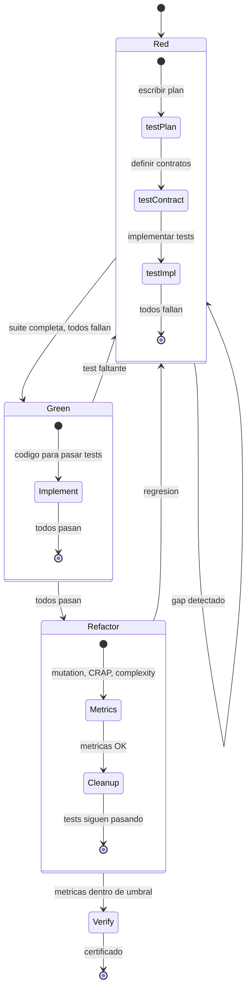

El dogma actual define 5 gates dentro de este ciclo:
**R0** (handoff completo) → **R1** (red valida) → **G1** (green
production-safe) → **F1** (refactor seguro) → **V1** (verify
independiente).

#### compositeAgent — ejecucion paralela de R/G/R

Cuando la ejecucion se paraleliza en multiples lanes, cada lane opera
dentro de un **mutation domain aislado** y recibe un compositeAgent: un
sub-agente que asume multiples personalidades secuencialmente dentro de
ese mismo dominio, evitando conflictos de filesystem. Worktrees son la
implementacion de referencia del Dogma actual. El invariante del
Principia es el aislamiento, no el mecanismo: un mutation domain valido
debe proveer (a) filesystem aislado que no interfiera con otros lanes,
(b) deteccion de conflictos al integrar, y (c) identidad de revision
por lane.

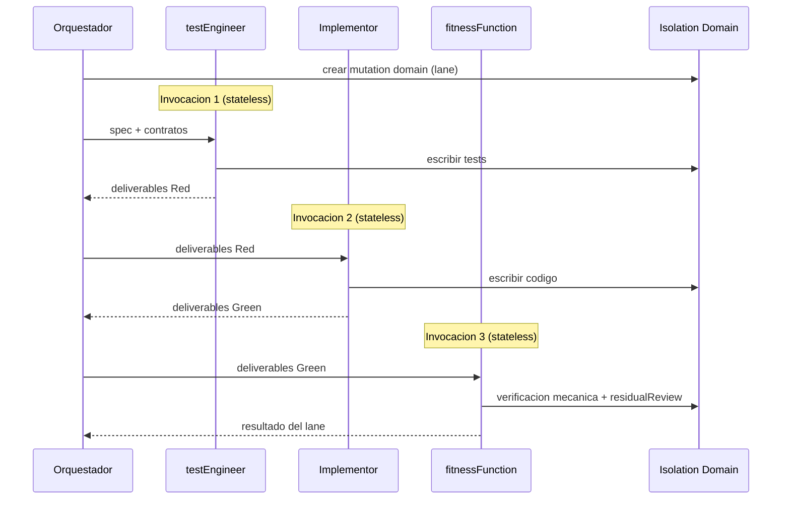

| Fase | Invocacion | Responsabilidad |
|------|-----------|-----------------|
| Red | testEngineer (sesion independiente) | Escribir tests segun spec |
| Green | Implementor (sesion independiente) | Codigo que pase los tests |
| Refactor | fitnessFunction (sesion independiente) | Mutation, CRAP, complejidad + residualReview |

Un compositeAgent NO es un agente monolitico — es una SECUENCIA de
invocaciones independientes orquestadas bajo una etiqueta comun.
Cada fase tiene su propio contrato y criterio de salida.

**Invariante de independencia**: cada fase del compositeAgent (testEngineer, Implementor, fitnessFunction) se ejecuta como invocacion independiente del agente — nueva sesion, sin historial conversacional. El Kernel implementa este reset como constraint tecnico (invocacion stateless por fase), no como instruccion al agente. Cada fase recibe unicamente los deliverables y build artifacts producidos por la fase anterior, no la historia de razonamiento. Este mecanismo satisface el Principio GP-4 (constraint > confianza): la independencia es estructural, no una promesa de comportamiento.

> **Desambiguacion**: "fitness functions" (plural, generico) designa una CATEGORIA de gate de calidad (junto con mutation testing y R/G/R) aplicable a todo el pipeline. `fitnessFunction` (singular, camelCase) designa un ROL ESPECIFICO de invocacion dentro de la secuencia compositeAgent (testEngineer → Implementor → fitnessFunction). No confundir: la categoria es universal; el rol es una instancia de invocacion dentro de un mutation domain.

### 7d. Testing Matrix — modelo de boundaries

El valor de un test depende de DONDE se ubica la frontera del mock,
no de la piramide clasica.

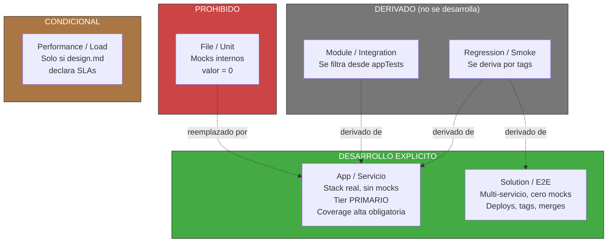

El dogma actual de Virgil define ademas T0 (protocol/app replay),
T1 (agent-in-the-loop) y T2 (host-adapter conformance) como niveles
especificos para validar el propio Virgil.

#### Patron de trazabilidad: matriz → codigo

Durante Red, los casos de prueba se definen como una matriz con
nombres estaticos. El codigo de la prueba importa esos nombres. Esto
crea un enlace RAG-searchable desde la matriz documentada hasta la
implementacion del test.

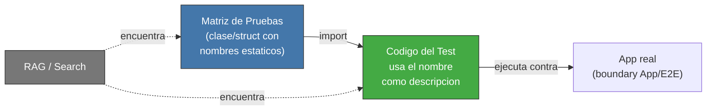

El patron es agnostico de tecnologia: en TypeScript es una clase con
`static readonly`, en Go seria un `const` block o struct, en Rust un
`mod` con constantes. Lo que importa es que la matriz y el test
compartan un identificador rastreable.

#### Binding Layer — confianza del enlace

El enlace entre un test y el codigo que lo satisface no es binario
(existe/no existe). Tiene tres niveles de confianza que progresan
durante el ciclo R/G/R:

| Estado | Fase | Garantiza |
|--------|------|-----------|
| declared | Red | El test existe y referencia un AC |
| inferred | Green | Un hook detecto que codigo ejercita el test |
| verified | Refactor | Mutation testing confirmo fortaleza real |

Solo `verified` certifica fortaleza — los demas solo confirman
existencia.

### 7e. QA / Acceptance Gates — certificacion

La certificacion combina gates mecanicas deterministas (test pass/fail, mutation score, coverage, CRAP, CVE scan, tamano de modulo) y gates de verificacion estructurada (alineacion arquitectonica). Las gates mecanicas son binarias: pasan o no pasan. Las gates de verificacion estructurada (ARCH: implementacion alineada con design.md) utilizan comparacion semantica documentada y trazable, sujeta al mismo deslinde de la seccion 3b.

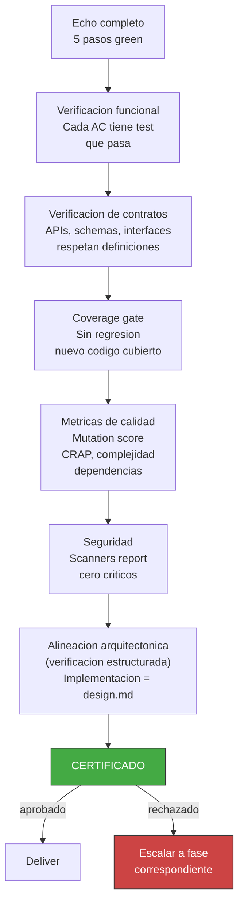

### 7f. droppableCode — cobertura como herramienta

Codigo con 0% de cobertura en appTests no tiene justificacion para
existir. La cobertura no es metrica de vanidad — es detector de
codigo muerto.

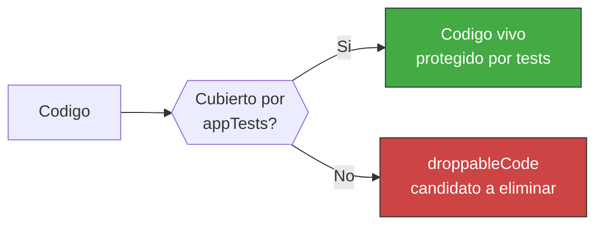

Codigo detectado como droppableCode debe eliminarse o justificar su existencia con una excepcion explicita, documentada y revisable. El concepto **safeToAutoDelete** identifica el subconjunto de droppableCode que cumple criterios mecanicos de eliminacion segura: **sin dependientes vivos, sin ejecucion observada durante N ciclos y sin cobertura transitiva**. safeToAutoDelete habilita eliminacion mecanica automatica; droppableCode sin esos criterios requiere decision humana (eliminar o justificar excepcion).

El threshold de cobertura es obligatorio y **nunca se reduce** sin
autorizacion explicita del MIM. Se mide solo sobre archivos con
logica real (cobertura selectiva). Excepciones documentadas: codigo
defensivo para failure modes raros, paths de feature flags no activos,
boilerplate de adapters para interfaces externas aun no ejercitadas,
y codigo legado en proceso de migracion. Cada excepcion requiere un
tag explicito en el archivo y revision periodica.

El mismo mecanismo de excepcion aplica a mutation testing: el MIM puede autorizar excepciones documentadas para codigo donde mutation testing es computacionalmente prohibitivo (test suites de integracion pesada, codigo generado, adapters de terceros). Cada excepcion requiere tag explicito, justificacion y revision periodica. Los umbrales de mutation score siguen siendo no-relajables para el codigo no exceptuado.

### 7g. complianceByDesign — compliance como efecto secundario

Si cada test aserta la forma EXACTA del DTO (campos presentes, campos
ausentes, tipos), se obtiene verificacion de compliance sin suites
separadas.

```mermaid
flowchart TD
    STRICT["Aserciones estrictas\nforma completa del DTO"]
    ABUSE["abuseCases\ntesting adversarial"]
    STRUCT["Validacion estructural\nschemas, hashing,\nencryption, A11y"]

    STRICT & ABUSE & STRUCT --> COMPLIANCE["Compliance\ncomo efecto secundario"]

    COMPLIANCE --> HIPAA["HIPAA\n(capa de datos)"]
    COMPLIANCE --> PCI["PCI DSS\n(capa de datos)"]
    COMPLIANCE --> GDPR["GDPR\n(capa de datos)"]

    style COMPLIANCE fill:#4a4,stroke:#333,color:#fff
```

Alcance: cubre EXCLUSIVAMENTE la capa de controles tecnicos de datos
(minimizacion, control de acceso por campo, validacion de forma). NO
cubre controles organizacionales, fisicos, legales, procedimentales
ni segregacion de responsabilidades. Cuando el proyecto declara un perfil de compliance regulatoria (HIPAA, PCI DSS, GDPR), el Method Pack DEBE activar review humano obligatorio sobre logica de autorizacion y modelado de dominio como gate blocking. Esta activacion es automatica para perfiles regulados, no opt-in. Para proyectos sin perfil regulatorio, el review humano permanece opcional y no-blocking. El Principia define la capacidad tecnica; el perfil de compliance del proyecto determina si el review humano es requerido.

### 7h. Supply Chain Integrity — dependencias seguras

[↑ Volver al indice](#indice)

Las dependencias externas son superficie de ataque y fuente de tech debt. Virgil impone tres invariantes sobre la cadena de suministro, agnosticos de lenguaje y plataforma.

#### versionPinning — reproducibilidad absoluta

Todas las dependencias se declaran con version EXACTA (sin rangos, sin prefijos de compatibilidad). El gestor de dependencias y su version tambien se declaran de forma explicita en el proyecto.

| Invariante | Que significa | Por que |
|------------|--------------|---------|
| Version exacta | `1.2.3`, nunca `^1.2.3` ni `~1.2.3` | Elimina version drift entre ambientes. Lo que pasa en CI es lo que corre en produccion |
| Gestor de dependencias versionado | Version del gestor pinneada al proyecto | Garantiza paridad de resolucion de dependencias en todos los ambientes |
| Lock file como artefacto | El lock file se versiona y se respeta como fuente de verdad | Captura el arbol completo de dependencias transitivas |

El invariante aplica independientemente del ecosistema (npm/pnpm/yarn, Go modules, Cargo, pip/uv, Maven/Gradle, etc.). La implementacion concreta varia; el principio es universal: **cero ambiguedad en versiones**.

#### securityAudit — gate de dependencias

Antes de construir, se ejecuta un escaneo de vulnerabilidades sobre el arbol de dependencias. Esta verificacion es una gate BLOCKING del paso 1 (Setup) del Echo System (seccion 7a).

```mermaid
flowchart LR
    DEPS["Arbol de\ndependencias"] --> AUDIT["securityAudit\n(escaneo de\nvulnerabilidades)"]
    AUDIT -->|"0 vulnerabilidades\naltas/criticas"| BUILD["→ Build\n(Echo paso 2)"]
    AUDIT -->|"vulnerabilidades\ndetectadas"| BLOCK["BLOQUEADO\nResolver antes\nde continuar"]

    style BUILD fill:#4a4,stroke:#333,color:#fff
    style BLOCK fill:#c44,stroke:#333,color:#fff
```

| Ambiente | Comportamiento |
|----------|---------------|
| Dev | Pre-push hook — alerta, no bloquea |
| CI | Pipeline stage — gate blocking |
| CD | Deployment gate — bloqueo absoluto |

El umbral de severidad (high, critical, o ambos) lo define el Method Pack. El Kernel impone que el escaneo se ejecute; el Pack decide el umbral. La herramienta de escaneo es agnostica: cada ecosistema tiene su equivalente (`pnpm audit`, `go vuln check`, `cargo audit`, `pip-audit`, `mvn dependency-check`, etc.).

#### bumpDependencies — mitigacion controlada de tech debt

Las versiones exactas previenen drift pero acumulan tech debt si no se actualizan. El ciclo bumpDependencies resuelve esta tension con un proceso de tres pasos:

```mermaid
flowchart LR
    S1["1. Security Fix\nResolver\nvulnerabilidades\nconocidas"]
    S2["2. Update Check\nIdentificar y aplicar\nactualizaciones\ndisponibles"]
    S3["3. Security Fix\nRe-verificar\npost-actualizacion"]

    S1 --> S2 --> S3

    S3 -->|"clean"| ECHO["Echo completo\n(5 pasos)"]
    S3 -->|"vulnerabilidades"| ROLLBACK["Rollback +\ninvestigar"]

    style S1 fill:#47a,stroke:#333,color:#fff
    style S2 fill:#47a,stroke:#333,color:#fff
    style S3 fill:#47a,stroke:#333,color:#fff
    style ECHO fill:#4a4,stroke:#333,color:#fff
    style ROLLBACK fill:#c44,stroke:#333,color:#fff
```

1. **Security Fix**: resolver vulnerabilidades conocidas en las versiones actuales
2. **Update Check**: ejecutar un verificador de actualizaciones que identifique versiones nuevas de todas las dependencias, aplicando las actualizaciones con version exacta (sin introducir rangos)
3. **Security Fix**: re-ejecutar el escaneo de seguridad contra las versiones actualizadas — una actualizacion puede INTRODUCIR vulnerabilidades nuevas

Despues del ciclo completo, el Echo System se ejecuta integro (5 pasos). Si alguna gate falla, se revierte la actualizacion y se investiga la causa.

bumpDependencies no es un paso del Echo — es un proceso de mantenimiento que PRECEDE al Echo. Se ejecuta de forma explicita (no automatica), tipicamente en una cadencia definida por el equipo (semanal, por sprint, o pre-release). El MIM puede delegar la cadencia al Method Pack.

### Ciclo cerrado

Estos mecanismos forman un ciclo cerrado: el Echo ejecuta, los build
artifacts capturan outputs, Red/Green/Refactor estructura la ejecucion
(paralelizable via compositeAgent), la Testing Matrix define que vale
como prueba, droppableCode detecta codigo muerto, complianceByDesign
verifica cumplimiento, Supply Chain Integrity asegura dependencias
seguras y actualizadas, y QA certifica el resultado. Si QA rechaza, se
escala a la fase que corresponda.

---

## 8. Donde vive el conocimiento

[↑ Volver al indice](#indice)

Tres concerns separados: donde se PERSISTEN los deliverables
(ArtifactStore), como se CONSULTAN deliverables y documentacion (RAG),
y como se COMPRENDE la estructura del codigo (codebaseMemory). El RAG
actua como DBMS del contexto documental; el codebaseMemory actua como
grafo estructural del codigo. Ambas proyecciones son **versionadas**:
declaran un watermark (la revision contra la cual estan sincronizadas)
y pueden detectar drift respecto al estado actual del repositorio.

El camino canonico de contextualizacion es consultar la herramienta
apropiada con queries acotadas, no cargar archivos completos en el
prompt. La lectura directa de archivos no esta prohibida pero tiene
un costo: consume tokens innecesariamente y opera fuera de la
trazabilidad de Virgil. Toda modificacion que genere nuevos commits
fuera del flujo de Virgil desplaza HEAD mas alla del watermark y
requiere un **re-sync** que actualice la proyeccion. Ninguna
certificacion es valida si la proyeccion RAG no esta sincronizada
con la revision que se certifica.

### 8a. ArtifactStore — persistencia

```mermaid
flowchart TD
    VIRGIL["Virgil Kernel"]
    VIRGIL -->|"persiste via"| ASA["ArtifactStoreAdapter\n(contrato)"]

    ASA --> DEFAULT["repo-docs (default)\n{target}/docs/virgil/\nlocal, RAG-friendly,\nsin dependencias externas"]

    ASA --> EXT["Adapters externos (TBD)"]

    subgraph EXTERNOS["Opciones via contrato"]
        JIRA["Jira"]
        CONF["Confluence"]
        AZURE["Azure DevOps"]
        ASANA["Asana"]
        GH["GitHub Projects/Issues"]
        OTROS["Otros\n(via contrato de adapter)"]
    end

    EXT --> EXTERNOS

    style DEFAULT fill:#4a4,stroke:#333,color:#fff
    style EXT fill:#777,stroke:#333,color:#fff
    style EXTERNOS fill:#777,stroke:#333,color:#fff
```

> **Clarificacion constitucional (CC-2):** Los adapters externos del ArtifactStoreAdapter (Jira, Confluence, Azure DevOps, GitLab, GitHub Projects, Basecamp, y otros que cumplan el contrato de adapter) son puntos de extension de primera clase, no funcionalidades provisionales. La marca "TBD" en el diagrama anterior refiere al estado de implementacion, no a la prioridad estrategica. El contrato de adapter es la interfaz universal; repo-docs es el default sin dependencias externas. Lo que se conecte, se conecta, mientras cumpla con el contrato del adapter — sin importar cuantos adapters existan implementados hoy.

### 8b. Separacion de namespaces

```mermaid
flowchart LR
    subgraph VIRGIL_DOCS["Virgil/docs/"]
        DOGMA["Dogma de Virgil\nread-only para consumidores\nnormativo y versionado"]
    end

    subgraph TARGET_DOCS["{target}/docs/"]
        MANAGED["{target}/docs/virgil/\nManaged namespace\nVIRGIL escribe aqui"]
        CORPUS["{target}/docs/**\nCorpus del proyecto\nread-only para Virgil\n(opt-in para RAG)"]
    end

    DOGMA -.-|"NO son lo mismo"| TARGET_DOCS
    MANAGED -.-|"write scope\ndelimitado"| CORPUS

    style DOGMA fill:#47a,stroke:#333,color:#fff
    style MANAGED fill:#4a4,stroke:#333,color:#fff
    style CORPUS fill:#777,stroke:#333,color:#fff
```

> **Invariante**: `Virgil/docs/` (dogma) y `{target}/docs/` (proyecto)
> comparten el nombre `docs` pero NO comparten identidad, ownership ni
> write policy.

### 8c. RAG dual — DBMS de contexto

Principio arquitectonico: **los agentes consultan en lugar de leer**.
La arquitectura favorece queries al RAG (deliverables, documentacion)
y al codebaseMemory (estructura del codigo, seccion 8f) sobre lectura
directa de archivos. Virgil inyecta esta guia via AGENTS.md.
Contextualizacion via queries, no via prompts — ahorro directo de
tokens.

#### Watermark y re-sync

El RAG y el codebaseMemory mantienen un **watermark**: la revision
(commit SHA) contra la cual la proyeccion fue construida o
sincronizada por ultima vez. Este watermark es la base de tres
mecanismos:

1. **Deteccion de drift**: al recibir una query, la proyeccion compara
   su watermark contra el HEAD actual. Si hay divergencia, reporta:
   "ultimo sync: `{sha}`, `{N}` commits atras" y sugiere re-sync.
2. **Bloqueo de certificacion**: Virgil NO certifica codigo cuya
   `sourceRevision` no sea alcanzable desde el watermark del RAG. El
   invariante es mecanico: sourceRevision debe ser alcanzable desde
   watermark en el grafo de commits (equivalente a
   `git merge-base --is-ancestor sourceRevision watermark`). El
   watermark es propiedad exclusiva del Kernel y solo se actualiza
   como efecto de un re-sync que reconstruye o actualiza la
   proyeccion — un agente no puede modificar el watermark sin
   ejecutar el proceso de sincronizacion.
3. **Re-sync explicito**: el MIM o el agente puede disparar un re-sync
   que actualiza la proyeccion al HEAD actual. El trigger puede ser:
   - Explicito: el MIM instruye al agente ("sincroniza Virgil").
   - Via PR: el PR incluye deltas del RAG y firma de sync (la
     especificacion de la firma la define el Dogma); al merge, la
     proyeccion queda up-to-date sin intervencion manual.
   - Via hook (opt-in): un post-merge hook dispara re-sync
     automaticamente. Es decision del consumidor, no obligacion del
     Principia.

```mermaid
flowchart TD
    QUERY["Query al RAG"]
    QUERY --> CHECK{{"HEAD alcanzable\ndesde watermark?"}}
    CHECK -->|"Si"| RESULT["Resultado\ncon certeza"]
    CHECK -->|"No"| WARN["Aviso: RAG\ndesactualizado\nsugerir re-sync"]

    CERT["Certificacion"]
    CERT --> GATE{{"sourceRevision\nalcanzable desde\nwatermark?"}}
    GATE -->|"Si"| PASS["Gate pasa"]
    GATE -->|"No"| BLOCK["BLOQUEADO\nre-sync requerido"]

    style RESULT fill:#4a4,stroke:#333,color:#fff
    style WARN fill:#a74,stroke:#333,color:#fff
    style PASS fill:#4a4,stroke:#333,color:#fff
    style BLOCK fill:#c44,stroke:#333,color:#fff
```

```mermaid
flowchart TD
    subgraph EVITAR["EVITAR (anti-patron)"]
        A1["Agente lee archivo completo\n(miles de tokens en prompt)"]
    end

    subgraph PREFERIR["PREFERIR (patron recomendado)"]
        A2["Agente hace query al RAG\no codebaseMemory\n(tokens minimos, scope acotado)"]
    end

    EVITAR -.-|"reemplazado por"| PREFERIR

    style EVITAR fill:#c44,stroke:#333,color:#fff
    style PREFERIR fill:#4a4,stroke:#333,color:#fff
```

Virgil define dos instancias del mismo patron RAG-como-DBMS, una por
cada modo operativo.

```mermaid
flowchart TD
    subgraph DEVRAG["devRag — Modo Desarrollo"]
        DR_SRC["Fuentes:\n./principia/ (inmutable)\n./docs/ (normativo)"]
        DR_ST["Storage:\narchivos del proyecto Virgil"]
        DR_ROL["Rol: DBMS de CTX\npara desarrollar Virgil"]
    end

    subgraph CONSRAG["consumerRag — Modo Consumo"]
        CR_SRC["Fuentes:\nVirgil dogma +\nRAG propio del proyecto"]
        CR_ST["Storage default:\n{target}/docs/\noverride via adapter"]
        CR_ROL["Rol: DBMS de CTX\npara el proyecto consumidor"]
    end

    PRINCIPIA["Principia\n(inmutable)"] -->|"alimenta"| DEVRAG
    DEVRAG -->|"echo:\nmismo patron\ndiferente scope"| CONSRAG

    style DEVRAG fill:#47a,stroke:#333,color:#fff
    style CONSRAG fill:#a74,stroke:#333,color:#fff
    style PRINCIPIA fill:#2b5,stroke:#333,color:#fff
```

| Aspecto | devRag | consumerRag |
|---------|--------|-------------|
| Modo | Desarrollo | Consumo |
| Fuentes | `./principia/` + `./docs/` | Virgil dogma + RAG propio del proyecto |
| Storage | Archivos del proyecto Virgil | `{target}/docs/` (default) |
| Override | N/A (fuente fija) | Adapter interfaces: Jira, Confluence, Azure DevOps, Asana, WordPress, DBMS |
| Rol | DBMS de CTX para Virgil | DBMS de CTX para el proyecto consumidor |

El consumerRag define **interfaces** — el cliente las implementa con
el backend que necesite. Lo que se conecte, se conecta, mientras
cumpla con el contrato del adapter.

Para consultas hibridas (ejemplo: "que funciones implementan la decision de diseno X descrita en design.md"), el router ejecuta ambas queries en paralelo: Q_SEM al RAG para localizar la decision, Q_STR al codebaseMemory para las funciones. Los resultados se fusionan por el ContextCompiler con trazabilidad de origen.

### 8d. Visibilidad escalonada

El agente principal (orquestador) tiene visibilidad completa del RAG
si asi lo estima necesario. Los sub-agentes reciben un scope reducido:
solo lo necesario para su tarea.

```mermaid
flowchart TD
    RAG["RAG\n(devRag | consumerRag)"]

    RAG -->|"100% visibilidad\n(si lo estima necesario)"| ORCH["Orquestador\n(agente principal)\nve TODO el inventario"]

    RAG -->|"scope acotado"| SUB1["Sub-agente A\nve solo deliverables\nde su tarea"]
    RAG -->|"scope acotado"| SUB2["Sub-agente B\nve solo deliverables\nde su tarea"]

    ORCH -->|"define scope via\ndelegationContract"| SUB1 & SUB2

    style ORCH fill:#4a4,stroke:#333,color:#fff
    style SUB1 fill:#47a,stroke:#333,color:#fff
    style SUB2 fill:#47a,stroke:#333,color:#fff
    style RAG fill:#a74,stroke:#333,color:#fff
```

El scope del sub-agente se define en el `delegationContract` (seccion
9c). El orquestador decide que topic_keys o queries son visibles para
cada delegacion.

### 8e. Memoizacion

El RAG mantiene una capa de cache en memoria para acelerar queries
repetidas. Fallback a almacenamiento persistente cuando la cache se
invalida o la sesion se reinicia.

```mermaid
flowchart LR
    QUERY["Query"] --> CACHE{{"Cache\nen memoria?"}}
    CACHE -->|"hit"| RESULT["Resultado\n(inmediato)"]
    CACHE -->|"miss"| FALLBACK["Fallback\nalmacenamiento local\nestructurado\n(tech TBD)"]
    FALLBACK --> RESULT
    FALLBACK -->|"popular cache"| CACHE

    style CACHE fill:#4a4,stroke:#333,color:#fff
    style FALLBACK fill:#777,stroke:#333,color:#fff
```

El RAG no es la autoridad del proceso — el Ledger, el
ArtifactRepository y la evidencia son la fuente de verdad. El RAG y
el TraceabilityGraph son proyecciones derivadas, reconstruibles desde
el Ledger y los deliverables. Ninguna proyeccion es fuente de verdad;
si se desincroniza, se reconstruye desde las fuentes autoritativas.

### 8f. codebaseMemory — grafo estructural del codigo

El RAG opera sobre deliverables y documentacion — datos estructurados
que se indexan semanticamente. El codigo fuente es diferente: no se
puede (ni se debe) meterlo completo en un RAG. Para el codigo, Virgil
utiliza una herramienta complementaria: un grafo estructural
determinista que mapea relaciones sin embeddings.

```mermaid
flowchart TD
    subgraph ROUTING["Routing de consulta"]
        Q_SEM["Consulta semantica\n'que dice el spec sobre auth?'\n'cual es la decision de diseno?'"]
        Q_STR["Consulta estructural\n'quien llama a esta funcion?'\n'que se rompe si cambio X?'\n'que tests cubren este modulo?'"]
    end

    Q_SEM -->|"RAG"| RAG["devRag | consumerRag\n(deliverables, docs)"]
    Q_STR -->|"codebaseMemory"| CBM["Grafo AST\n(entidades, relaciones)"]

    style Q_SEM fill:#47a,stroke:#333,color:#fff
    style Q_STR fill:#4a4,stroke:#333,color:#fff
    style RAG fill:#47a,stroke:#333,color:#fff
    style CBM fill:#4a4,stroke:#333,color:#fff
```

#### Que indexa vs que excluye

El codebaseMemory indexa ESTRUCTURA, no contenido.

```mermaid
flowchart TD
    subgraph INDEXA["Indexa (liviano, determinista)"]
        ENT["Entidades\narchivos, modulos, clases,\nfunciones, interfaces, tipos,\ntests, rutas"]
        REL["Relaciones\ncalls, imports, herencia,\ncontiene, test-covers,\ndata-flow"]
        META["Metadata\nsignaturas, ubicacion,\nassociacion con commits"]
    end

    subgraph EXCLUYE["Excluye (mantiene liviano)"]
        EMB["Embeddings de\ncodigo fuente completo"]
        VEC["Chunks vectoriales\nlinea por linea"]
        AMB["Edges ambiguos\n(sin edge > edge dudoso)"]
    end

    INDEXA -.-|"linea clara"| EXCLUYE

    style INDEXA fill:#4a4,stroke:#333,color:#fff
    style EXCLUYE fill:#c44,stroke:#333,color:#fff
```

#### Construccion determinista

El grafo se construye por un parser AST determinista, no por inferencia
de un LLM. Esto garantiza cobertura determinista del corpus parseable,
velocidad y **soundness conservadora** de los edges: una relacion se
registra solo cuando existe evidencia estructural suficiente. Los edges
ambiguos se omiten; ausencia de edge no prueba ausencia de una relacion
runtime o dinamica.

```mermaid
flowchart LR
    SRC["Codigo fuente"] --> PARSE["Parser AST\n(determinista)"]
    PARSE --> GRAPH["Grafo de nodos\nentidades + relaciones"]
    GRAPH --> STORE["Almacenamiento local\nestructurado"]
    STORE --> QUERY["Queries\nestructurales"]

    CHANGES["Cambio en archivo"] -->|"watcher +\ncontent hash"| PARSE

    style PARSE fill:#47a,stroke:#333,color:#fff
    style GRAPH fill:#4a4,stroke:#333,color:#fff
    style STORE fill:#777,stroke:#333,color:#fff
```

La actualizacion es incremental: un file watcher detecta cambios,
compara hashes, y re-parsea solo los archivos modificados. No hay
rebuild completo en cada cambio.

#### Complemento del RAG, no reemplazo

```mermaid
flowchart TD
    VIRGIL["Virgil"]
    VIRGIL --> RAG["RAG\nDBMS de deliverables\n(semantico)"]
    VIRGIL --> CBM["codebaseMemory\nGrafo de codigo\n(estructural)"]

    RAG --> R_Q["'que dice el design\nsobre el modulo auth?'"]
    CBM --> C_Q["'que funciones dependen\nde AuthMiddleware?\nque tests las cubren?'"]

    RAG ~~~ CBM

    NOTE["Misma visibilidad escalonada:\norquestador ve todo el grafo,\nsub-agentes ven scope acotado\n(via delegationContract)"]

    style RAG fill:#47a,stroke:#333,color:#fff
    style CBM fill:#4a4,stroke:#333,color:#fff
    style NOTE fill:none,stroke:none
```

El codebaseMemory habilita la visualizacion on-demand del proyecto
como un grafo de nodos — sin cargar codigo fuente en el prompt, sin
quemar tokens, y con ownership total de la estructura. Es la
herramienta que permite a Virgil "ver" el codigo sin "leerlo".

El codebaseMemory mantiene su propio watermark, independiente del RAG.
La actualizacion incremental via file watcher actualiza el watermark
automaticamente al commit que disparo el cambio. El invariante de
certificacion (seccion 8c) aplica a ambas proyecciones.

En escenarios de lanes paralelos (seccion 11c), cada mutation domain aislado mantiene su propia instancia del grafo. En la implementacion de referencia esos dominios son worktrees. Los grafos divergentes se reconcilian al integrar codigo: la revision integrada dispara reconstruccion incremental del grafo desde su AST. No hay grafo compartido entre lanes divergentes.

Con el conocimiento organizado como DBMS documental (RAG), grafo
estructural (codebaseMemory) y visibilidad escalonada por rol, el
paso siguiente es entender como ese contexto fluye entre agentes
durante la ejecucion.

---

## 9. Como fluye el contexto

[↑ Volver al indice](#indice)

Regla fundamental: **nunca se pasa contexto crudo a un sub-agente**.
El contexto se entrega compilado (ContextBrief) o como referencia
(topic_key) para que el sub-agente lea del RAG.

### 9a. ContextBrief

El ContextCompiler selecciona deliverables, hechos y limites para
producir un ContextBrief acotado al objetivo del actor. La seleccion
queda trazable: que se incluyo, de donde salio, que se excluyo.

La compilacion del ContextBrief es un paso de juicio (seccion 3b) con superficie de alucinacion inherente: la seleccion/resumen puede omitir o distorsionar informacion. La trazabilidad (que se incluyo, de donde salio, que se excluyo) permite auditoria post-hoc, pero NO previene la omision en tiempo de compilacion. Este riesgo se mitiga con el PDC (coherence check post-delegacion) y con la reconstruccion del ContextBrief ante PlanningGapDetected.

### 9b. Dos patrones de entrega

```mermaid
flowchart TD
    NEED["Sub-agente necesita contexto"]
    NEED --> Q{{"Target conocido\ny deterministico?"}}

    Q -->|"Si"| PB["PatternB\nSM pasa topic_key\nsub-agente lee directo del RAG\nsignificativamente mas economico"]
    Q -->|"No"| PA["PatternA\nSM busca, cura, inyecta\ncalidad sobre costo"]

    style PB fill:#4a4,stroke:#333,color:#fff
    style PA fill:#47a,stroke:#333,color:#fff
```

| Patron | Cuando | Costo | Calidad |
|--------|--------|-------|---------|
| PatternB (default) | Target conocido, deterministico | Bajo (pasa `topic_key`; evita materializar contexto) | Buena |
| PatternA | Busqueda fuzzy, fan-out alto (8+) | Alto | Optima |

Ambos patrones operan sobre el RAG dual (seccion 8c): devRag en Modo
Desarrollo, consumerRag en Modo Consumo.

### 9c. Delegacion: SM → sub-agente → PDC

```mermaid
sequenceDiagram
    participant SM as SM
    participant SUB as Sub-agente
    participant TPM as TPM

    SM->>SUB: delegationContract<br/>(6 campos obligatorios)
    activate SUB
    SUB-->>SM: Output + Status Report
    deactivate SUB

    Note over SM: PDC obligatorio
    SM->>SM: ECHO - coherente?
    SM->>SM: VERIFY - completo?
    SM->>TPM: MARK - persistir
    SM->>SM: DECIDE - avanzar?
```

Los 6 campos obligatorios del delegationContract:

| Campo | Que define |
|-------|------------|
| Identidad | Nombre de rol, tier de razonamiento (busqueda / implementacion / arquitectura), constraints de comportamiento |
| Scope | Limite explicito del alcance — que archivos, que acciones, que esta fuera |
| Objetivo verificable | Criterio binario que el SM evalua contra el output |
| Input | Datos resueltos que el sub-agente necesita — sin referencias que deba perseguir |
| Output schema | Estructura exacta del resultado esperado |
| Reglas inyectadas | Reglas del proyecto y constraints como texto literal en el briefing — el sub-agente NO busca su propio contexto |

La **identidad** no es decorativa — define como razona y opera el
sub-agente. El tier de razonamiento se asigna por complejidad de la
tarea, no por preferencia: una busqueda no requiere capacidad
arquitectonica; una decision de diseno no se delega a capacidad de
busqueda. Las reglas llegan pre-digeridas porque un sub-agente sin
estado (GP-4: constraint > confianza) no tiene acceso al registro de
origen ni responsabilidad de buscarlo.

Sin Status Report en el output, el SM lo trata como FAILED.
Tres fallos consecutivos al mismo rol activan el circuitBreaker.

> **No confundir**: el paso `ECHO` del PDC valida coherencia del output delegado. El **Echo System** ejecuta Setup → Build → Static → Dynamic → E2E y produce build artifacts. El primero es un checkpoint de orquestacion; el segundo es el pipeline canonico de evidencia.

---

## 10. Como se recupera

[↑ Volver al indice](#indice)

Despues de un crash, compactacion o nueva sesion, el estado se
reconstruye — no se pierde.

```mermaid
sequenceDiagram
    participant SM as SM
    participant TPM as TPM
    participant STORE as ArtifactStore

    SM->>TPM: que deliverables existen?
    TPM->>STORE: scan estados
    STORE-->>TPM: lista + revisiones
    TPM-->>SM: deliverables + estados + historial de fallos

    SM->>SM: derivar fase actual
    SM->>SM: consultar historial<br/>(ajustar estrategia)
    SM->>SM: continuar desde<br/>fase derivada
```

- El SM deriva la fase por **revisiones consolidadas** de deliverables, no por mera existencia de archivos. Una revision solo participa en la derivacion de estado cuando su persistencia y su gate/evidencia requerida quedaron confirmados; una revision parcial despues de un crash no hace avanzar la fase.
- El estado de fase no se almacena como puntero autoritativo; se deriva de esas revisiones consolidadas y del Ledger
- El historial de fallos es per-deliverable y cross-session
- `lastVerifiedAt` evita re-verificacion innecesaria si el codigo
  no toco el scope del deliverable
- Cambios externos se clasifican: aditivos (registrar), contradictorios
  (decision del MIM), o de otro ciclo (registrar como contexto)

---

## 11. Como se ejecuta

[↑ Volver al indice](#indice)

Despues de que planning produce un handoff aprobado, la ejecucion
transforma ese handoff en una implementacion candidata y **Verify** la
certifica contra los artifacts/evidencia del camino canonico. Virgil
OBSERVA — no dirige, no implementa. Emite PlanningGapDetected si
detecta vacios.

### 11a. Pipeline de ejecucion

Cinco fases secuenciales. Cada fase tiene su gate de salida.

```mermaid
flowchart LR
    PRE["prePhase\nContratos:\nAPIs, schemas,\ninterfaces"]
    RED["Red\nToda la suite\nde tests\n(todos fallan)"]
    GREEN["Green\nCodigo que\npase tests\n(todos pasan)"]
    REFACTOR["Refactor\nVerificacion\nmecanica\n(metricas OK)"]
    VERIFY["Verify\nCertificacion\n(QA gate)"]

    PRE --> RED --> GREEN --> REFACTOR --> VERIFY

    style PRE fill:#777,stroke:#333,color:#fff
    style RED fill:#c44,stroke:#333,color:#fff
    style GREEN fill:#4a4,stroke:#333,color:#fff
    style REFACTOR fill:#47a,stroke:#333,color:#fff
    style VERIFY fill:#2b5,stroke:#333,color:#fff
```

| Fase | Que produce | Gate de salida |
|------|-------------|----------------|
| prePhase | Contratos fuente (OpenAPI source, schemas, interfaces) | Todos los contratos definidos |
| Red | Suite completa de tests | Todos fallan (red valido) |
| Green | Implementacion | Todos pasan |
| Refactor | Metricas dentro de umbral | Mutation, CRAP, complejidad OK |
| Verify | Certificacion | Gates mecanicas + verificacion estructurada (ver 7e) |

### 11b. Contratos primero — habilitador de paralelismo

La prePhase define contratos ANTES de implementar. Esto permite que
multiples lanes trabajen en paralelo contra la misma interfaz.

```mermaid
flowchart TD
    CONTRACTS["prePhase\nAPIs, schemas, interfaces\n(definidos y aprobados)"]

    CONTRACTS --> LANE1["Lane A\n(frontend)"]
    CONTRACTS --> LANE2["Lane B\n(backend)"]
    CONTRACTS --> LANE3["Lane C\n(infra)"]

    LANE1 & LANE2 & LANE3 -->|"merge"| INTEGRATION["Integration\n(tests cruzados)"]

    style CONTRACTS fill:#47a,stroke:#333,color:#fff
    style INTEGRATION fill:#4a4,stroke:#333,color:#fff
```

### 11c. Git strategy — aislamiento y trazabilidad

El Principia NO impone GitFlow, trunk-based ni nombres de branches concretos. Impone cuatro invariantes:

1. Lanes concurrentes deben tener **mutation domains aislados** mientras divergen (filesystem aislado, deteccion de conflictos al integrar, identidad de revision por lane).
2. Cada `buildArtifactSet` producido por Echo debe estar ligado inequívocamente a la `sourceRevision` que lo genero.
3. La integracion de lanes debe volver a ejecutar el Echo requerido sobre la revision integrada antes de que esa revision pueda certificarse.
4. La identidad y procedencia de cada lane debe **sobrevivir la integracion** y ser mecanicamente verificable en el historial. El enforcement canonico es `--no-ff` (no fast-forward merge); una estrategia alternativa solo es admisible si preserva evidencia equivalente de identidad y procedencia de lane.

La estrategia Git concreta es configurable por proyecto dentro de estos invariantes. El Dogma actual provee worktrees + branches como implementacion de referencia:

```mermaid
flowchart TD
    MAIN["main\n(estable, produccion)"]
    DEV["develop\n(integracion)"]
    ITER["exec/iter-N\n(iteracion)"]

    subgraph LANES["Referencia: lanes paralelos con worktrees"]
        L1["exec/iter-N/lane-auth"]
        L2["exec/iter-N/lane-api"]
        L3["exec/iter-N/lane-ui"]
    end

    L1 & L2 & L3 -->|"--no-ff"| ITER
    ITER -->|"--no-ff"| DEV
    DEV -->|"merge o squash\n(MIM decide)"| MAIN

    style MAIN fill:#4a4,stroke:#333,color:#fff
    style ITER fill:#47a,stroke:#333,color:#fff
    style LANES fill:#a74,stroke:#333,color:#fff
```

Con esa implementacion, cada lane se ejecuta en un worktree aislado y un compositeAgent (seccion 7c) opera dentro de ese mutation domain. Otro proyecto puede usar otro mecanismo de aislamiento siempre que satisfaga las propiedades del mutation domain y los cuatro invariantes de esta seccion.

Si una lane detecta violacion de contrato mid-flight, el SM emite PlanningGapDetected y detiene ESA lane. Las demas lanes en ejecucion que dependen del mismo contrato reciben notificacion de contrato invalidado y entran en estado de pausa pendiente de reconciliacion. Las lanes independientes (sin dependencia del contrato violado) continuan sin interrupcion.

Las convenciones de commits son defaults del Dogma y pueden ser overrideadas por proyecto siempre que Virgil pueda reconstruir fase, revision y evidencia **por parseo determinista** (no por inferencia de un LLM):

| Fase | Prefijo default | Frecuencia default |
|------|-----------------|--------------------|
| prePhase | `contract:` | 1 por tipo |
| Red | `test:` | 1 por test o grupo |
| Green | `feat:` | 1 por test que pasa |
| Refactor | `refactor:` | 1 por refactor atomico |

### 11d. Verificacion mecanica — review humano condicional

La fase Refactor utiliza verificacion mecanica basada en metricas como mecanismo primario de certificacion. Las gates mecanicas (seccion 7e) son el canal principal de calidad. Para proyectos con perfil de compliance regulatoria, el Method Pack activa adicionalmente review humano blocking sobre logica de autorizacion y modelado de dominio (ver seccion 7g). En ambos casos, la certificacion final requiere que TODAS las gates aplicables pasen — tanto las mecanicas como las de review humano cuando estan activas.

Las gates de certificacion combinan verificacion mecanica determinista (test pass/fail, mutation score, coverage, CRAP, CVE scan) y verificacion estructurada (alineacion arquitectonica — ver seccion 7e). El review humano, cuando esta activo por perfil de compliance, tambien forma parte de las gates aplicables. El PDC opera durante la ejecucion como safeguard de coherencia (seccion 3b), pero no forma parte del pipeline de certificacion — puede detener una delegacion incoherente, no certifica ni aprueba codigo.

```mermaid
flowchart TD
    subgraph MECANICO["Verificacion mecanica (obligatoria)"]
        MUT["Mutation testing\nfuerza real de tests"]
        CRAP["CRAP score\nriesgo de cambio"]
        CYCL["Complejidad ciclomatica\nfunciones simples"]
        SIZE["Tamano de modulo\nLOC acotado"]
        DEPS["Estructura de dependencias\ncero ciclos"]
        SEC["Seguridad\ncero CVEs criticos"]
    end

    subgraph RESIDUAL["Review AUTH/DDD (opcional por defecto; blocking con perfil de compliance — ver 7g)"]
        AUTH["Logica de autorizacion"]
        DDD["Modelado de dominio"]
    end

    MECANICO -->|"gate"| PASS{{"Pasa?"}}
    PASS -->|"Si"| VERIFY["Verify"]
    PASS -->|"No"| BACK["Re-delegar a\nfase correspondiente"]

    style MECANICO fill:#47a,stroke:#333,color:#fff
    style RESIDUAL fill:#777,stroke:#333,color:#fff
    style PASS fill:#4a4,stroke:#333,color:#fff
    style BACK fill:#c44,stroke:#333,color:#fff
```

Los umbrales especificos (mutation score, CRAP maximo, complejidad)
los define el dogma por tier (strict, standard, relaxed). El
Principia define el principio: **mecanico, no subjetivo**.

### 11e. Accept/Reject — certificacion por gates

```mermaid
flowchart TD
    QA{{"QA: virgil health"}}

    QA -->|"pasa"| CERT["CERTIFICADO\ngit tag: qa/approved"]
    QA -->|"gap de implementacion"| GREEN["→ Green"]
    QA -->|"gap de testing"| RED["→ Red"]
    QA -->|"gap de contratos"| PRE["→ prePhase"]
    QA -->|"gap de planning"| PLANNING["→ Planning\n(PlanningGapDetected)"]

    style CERT fill:#4a4,stroke:#333,color:#fff
    style GREEN fill:#c44,stroke:#333,color:#fff
    style RED fill:#c44,stroke:#333,color:#fff
    style PRE fill:#c44,stroke:#333,color:#fff
    style PLANNING fill:#c44,stroke:#333,color:#fff
```

| Tipo de gap | Rechazo | Re-delegar a |
|-------------|---------|--------------|
| Codigo no satisface test | Implementacion incompleta | Green |
| Suite de tests incompleta | Tests faltantes | Red |
| Contrato violado | Interfaz rota | prePhase |
| Diseno no reflejado en codigo | Arquitectura divergente | Refactor |
| Feature faltante en planning | Deliverable insuficiente | Planning |

El rechazo es ESPECIFICO — identifica la fase exacta que debe
corregirse, no un generico "arreglar". Cada re-delegacion pasa por
el PDC completo (seccion 9c).

#### Lane de emergencia (break-glass)

Para incidentes P1 en produccion, existe un camino expedito que
comprime la ceremonia sin eliminarla:

```mermaid
flowchart LR
    P1["Incidente P1\ndetectado"]
    P1 -->|"MIM autoriza\nbreak-glass"| FIX["Fix directo\n(Red + Green\ncomprimidos)"]
    FIX -->|"deploy\ninmediato"| PROD["Produccion\nestabilizada"]
    PROD -->|"dentro de 72h\n(configurable:\nmin 24h, max 168h)"| CERT["Certificacion\ncompleta\npost-hoc"]

    style P1 fill:#c44,stroke:#333,color:#fff
    style FIX fill:#a74,stroke:#333,color:#fff
    style CERT fill:#4a4,stroke:#333,color:#fff
```

| Restriccion | Regla |
|-------------|-------|
| Autorizacion | Solo el MIM puede activar break-glass. En equipos con MIM no siempre disponible, una standing policy emitida por el MIM puede pre-autorizar activaciones bajo condiciones mecanicamente verificables: tipos de incidente cubiertos, fecha de expiracion de la policy, y notificacion obligatoria al MIM dentro de un plazo definido |
| Scope | Exclusivamente el fix del incidente — cero features |
| Certificacion | Certificacion completa post-hoc dentro de 72 horas (configurable por el Method Pack, minimo 24h, maximo 168h) |
| Registro | El Ledger registra la activacion como evento auditable |

Una standing policy no transfiere autoridad ni amplia scope: declara condiciones cerradas bajo las cuales break-glass puede activarse sin presencia del MIM. Cada activacion debe demostrar que cumplio las condiciones pre-autorizadas, quedar atribuida a la politica MIM vigente, y notificar al MIM dentro del plazo declarado en la policy.

El break-glass NO es un atajo — es un camino documentado con
restricciones explicitas. Un fix sin certificacion post-hoc dentro
de las 72 horas (o el plazo configurado) se trata como deuda tecnica critica.

### 11f. Evidencia como dato queryable

Todo lo que ocurre durante ejecucion se ingiere como evidencia
queryable, no como documentacion narrativa. Para **certificacion de
codigo**, los resultados de tests, coverage, metricas, scanners y builds
solo son elegibles cuando estan ligados a un `EchoRun` y su
`buildArtifactSet`. Evidencia de planning, decisiones humanas o eventos
de operacion puede provenir de otras fuentes, pero no sustituye el camino
Echo para certificar codigo.

```mermaid
flowchart TD
    subgraph FUENTES["Fuentes de evidencia"]
        TESTS["Test results\npass/fail + AC ref"]
        COV["Coverage reports\n% por archivo"]
        METRICS["Metricas\nmutation, CRAP,\ncomplejidad"]
        COMMITS["Commits\nSHA + fase + test ref"]
        PIPELINE["Echo pipeline\nlogs, reports"]
    end

    FUENTES --> INGESTION["EvidenceIngestion\n(kernel)"]
    INGESTION --> LEDGER["Ledger\n(inmutable)"]
    INGESTION --> BINDING["Binding Layer\ndeclared → inferred → verified"]

    style INGESTION fill:#47a,stroke:#333,color:#fff
    style LEDGER fill:#4a4,stroke:#333,color:#fff
```

La evidencia alimenta el Binding Layer: cada commit con referencia
a un test mueve el enlace de `declared` a `inferred`. La verificacion
mecanica (mutation testing) lo mueve a `verified`.

---

## 12. Como opera (opcional)

[↑ Volver al indice](#indice)

La fase de operacion se activa SOLO si el producto tiene superficie
operacional activa (APIs, CLIs, servicios o herramientas operadas).
Una libreria por si sola no activa Operation; su API reference pertenece
a Delivery/support documentation. Tampoco aplica a deliverables de un
solo uso.

### 12a. Activacion y rol

```mermaid
flowchart TD
    DELIVER["Delivery\ncompleta"]
    DELIVER --> Q{{"Superficie\noperacional?"}}
    Q -->|"Si\n(API, CLI, servicio)"| ACTIVE["Operation ACTIVA\nVirgil ASISTE\n(reactivo)"]
    Q -->|"No\n(libreria, one-shot)"| INACTIVE["Operation\nNO APLICA"]

    style ACTIVE fill:#47a,stroke:#333,color:#fff
    style INACTIVE fill:#777,stroke:#333,color:#fff
```

| Actor | Rol en operacion |
|-------|-----------------|
| MIM | Usuario — consume el producto |
| Agente | operationalAssistant — ejecuta solicitudes del MIM dentro del contexto del producto |
| Virgil | Asiste al agente con contexto, NO dirige |

### 12b. Adapters de operacion

Dos tipos de documentacion pertenecen directamente a Operation; las librerias mantienen `api-reference` como artifact de Delivery/support, sin activar por si mismas la fase operacional.

```mermaid
flowchart LR
    OP["Operacion"]
    OP --> RUNBOOK["ops-runbook\n(servicios, APIs)"]
    OP --> USAGE["usage-guide\n(CLIs, herramientas)"]
    DELIVERY["Delivery / Support"] --> APIREF["api-reference\n(librerias)"]

    style RUNBOOK fill:#47a,stroke:#333,color:#fff
    style USAGE fill:#47a,stroke:#333,color:#fff
    style APIREF fill:#47a,stroke:#333,color:#fff
```

### 12c. Escalacion

Si operacion detecta problemas, escala de vuelta al ciclo
correspondiente.

```mermaid
flowchart TD
    OP["Operacion"]
    OP -->|"bug detectado"| EXEC["→ Execution\n(ciclo Red-Green)"]
    OP -->|"feature request"| PLAN["→ Planning\n(nuevo ciclo)"]
    OP -->|"doc faltante"| DOC["→ Planning\n(producir runbook/guide)"]

    style EXEC fill:#a74,stroke:#333,color:#fff
    style PLAN fill:#47a,stroke:#333,color:#fff
    style DOC fill:#47a,stroke:#333,color:#fff
```

Operacion nunca corrige bugs inline ni agrega features sin pasar
por el ciclo completo. El principio de metodologia e2e (gobierno
principio 1) aplica igual en post-entrega.

---

## Regla de auto-referencia

[↑ Volver al indice](#indice)

Este Principia gobierna AMBOS modos con la misma autoridad:

```mermaid
flowchart TD
    P["Principia\n(este documento)"]

    P --> MD["Modo Desarrollo\nVirgil es el OBJETO\nDesarrollador trabaja\nSOBRE Virgil"]
    P --> MC["Modo Consumo\nVirgil es la HERRAMIENTA\nImplementador trabaja\nCON Virgil"]

    MD --> MISMOS["Mismos principios\nMismos contratos\nMismas gates\nDiferente direccion\nde agencia"]
    MC --> MISMOS

    style P fill:#2b5,stroke:#333,color:#fff
    style MISMOS fill:#47a,stroke:#333,color:#fff
```

---

## Glosario

[↑ Volver al indice](#indice)

| Termino | Definicion |
|---------|-----------|
| AGENTS.md | Archivo de discoverability publicado por Virgil en el proyecto consumidor siguiendo el Open Agentic Standard. Contiene reglas operativas inyectadas para el agente (seccion 1) |
| ARCH | Gate de alineacion arquitectonica dentro del pipeline de certificacion. Valida conformidad con los principios de arquitectura (seccion 7e, 11d) |
| ArtifactRepository | Componente del Kernel que gestiona deliverables, revisiones y procedencia. No confundir con ArtifactStoreAdapter (adapter externo) ni con el termino informal "ArtifactStore" (seccion 5) |
| ArtifactStoreAdapter | Adapter que traduce persistencia y retrieval entre el Kernel y el sistema externo de almacenamiento (repo-docs, Jira, etc.). No confundir con ArtifactRepository (componente interno del Kernel) (seccion 5, 3b) |
| Binding Layer | Tres niveles de confianza para contratos: declared (definido), inferred (derivado de evidencia), verified (confirmado por ejecucion) (seccion 7d) |
| Break-glass | Lane de emergencia para incidentes P1 que comprime ceremonia con autoridad MIM y certificacion post-hoc obligatoria (seccion 11e) |
| buildArtifactSet | Conjunto de build artifacts producidos por un EchoRun, ligados inequivocamente a una sourceRevision (seccion 7b) |
| bumpDependencies | Ciclo de mantenimiento de tres pasos (security fix → update check → security fix) para actualizar dependencias exactas sin introducir vulnerabilidades (seccion 7h) |
| circuitBreaker | Mecanismo que detiene delegaciones tras 3 fallos consecutivos y escala al MIM (seccion 9c) |
| codebaseMemory | Grafo estructural del codigo derivado de AST. Complementa al RAG con consultas de relaciones entre entidades de codigo (seccion 8f) |
| compositeAgent | Secuencia de invocaciones independientes (testEngineer → Implementor → fitnessFunction) orquestadas bajo una etiqueta comun dentro de un mutation domain aislado; worktree es una implementacion posible (seccion 7c) |
| complianceByDesign | Aserciones de forma de datos integradas en el desarrollo. Cubre exclusivamente controles tecnicos de datos (seccion 7g) |
| consumerRag | Proyeccion RAG del proyecto consumidor en Modo Consumo. Complementa devRag. Ver RAG dual (seccion 8c) |
| ContextBrief | Paquete de contexto compilado por el ContextCompiler para alimentar una delegacion. Incluye deliverables seleccionados con trazabilidad de origen (seccion 9a) |
| ContextCompiler | Componente del Kernel que selecciona y compila deliverables relevantes en un ContextBrief. Paso de juicio con superficie de alucinacion documentada (seccion 9a) |
| CRAP score | Change Risk Anti-Patterns — metrica que combina complejidad y cobertura para evaluar riesgo de cambio |
| delegationContract | Contrato de 6 campos obligatorios que acompana cada delegacion del SM: identidad (rol, tier, constraints), scope, objetivo verificable, input resuelto, output schema, reglas inyectadas como texto (seccion 9c) |
| devRag | Proyeccion RAG de Virgil en Modo Desarrollo. Complementa consumerRag. Ver RAG dual (seccion 8c) |
| DogmaRef | Referencia de identidad al dogma operativo (docs/). Resuelta por el HostAdapter al inicio de cada invocacion. Contrato de campos definido en el layer de protocolo, fuera del alcance de este Principia (seccion 3b) |
| droppableCode | Codigo con 0% de cobertura en appTests. Debe eliminarse o justificar su existencia con excepcion documentada. Ver safeToAutoDelete para eliminacion mecanica segura (seccion 7f) |
| Echo System | Pipeline de 5 pasos para la ejecucion de cada fase: Setup → Build → Static → Dynamic → E2E (seccion 7a) |
| EchoRun | Instancia concreta de ejecucion del Echo System que produce un buildArtifactSet ligado a una sourceRevision (seccion 7b) |
| EvidenceIngestion | Componente del Kernel que ingiere evidencia producida por ejecuciones y la registra en el Ledger con trazabilidad de origen (seccion 5) |
| FastForward | Gradiente de certeza (FF-1 a FF-4) que permite comprimir ceremonia de planning cuando la evidencia observable lo soporta (seccion 3a) |
| HostAdapter | Adapter que traduce discovery, invocacion y envelopes entre el host (Claude, GPT, etc.) y el Virgil Kernel. Declara capabilities y degradaciones (seccion 3b, 5) |
| Kernel | Nucleo ceremonia-agnostico de Virgil. Contiene Ledger, TraceabilityGraph, ArtifactRepository, EvidenceIngestion, ContextCompiler, RAG (seccion 5) |
| Ledger | Registro inmutable de eventos, transiciones e historial del proyecto |
| MIM | Mind in the Machine: humano con autoridad final sobre el proyecto. Aprueba, rechaza, desempata. Su veto es no negociable (vocabulario) |
| Method Pack | Capa de ceremonia que se monta sobre el Kernel. Define roles, flujos y gates adicionales. Pack Scrum es el unico implementado (seccion 5) |
| mutation domain | Dominio de aislamiento donde un lane de ejecucion opera sin interferir con otros lanes concurrentes. Debe proveer filesystem aislado, deteccion de conflictos al integrar, e identidad de revision por lane. Worktrees son la implementacion de referencia (seccion 7c, 11c) |
| PDC | Post-Delegation Checkpoint: safeguard de coherencia de orquestacion (ECHO → VERIFY → MARK → DECIDE). No es gate de certificacion (seccion 3b) |
| PlanningGapDetected | Senal de escalacion cuando la ejecucion detecta un defecto de planning. Dispara re-planificacion |
| ProjectRef | Referencia de identidad al proyecto objetivo (target). Resuelta por el HostAdapter al inicio de cada invocacion. Contrato de campos definido en el layer de protocolo, fuera del alcance de este Principia (seccion 3b) |
| RAG | Proyeccion de lectura optimizada sobre deliverables y documentacion. No es fuente de verdad — es reconstruible (seccion 8e) |
| re-sync | Proceso que actualiza una proyeccion (RAG o codebaseMemory) al HEAD actual y avanza su watermark. Puede dispararse de forma explicita, via PR con deltas, o via hook post-merge (seccion 8c) |
| RetrievalProjection | Nombre formal del componente del Kernel que implementa las proyecciones de lectura. Sinonimo tecnico de RAG en el contexto del catalogo de componentes (seccion 5) |
| RunContext | Contexto de ejecucion del run/change activo. Resuelto por el HostAdapter al inicio de cada invocacion. Contrato de campos definido en el layer de protocolo, fuera del alcance de este Principia (seccion 3b) |
| securityAudit | Gate blocking del Echo paso 1 (Setup): escaneo de vulnerabilidades sobre el arbol de dependencias. El Kernel impone la ejecucion; el Method Pack define el umbral de severidad (seccion 7h) |
| SM | Session Manager: agente orquestador que coordina la sesion. Compila contexto, delega trabajo, ejecuta PDC. No es Scrum Master (vocabulario) |
| safeToAutoDelete | Subconjunto de droppableCode que cumple criterios mecanicos de eliminacion segura: sin dependientes vivos, sin ejecucion observada en N ciclos, sin cobertura transitiva. Habilita eliminacion mecanica automatica (seccion 7f) |
| sourceRevision | Commit SHA que identifica la revision del codigo que produjo un buildArtifactSet. Debe ser alcanzable desde el watermark para que la certificacion sea valida (seccion 7b, 8c) |
| Supply Chain Integrity | Tres invariantes sobre dependencias: version pinning exacto, security audit como gate, y bumpDependencies como ciclo de actualizacion controlada (seccion 7h) |
| TPM | Task Progress Monitor: agente ligero que escanea estados y reporta al SM sin mutar deliverables (vocabulario) |
| TraceabilityGraph | Proyeccion derivada que conecta intencion → decision → trabajo → evidencia. Reconstruible desde el Ledger (seccion 5, 8e) |
| versionPinning | Invariante que requiere versiones exactas (sin rangos) para todas las dependencias y el gestor de dependencias. Garantiza reproducibilidad absoluta (seccion 7h) |
| watermark | Revision (commit SHA) contra la cual una proyeccion (RAG o codebaseMemory) fue construida o sincronizada por ultima vez. Propiedad exclusiva del Kernel. Gate de certificacion: sourceRevision debe ser alcanzable desde watermark en el grafo de commits (seccion 8c) |

---

## Nota de autoridad

Este documento es inmutable una vez consolidado.

**Fuente de verdad**: `principia/constitution.md`

Este Principia gobierna con igual fuerza el **Modo Desarrollo** (donde Virgil es el objeto sobre el cual se trabaja) y el **Modo Consumo** (donde Virgil es la herramienta con la cual se trabaja). Ambos modos heredan los mismos principios de gobierno, arquitectura, contratos y gates.
