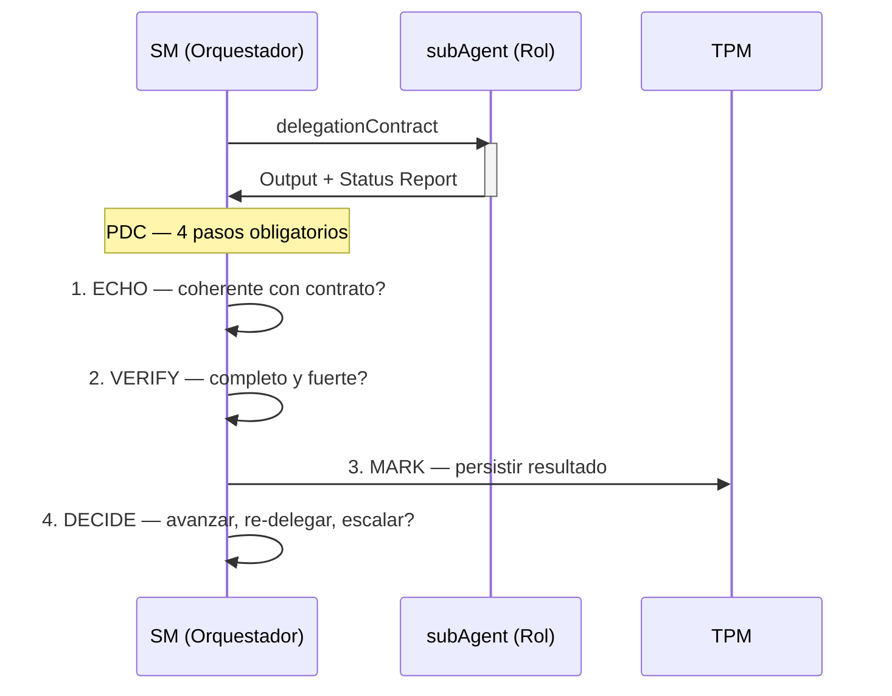
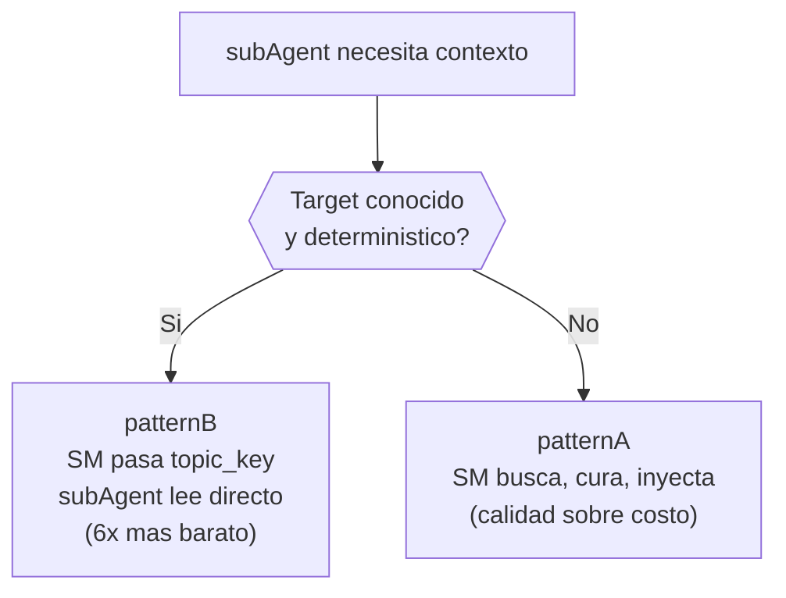

# Delegation Contract y PDC

## Delegation Contract

Toda delegacion a un subAgent requiere un contrato explicito con estos
campos obligatorios:

| Campo | Descripcion |
|-------|-------------|
| Rol | Que rol del equipo representa |
| Personalidad | Como se comporta el subAgent (tono, enfoque, prioridades) |
| Contexto | Que informacion recibe del store (y SOLO esa) |
| Input | Que se le pide que haga, con alcance acotado |
| Output esperado | Que forma tiene el resultado que debe devolver |
| Status Report | Formato obligatorio en el output del subAgent |

## Status Report

Formato obligatorio al final de todo output de subAgent:

```
Status: [SUCCESS | PARTIAL | FAILED | BLOCKED]
Progress: X/Y items completados
Blocker: (si aplica — que lo detuvo)
Artifacts: (que produjo — lista de cambios o decisiones)
```

Sin este bloque, el SM trata el resultado como FAILED.

## PDC (Post-Delegation Checkpoint)



El PDC es obligatorio despues de cada delegacion. No se puede lanzar
otro subAgent sin haber completado los 4 pasos del PDC anterior.

### 1. ECHO

El resultado es coherente con el contrato? Se compara el output contra
lo solicitado en el delegationContract.

### 2. VERIFY

Faltan artefactos o hay bloqueadores? Se verifica completitud y
fortaleza — no solo que algo exista, sino que sea solido. VERIFY
incluye fortaleza, no solo existencia: un workItem nunca alcanza
confianza `verified` solo porque el TPM registro un link. Se requiere
confirmacion de fortaleza (mutation testing, CRAP, complejidad).

### 3. MARK

Instruir al TPM para persistir el resultado en el artifact store.

### 4. DECIDE

Avanzar, re-delegar o escalar al MIM?

## Patrones de retrieval



Cuando un subAgent necesita contexto del store, hay dos patrones:

### patternA — SM busca, cura, inyecta

Para busquedas fuzzy o fan-out alto. El SM busca en el store, cura el
resultado y lo inyecta en el prompt del subAgent. Prioriza calidad
sobre costo.

### patternB — SM pasa topic_key, subAgent lee directo

Para targets conocidos y deterministicos. El SM pasa la referencia y
el subAgent lee directamente del store. 6x mas barato que patternA.

## Niveles de confianza

| Nivel | Significado |
|-------|-------------|
| untested | No hay prueba asociada a la tarea |
| traced | Existe una prueba asociada (binding del TPM), fortaleza sin evaluar |
| verified | Scan confirmo mutation/CRAP/complejidad dentro de umbral del tier |
