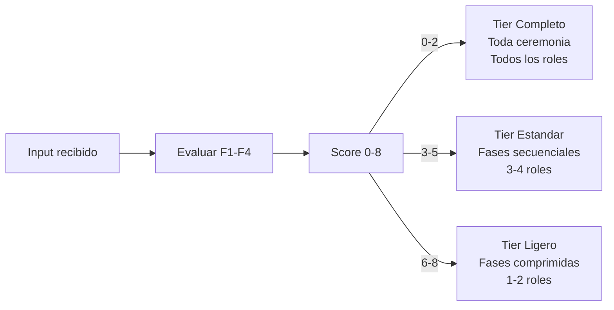

# FastForward

El SM no avanza siempre una fase a la vez. Al recibir un input, evalua
que tan determinista es la solucion dado el contexto existente y avanza
proporcionalmente.

## Gradiente de certeza (F1-F4)

| Factor | 0 puntos | 1 punto | 2 puntos |
|--------|----------|---------|----------|
| F1. Artefactos existentes | Store vacio | 1-2 artefactos upstream | spec + design + tasks aprobados |
| F2. Estandarizacion | Dominio custom sin estandar | Estandar con variantes (auth, API) | Estandar abierto puro (OTEL, i18n, linting) |
| F3. Ambiguedad de dominio | Infinitas interpretaciones | Dominio acotado con decisiones pendientes | Dominio determinista (agregar modulo X a app existente) |
| F4. Referencia existente | Sin codebase ni precedentes | Codebase existe pero no cubre este dominio | Codebase con patrones/stack que aplican directamente |

## Score y tiers

| Score total | Certeza | Hasta donde avanza |
|-------------|---------|-------------------|
| 0-2 | Baja | Idea + preguntas al MIM |
| 3-5 | Media | Idea + spec parcial + preguntas especificas |
| 6-8 | Alta | Hasta handoff o ejecucion directa |

## Definicion de tiers

| Aspecto | Ligero (6-8) | Estandar (3-5) | Completo (0-2) |
|---------|--------------|----------------|----------------|
| Roles por fase | 1-2 esenciales | 3-4 segun fase | Todos + ad-hoc |
| Gates | Comprimidos (SM valida inline) | Estandar (PDC completo) | Estrictos (PDC + validacion cruzada) |
| Dispatch | Ultra-comprimido: multiples fases en una delegacion | Normal: una fase por delegacion | Normal: una fase por delegacion, sin omisiones |
| Smoke test handoff | Omisible si el contexto es determinista | Requerido | Requerido + revision adversarial |

## Responsabilidad

El FastForward es un concepto del Method Pack. Cada pack define como
aplica la compresion de fases a su ceremonia. El Principia define el
mecanismo (gradiente F1-F4, tiers); el Method Pack define la politica
(que fases se comprimen, que roles se omiten, que gates se relajan).
