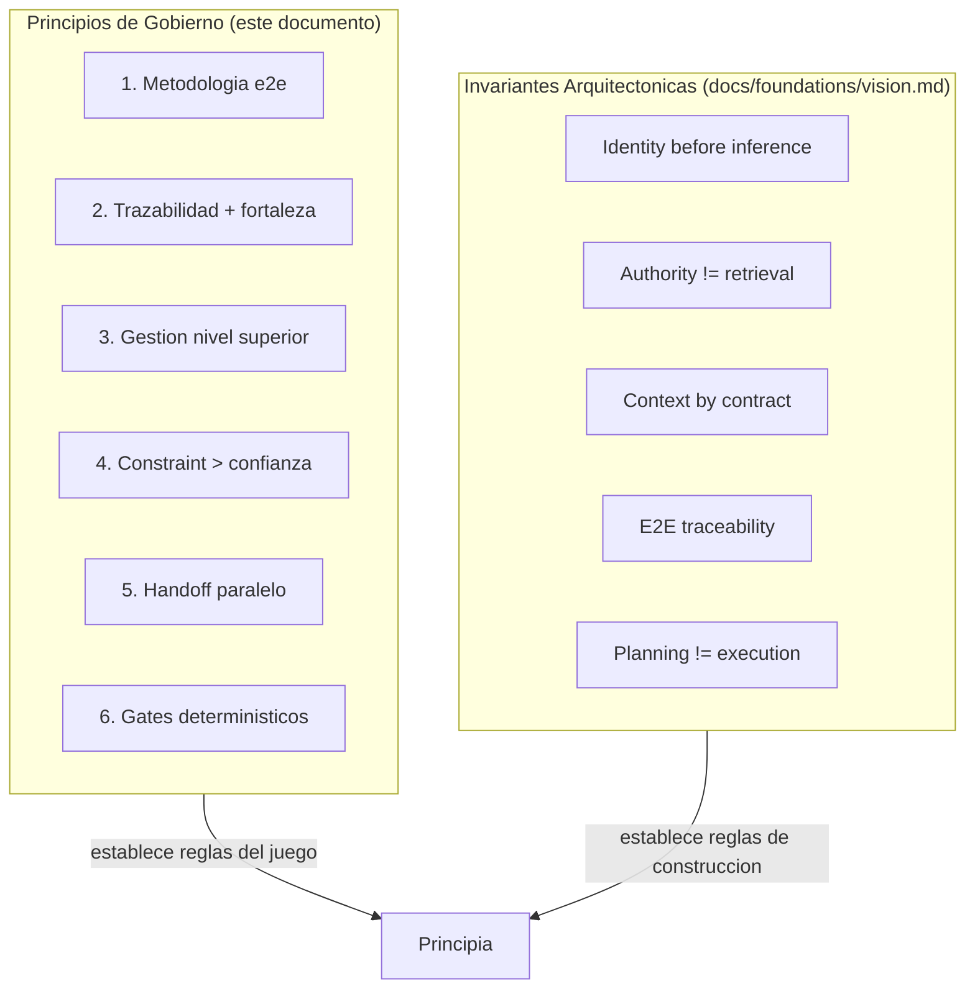

# Principios de Gobierno

Estos principios son no negociables. Toda decision de diseno,
herramienta o proceso debe alinearse con ellos. Aplican en ambos modos
(Desarrollo y Consumo).

## 1. Metodologia end-to-end

El framework cubre el ciclo completo idea a codigo certificado, con una
transicion de despliegue verificada mecanicamente (gate pre/post-deploy
y concepto de rollback) hacia una operacion opcional. La operacion es
una fachada deliberadamente delgada — reactiva, sin fases propias.
"Idea a operacion" describe la transicion mecanica cubierta, no que el
framework opere el servicio por el usuario.

## 2. Trazabilidad Y fortaleza verificadas

No basta con verificar el binding (la trazabilidad entre artefactos,
que confirma que un enlace existe). Tambien se verifica la fortaleza
real del codigo mediante herramientas externas orquestadas (mutation
testing, CRAP score, complejidad ciclomatica).

## 3. Gestion desde nivel superior

El MIM gestiona el proyecto mediante un dashboard de salud, no mediante
revision manual de codigo linea por linea. Las metricas mecanizables
reemplazan la inspeccion subjetiva.

## 4. El agente opera bajo constraint, no bajo confianza

El cumplimiento se impone mediante hooks y gates deterministicos, no
mediante la expectativa de que el agente "se porte bien". El prompt
guia al agente; los guards protegen el sistema.

## 5. Un handoff, ejecucion paralela con semantica de coordinacion

Multiples subAgents ejecutan sobre un mismo handoff mediante claiming
(pending, claimed, done) y execution state, evitando colisiones sin
necesitar handoffs separados por subAgent.

## 6. Gates deterministicos en transiciones de fase

Cada transicion entre fases se valida mecanicamente, no por aprobacion
subjetiva. Los gates son binarios: pasa o no pasa.

## Relacion con las invariantes arquitectonicas

Estos 6 principios definen COMO se gobierna. Las invariantes
arquitectonicas (identity before inference, authority separada de
retrieval, context compiled by contract, etc.) definen COMO se
construye. Ambas capas coexisten: los principios de gobierno establecen
las reglas del juego; las invariantes arquitectonicas establecen las
reglas de construccion.

Las invariantes arquitectonicas viven en `docs/foundations/vision.md`
y son mantenidas por el dogma tecnico. Este documento no las duplica
ni las reemplaza.
