# Virgil — Principio Fundador

Documento ancla. Todo lo que Virgil es, hace y por que lo hace.
Si algo contradice este documento, este documento gana.

## Indice

### En este documento
- [1. Que es Virgil](#1-que-es-virgil)
- [2. Como es (estructura)](#2-como-es-estructura)
- [3. Como actua](#3-como-actua)
- [4. Por que actua asi](#4-por-que-actua-asi)
- [5. Que partes lo componen](#5-que-partes-lo-componen)
- [6. Como interactuan las partes](#6-como-interactuan-las-partes)
- [7. Como garantiza calidad](#7-como-garantiza-calidad)
- [8. Donde vive el conocimiento](#8-donde-vive-el-conocimiento)
- [9. Como fluye el contexto](#9-como-fluye-el-contexto)
- [10. Como se recupera](#10-como-se-recupera)
- [Regla de auto-referencia](#regla-de-auto-referencia)

### Documentos del Principia
- [actors-and-modes.md](actors-and-modes.md) — Roles de agentes y modos operativos
- [governance-principles.md](governance-principles.md) — Principios de gobierno
- [role-architecture.md](role-architecture.md) — Arquitectura de responsabilidades
- [delegation-pdc.md](delegation-pdc.md) — Delegacion y contratos
- [fast-forward.md](fast-forward.md) — Modo acelerado de transiciones
- [binding-layer.md](binding-layer.md) — Capa de enlace operativo
- [circuit-breaker.md](circuit-breaker.md) — Mecanismos de interrupcion

---

## 1. Que es Virgil

Virgil es el knowledge/control plane de un proyecto. No es un
framework, no es un Scrum Master, no ejecuta codigo. Mantiene
identidad, trazabilidad, contexto y transiciones.

Virgil se apega al **Open Agentic Standard**: publica un `AGENTS.md`
en el proyecto consumidor como convención de discoverability, y se
comunica via **Model Context Protocol (MCP)** / JSON-RPC. Cualquier
agente compatible puede consumir Virgil sin acoplamiento a un
proveedor específico.

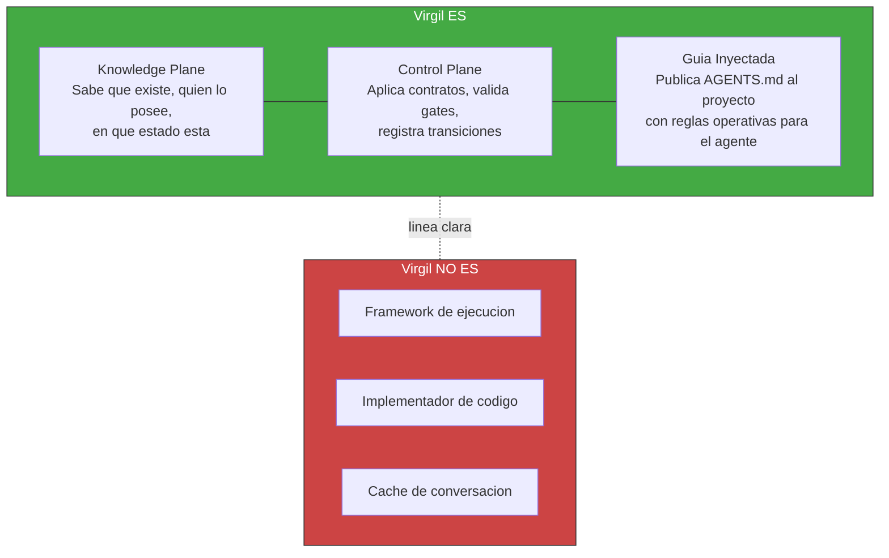

Virgil no adopta roles ceremoniales (no es Scrum Master). Pero SI inyecta
guia operativa al agente consumidor via AGENTS.md. Esa guia deberia
incluir:

- Patron orquestador-minion (como delegar trabajo a sub-agentes)
- Ownership y housekeeping de tokens (como gestionar contexto)
- Planning boundary y stop conditions (cuando detenerse)

> **GAP**: el AGENTS.md actual documenta wire protocol y operaciones,
> pero no el patron de orquestacion ni la gestion de tokens. Pendiente
> de definir en Principia y codificar en el template.

---

## 2. Como es (estructura)

Tres capas concentricas. Cada capa interna gobierna a las externas.

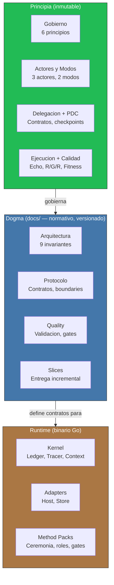

Con esta estructura inmutable como cimiento, Virgil se manifiesta a través de ciclos de vida predecibles: una máquina de estados que rige proyectos y un flujo de invocación que garantiza trazabilidad en cada transición.

---

## 3. Como actua

### 3a. Ciclo de vida de un proyecto

Cada fase itera hasta consolidar su deliverable. No es una linea recta —
es un loop que converge hacia un handoff bien acotado.

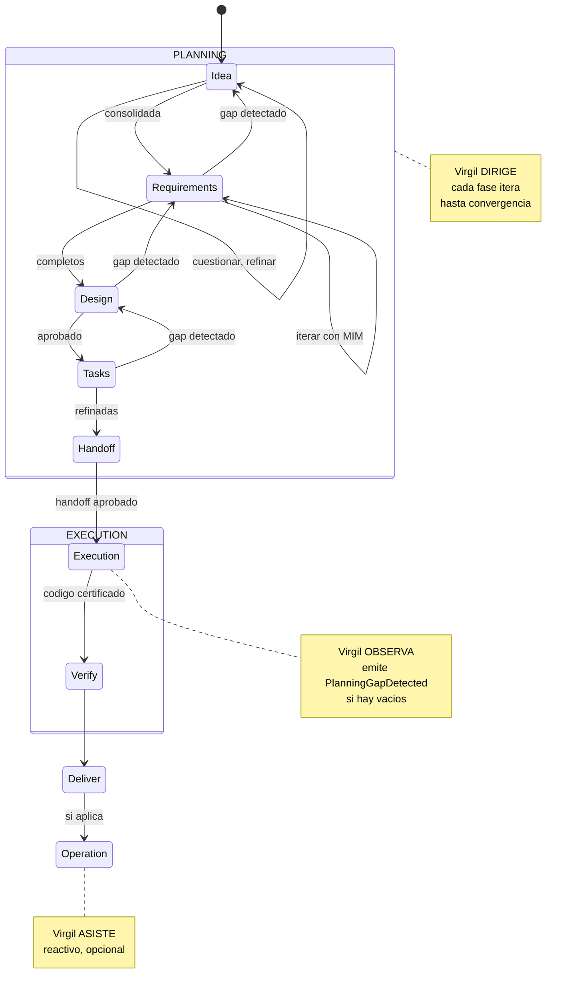

La maquina de estados del proyecto (via virgil_status) indica en que
fase esta cada feature y el proyecto en general. Un feature no avanza
hasta que su deliverable esta consolidado.

**PlanningGapDetected**: si execution descubre que un deliverable aprobado
es ambiguo, contradictorio o insuficiente, emite esta senal, bloquea
solo el scope afectado y devuelve el control a planning. Execution
nunca reescribe un deliverable aprobado.

**FastForward**: el SM no siempre ejecuta todas las fases con la misma
ceremonia. Evalua un gradiente de certeza (F1-F4) sobre el contexto
existente y comprime las fases proporcionalmente — desde ceremonia
completa (score 0-2) hasta ejecucion directa (score 6-8). Detalle
en [fast-forward.md](fast-forward.md).

### 3b. Flujo de una invocacion

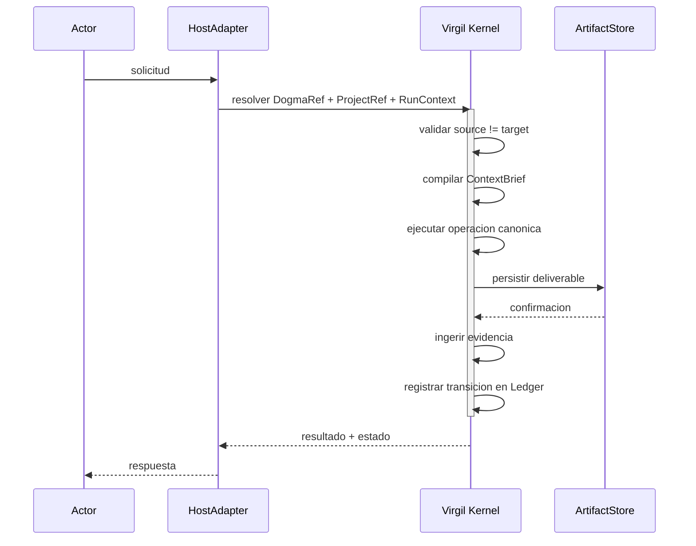

Este flujo canonico es determinista por diseño. Detras de cada paso hay un principio deliberado que descubrimos a continuación.

---

## 4. Por que actua asi

Dos capas de principios complementarias. No se mezclan.

### 4a. Gobierno — COMO se gobierna

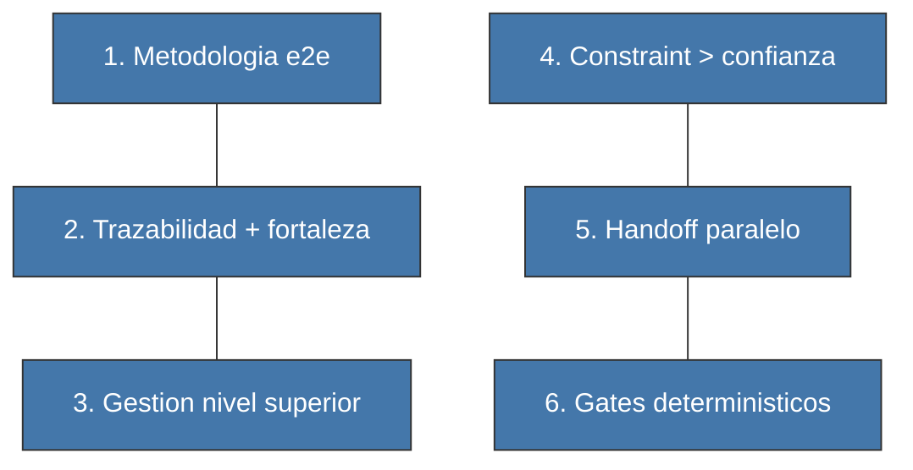

| # | Principio | En una frase |
|---|-----------|-------------|
| 1 | Metodologia e2e | Idea → codigo certificado → operacion. Sin saltos. |
| 2 | Trazabilidad + fortaleza | No basta que el enlace exista; debe ser fuerte. |
| 3 | Gestion nivel superior | Dashboard de salud, no revision linea a linea. |
| 4 | Constraint > confianza | Hooks y gates, no promesas del agente. |
| 5 | Handoff paralelo | Claiming sobre un handoff, no handoffs separados. |
| 6 | Gates deterministicos | Binario: pasa o no pasa. Sin aprobacion subjetiva. |

### 4b. Arquitectura — COMO se construye

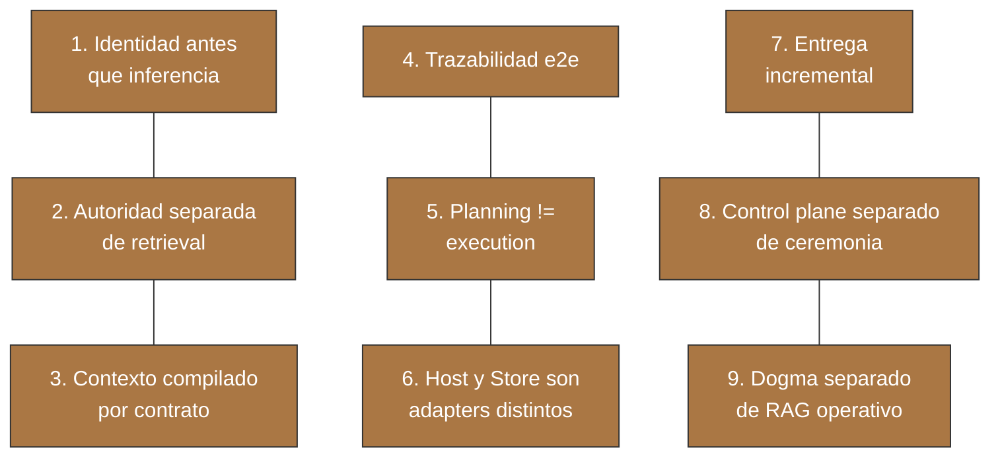

### 4c. Como se relacionan las dos capas

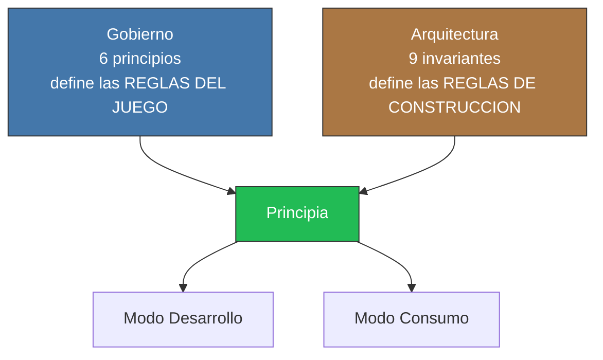

Ambas capas de principios confluyen en el Principia. Lo que falta es conocer sus componentes: qué piezas implementan estas reglas.

---

## 5. Que partes lo componen

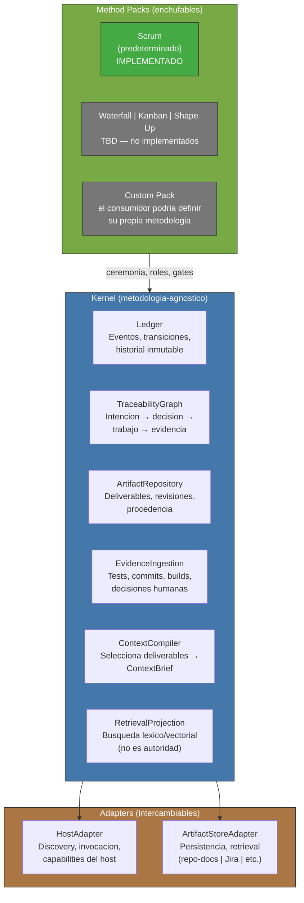

Cada componente tiene una responsabilidad clara. Su verdadera potencia emerge en cómo colaboran bajo restricciones.

---

## 6. Como interactuan las partes

### 6a. Actores y modos

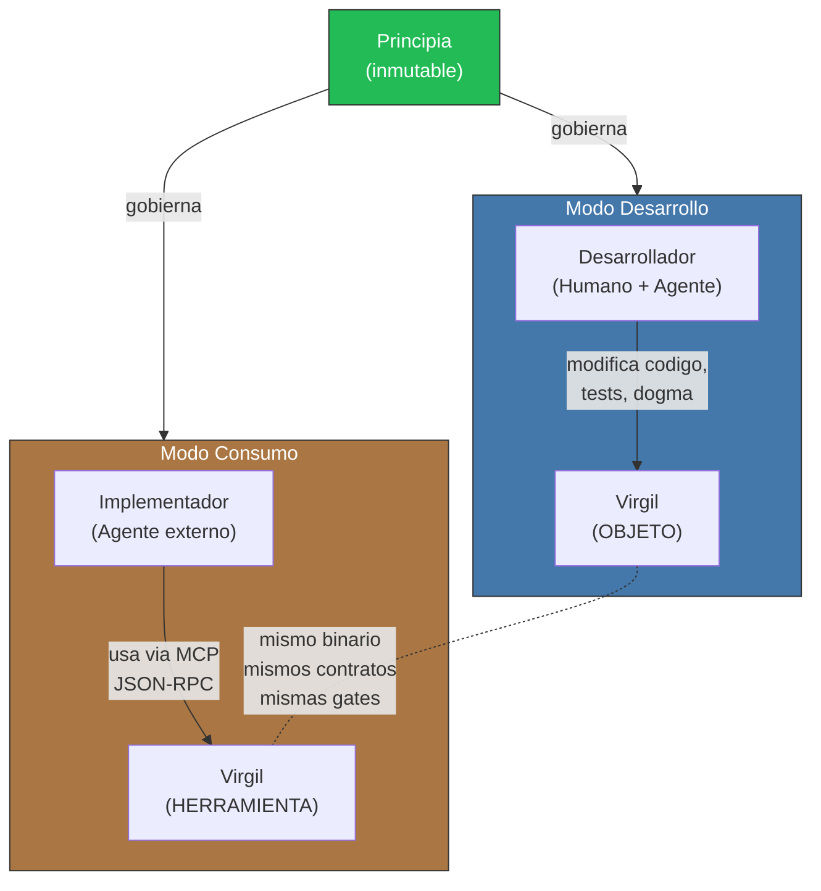

### 6b. Separacion de concerns

Cada pieza tiene un ownership claro. No se mezclan.

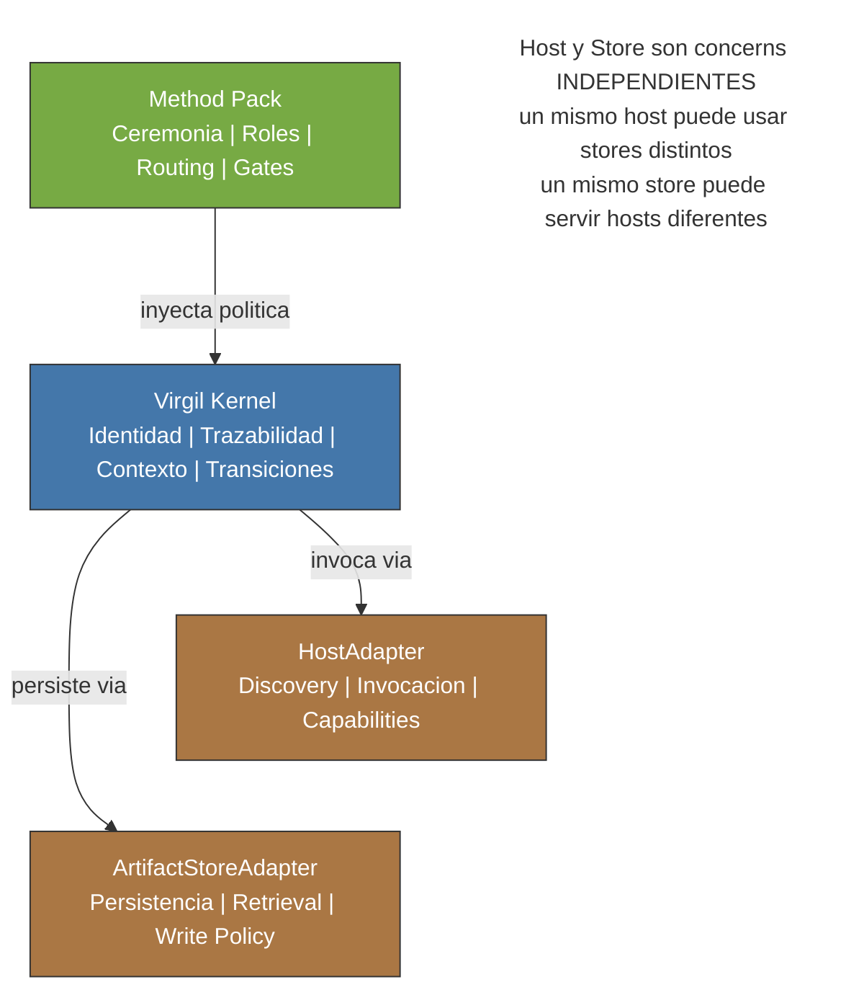

### 6c. Invariante fundamental

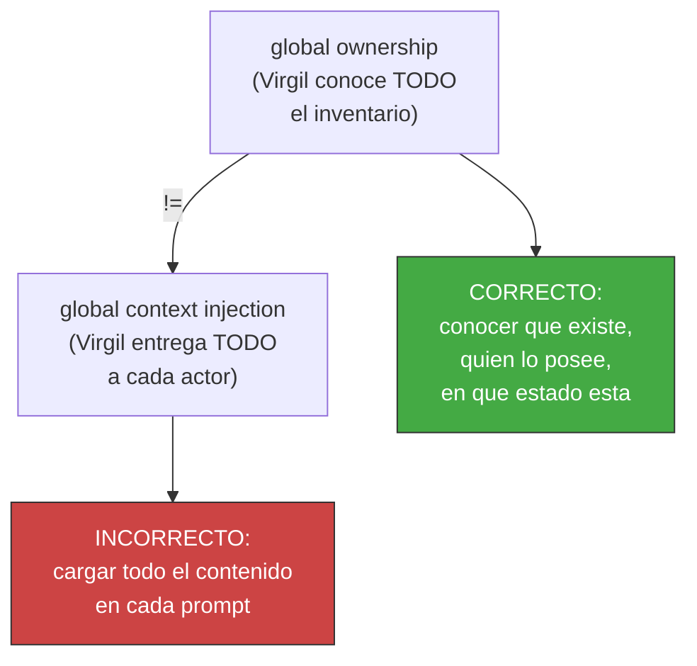

Estas invariantes fundamentales — que Virgil conoce sin inflar contextos — se aplican de forma idéntica en ambos modos operativos, generando una propiedad notable: Virgil es tanto herramienta como objeto bajo las mismas reglas.

---

## 7. Como garantiza calidad

Siete mecanismos forman un ciclo de accountability anidado. Ninguno
funciona aislado.

### 7a. Echo System — pipeline determinista

Secuencia de 5 pasos que se ejecuta en TODO ambiente (dev, CI, CD).
Los pasos son siempre los mismos y en el mismo orden. Lo que varia
es el scope (dev prioriza feedback rapido, CI prioriza completitud).

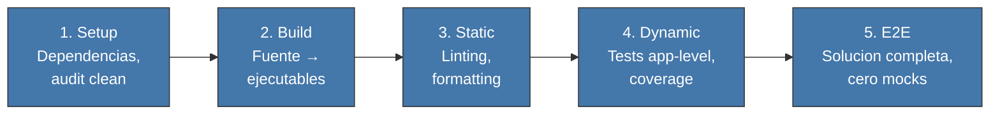

| Ambiente | Scope | Trigger | Enforcement |
|----------|-------|---------|-------------|
| Dev | Selectivo, feedback rapido | git hooks | Pre-commit, pre-push |
| CI | Completo | Push, PR | Pipeline stages |
| CD | Confianza absoluta | Tag, merge a main | Deployment gates |

### 7b. Deliverables vs Build Artifacts

Dos tipos de outputs que no deben confundirse. Los documentos de
planning son **deliverables** (PMBOK/ISO 21500). Los outputs del build
pipeline son **build artifacts** (DevOps/CI-CD). Virgil gestiona
deliverables; el Echo System genera build artifacts.

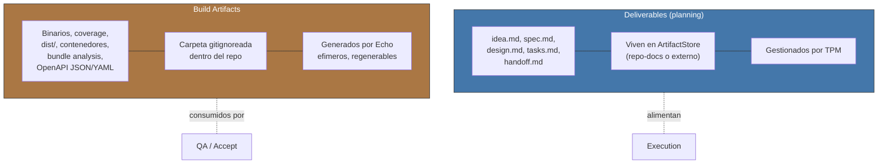

> **Nomenclatura**: el codigo de Virgil usa "Artifact" en entidades
> como ArtifactStore, ArtifactRepository y ArtifactStoreAdapter. Estas
> entidades gestionan **deliverables**, no build artifacts. La
> nomenclatura de codigo es historica; este Principia define la
> terminologia canonica.

### 7c. Macro Red/Green/Refactor — TDD por lotes

TDD a nivel de batch, no funcion por funcion. Primero TODA la suite de
tests, luego TODA la implementacion, luego TODO el refactoring.

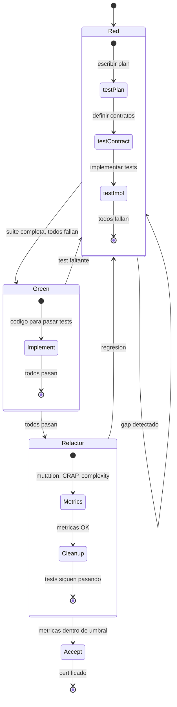

El dogma actual define 5 gates dentro de este ciclo:
**R0** (handoff completo) → **R1** (red valida) → **G1** (green
production-safe) → **F1** (refactor seguro) → **V1** (verify
independiente).

#### compositeAgent — ejecucion paralela de R/G/R

Cuando la ejecucion se paraleliza en multiples lanes (worktrees),
cada lane recibe un compositeAgent: un sub-agente que asume multiples
personalidades secuencialmente dentro del mismo worktree, evitando
conflictos de filesystem.

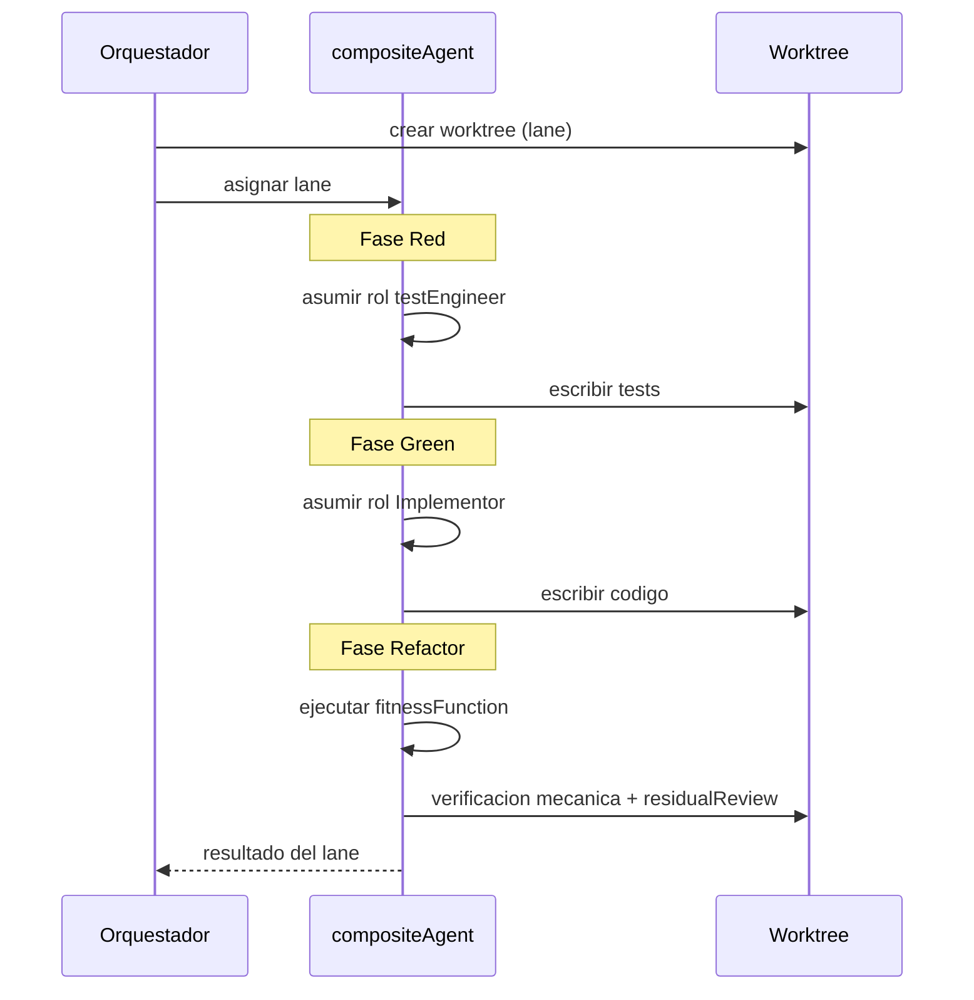

| Fase | Personalidad | Responsabilidad |
|------|-------------|-----------------|
| Red | testEngineer | Escribir tests segun spec |
| Green | Implementor | Codigo que pase los tests |
| Refactor | fitnessFunction | Mutation, CRAP, complejidad + residualReview |

Un compositeAgent NO es un agente que hace todo — es un agente que
CAMBIA de rol secuencialmente. Cada fase tiene su propio contrato
y criterio de salida.

### 7d. Testing Matrix — modelo de boundaries

El valor de un test depende de DONDE se ubica la frontera del mock,
no de la piramide clasica.

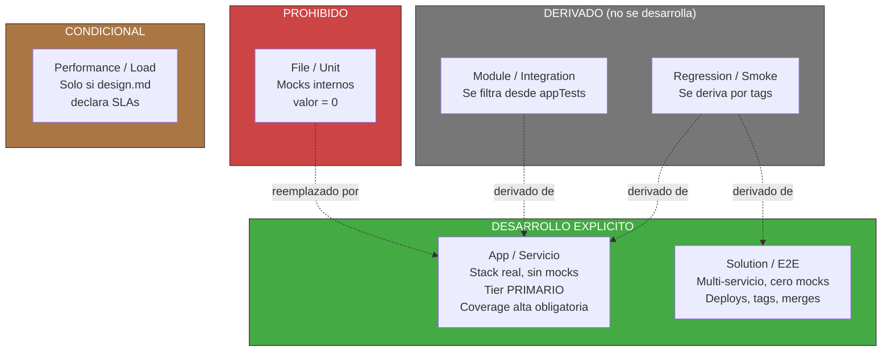

El dogma actual de Virgil define ademas T0 (protocol/app replay),
T1 (agent-in-the-loop) y T2 (host-adapter conformance) como niveles
especificos para validar el propio Virgil.

#### Patron de trazabilidad: matriz → codigo

Durante Red, los casos de prueba se definen como una matriz con
nombres estaticos. El codigo de la prueba importa esos nombres. Esto
crea un enlace RAG-searchable desde la matriz documentada hasta la
implementacion del test.

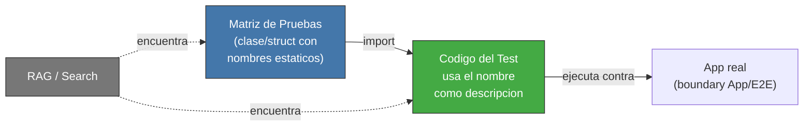

El patron es agnostico de tecnologia: en TypeScript es una clase con
`static readonly`, en Go seria un `const` block o struct, en Rust un
`mod` con constantes. Lo que importa es que la matriz y el test
compartan un identificador rastreable.

#### Binding Layer — confianza del enlace

El enlace entre un test y el codigo que lo satisface no es binario
(existe/no existe). Tiene tres niveles de confianza que progresan
durante el ciclo R/G/R:

| Estado | Fase | Garantiza |
|--------|------|-----------|
| declared | Red | El test existe y referencia un AC |
| inferred | Green | Un hook detecto que codigo ejercita el test |
| verified | Refactor | Mutation testing confirmo fortaleza real |

Solo `verified` certifica fortaleza — los demas solo confirman
existencia. Detalle en [binding-layer.md](binding-layer.md).

### 7e. QA / Acceptance Gates — certificacion

La certificacion es determinista y basada en metricas, no en revision
subjetiva de codigo.

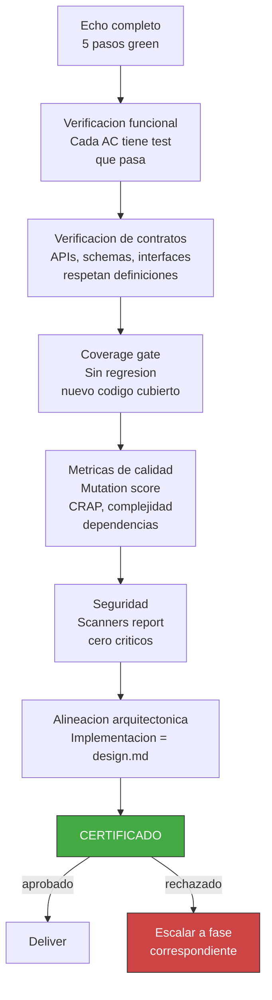

### 7f. droppableCode — cobertura como herramienta

Codigo con 0% de cobertura en appTests no tiene justificacion para
existir. La cobertura no es metrica de vanidad — es detector de
codigo muerto.

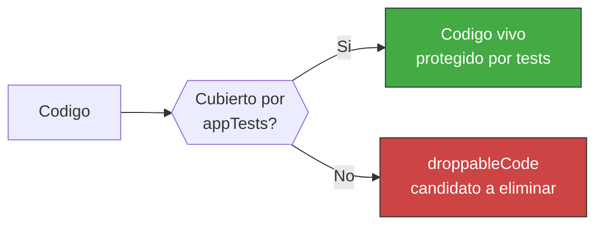

El threshold de cobertura es obligatorio y **nunca se reduce**. Se
mide solo sobre archivos con logica real (cobertura selectiva).

### 7g. complianceByDesign — compliance como efecto secundario

Si cada test aserta la forma EXACTA del DTO (campos presentes, campos
ausentes, tipos), se obtiene verificacion de compliance sin suites
separadas.

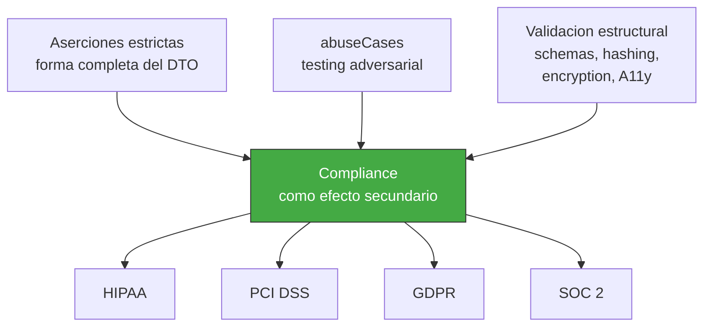

Alcance: cubre la capa de DATOS (minimizacion, control de acceso por
campo, validacion de forma). NO cubre controles organizacionales,
fisicos, legales o procedimentales.

### Ciclo cerrado

Estos mecanismos forman un ciclo cerrado: el Echo ejecuta, los build
artifacts capturan outputs, Red/Green/Refactor estructura la ejecucion
(paralelizable via compositeAgent), la Testing Matrix define que vale
como prueba, droppableCode detecta codigo muerto, complianceByDesign
verifica cumplimiento, y QA certifica el resultado. Si QA rechaza, se
escala a la fase que corresponda.

---

## 8. Donde vive el conocimiento

Dos concerns separados: donde se PERSISTEN los deliverables
(ArtifactStore) y como se CONSULTAN (RAG). El RAG actua como DBMS
del contexto — ningun agente lee archivos directamente; todo agente
consulta el RAG con queries acotadas.

### 8a. ArtifactStore — persistencia

```mermaid
flowchart TD
    VIRGIL["Virgil Kernel"]
    VIRGIL -->|"persiste via"| ASA["ArtifactStoreAdapter\n(contrato)"]

    ASA --> DEFAULT["repo-docs (default)\n{target}/docs/virgil/\nlocal, RAG-friendly,\nsin dependencias externas"]

    ASA --> EXT["Adapters externos (TBD)"]

    subgraph EXTERNOS["Opciones via contrato"]
        JIRA["Jira"]
        CONF["Confluence"]
        AZURE["Azure DevOps"]
        ASANA["Asana"]
        GH["GitHub Projects/Issues"]
        OTROS["Otros\n(via contrato de adapter)"]
    end

    EXT --> EXTERNOS

    style DEFAULT fill:#4a4,stroke:#333,color:#fff
    style EXT fill:#777,stroke:#333,color:#fff
    style EXTERNOS fill:#777,stroke:#333,color:#fff
```

### 8b. Separacion de namespaces

```mermaid
flowchart LR
    subgraph VIRGIL_DOCS["Virgil/docs/"]
        DOGMA["Dogma de Virgil\nread-only para consumidores\nnormativo y versionado"]
    end

    subgraph TARGET_DOCS["{target}/docs/"]
        MANAGED["{target}/docs/virgil/\nManaged namespace\nVIRGIL escribe aqui"]
        CORPUS["{target}/docs/**\nCorpus del proyecto\nread-only para Virgil\n(opt-in para RAG)"]
    end

    DOGMA -.-|"NO son lo mismo"| TARGET_DOCS
    MANAGED -.-|"write scope\ndelimitado"| CORPUS

    style DOGMA fill:#47a,stroke:#333,color:#fff
    style MANAGED fill:#4a4,stroke:#333,color:#fff
    style CORPUS fill:#777,stroke:#333,color:#fff
```

> **Invariante**: `Virgil/docs/` (dogma) y `{target}/docs/` (proyecto)
> comparten el nombre `docs` pero NO comparten identidad, ownership ni
> write policy.

### 8c. RAG dual — DBMS de contexto

Regla fundamental: **ningun agente lee archivos directamente**. Todo
agente consulta el RAG con queries acotadas. Contextualizacion via
queries, no via prompts — ahorro directo de tokens.

```mermaid
flowchart TD
    subgraph INCORRECTO["INCORRECTO"]
        A1["Agente lee archivo completo\n(miles de tokens en prompt)"]
    end

    subgraph CORRECTO["CORRECTO"]
        A2["Agente hace query al RAG\n(tokens minimos, scope acotado)"]
    end

    INCORRECTO -.-|"reemplazado por"| CORRECTO

    style INCORRECTO fill:#c44,stroke:#333,color:#fff
    style CORRECTO fill:#4a4,stroke:#333,color:#fff
```

Virgil define dos instancias del mismo patron RAG-como-DBMS, una por
cada modo operativo.

```mermaid
flowchart TD
    subgraph DEVRAG["devRag — Modo Desarrollo"]
        DR_SRC["Fuentes:\n./principia/ (inmutable)\n./docs/ (normativo)"]
        DR_ST["Storage:\narchivos del proyecto Virgil"]
        DR_ROL["Rol: DBMS de CTX\npara desarrollar Virgil"]
    end

    subgraph CONSRAG["consumerRag — Modo Consumo"]
        CR_SRC["Fuentes:\nVirgil dogma +\nRAG propio del proyecto"]
        CR_ST["Storage default:\n{target}/docs/\noverride via adapter"]
        CR_ROL["Rol: DBMS de CTX\npara el proyecto consumidor"]
    end

    PRINCIPIA["Principia\n(inmutable)"] -->|"alimenta"| DEVRAG
    DEVRAG -->|"echo:\nmismo patron\ndiferente scope"| CONSRAG

    style DEVRAG fill:#47a,stroke:#333,color:#fff
    style CONSRAG fill:#a74,stroke:#333,color:#fff
    style PRINCIPIA fill:#2b5,stroke:#333,color:#fff
```

| Aspecto | devRag | consumerRag |
|---------|--------|-------------|
| Modo | Desarrollo | Consumo |
| Fuentes | `./principia/` + `./docs/` | Virgil dogma + RAG propio del proyecto |
| Storage | Archivos del proyecto Virgil | `{target}/docs/` (default) |
| Override | N/A (fuente fija) | Adapter interfaces: Jira, Confluence, Azure DevOps, Asana, WordPress, DBMS |
| Rol | DBMS de CTX para Virgil | DBMS de CTX para el proyecto consumidor |

El consumerRag define **interfaces** — el cliente las implementa con
el backend que necesite. Lo que se conecte, se conecta, mientras
cumpla con el contrato del adapter.

### 8d. Visibilidad escalonada

El agente principal (orquestador) tiene visibilidad completa del RAG
si asi lo estima necesario. Los sub-agentes reciben un scope reducido:
solo lo necesario para su tarea.

```mermaid
flowchart TD
    RAG["RAG\n(devRag | consumerRag)"]

    RAG -->|"100% visibilidad\n(si lo estima necesario)"| ORCH["Orquestador\n(agente principal)\nve TODO el inventario"]

    RAG -->|"scope acotado"| SUB1["Sub-agente A\nve solo deliverables\nde su tarea"]
    RAG -->|"scope acotado"| SUB2["Sub-agente B\nve solo deliverables\nde su tarea"]

    ORCH -->|"define scope via\ndelegationContract"| SUB1 & SUB2

    style ORCH fill:#4a4,stroke:#333,color:#fff
    style SUB1 fill:#47a,stroke:#333,color:#fff
    style SUB2 fill:#47a,stroke:#333,color:#fff
    style RAG fill:#a74,stroke:#333,color:#fff
```

El scope del sub-agente se define en el `delegationContract` (seccion
9c). El orquestador decide que topic_keys o queries son visibles para
cada delegacion.

### 8e. Memoizacion

El RAG mantiene una capa de cache en memoria para acelerar queries
repetidas. Fallback a almacenamiento persistente cuando la cache se
invalida o la sesion se reinicia.

```mermaid
flowchart LR
    QUERY["Query"] --> CACHE{{"Cache\nen memoria?"}}
    CACHE -->|"hit"| RESULT["Resultado\n(inmediato)"]
    CACHE -->|"miss"| FALLBACK["Fallback\nengram | sqlite\n(tech TBD)"]
    FALLBACK --> RESULT
    FALLBACK -->|"popular cache"| CACHE

    style CACHE fill:#4a4,stroke:#333,color:#fff
    style FALLBACK fill:#777,stroke:#333,color:#fff
```

El RAG no es la autoridad del proceso — el Ledger, el
ArtifactRepository y la evidencia son la fuente de verdad. El RAG es
una proyeccion de lectura optimizada, reconstruible y memoizada.

Con el conocimiento organizado como DBMS de contexto y la visibilidad
escalonada por rol, el paso siguiente es entender como ese contexto
fluye entre agentes durante la ejecucion.

---

## 9. Como fluye el contexto

Regla fundamental: **nunca se pasa contexto crudo a un sub-agente**.
El contexto se entrega compilado (ContextBrief) o como referencia
(topic_key) para que el sub-agente lea del RAG.

### 9a. ContextBrief

El ContextCompiler selecciona deliverables, hechos y limites para
producir un ContextBrief acotado al objetivo del actor. La seleccion
queda trazable: que se incluyo, de donde salio, que se excluyo.

### 9b. Dos patrones de entrega

```mermaid
flowchart TD
    NEED["Sub-agente necesita contexto"]
    NEED --> Q{{"Target conocido\ny deterministico?"}}

    Q -->|"Si"| PB["PatternB\nSM pasa topic_key\nsub-agente lee directo del RAG\n6x mas barato"]
    Q -->|"No"| PA["PatternA\nSM busca, cura, inyecta\ncalidad sobre costo"]

    style PB fill:#4a4,stroke:#333,color:#fff
    style PA fill:#47a,stroke:#333,color:#fff
```

| Patron | Cuando | Costo | Calidad |
|--------|--------|-------|---------|
| PatternB (default) | Target conocido, deterministico | Bajo (6x) | Buena |
| PatternA | Busqueda fuzzy, fan-out alto (8+) | Alto | Optima |

Ambos patrones operan sobre el RAG dual (seccion 8c): devRag en Modo
Desarrollo, consumerRag en Modo Consumo.

### 9c. Delegacion: SM → sub-agente → PDC

```mermaid
sequenceDiagram
    participant SM as SM
    participant SUB as Sub-agente
    participant TPM as TPM

    SM->>SUB: delegationContract<br/>(6 campos obligatorios)
    activate SUB
    SUB-->>SM: Output + Status Report
    deactivate SUB

    Note over SM: PDC obligatorio
    SM->>SM: ECHO - coherente?
    SM->>SM: VERIFY - completo?
    SM->>TPM: MARK - persistir
    SM->>SM: DECIDE - avanzar?
```

Sin Status Report en el output, el SM lo trata como FAILED.
Tres fallos consecutivos al mismo rol activan el circuitBreaker
(ver [circuit-breaker.md](circuit-breaker.md)).

Detalle completo en [delegation-pdc.md](delegation-pdc.md).

---

## 10. Como se recupera

Despues de un crash, compactacion o nueva sesion, el estado se
reconstruye — no se pierde.

```mermaid
sequenceDiagram
    participant SM as SM
    participant TPM as TPM
    participant STORE as ArtifactStore

    SM->>TPM: que deliverables existen?
    TPM->>STORE: scan estados
    STORE-->>TPM: lista + revisiones
    TPM-->>SM: deliverables + estados + historial de fallos

    SM->>SM: derivar fase actual
    SM->>SM: consultar historial<br/>(ajustar estrategia)
    SM->>SM: continuar desde<br/>fase derivada
```

- El SM deriva la fase por los deliverables existentes (no la almacena)
- El historial de fallos es per-deliverable y cross-session
- `lastVerifiedAt` evita re-verificacion innecesaria si el codigo
  no toco el scope del deliverable
- Cambios externos se clasifican: aditivos (registrar), contradictorios
  (decision del MIM), o de otro ciclo (registrar como contexto)

---

## Regla de auto-referencia

Este Principia gobierna AMBOS modos con la misma autoridad:

```mermaid
flowchart TD
    P["Principia\n(este documento)"]

    P --> MD["Modo Desarrollo\nVirgil es el OBJETO\nDesarrollador trabaja\nSOBRE Virgil"]
    P --> MC["Modo Consumo\nVirgil es la HERRAMIENTA\nImplementador trabaja\nCON Virgil"]

    MD --> MISMOS["Mismos principios\nMismos contratos\nMismas gates\nDiferente direccion\nde agencia"]
    MC --> MISMOS

    style P fill:#2b5,stroke:#333,color:#fff
    style MISMOS fill:#47a,stroke:#333,color:#fff
```

---

## Nota de autoridad

Este documento es inmutable una vez consolidado.

**Fuente de verdad**: `principia/overview.md`

Este Principia gobierna con igual fuerza el **Modo Desarrollo** (donde Virgil es el objeto sobre el cual se trabaja) y el **Modo Consumo** (donde Virgil es la herramienta con la cual se trabaja). Ambos modos heredan los mismos principios de gobierno, arquitectura, contratos y gates.
