# Virgil — Principio Fundador

Documento ancla. Todo lo que Virgil es, hace y por que lo hace.
Si algo contradice este documento, este documento gana.

## Indice

### En este documento
- [1. Que es Virgil](#1-que-es-virgil)
- [2. Como es (estructura)](#2-como-es-estructura)
- [3. Como actua](#3-como-actua)
- [4. Por que actua asi](#4-por-que-actua-asi)
- [5. Que partes lo componen](#5-que-partes-lo-componen)
- [6. Como interactuan las partes](#6-como-interactuan-las-partes)
- [Regla de auto-referencia](#regla-de-auto-referencia)

### Documentos del Principia
- [actors-and-modes.md](actors-and-modes.md) — Roles de agentes y modos operativos
- [governance-principles.md](governance-principles.md) — Principios de gobierno
- [role-architecture.md](role-architecture.md) — Arquitectura de responsabilidades
- [delegation-pdc.md](delegation-pdc.md) — Delegacion y contratos
- [fast-forward.md](fast-forward.md) — Modo acelerado de transiciones
- [binding-layer.md](binding-layer.md) — Capa de enlace operativo
- [circuit-breaker.md](circuit-breaker.md) — Mecanismos de interrupcion

---

## 1. Que es Virgil

Virgil es el knowledge/control plane de un proyecto. No es un
framework, no es un Scrum Master, no ejecuta codigo. Mantiene
identidad, trazabilidad, contexto y transiciones.

Virgil se apega al **Open Agentic Standard**: publica un `AGENTS.md`
en el proyecto consumidor como convención de discoverability, y se
comunica via **Model Context Protocol (MCP)** / JSON-RPC. Cualquier
agente compatible puede consumir Virgil sin acoplamiento a un
proveedor específico.

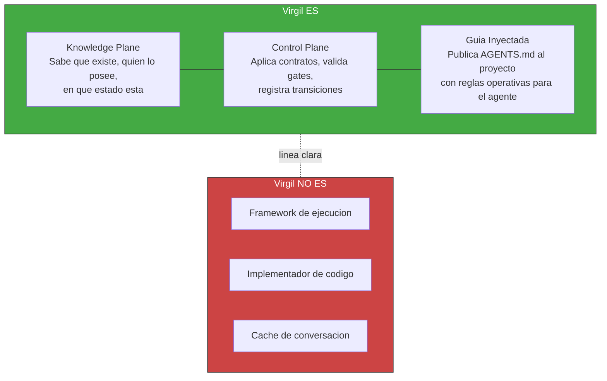

Virgil no adopta roles ceremoniales (no es Scrum Master). Pero SI inyecta
guia operativa al agente consumidor via AGENTS.md. Esa guia deberia
incluir:

- Patron orquestador-minion (como delegar trabajo a sub-agentes)
- Ownership y housekeeping de tokens (como gestionar contexto)
- Planning boundary y stop conditions (cuando detenerse)

> **GAP**: el AGENTS.md actual documenta wire protocol y operaciones,
> pero no el patron de orquestacion ni la gestion de tokens. Pendiente
> de definir en Principia y codificar en el template.

---

## 2. Como es (estructura)

Tres capas concentricas. Cada capa interna gobierna a las externas.

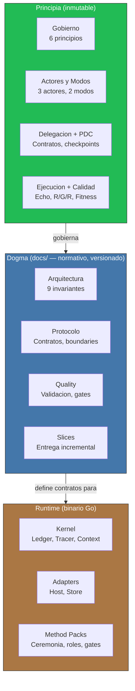

Con esta estructura inmutable como cimiento, Virgil se manifiesta a través de ciclos de vida predecibles: una máquina de estados que rige proyectos y un flujo de invocación que garantiza trazabilidad en cada transición.

---

## 3. Como actua

### 3a. Ciclo de vida de un proyecto

Cada fase itera hasta consolidar su artefacto. No es una linea recta —
es un loop que converge hacia un handoff bien acotado.

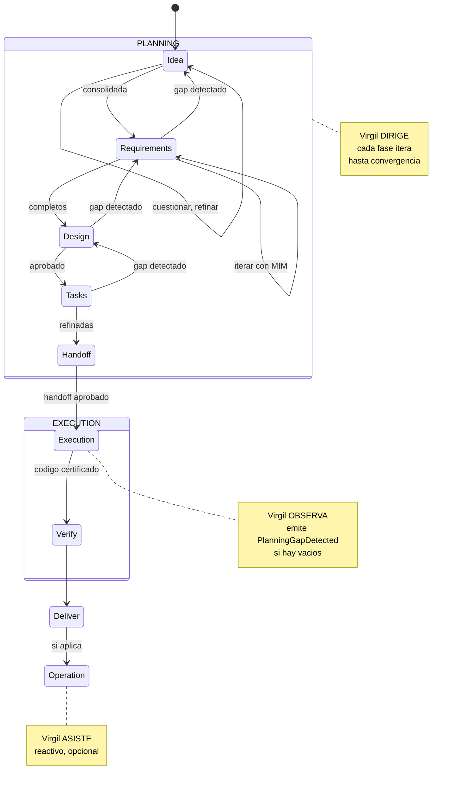

La maquina de estados del proyecto (via virgil_status) indica en que
fase esta cada feature y el proyecto en general. Un feature no avanza
hasta que su artefacto esta consolidado.

### 3b. Flujo de una invocacion

Este flujo canonico es determinista por diseño. Detras de cada paso hay un principio deliberado que descubrimos a continuación.

---

## 4. Por que actua asi

Dos capas de principios complementarias. No se mezclan.

### 4a. Gobierno — COMO se gobierna

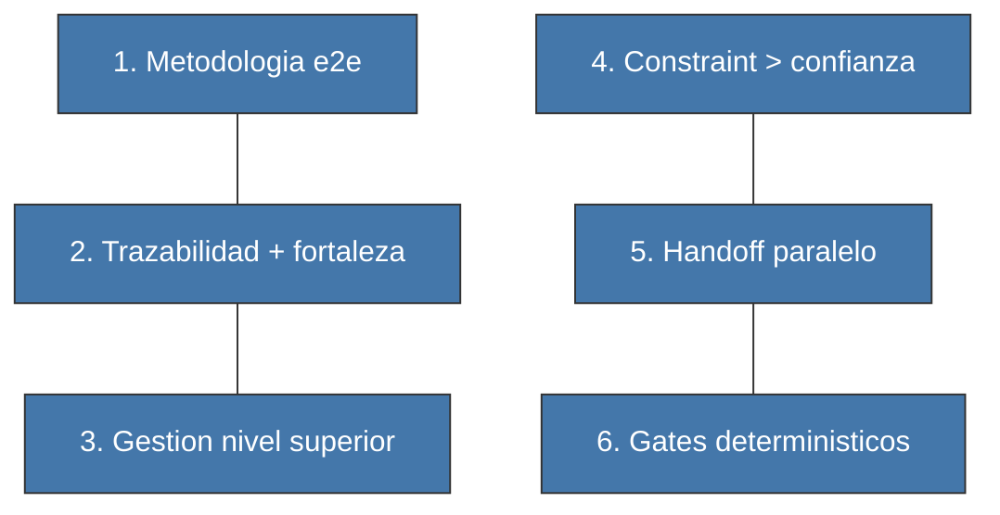

| # | Principio | En una frase |
|---|-----------|-------------|
| 1 | Metodologia e2e | Idea → codigo certificado → operacion. Sin saltos. |
| 2 | Trazabilidad + fortaleza | No basta que el enlace exista; debe ser fuerte. |
| 3 | Gestion nivel superior | Dashboard de salud, no revision linea a linea. |
| 4 | Constraint > confianza | Hooks y gates, no promesas del agente. |
| 5 | Handoff paralelo | Claiming sobre un handoff, no handoffs separados. |
| 6 | Gates deterministicos | Binario: pasa o no pasa. Sin aprobacion subjetiva. |

### 4b. Arquitectura — COMO se construye

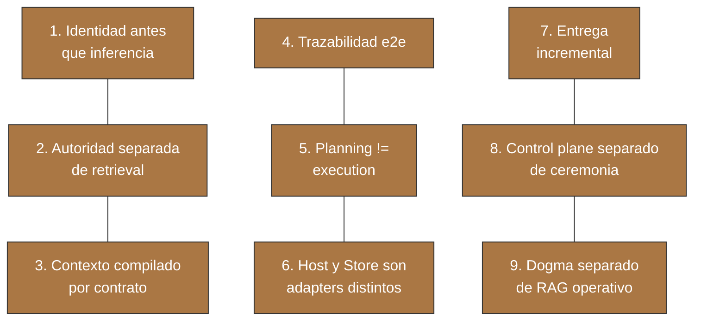

### 4c. Como se relacionan las dos capas

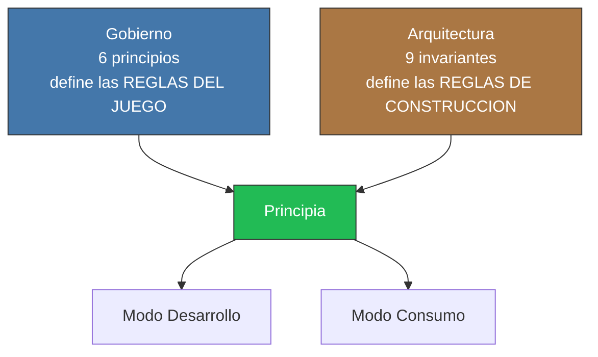

Ambas capas de principios confluyen en el Principia. Lo que falta es conocer sus componentes: qué piezas implementan estas reglas.

---

## 5. Que partes lo componen

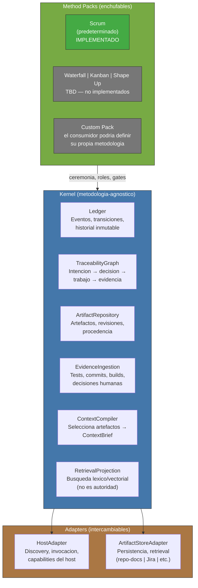

Cada componente tiene una responsabilidad clara. Su verdadera potencia emerge en cómo colaboran bajo restricciones.

---

## 6. Como interactuan las partes

### 6a. Actores y modos

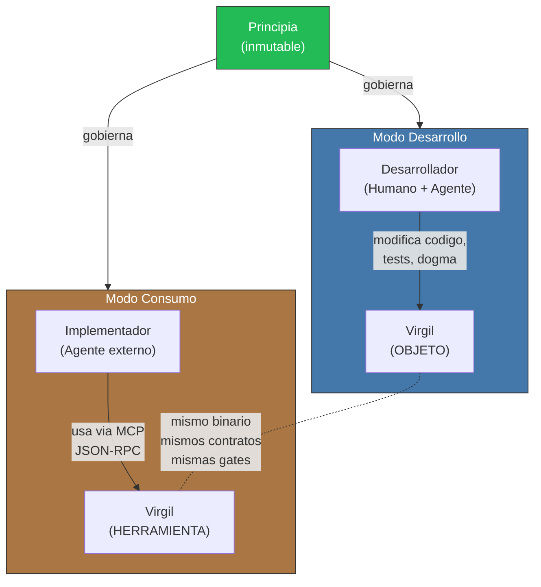

### 6b. Separacion de concerns

Cada pieza tiene un ownership claro. No se mezclan.

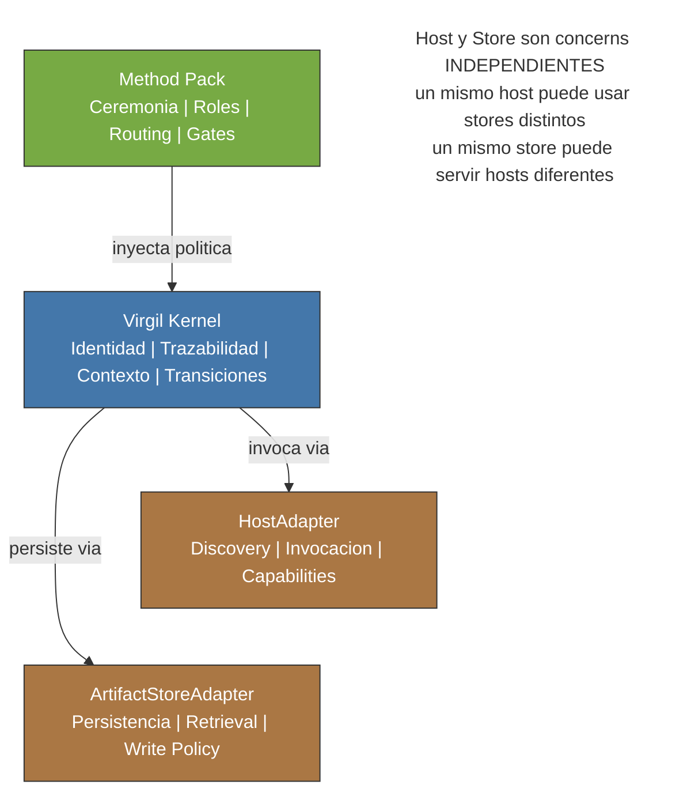

### 6c. Invariante fundamental

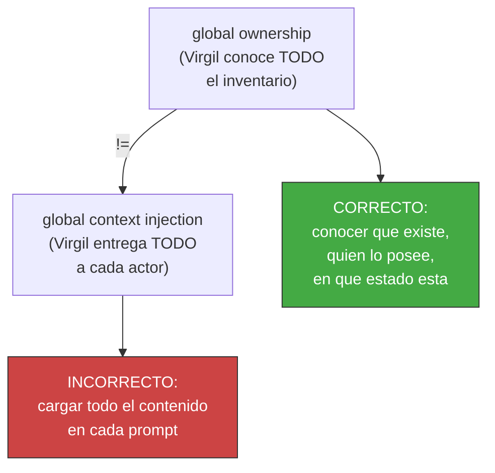

Estas invariantes fundamentales — que Virgil conoce sin inflar contextos — se aplican de forma idéntica en ambos modos operativos, generando una propiedad notable: Virgil es tanto herramienta como objeto bajo las mismas reglas.

---

## Regla de auto-referencia

Este Principia gobierna AMBOS modos con la misma autoridad:

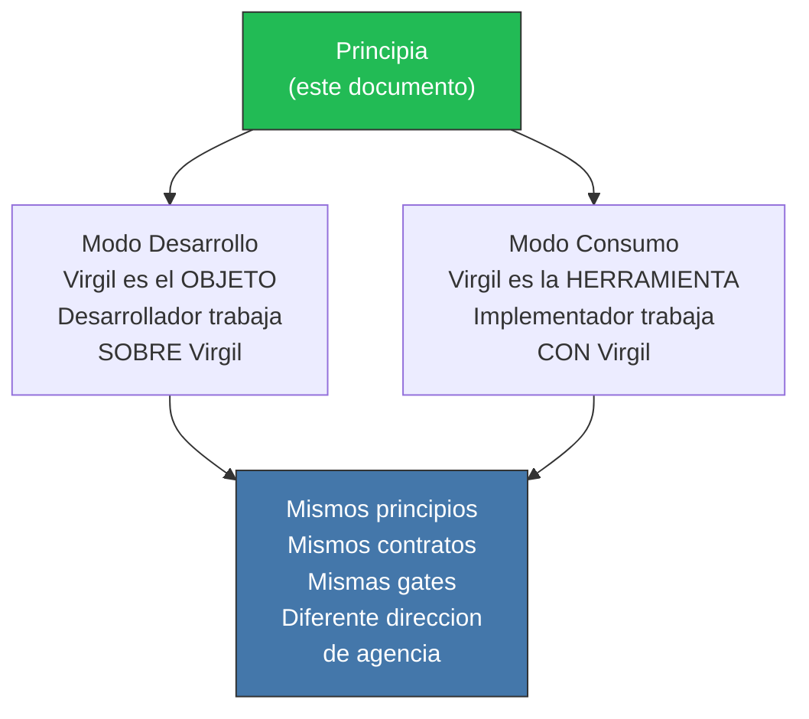

---

## Nota de autoridad

Este documento es inmutable una vez consolidado.

**Fuente de verdad**: `principia/overview.md`

Este Principia gobierna con igual fuerza el **Modo Desarrollo** (donde Virgil es el objeto sobre el cual se trabaja) y el **Modo Consumo** (donde Virgil es la herramienta con la cual se trabaja). Ambos modos heredan los mismos principios de gobierno, arquitectura, contratos y gates.
