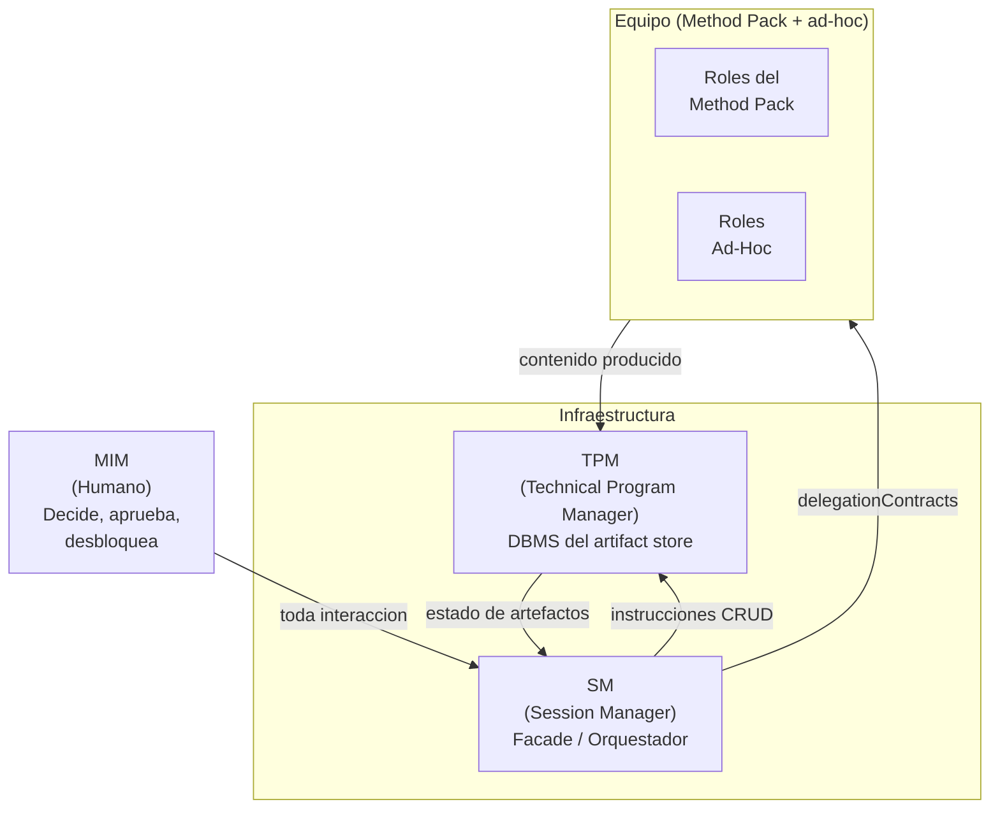
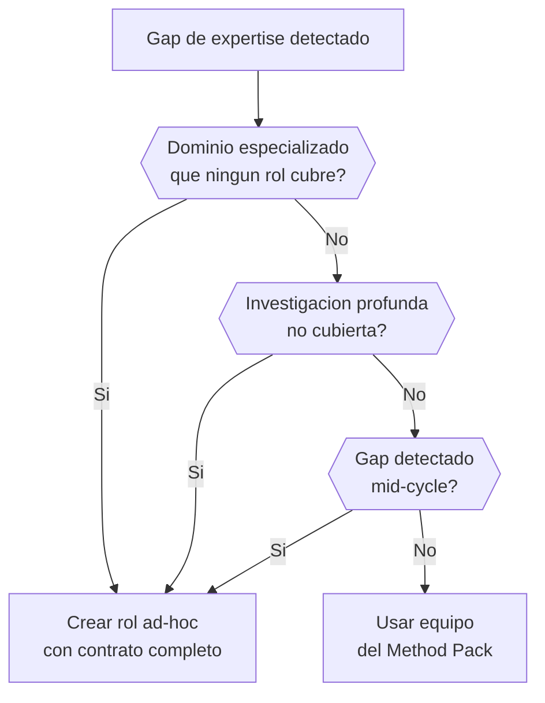

# Arquitectura de Roles

Los roles son subAgents — no personas. Son personalidades y
competencias que el orquestador instancia para una tarea acotada. Un
mismo agente puede asumir diferentes roles en diferentes fases; lo que
importa es el contrato.

## Tres capas de actores

## Infraestructura (no son roles productivos)

### SM (Session Manager)

El SM NO produce artefactos de contenido. El SM:

1. Detecta en que fase esta el proyecto
2. Convoca a los roles que corresponden a esa fase
3. Extiende el equipo con roles ad-hoc cuando se requiere expertise
   fuera del equipo del Method Pack
4. Acota la funcion de cada rol convocado (que esperamos, que NO)
5. Valida que el artefacto de salida quede aprobado (via TPM)
6. Bloquea el avance si el gate no se cumple
7. Desbloquea la siguiente fase cuando el artefacto es suficiente
8. Rastrea la iteracion actual, el historial y las escalaciones

El SM es el UNICO rol que persiste a lo largo de todas las fases. Los
demas roles entran y salen segun la fase los requiera.

### TPM (Technical Program Manager)

El TPM es el DBMS del artifact store. Es infraestructura operativa
permanente, no parte del equipo productivo.

- Responsabilidades: CRUD sobre el store, estandares de escritura,
  serving de contexto acotado, tracking de completitud
- Personalidad: riguroso, metodico, con criterio editorial. Mantiene
  estandares sin imponer opinion de producto o tecnica
- Se invoca cada vez que hay que persistir, leer o verificar artefactos

## Roles productivos

Los roles productivos especificos (quienes son, que expertise tienen,
en que fases participan) son responsabilidad del Method Pack. El
Principia no hardcodea perfiles — define la arquitectura.

Cada rol productivo recibe un delegationContract (ver
delegation-pdc.md) y devuelve un output con Status Report obligatorio.

## Mecanismo ad-hoc

El SM puede extender el equipo con roles ad-hoc cuando detecta un gap
de expertise que ningun rol del Method Pack cubre. El rol ad-hoc
requiere un contrato completo:

| Campo | Obligatorio |
|-------|-------------|
| Rol (nombre descriptivo) | Si |
| Justificacion (por que los roles del pack no cubren) | Si |
| Expertise core | Si |
| Frase que lo define | Si |
| Personalidad | Si |
| Contexto del store | Si |
| Input | Si |
| Output esperado | Si |
| NO hace (restricciones de scope) | Si |
| Escalacion upstream | Si |
| Status Report | Si |
| Gate de completitud | Si |
| Fases activas | Si |
| Voto en aceptacion | No (default: advisory only) |

## Modo Desarrollo vs Modo Consumo

En Modo Desarrollo (trabajando en Virgil), el SM es el orquestador que
coordina sub-agentes para desarrollar features, corregir bugs o
evolucionar el dogma.

En Modo Consumo (usando Virgil), el SM es el orquestador del proyecto
cliente que usa Virgil como herramienta de planificacion.

La arquitectura de roles es identica en ambos modos. Lo que cambia son
los perfiles concretos del Method Pack y el objeto de trabajo.
