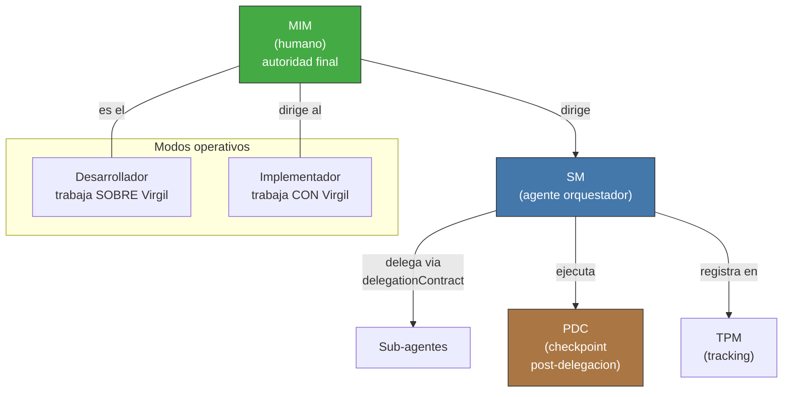

<!-- Virgil Principia
section_id: "vocabulary"
title: "Vocabulario de actores"
source: "principia/constitution.md"
source_lines: [63, 99]
layer: identity
constitutional: true
actors: [MIM, Desarrollador, Implementador, Virgil, SM, TPM, PDC]
glossary_terms: [MIM, SM, TPM, PDC, compositeAgent]
depends_on: []
referenced_by: [1, 2, 6]
keywords:
  - actors
  - roles
  - modos
  - Desarrollo
  - Consumo
  - vocabulario
  - MIM
  - SM
  - TPM
editorial_additions: [context_paragraph]
-->

> **Context:** Esta tabla y diagrama definen los actores canonicos de Virgil (MIM, Desarrollador, Implementador, Virgil, SM, TPM, PDC) referenciados a lo largo del Principia, incluyendo la seccion "1. Que es Virgil" y "6a. Actores y modos".

### Vocabulario de actores

| Actor | Que es | Cuando actua |
|-------|--------|-------------|
| MIM | Humano con autoridad final de decision | Siempre — aprueba, rechaza, desempata |
| Desarrollador | Humano + agente trabajando SOBRE Virgil | Modo Desarrollo |
| Implementador | Agente externo trabajando CON Virgil | Modo Consumo |
| Virgil | El binario — knowledge/control plane | Ambos modos |
| SM | SM (Session Manager) — Agente orquestador. El Method Pack inyecta este rol: en el Pack Scrum cumple funciones de Scrum Master; en otros Packs cumple el rol de orquestacion equivalente definido por ese Pack. Virgil (el binario) no ES el SM — el SM es un rol que opera DENTRO de Virgil. | Ejecucion — delega, verifica, decide |
| TPM | Funcion de tracking de deliverables | Ejecucion — persiste estado, reporta |
| PDC | Post-Delegation Checkpoint (ECHO → VERIFY → MARK → DECIDE) | Despues de cada delegacion del SM |

Detalle de delegacion y PDC en la seccion 9c de este documento.

> **Delegacion de aprobaciones MIM.** En equipos donde el MIM es tambien el unico desarrollador, los puntos de aprobacion MIM (excepciones de cobertura, declaracion de perfil de compliance del proyecto, break-glass) pueden consolidarse mediante autorizacion permanente documentada: el MIM emite una politica de proyecto que pre-autoriza categorias especificas, reduciendo la friccion sin eliminar la trazabilidad. Nota: lo delegable es la DECLARACION del perfil regulatorio del proyecto, no la activacion del gate de review humano — esa activacion es automatica e incondicional una vez declarado el perfil (ver seccion 7g).
