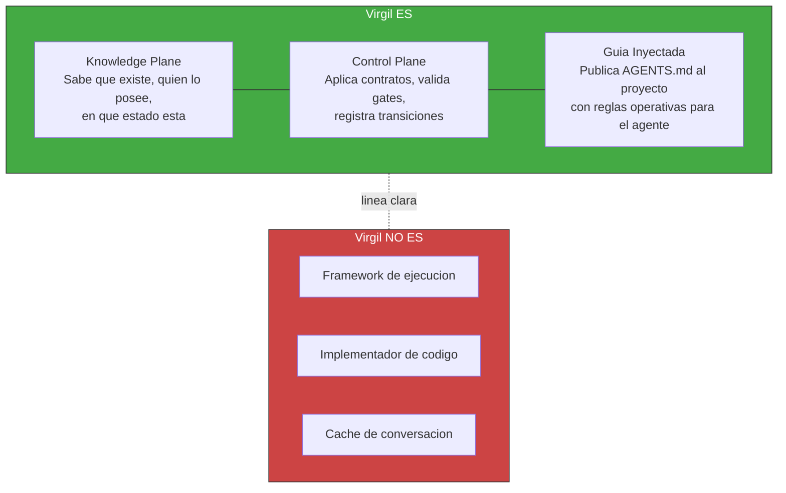

<!-- Virgil Principia
section_id: "1"
title: "Que es Virgil"
source: "principia/overview.md"
source_lines: [100, 146]
layer: identity
constitutional: true
actors: [MIM, Virgil]
glossary_terms: [Virgil, MCP, AGENTS.md, Open Agentic Standard, Kernel, Method Pack]
depends_on: []
referenced_by: [1a, 2, 5, 6]
keywords:
  - que es Virgil
  - knowledge plane
  - control plane
  - identidad
  - Open Agentic Standard
  - AGENTS.md
-->

## 1. Que es Virgil

[↑ Volver al indice](../README.md)

Virgil es el knowledge/control plane de un proyecto. No es un
framework, no es un Scrum Master, no ejecuta codigo. Mantiene
identidad, trazabilidad, contexto y transiciones.

Virgil se apega al **Open Agentic Standard**: publica un `AGENTS.md`
en el proyecto consumidor como convención de discoverability, y se
comunica via **Model Context Protocol (MCP)** / JSON-RPC. Cualquier
agente compatible puede consumir Virgil sin acoplamiento a un
proveedor específico.

Virgil no adopta roles ceremoniales (no es Scrum Master). Pero SI inyecta
guia operativa al agente consumidor via AGENTS.md. Esa guia deberia
incluir:

- Patron orquestador-minion (como delegar trabajo a sub-agentes)
- Ownership y housekeeping de tokens (como gestionar contexto)
- Planning boundary y stop conditions (cuando detenerse)

> **Pendiente de definicion**: el AGENTS.md actual documenta wire protocol y operaciones. El patron de orquestacion y la gestion de tokens se especificaran en el Method Pack correspondiente, no en este documento ancla. Este item queda fuera del alcance del Principia.

> **Alcance de este documento.** El Principia es el dogma fundacional: filosofia, arquitectura e invariantes. NO es un documento de go-to-market, guia de adopcion ni manual de usuario. El perfil de consumidor objetivo (ICP), la estrategia de MVP, el posicionamiento competitivo y las guias de onboarding son deliverables separados que se derivan DEL Principia pero no forman parte de el. El Kernel + el Method Pack Scrum (el unico implementado) constituyen el slice minimo viable; los demas Method Packs, codebaseMemory y extensiones son provisiones arquitectonicas, no requisitos de v1.
